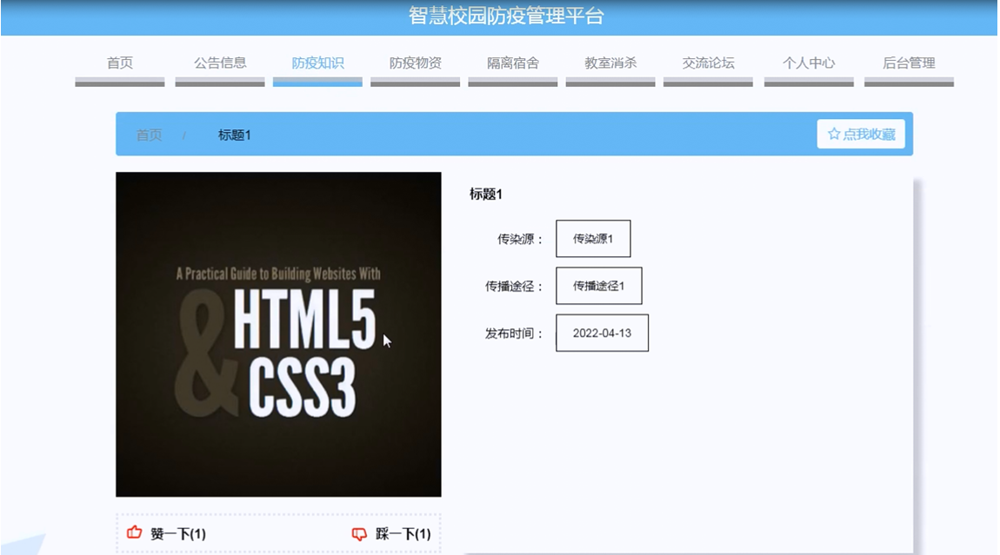
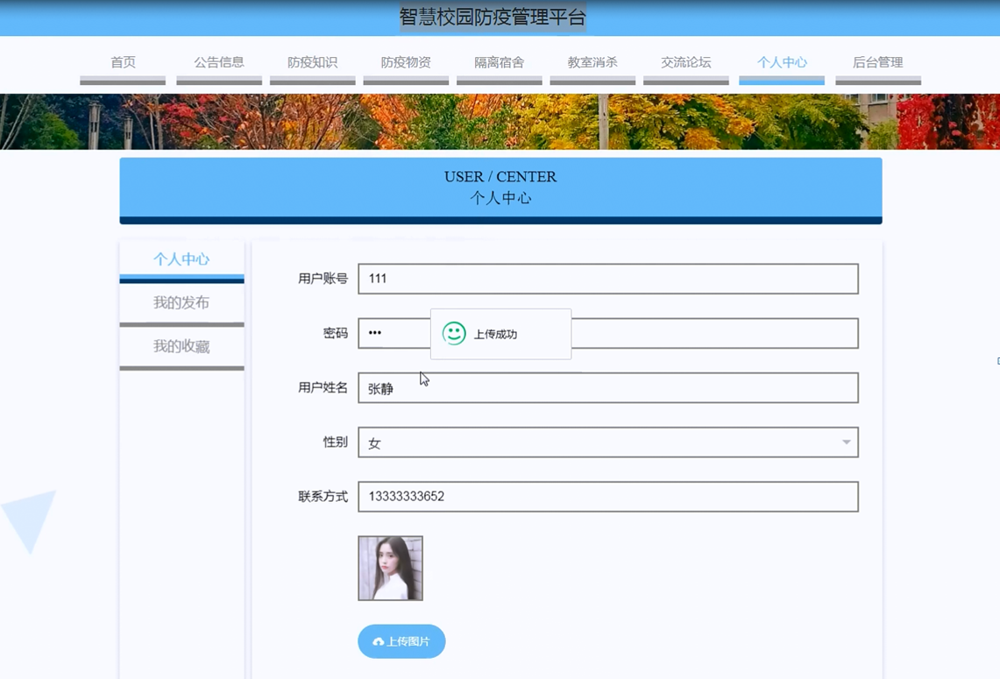

ssm+Vue计算机毕业设计智慧校园防疫管理平台（程序+LW文档）

**项目运行**

**环境配置：**

**Jdk1.8 + Tomcat7.0 + Mysql + HBuilderX** **（Webstorm也行）+ Eclispe（IntelliJ
IDEA,Eclispe,MyEclispe,Sts都支持）。**

**项目技术：**

**SSM + mybatis + Maven + Vue** **等等组成，B/S模式 + Maven管理等等。**

**环境需要**

**1.** **运行环境：最好是java jdk 1.8，我们在这个平台上运行的。其他版本理论上也可以。**

**2.IDE** **环境：IDEA，Eclipse,Myeclipse都可以。推荐IDEA;**

**3.tomcat** **环境：Tomcat 7.x,8.x,9.x版本均可**

**4.** **硬件环境：windows 7/8/10 1G内存以上；或者 Mac OS；**

**5.** **是否Maven项目: 否；查看源码目录中是否包含pom.xml；若包含，则为maven项目，否则为非maven项目**

**6.** **数据库：MySql 5.7/8.0等版本均可；**

**毕设帮助，指导，本源码分享，调试部署** **(** **见文末** **)**

### 系统总体架构设计

该款智慧校园防疫管理平台；用户可以通过注册账号从而登入系统主界面来实现相对应的功能，分别是查看首页,公告信息，防疫知识，防疫物资，隔离宿舍，教室消杀，交流论坛，个人中心,后台管理等功能。

系统使用Eclipse设计开发，使用MySql进行对数据的存储。后台读取数据并转换成json类型的数据进行传输，在客户端接收数据解析实现各功能并显示给用户。

该系统软件的功能结构图：

图4-1系统功能结构图

### 4.3 系统数据库的设计

#### 4.3.1数据库E/R图

ER图是由实体及其关系构成的图，通过E/R图可以清楚地描述系统涉及到的实体之间的相互关系。在系统中对一些主要的几个关键实体如下图：

(1)用户管理E/R图如下所示：

图4-2用户管理E/R图

(2)防疫知识管理E/R图如下所示：

图4-3防疫知识管理E/R图

(3)防疫物资管理E/R图如下所示：

图4-4防疫物资管理E/R图

### 系统功能模块

智慧校园防疫管理平台，在平台首页可以查看首页,公告信息，防疫知识，防疫物资，隔离宿舍，教室消杀，交流论坛，个人中心,后台管理等内容，并进行详细操作；如图5-1所示。

图5-1平台首页界面图

用户注册，在用户注册页面通过填写用户账号,密码,再次密码,用户姓名,联系方式等信息进行注册操作；如图5-2所示。

图5-2用户注册界面图

防疫知识，在防疫知识页面可以查看标题，传染源，传播途径，发布时间等内容进行收藏操作；如图5-3所示。

图5-3防疫知识界面图

防疫物资，在防疫物资页面可以查看物资名称，物资分类，物资规格，物资品牌，物资数量，物资位置，登记日期等内容；如图5-4所示。

图5-4防疫物资界面图

宿舍隔离，在宿舍隔离页面可以查看宿舍名称，宿舍类型，位置，人数，宿舍楼，房间号，更新时间等内容；如图5-5所示。

图5-5宿舍隔离界面图

个人中心，在个人中心页面通过填写用户账号,密码,用户姓名,性别,联系方式，上传图片等内容进行更新信息操作，还可以对我的发布，我的收藏进行详细操作；如图5-6所示。

图5-6个人中心界面图

### 5.2管理员功能模块

管理员登录，进入系统前在登录页面根据要求填写用户名和密码，选择角色等信息，点击登录进行登录操作，如图5-7所示。

图5-7管理员登录界面图

管理员登录系统后，可以对首页,个人中心,用户管理,员工管理,公告信息管理,防疫知识管理,防疫物资管理,隔离宿舍管理,教室消杀管理,健康填报管理，出入申请管理，交流论坛，系统管理等功能进行相应的操作管理，如图5-8所示。

图5-8管理员功能界面图

用户管理，在用户管理页面可以对索引,用户账号,用户姓名,性别，联系方式，头像等内容进行详情，修改和删除等操作，如图5-9所示。

图5-9用户管理界面图

员工管理，在员工管理页面可以对索引,员工账号,员工姓名,性别,联系方式,头像等信息进行详情，修改和删除等操作，如图5-10所示。

图5-10员工管理界面图

公告信息管理，在公告信息管理页面可以对索引,标题，区域，图片，发布日期等内容进行详情，修改和删除等操作，如图5-11所示。

图5-11公告信息管理界面图

防疫知识管理，在防疫知识管理页面可以对索引,标题，封面，传染源，传播途径，发布时间等内容进行详情，修改和删除等操作，如图5-12所示。

图5-12防疫知识管理界面图

#### **JAVA** **毕设帮助，指导，源码分享，调试部署**

