ssm+Vue计算机毕业设计智慧消防维保系统后端（程序+LW文档）

**项目运行**

**环境配置：**

**Jdk1.8 + Tomcat7.0 + Mysql + HBuilderX** **（Webstorm也行）+ Eclispe（IntelliJ
IDEA,Eclispe,MyEclispe,Sts都支持）。**

**项目技术：**

**SSM + mybatis + Maven + Vue** **等等组成，B/S模式 + Maven管理等等。**

**环境需要**

**1.** **运行环境：最好是java jdk 1.8，我们在这个平台上运行的。其他版本理论上也可以。**

**2.IDE** **环境：IDEA，Eclipse,Myeclipse都可以。推荐IDEA;**

**3.tomcat** **环境：Tomcat 7.x,8.x,9.x版本均可**

**4.** **硬件环境：windows 7/8/10 1G内存以上；或者 Mac OS；**

**5.** **是否Maven项目: 否；查看源码目录中是否包含pom.xml；若包含，则为maven项目，否则为非maven项目**

**6.** **数据库：MySql 5.7/8.0等版本均可；**

**毕设帮助，指导，本源码分享，调试部署** **(** **见文末** **)**

### 软件功能模块设计

为了更好的去理清本系统整体思路，对该系统以结构图的形式表达出来，设计实现该智慧消防维保系统后端的功能结构图如下所示：

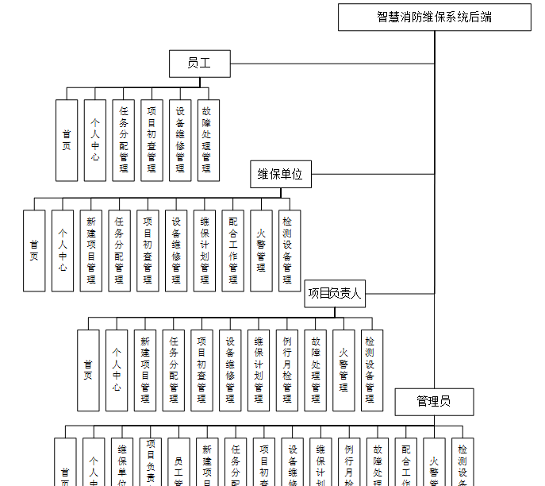

图4-1 系统总体结构图

### 4.2数据库设计

#### 4.2.1 数据库E/R图

ER图是由实体及其关系构成的图，通过E/R图可以清楚地描述系统涉及到的实体之间的相互关系。在系统中对一些主要的几个关键实体如下图：

(1)维保单位注册E/R图如下所示：

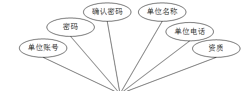

图4-2维保单位注册E/R图

(2)设备维修E/R图如下所示：

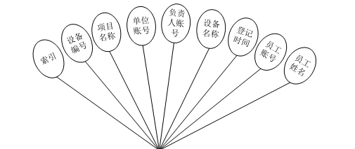

图4-3设备维修E/R图

(3) 维保计划E/R图如下所示：

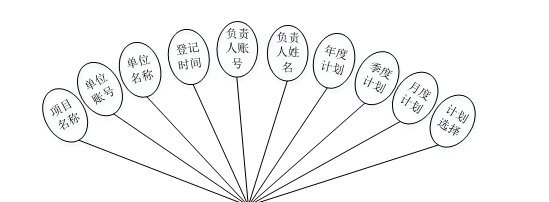

图4-4维保计划E/R图

### 登录注册模块

系统登录，管理员、员工、维保单位和项目负责人通过输入账号、密码，选择角色并点击登录进行系统登录操作，如图5-1所示。

图5-1系统登录界面图

维保单位注册，在维保单位注册页面通过填写单位账号、密码、确认密码、单位名称、 单位电话、资质等内容进行注册等操作；如图5-2所示。

图5-2维保单位注册界面图

项目负责人注册，在项目负责人注册页面通过填写负责人账号、密码、确认密码、负责人项目、负责人电话等信息进行注册操作；如图5-3所示。

图5-3项目负责人注册界面图

员工注册，在员工注册页面通过填写员工账号、密码、确认密码、员工姓名、员工电话等信息进行注册操作；如图5-4所示。

图5-4员工注册界面图

### 5.2管理员功能模块

管理员登陆系统后，可以对首页、个人中心、维保单位管理、项目负责人管理、员工管理、新建项目管理、任务分配管理、项目初查管理、设备维修管理、维保计划管理、例行月检管理、故障处理管理、配合工作管理、火警管理、检测设备管理等功能进行相应操作，如图5-5所示。

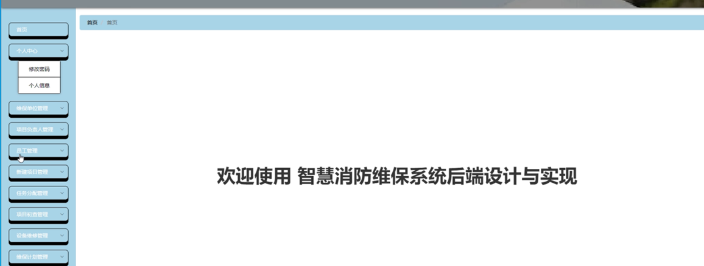

图5-5管理员功能界面图

项目初查管理，在项目初查管理页面可以对索引、项目名称、
单位账号、负责人账号、设施设备、数量、型号、运行状态、员工账号、员工姓名、登记时间等内容进行详情、修改或删除等操作，如图5-6所示。

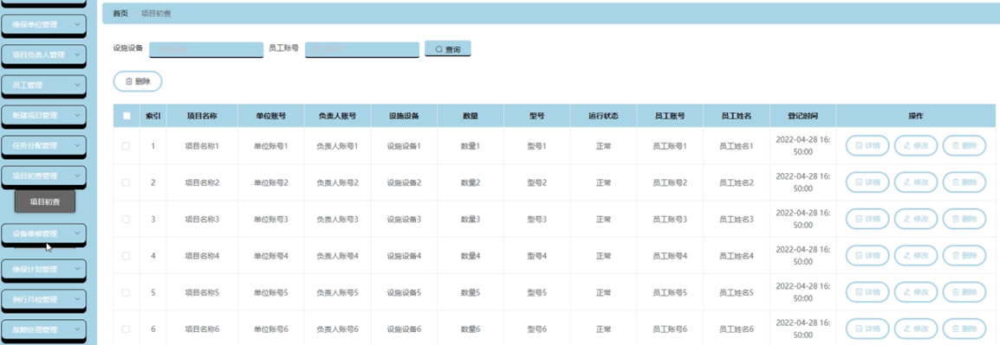

图5-6项目初查管理界面图

设备维修管理，在设备维修管理页面可以对索引、设备编号、项目名称、单位账号、负责人账号、设备名称、登记时间、员工账号、员工姓名等内容进行详情、修改或删除等操作，如图5-7所示。

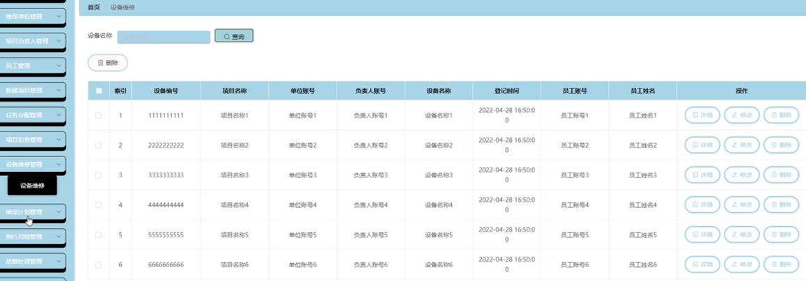

图5-7设备维修管理界面图

设备维修管理，在设备维修管理页面可以对索引、设备编号、项目名称、单位账号、负责人账号、设备名称、登记时间、员工账号、员工姓名等内容进行详情、修改或删除等操作，如图5-8所示。

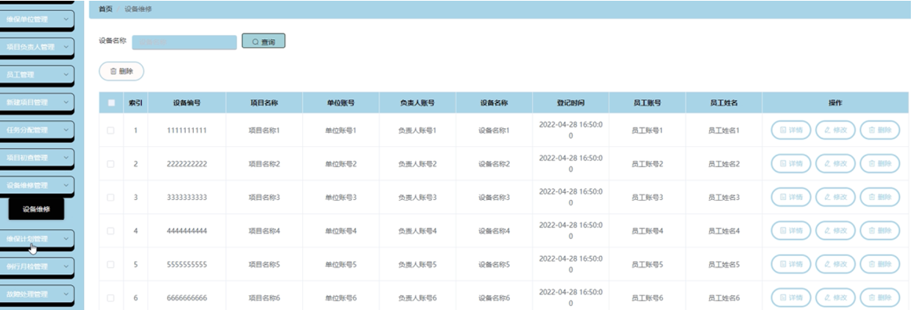

图5-8设备维修管理界面图

维保计划管理，在维保计划管理页面可以对索引、项目名称、单位账号、单位名称、登记时间、负责人账号、负责人姓名等内容进行详情、修改或删除等操作，如图5-9所示。

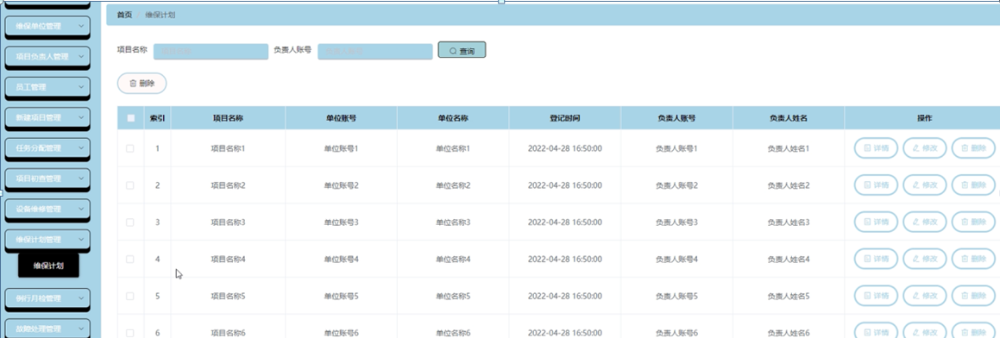

图5-9维保计划管理界面图

例行月检管理，在例行月检管理页面可以对索引、月检标题、负责人账号、负责人姓名、时间、审核发回复、审核状态、审核等内容进行详情、修改或删除等操作，如图5-10所示。

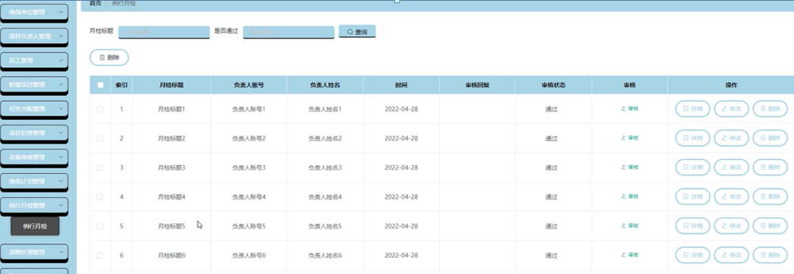

图5-10例行月检管理界面图

配合工作管理，在配合工作管理页面可以对索引、工作编号、工作标题、时间、单位账号、单位名称等内容进行详情、修改或删除等操作，如图5-11所示。

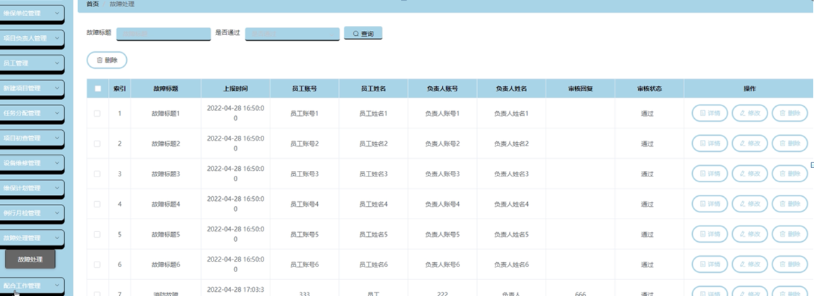

图5-11配合工作管理界面图

火警管理，在火警管理页面可以对索引、火警号码、火警单位、地址等内容进行详情、修改或删除等操作，如图5-12所示。

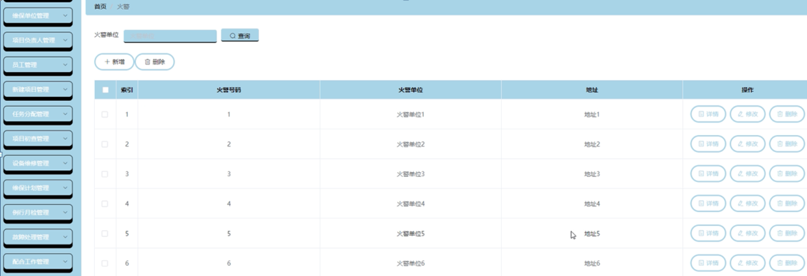

图5-12火警管理界面图

**JAVA** **毕设帮助，指导，源码分享，调试部署**

