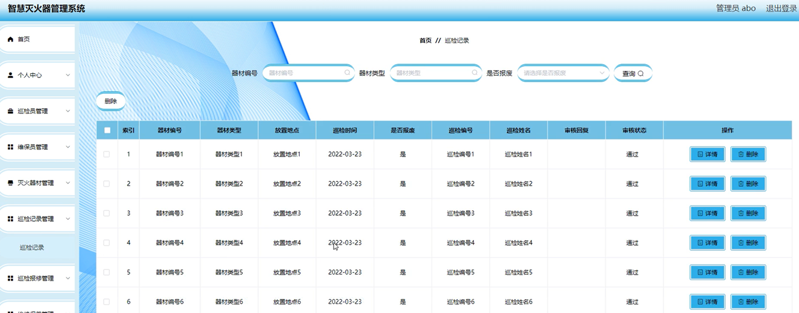

ssm+Vue计算机毕业设计智慧灭火器管理系统（程序+LW文档）

**项目运行**

**环境配置：**

**Jdk1.8 + Tomcat7.0 + Mysql + HBuilderX** **（Webstorm也行）+ Eclispe（IntelliJ
IDEA,Eclispe,MyEclispe,Sts都支持）。**

**项目技术：**

**SSM + mybatis + Maven + Vue** **等等组成，B/S模式 + Maven管理等等。**

**环境需要**

**1.** **运行环境：最好是java jdk 1.8，我们在这个平台上运行的。其他版本理论上也可以。**

**2.IDE** **环境：IDEA，Eclipse,Myeclipse都可以。推荐IDEA;**

**3.tomcat** **环境：Tomcat 7.x,8.x,9.x版本均可**

**4.** **硬件环境：windows 7/8/10 1G内存以上；或者 Mac OS；**

**5.** **是否Maven项目: 否；查看源码目录中是否包含pom.xml；若包含，则为maven项目，否则为非maven项目**

**6.** **数据库：MySql 5.7/8.0等版本均可；**

**毕设帮助，指导，本源码分享，调试部署(见文末)**

**总体设计**

智慧灭火器管理系统采用了结构化开发的方法。这种开发方法的优点是控制性比较强，开发过程中采用了结构化和模块化的设计思想，自顶向下，从总体到部分，合理划分系统的结构和模块。结构化开发时使用模块式开发，各模块之间互不影响，方便系统的开发与管理。

本系统的设计是基于
B/S架构的三层体系结构，也就是浏览器和服务器结构。计算机技术发展的速度非常快，以前的设计结构都以C/S的模式为主，也就是用户端和服务端模式。但随着网页技术的发展，越来越多的用户习惯于使用浏览器。现在的网页技术可以在浏览器中实现非常漂亮的效果，以前的单一低调的用户端页面已经无法满足用户的需求。在B/S这种结构下，技术人员可以很轻松的设计出用户所需要的工作界面，页面代码通过浏览器进行解析展示，在浏览器中不做过多的事务逻辑的处理。主要的事务逻辑放在服务端进行处理。这样用户的电脑就不会承载过多的东西，只需要浏览器展示即可。对于开发人员也很方便进行系统的维护和升级。开发人员只需要在服务端进行系统的维护就可以了。使用ssm这样的跨平台性非常好的框架，这样的开发模式更加的方便，高效。本系统合理的进行了模块划分和组合，因此由于各个模块之间基本上是相互独立的，所以每个模块都可以独立的被解释、执行、调试和修改，让繁琐的系统设计工作简单化。

如图4.1是该系统软件的功能结构图：

图4.1 功能结构图

4.3 系统数据库的设计

4.3.1数据库E/R图

ER图是由实体及其关系构成的图，通过E/R图可以清楚地描述系统涉及到的实体之间的相互关系。在系统中对一些主要的几个关键实体如下图：

(1) 管理员信息E/R图如下所示：

图4.2管理员信息E/R图

(2) 巡检员信息E/R图如下所示：

图4.3巡检员信息E/R图

(3) 维保员信息E/R图如下所示：

图4.4维保员信息E/R图

（4）灭火器材信息E/R图如下所示：

图4.5灭火器材信息E/R图

### 管理员功能模块

管理员登录，管理员通过登录页面输入用户名，密码和角色，点击登录进入系统进行操作，如图5-1所示。

图5-1管理员登录界面图

管理员登陆系统后，可以查看首页、个人中心、巡检员管理、维保员管理、灭火器材管理、巡检记录管理、巡检报修管理、维修保养管理等功能，还能对每个功能逐一进行相应操作，如图5-2所示。

图5-2管理员功能界面图

巡检员管理，在巡检员管理页面查看巡检编号、巡检姓名、性别、手机、备注等内容，进行详情、修改、删除等操作，如图5-3所示。

图5-3巡检员管理界面图

维保员管理，在维保员管理页面查看维保编号、维保姓名、性别、手机、备注等内容进行详情、修改、删除等操作，如图5-4所示。

图5-4维保员管理界面图

灭火器材管理，在灭火器材管理页面查看器材编号、器材类型、器材型号、放置地点、放置时间、器材图片等内容进行详情、修改、删除等操作，如图5-5所示。

图5-5灭火器材管理界面图

巡检记录管理，在巡检记录管理页面查看器材编号、器材类型、放置地点、巡检时间、是否报案、巡检编号、巡检姓名、审核回复、审核状态等内容进行详情、删除等操作，如图5-6所示。

图5-6巡检记录管理界面图

巡检报修管理，在巡检报修管理页面查看器材编号、器材类型、放置地点、报修时间、巡检编号、巡检姓名、审核回复、审核状态等内容进行详情、删除等操作，如图5-7所示。

图5-7巡检报修管理界面图

维修保养管理，在维修保养管理页面查看器材编号、器材类型、放置地点、保养类型、保养时间、维保编号、维保姓名等内容进行详情、删除等操作，如图5-8所示。

图5-8维修保养管理界面图

### 5.2巡检员功能模块

巡检员注册，在注册页面填写巡检编号、密码、确认密码、巡检姓名、手机、备注等详细信息进行注册，如图5-9所示。

图5-9巡检员注册界面图

巡检员登录，巡检员在登录页面通过填写账号、密码和角色信息完成登录，如图5-10所示。

图5-10巡检员登录界面图

巡检员登陆系统后，可以查看首页、个人中心、灭火器材管理、巡检记录管理、巡检报修管理等功能，还能对每个功能逐一进行相应操作，如图5-11所示。

图5-11巡检员功能界面图

灭火器材管理，在灭火器材管理页面查看器材编号、器材类型、器材型号、放置地点、放置时间、器材图片等内容，进行详情、巡检等操作，如图5-12所示。

图5-12灭火器材管理界面图

**JAVA** **毕设帮助，指导，源码分享，调试部署**

