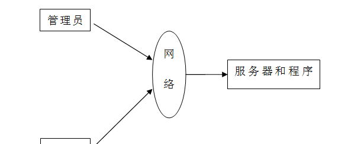
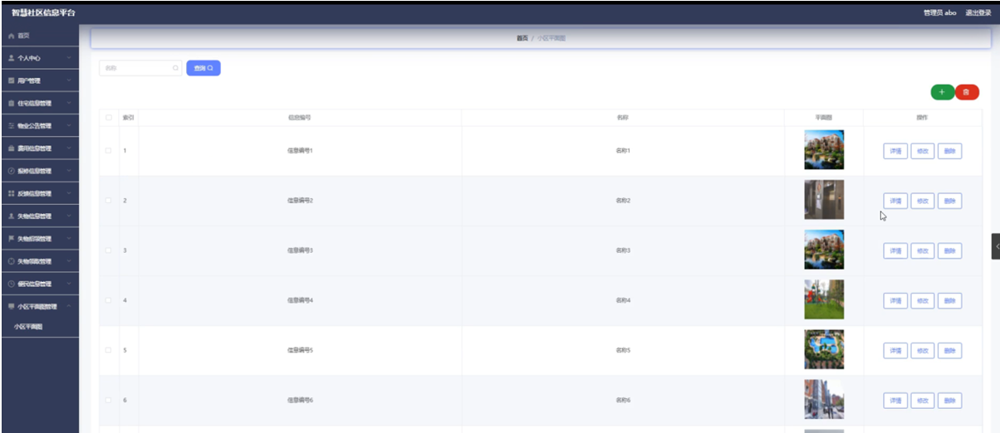

ssm+Vue计算机毕业设计智慧社区信息平台（程序+LW文档）

**项目运行**

**环境配置：**

**Jdk1.8 + Tomcat7.0 + Mysql + HBuilderX** **（Webstorm也行）+ Eclispe（IntelliJ
IDEA,Eclispe,MyEclispe,Sts都支持）。**

**项目技术：**

**SSM + mybatis + Maven + Vue** **等等组成，B/S模式 + Maven管理等等。**

**环境需要**

**1.** **运行环境：最好是java jdk 1.8，我们在这个平台上运行的。其他版本理论上也可以。**

**2.IDE** **环境：IDEA，Eclipse,Myeclipse都可以。推荐IDEA;**

**3.tomcat** **环境：Tomcat 7.x,8.x,9.x版本均可**

**4.** **硬件环境：windows 7/8/10 1G内存以上；或者 Mac OS；**

**5.** **是否Maven项目: 否；查看源码目录中是否包含pom.xml；若包含，则为maven项目，否则为非maven项目**

**6.** **数据库：MySql 5.7/8.0等版本均可；**

**毕设帮助，指导，本源码分享，调试部署** **(** **见文末** **)**

####  系统结构图

智慧社区信息平台的结构图3-1所示：

图3-1 系统结构

登录系统结构图，如图3-2所示：

图3-2 登录结构图

这些功能可以充分满足智慧社区信息平台的需求。此系统功能较为全面如下图系统功能结构如图3-3所示。

图3-3系统功能结构图

###  数据库设计

#### 3.3.1 数据库实体

管理员信息结构图，如图3-7所示：

图3-7管理员信息实体结构图

用户信息实体属性图，如图3-8所示：

图3-8用户信息实体属性图

住宅信息管理实体属性图如图3-9所示。

图3-9住宅信息管理实体属性图

便民信息管理实体属性图如图3-10所示。

图3-10便民信息管理实体属性图

### 系统实现

#### 4.2.1管理员功能模块

管理员登录，通过填写注册时输入的用户名、密码、角色进行登录，如图4-1所示。

图4-1管理员登录界面图

管理员登录进入智慧社区信息平台可以查看首页、个人中心、用户管理、住宅信息管理、物业公告管理、费用信息管理、报修信息管理、反馈信息管理、失物信息管理、失物招领管理、失物领取管理、便民信息管理、小区平面图管理等信息，如图4-2所示。

图4-2管理员功能界面图

用户管理，在用户管理页面中可以查看索引、个人账号、姓名、性别、年龄、身份证号码、手机号码、相片等信息，并可根据需要进行修改或删除等操作，如图4-3所示。

图4-3用户管理界面图

住宅信息管理，在住宅信息管理页面中可以查看索引、信息编号、地址、区域、门牌号、居住人数、个人账号、姓名、日期、审核回复、审核状态、审核等信息，并可根据需要进行费用操作，如图4-4所示。

图4-4住宅信息管理界面图

物业公告管理，在物业公告管理页面中可以查看索引、公告编号、标题、内容、相关图片、发布日期等信息，并可根据需要进行修改或删除等操作，如图4-5所示。

图4-5物业公告管理界面图

费用信息管理，在费用信息管理页面中可以查看索引、费用编号、费用类型、金额、费用日期、门牌号、个人账号、姓名、是否支付等信息，并可根据需要进行修改或删除等操作，如图4-6所示。

图4-6费用信息管理界面图

反馈信息管理，在反馈信息管理页面中可以查看索引、反馈编号、反馈标题、反馈内容、相关图片、门牌号、个人账号、姓名、日期、审核回复、审核状态、审核等信息，如图4-7所示。

图4-7反馈信息管理界面图

失物信息管理，在失物信息管理页面中可以查看索引、信息编号、失物名称、相关图片、数量、个人账号、姓名、日期、审核回复、审核状态、审核等信息，并可根据需要进行信息发布，如图4-8所示。

图4-8失物信息管理界面图

失物招领管理，在失物招领管理页面中可以查看索引、信息编号、失物名称、相关图片、数量、日期等信息，并可根据需要进行修改或删除等操作，如图4-9所示。

图4-9失物招领管理界面图

失物领取管理，在失物领取管理页面中可以查看索引、信息编号、失物名称、相关图片、数量、个人账号、姓名、领取日期、审核回复、审核状态、审核等信息，如图4-10所示。

图4-10失物领取管理界面图

便民信息管理，在便民信息管理页面中可以查看索引、信息编号、项目名称、负责人、负责人电话、发布日期等信息，并可根据需要进行修改或删除等操作，如图4-11所示。

图4-11便民信息管理界面图

小区平面图管理，在小区平面图管理页面中可以查看索引、信息编号、名称、平面图等信息，并可根据需要进行修改或删除等操作，如图4-12所示。

图4-12小区平面图管理界面图

#### **JAVA** **毕设帮助，指导，源码分享，调试部署**

