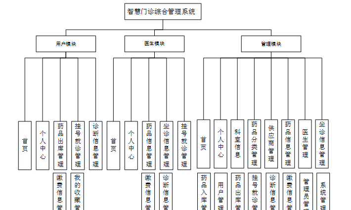

ssm+Vue计算机毕业设计智慧门诊综合管理系统 （程序+LW文档）

**项目运行**

**环境配置：**

**Jdk1.8 + Tomcat7.0 + Mysql + HBuilderX** **（Webstorm也行）+ Eclispe（IntelliJ
IDEA,Eclispe,MyEclispe,Sts都支持）。**

**项目技术：**

**SSM + mybatis + Maven + Vue** **等等组成，B/S模式 + Maven管理等等。**

**环境需要**

**1.** **运行环境：最好是java jdk 1.8，我们在这个平台上运行的。其他版本理论上也可以。**

**2.IDE** **环境：IDEA，Eclipse,Myeclipse都可以。推荐IDEA;**

**3.tomcat** **环境：Tomcat 7.x,8.x,9.x版本均可**

**4.** **硬件环境：windows 7/8/10 1G内存以上；或者 Mac OS；**

**5.** **是否Maven项目: 否；查看源码目录中是否包含pom.xml；若包含，则为maven项目，否则为非maven项目**

**6.** **数据库：MySql 5.7/8.0等版本均可；**

**毕设帮助，指导，本源码分享，调试部署** **(** **见文末** **)**

系统结构设计

系统设计主要是管理员登录后对整个系统相关操作进行处理，可进行管理员的添加和删除，药品信息管理、医生管理、坐诊信息管理、药品入库管理、用户管理、药品出库管理、挂号就诊管理、诊断信息管理、缴费信息管理等操作管理。

系统的功能结构图如下图所示。

图4-1系统功能结构图

E-R图设计

概念设计是整个数据库设计的关键，在概念设计阶段，由需求分析得到了E-
R模型。E-R图是识别功能模型与数据模型间关联关系的，在主题数据库的抽取和规范化的过程中，采用的是简化的E-R图表示方法，从而避免过繁过细的E-
R图表示影响规划的直观和可用性。是对现实世界的抽象和概括，是数据库设计人员进行数据可设计的有力工具，能够方便直接地表达应用中的各种语义知识，令一方面它简单、清晰、易于用户理解。

管理员实体包括管理员名称、密码和权限三个属性。

管理员体ER图如下图所示。

图4-4管理员ER图

药品信息ER图如下图所示。

图4-5药品信息ER图

坐诊信息ER图如下图所示。

图4-6坐诊信息ER图

用户信息ER图如下图所示。

图4-7用户信息ER图

登录模块的实现

系统登录模块可分为前台登录模块和后台登录模块，为确保系统安全性，系统操作员只有在登录界面输入正确的管理员名、密码、权限以及验证码，单击“登录”按钮后才能够进入本系统的主界面。

管理员登录流程图如下所示。

图5-1管理员登录流程图

登录界面如下图所示。

图5-2登录界面

### 5.2 系统功能模块

智慧门诊综合管理系统，在系统的首页可以查看首页、药品信息、坐诊信息、医疗资讯、个人中心、后台管理、客服等信息，如图5-3所示。

图5-3系统首页界面图

用户注册，在用户注册页面通过填写用户名、密码、姓名、手机等信息完成用户注册，如图5-4所示。

图5-4用户注册界面图

药品信息，在药品信息页面中可以查看分类、规格、品牌、供应商名称、进价、售价、数量等信息，如图5-5所示。

图5-5药品信息界面图

坐诊信息，在坐诊信息页面可以查看医生工号、职称、科室、邮箱、坐诊时间、挂号费等信息，进行挂号就诊，如图5-6所示。

图5-6坐诊信息界面图

个人中心，在个人中心页面通过填写用户名、密码、姓名、性别、手机等信息更新信息，如图5-7所示。

图5-7个人中心界面图

客服，通过填写聊天内容进行发布，如图5-8所示。

图5-8客服界面图

### 5.3 管理员模块

管理员登录进入智慧门诊综合管理系统之后，就可以对所有的信息进行查看，可以查看到首页、个人中心、科室信息、药品分类管理、供应商管理、药品信息管理、医生管理、坐诊信息管理、药品入库管理、用户管理、药品出库管理、挂号就诊管理、诊断信息管理、缴费信息管理、管理员管理、系统管理等，并且还可以对其进行相应的操作管理，如图5-9所示。

图5-9管理员功能界面图

科室信息，在科室信息页面中可以查看科室等信息，还可以根据需要进行修改或删除等操作，如图5-10所示。

图5-10科室信息界面图

药品分类管理，在药品分类管理页面中可以查看分类等信息，还可以根据需要进行修改或删除等操作，如图5-11所示。

图5-11药品分类管理界面图

供应商管理，在供应商管理页面中可以查看供应商编号、供应商名称、经营产品、联系人、办公地址、联系电话等信息，还可以根据需要进行修改或删除等操作，如下图5-12所示。

图5-12供应商管理界面图

#### **JAVA** **毕设帮助，指导，源码分享，调试部署**

