ssm+Vue计算机毕业设计智慧门诊综合管理系统（程序+LW文档）

**项目运行**

**环境配置：**

**Jdk1.8 + Tomcat7.0 + Mysql + HBuilderX** **（Webstorm也行）+ Eclispe（IntelliJ
IDEA,Eclispe,MyEclispe,Sts都支持）。**

**项目技术：**

**SSM + mybatis + Maven + Vue** **等等组成，B/S模式 + Maven管理等等。**

**环境需要**

**1.** **运行环境：最好是java jdk 1.8，我们在这个平台上运行的。其他版本理论上也可以。**

**2.IDE** **环境：IDEA，Eclipse,Myeclipse都可以。推荐IDEA;**

**3.tomcat** **环境：Tomcat 7.x,8.x,9.x版本均可**

**4.** **硬件环境：windows 7/8/10 1G内存以上；或者 Mac OS；**

**5.** **是否Maven项目: 否；查看源码目录中是否包含pom.xml；若包含，则为maven项目，否则为非maven项目**

**6.** **数据库：MySql 5.7/8.0等版本均可；**

**毕设帮助，指导，本源码分享，调试部署** **(** **见文末** **)**

### 系统功能设计

系统的功能设计是整个系统的运行基础，是一个把设计需求替换成以计算机系统的形式表示出来。通过对智慧门诊综合管理系统的调查、分析和研究，得出了该网站的总体规划，这是开发设计系统的初步核心。

系统功能结构图如图4-1所示。

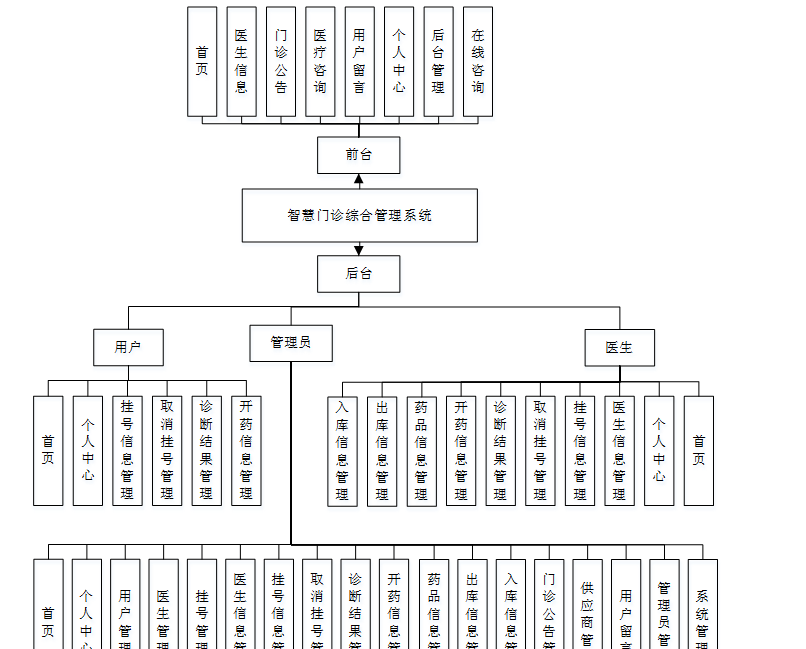

图4-1系统功能结构图

### 4.2数据库设计

在整个系统来说，数据库的设计是相当重要的，需要非常仔细去设计。

本系统中涉及的各级权限分别是：

（1）用户登录权限，可以查看系统前台的门诊信息，修改查看自己的信息，并能修改个人资料，查看门诊信息，还可以在线留言，可以看到网站的公告等。

（2）管理员权限，管理员有系统的所有权限，包括用户的管理，可以添加、修改和删除任意权限的用户；还包括发布网站的门诊公告管理，供应商管理，用户留言，管理员管理，系统管理等等。

#### 4.2.1概念结构设计

根据分析系统的数据需求，得到系统的实体属性图。

(1)管理员信息E-
R图，如图4-2所示：首页，个人中心，用户管理，医生管理，挂号管理，医生信息管理，挂号信息管理，取消挂号管理，诊断结果管理，开药信息管理，药品信息管理，
出库信息管理， 入库信息管理，门诊公告管理，供应商管理，用户留言，管理员管理，系统管理

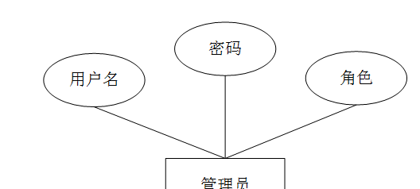

图4-2管理员信息E-R图

(2)用户管理E-R图，如图4-3所示：

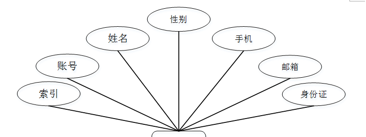

图4-3用户管理E-R图

(3)医生管理E-R图，如图4-4所示：

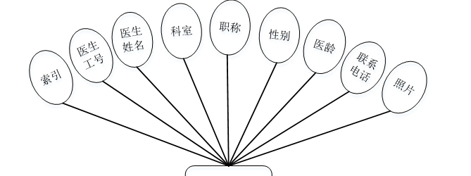

图4-4医生管理E-R图

### 系统功能模块

智慧门诊综合管理系统，在系统首页可以查看首页，医生信息，门诊公告，医疗咨询，用户留言，个人中心，后台管理，在线咨询等内容，并进行详细操作，如图5-1所示。

图5-1系统首页界面图

用户注册，在用户注册页面通过填写用户账号，密码，再次输入密码，姓名，手机，邮箱，身份证等内容完成用户注册，如图5-2所示。

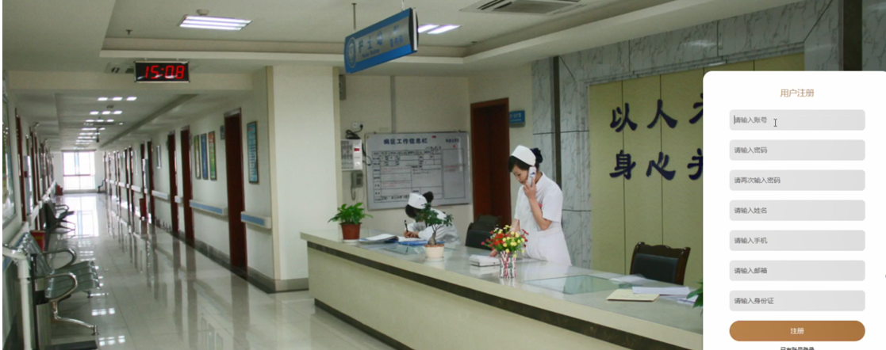

图5-2用户注册界面图

医生信息，在医生信息页面可以查看医生名称，医生工号，上班时间，科室，职称，挂号费，医龄，联系电话，等内容，并进行挂号，收藏操作，如图5-3所示。

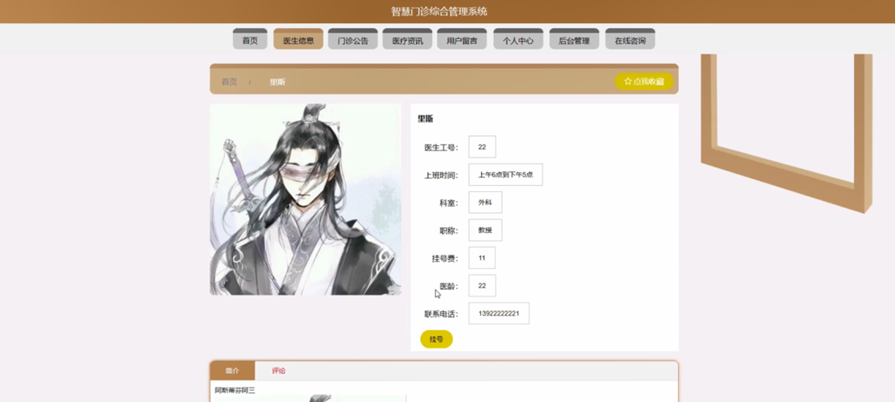

图5-3医生信息界面图

个人中心，在个人中心页面通过填写用户账号，密码，姓名，性别，手机，邮箱，身份证等内容进行更新信息，根据需要对我的收藏进行详细操作，如图5-4所示。

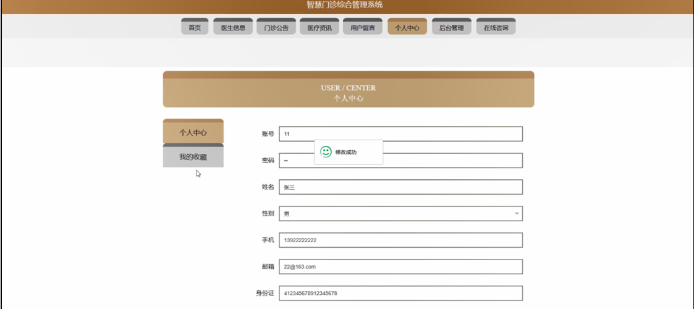

图5-4个人中心界面图

### 5.2管理员功能模块

管理员进行登录，进入系统前在登录页面根据要求填写用户名和密码，选择角色等信息，点击登录进行登录操作，如图5-6所示。

图5-6管理员登录界面图

管理员登录系统后，可以对首页，个人中心，用户管理，医生管理，挂号管理，医生信息管理，挂号信息管理，取消挂号管理，诊断结果管理，开药信息管理，药品信息管理，
出库信息管理， 入库信息管理，门诊公告管理，供应商管理，用户留言，管理员管理，系统管理等进行相应的操作管理，如图5-7所示。

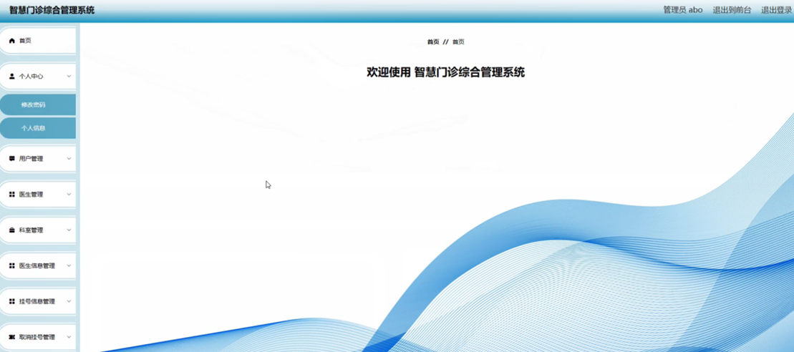

图5-7管理员功能界面图

用户管理，在用户管理页面可以对索引，账号，姓名，性别，手机，邮箱，身份证等内容进行详情，修改和删除等操作，如图5-8所示。

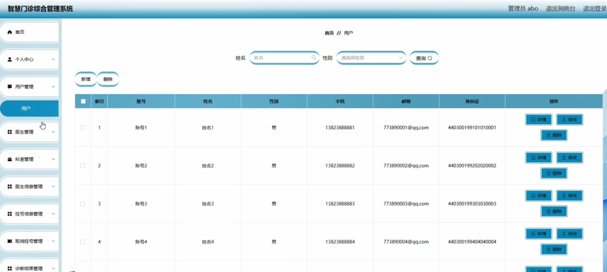

图5-8用户管理界面图

医生管理，在医生管理页面可以对索引，医生工号，医生姓名，科室，职称，性别，医龄，联系电话，照片等内容进行详情，修改和删除等操作，如图5-9所示。

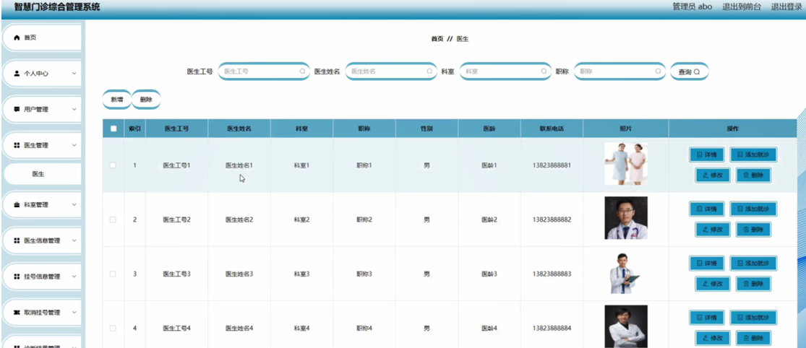

图5-9医生管理界面图

门诊公告管理，在门诊公告管理页面可以对索引，公告标题，图片，发布日期，等内容进行详情，修改和删除等操作，如图5-10所示。

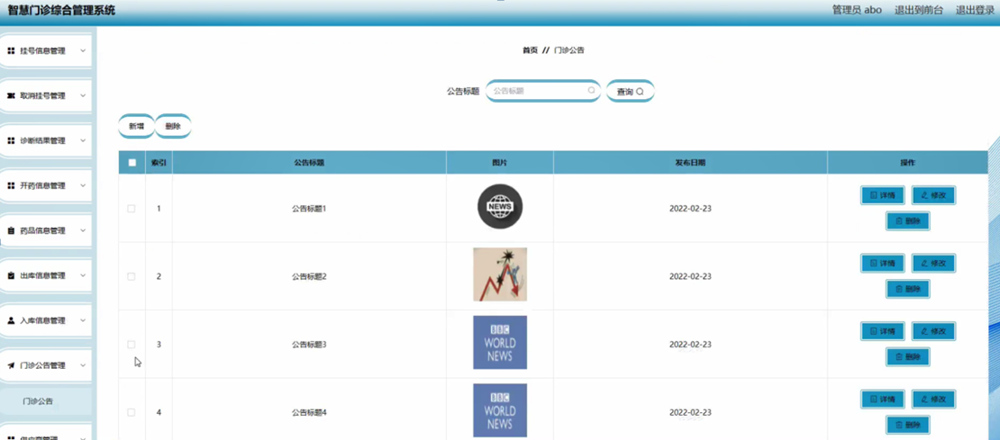

图5-10门诊公告管理界面图

科室管理，在科室管理页面可以对索引，科室等内容进行修改和删除等操作，如图5-11所示。

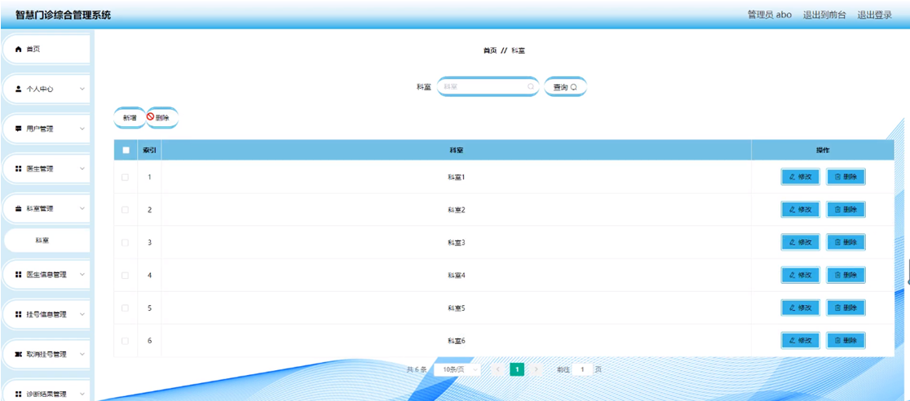

图5-11科室管理界面图

医生信息管理，在医生信息管理页面可以对医生工号，医生姓名，上班时间，科室，职称，挂号费，医龄，联系电话等内容进行详情，挂号，修改，查看评论和删除等操作，如图5-12所示。

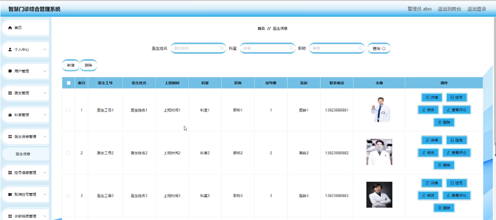

图5-12医生信息管理界面图

#### **JAVA** **毕设帮助，指导，源码分享，调试部署**

