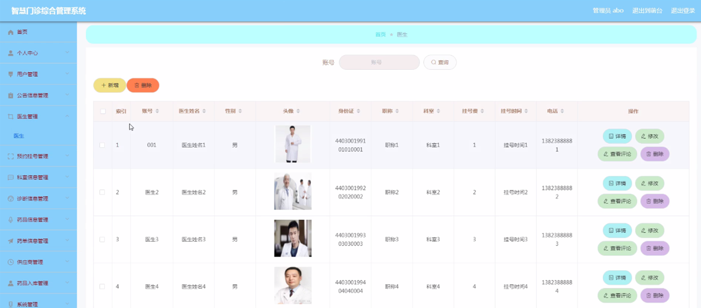
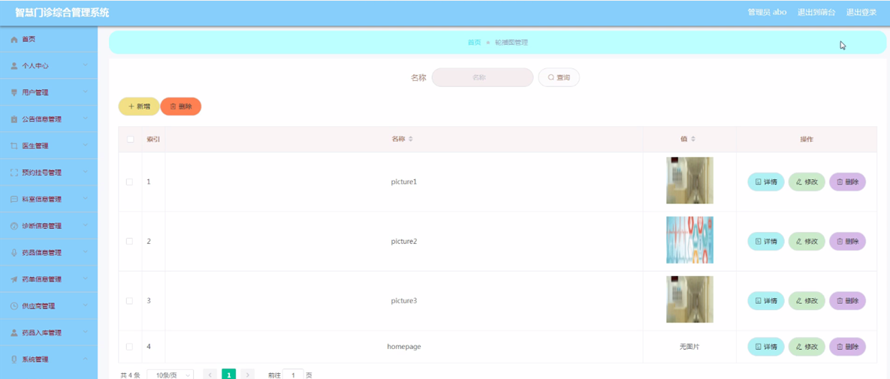

ssm+Vue计算机毕业设计智慧门诊综合管理系统（程序+LW文档）

**项目运行**

**环境配置：**

**Jdk1.8 + Tomcat7.0 + Mysql + HBuilderX** **（Webstorm也行）+ Eclispe（IntelliJ
IDEA,Eclispe,MyEclispe,Sts都支持）。**

**项目技术：**

**SSM + mybatis + Maven + Vue** **等等组成，B/S模式 + Maven管理等等。**

**环境需要**

**1.** **运行环境：最好是java jdk 1.8，我们在这个平台上运行的。其他版本理论上也可以。**

**2.IDE** **环境：IDEA，Eclipse,Myeclipse都可以。推荐IDEA;**

**3.tomcat** **环境：Tomcat 7.x,8.x,9.x版本均可**

**4.** **硬件环境：windows 7/8/10 1G内存以上；或者 Mac OS；**

**5.** **是否Maven项目: 否；查看源码目录中是否包含pom.xml；若包含，则为maven项目，否则为非maven项目**

**6.** **数据库：MySql 5.7/8.0等版本均可；**

**毕设帮助，指导，本源码分享，调试部署** **(** **见文末** **)**

### 系统体系结构

智慧门诊综合管理系统的结构图4-1所示：

图4-1 系统结构

登录系统结构图，如图4-2所示：

图4-2 登录结构图

系统结构图，如图4-3所示。

图4-3系统结构图

### 数据库设计原则

学习编程，我们都知道数据库设计是基于需要设计的系统功能，我们需要建立一个数据库关系模型，用于存储数据信息，这样当我们在程序中时，就没有必要为程序页面添加数据，从而提高系统的效率。数据库存储了很多信息，可以说是信息管理系统的核心和基础，数据库还为系统提供了添加、删除、修改和检查等操作模块，使系统能够快速找到自己想要的信息，而不是在程序代码中找到。数据库中信息表的每个部分根据一定的关系精确地组合，排列和组合成数据表。

通过智慧门诊综合管理系统的功能进行规划分成几个实体信息，实体信息将通过ER图进行说明，本系统的主要实体图如下：

管理员信息属性图如图4-5所示。

图4-5 管理员信息实体属性图

用户信息实体属性图如图4-6所示。

图4-6用户信息实体属性图

医生信息实体属性图如图4-7所示。

图4-7医生信息实体属性图

药品信息实体属性图如图4-8所示。

图4-8药品信息实体属性图

诊断信息实体属性图如图4-9所示。

图4-9诊断信息实体属性图

### 管理员功能模块

管理员登录，通过填写用户名、密码、角色等信息，输入完成后选择登录即可进入智慧门诊综合管理系统，如图5-1所示。

图5-1管理员登录界面图

管理员登录进入智慧门诊综合管理系统查看首页、个人中心、用户管理，公告信息管理、医生管理、预约挂号管理，科室信息管理、诊断信息管理、药品信息管理、药单信息管理、供应商管理、药品入库管理、系统管理等内容，如图5-2所示。

图5-2管理员功能界面图

医生管理，在医生管理页面可以查看账号、医生姓名、性别、头像、身份证、职称、科室、挂号费、挂号时间、电话等信息，并可根据需要对医生管理进行详情，修改，删除操作，如图5-3所示。

图5-3医生管理界面图

管理员在科室信息管理页面可以查看科室名称、简介等信息，并可根据需要对科室信息管理进行修改、删除操作，如图5-4所示。

图5-4科室信息管理界面图

药品信息管理，在药品信息管理页面可以查看药品编号、药品名称、剂型、批次号、生产日期、生产单位、生产地址、药品图片、价格、数量、保质期等信息，并可根据需要对药品信息管理进行详情、修改、删除操作，如图5-5所示。

图5-5药品信息管理界面图

供应商管理，在供应商管理页面可以查看供应商编号、供应商名称、负责人姓名、职务、地址、联系方式等内容，并可根据需要对供应商管理进行详情、修改、删除操作，如图5-6所示。

图5-6供应商管理界面图

医疗资讯，在医疗资讯页面可以查看标题、简介、图片等信息，并可根据需要对医疗资讯进行详情，修改，删除操作，如图5-7所示。

图5-7医疗资讯界面图

轮播图；该页面为轮播图管理界面。管理员可以在此页面进行首页轮播图的管理，通过新建操作可在轮播图中加入新的图片，还可以对以上传的图片进行修改操作，以及图片的删除操作，如图5-8所示。

图5-8轮播图管理界面图

#### **JAVA** **毕设帮助，指导，源码分享，调试部署**

