ssm+Vue计算机毕业设计智能云税导引服务机器人云端管理（程序+LW文档）

**项目运行**

**环境配置：**

**Jdk1.8 + Tomcat7.0 + Mysql + HBuilderX** **（Webstorm也行）+ Eclispe（IntelliJ
IDEA,Eclispe,MyEclispe,Sts都支持）。**

**项目技术：**

**SSM + mybatis + Maven + Vue** **等等组成，B/S模式 + Maven管理等等。**

**环境需要**

**1.** **运行环境：最好是java jdk 1.8，我们在这个平台上运行的。其他版本理论上也可以。**

**2.IDE** **环境：IDEA，Eclipse,Myeclipse都可以。推荐IDEA;**

**3.tomcat** **环境：Tomcat 7.x,8.x,9.x版本均可**

**4.** **硬件环境：windows 7/8/10 1G内存以上；或者 Mac OS；**

**5.** **是否Maven项目: 否；查看源码目录中是否包含pom.xml；若包含，则为maven项目，否则为非maven项目**

**6.** **数据库：MySql 5.7/8.0等版本均可；**

**毕设帮助，指导，本源码分享，调试部署** **(** **见文末** **)**

#### E-R图设计

概念设计是整个数据库设计的关键，在概念设计阶段，由需求分析得到了E-
R模型。E-R图是识别功能模型与数据模型间关联关系的，在主题数据库的抽取和规范化的过程中，采用的是简化的E-R图表示方法，从而避免过繁过细的E-
R图表示影响规划的直观和可用性。是对现实世界的抽象和概括，是数据库设计人员进行数据可设计的有力工具，能够方便直接地表达应用中的各种语义知识，令一方面它简单、清晰、易于用户理解。

用户管理ER图如下图所示。

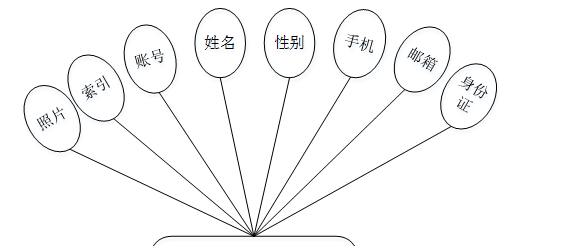

图4-2用户管理ER图

机器人信息管理ER图如下图所示。

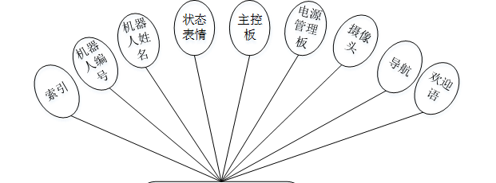

图4-3机器人信息管理ER图

### 登录注册模块的实现

系统登录模块，为确保系统安全性，系统操作员只有在登录界面输入正确的管理员名、密码、权限以及验证码，单击“登录”按钮后才能够进入本系统的主界面。

管理员登录流程图如下所示。

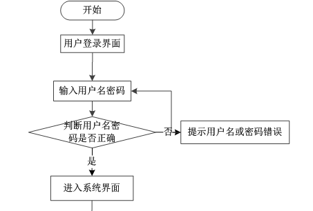

图5-1管理员登录流程图

登录界面如下图所示。

图5-2管理员登录界面图

用户注册，在用户注册页面通过填写账号、密码、姓名、手机、邮箱、身份证等信息进行注册操作，如图5-3所示。

图5-3用户注册界面图

### 5.2管理员功能模块

管理员登录进入智能云税导引服务机器人云端管理系统可以查看首页、个人中心、用户管理、会员管理、机器人信息管理、资源管理、
商品管理、引领带路管理、我的收藏管理、留言板管理、系统管理等信息进行相应操作，如图5-4所示。

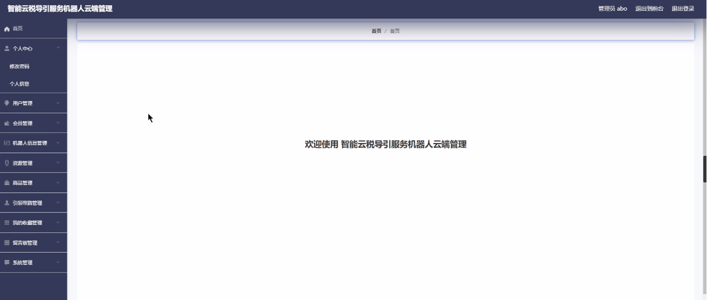

图5-4管理员功能界面图

用户管理，在用户管理页面中可以对索引、账号、姓名、性别、手机、邮箱、身份证、照片等内容，进行详情、修改或删除等操作；如图5-5所示。

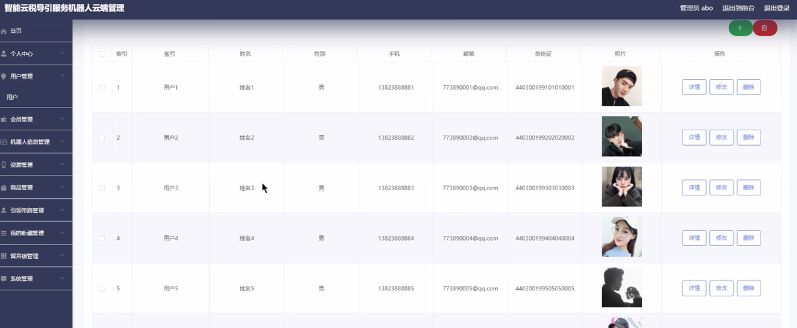

图5-5用户管理界面图

会员管理：在会员管理页面中可以对索引、账号、姓名、性别、手机、邮箱、身份证、照片等内容，进行详情、修改或删除等操作；如图5-6所示。

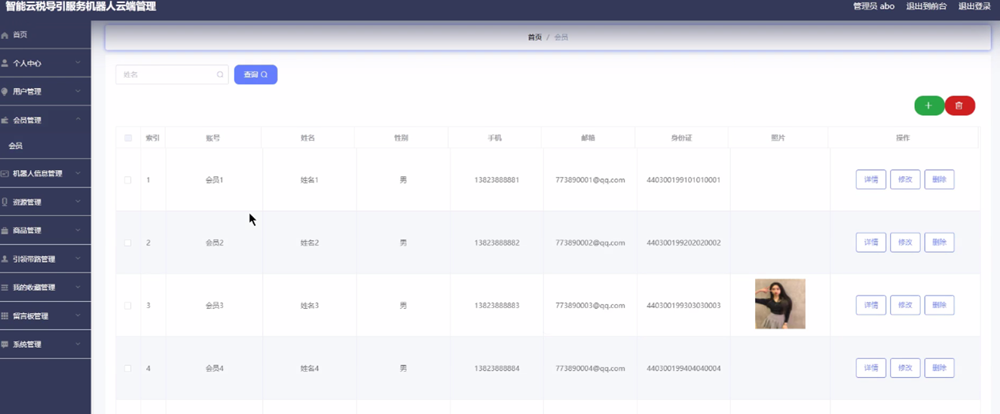

图5-6会员管理界面图

机器人信息管理；在机器人信息管理页面中可以对索引、机器人编号、机器人姓名、欢迎语、状态表情、主控板、电源管理板、摄像头、导航等内容，进行详情、修改或删除等操作；如图5-7所示。

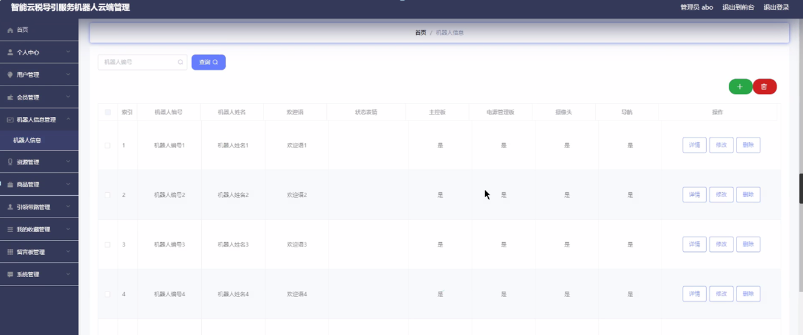

图5-7机器人信息管理界面图

资源管理；在资源管理页面中可以对索引、账号、机器人编号、服务名称、咨询内容、服务时间、不可到地点、不可导范围、图片等内容，进行详情、修改或删除等操作；如图5-8所示。

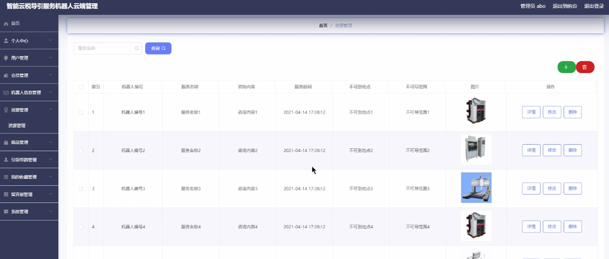

图5-8资源管理界面图

商品管理；在商品管理页面中可以对索引、商品名称、商品分类、商品价格、商品数量、商品是否促销、商品图片等内容，进行详情、修改或删除等操作；如图5-9所示。

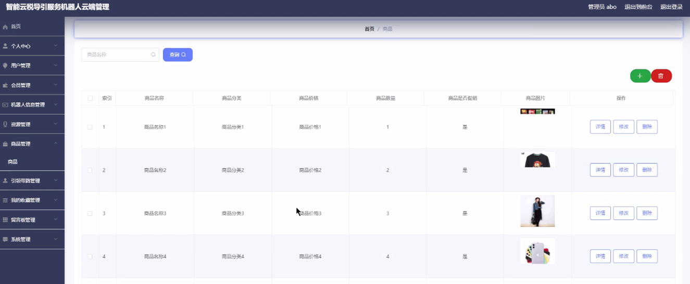

图5-9商品管理界面图

引领带路管理；在引领带路管理页面中可以对索引、名称、图片、上传时间等内容，进行详情、修改或删除等操作；如图5-10所示。

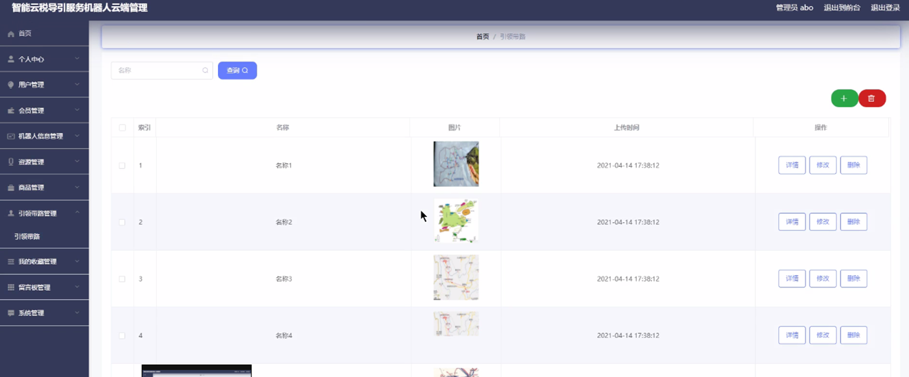

图5-10引领带路管理界面图

我的收藏管理；在我的收藏管理页面中可以对索引、收藏名称、收藏图片等内容，进行详细的操作；如图5-11所示。

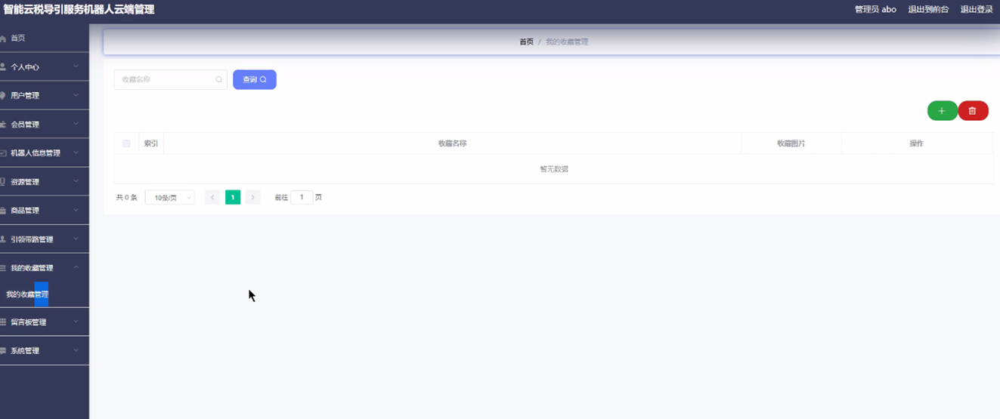

图5-11我的收藏管理界面图

留言板管理：在留言板管理页面中可以对索引、用户名、留言内容、回复内容等信息，进行详情、修改、回复或删除等操作；如图5-12所示。

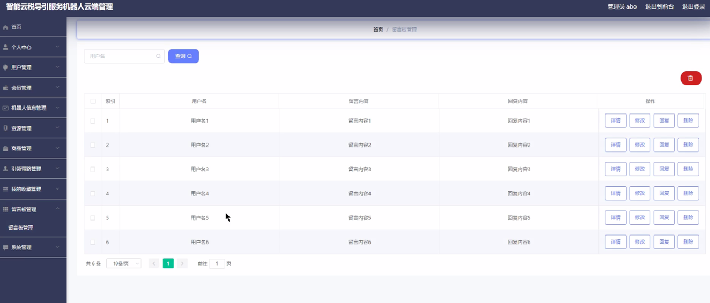

图5-12留言板管理界面图

#### **JAVA** **毕设帮助，指导，源码分享，调试部署**

