ssm+Vue计算机毕业设计智能交通信息管理平台（程序+LW文档）

**项目运行**

**环境配置：**

**Jdk1.8 + Tomcat7.0 + Mysql + HBuilderX** **（Webstorm也行）+ Eclispe（IntelliJ
IDEA,Eclispe,MyEclispe,Sts都支持）。**

**项目技术：**

**SSM + mybatis + Maven + Vue** **等等组成，B/S模式 + Maven管理等等。**

**环境需要**

**1.** **运行环境：最好是java jdk 1.8，我们在这个平台上运行的。其他版本理论上也可以。**

**2.IDE** **环境：IDEA，Eclipse,Myeclipse都可以。推荐IDEA;**

**3.tomcat** **环境：Tomcat 7.x,8.x,9.x版本均可**

**4.** **硬件环境：windows 7/8/10 1G内存以上；或者 Mac OS；**

**5.** **是否Maven项目: 否；查看源码目录中是否包含pom.xml；若包含，则为maven项目，否则为非maven项目**

**6.** **数据库：MySql 5.7/8.0等版本均可；**

**毕设帮助，指导，本源码分享，调试部署** **(** **见文末** **)**

### 系统功能设计

系统的功能设计是整个系统的运行基础，是一个把设计需求替换成以计算机系统的形式表示出来。通过对智能交通信息管理平台的调查、分析和研究，得出了该网站的总体规划，这是开发设计系统的初步核心。

根据前期所得的数据流图，进一步的进行分析和研究，得到系统各模块的属性结构图。下面显示了系统功能的结构图。

智能交通信息管理平台功能模块的结构图，如图4-1所示：

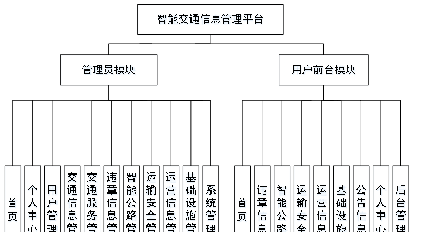

图4-1智能交通信息管理平台结构图

### 4.2数据库设计

在整个系统来说，数据库的设计是相当重要的，需要非常仔细去设计。

本系统中涉及的各级权限分别是：

（1）用户登录权限，可以查看违章信息、智能公路、运输安全、运营信息、基础设施、公告信息等信息，修改查看自己的个人信息。

（2）管理员权限，管理员有系统的所有权限，可以添加、修改和删除任意权限的用户；还主要包括；交通信息、交通服务、违章信息、智能公路、运输安全、运营信息、基础设施等等功能。

#### 4.2.1概念结构设计

根据分析系统的数据需求，得到系统的实体属性图。

(1)用户信息E-R图，如图4-2所示：

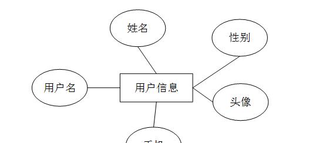

图4-2用户信息E-R图

(2)智能公路信息E-R图，如图4-3所示：

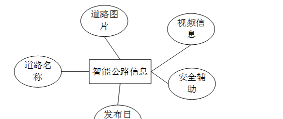

图4-3智能公路信息E-R图

(3)运输安全信息E-R图，如图4-4所示：

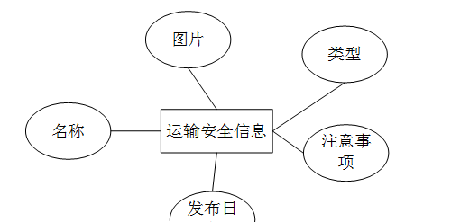

图4-4运输安全信息E-R图

(4)基础设施信息E-R图，如图4-5所示：

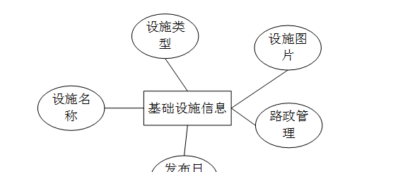

图4-5基础设施信息E-R图

### 用户前台功能模块

智能交通信息管理平台，用户进入前台网站查看首页、违章信息、智能公路、运输安全、运营信息、基础设施、公告信息、个人中心、后台管理等内容进行操作，如图5-1所示。

图5-1用户前台界面图

用户注册，在注册页面可以填写用户名、密码、确认密码、姓名、手机等信息，进行注册，如图5-2所示。

图5-2用户注册界面图

用户登录，在登录页面通过填写账号、密码等信息完成用户登录操作，如图5-3所示。

图5-3用户登录界面图

个人中心：在个人中心管理页面可以查看用户名、密码、姓名、性别、头像、手机等信息更新，退出登录操作，如图5-4所示。

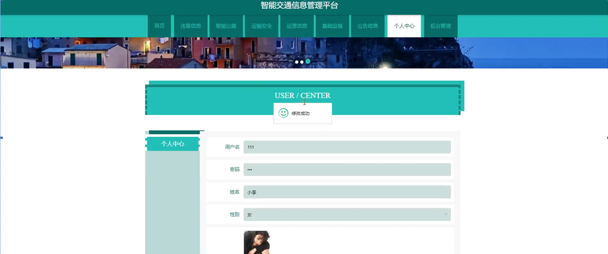

图5-4个人中心界面图

智能公路：在智能公路页面可以查看道路名称、道路图片、视频信息、安全辅助、发布日期等内容操作，如图5-5所示。

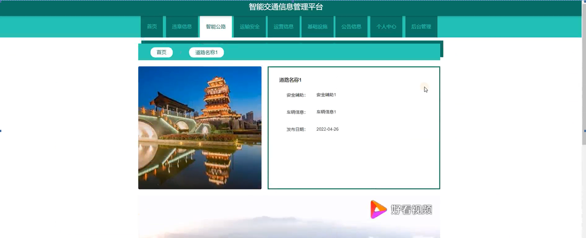图5-5智能公路界面图

运输安全：在运输安全页面查看名称、图片、类型、注意事项、发布日期等内容，进行内容详情操作，如图5-6所示。

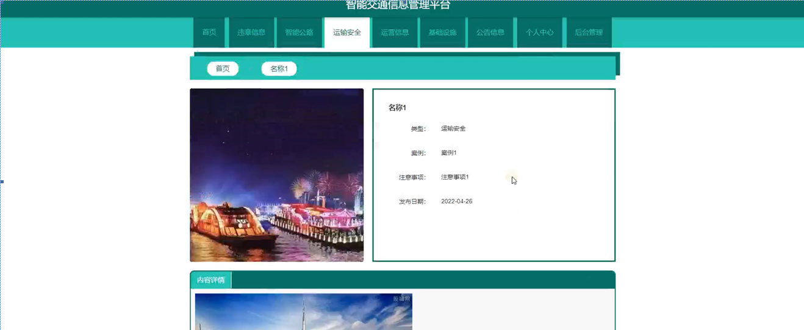图5-6运输安全界面图

运营信息：在运营信息页面查看运营名称、运营类型、运营图片、发布日期等内容，进行内容详情操作，如图5-7所示。

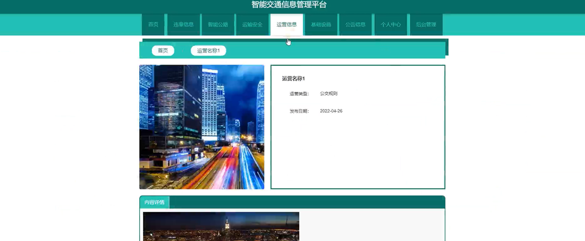图5-7运营信息界面图

基础设施：在基础设施页面查看设施名称、设施类型、设施图片、路政管理、发布日期等内容，进行内容详情操作，如图5-8所示。

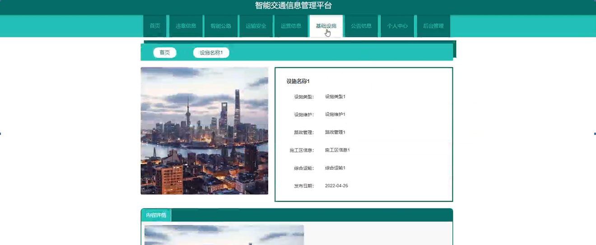图5-8基础设施界面图

### 5.2管理员功能模块

运行系统，首先进入登录界面，按照登录界面的要求填写相应的“用户名”和“密码”以及选择角色，点击“登录”然后系统判断填写是否正确，若正确进入相应的界面，具体流程如图5-9所示。

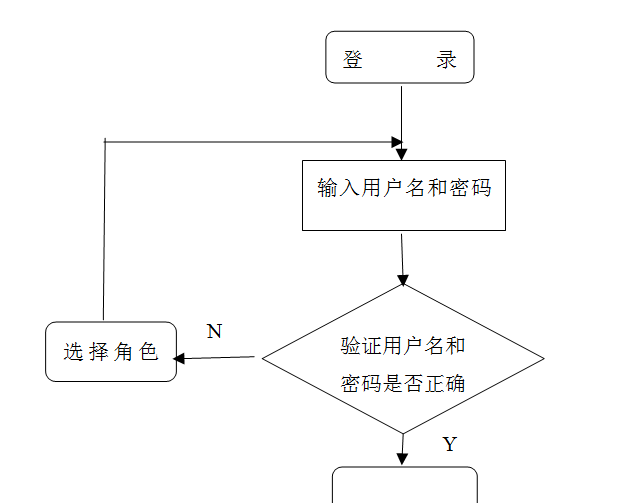

登录流程图

图5-9管理员登录界面图

管理员登录进入智能交通信息管理平台查看首页、个人中心、用户管理、交通信息管理、交通服务管理、违章信息管理、智能公路管理、运输安全管理、运营信息管理、基础设施管理、系统管理内容相应操作，如图5-10所示。

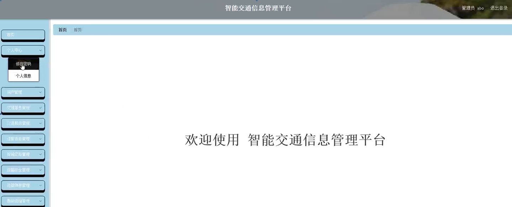

图5-10管理员功能界面图

个人中心，管理员在个人中心页面可以修改个人信息等内容，并进行修改密码操作，如图5-11 5-12所示。

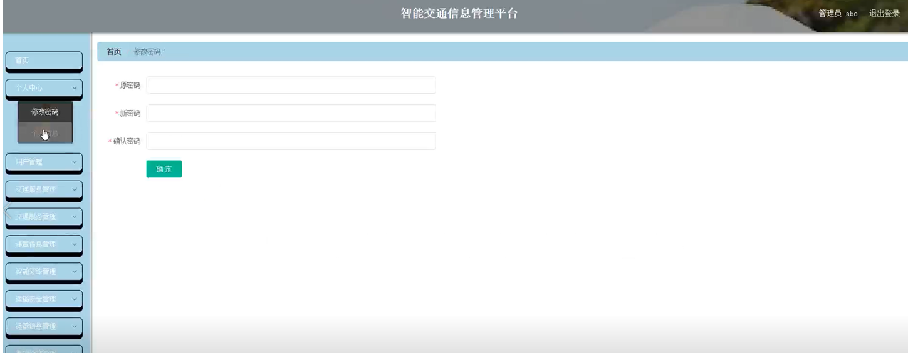

图5-11修改密码界面图

图5-12个人信息界面图

**JAVA** **毕设帮助，指导，源码分享，调试部署**

