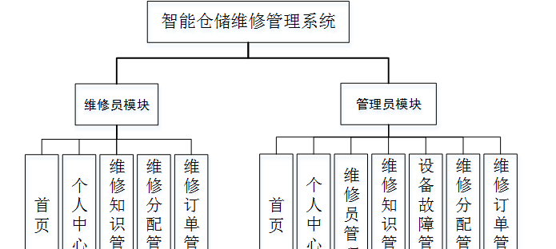

ssm+Vue计算机毕业设计智能仓储维修管理系统设计（程序+LW文档）

**项目运行**

**环境配置：**

**Jdk1.8 + Tomcat7.0 + Mysql + HBuilderX** **（Webstorm也行）+ Eclispe（IntelliJ
IDEA,Eclispe,MyEclispe,Sts都支持）。**

**项目技术：**

**SSM + mybatis + Maven + Vue** **等等组成，B/S模式 + Maven管理等等。**

**环境需要**

**1.** **运行环境：最好是java jdk 1.8，我们在这个平台上运行的。其他版本理论上也可以。**

**2.IDE** **环境：IDEA，Eclipse,Myeclipse都可以。推荐IDEA;**

**3.tomcat** **环境：Tomcat 7.x,8.x,9.x版本均可**

**4.** **硬件环境：windows 7/8/10 1G内存以上；或者 Mac OS；**

**5.** **是否Maven项目: 否；查看源码目录中是否包含pom.xml；若包含，则为maven项目，否则为非maven项目**

**6.** **数据库：MySql 5.7/8.0等版本均可；**

**毕设帮助，指导，本源码分享，调试部署** **(** **见文末** **)**

### 4.1系统总体设计

系统总体设计即对有关系统全局问题的设计，也就是设计系统总的处理方案，又称系统概要设计。它包括系统规划与系统功能设计等内容。

智能仓储维修管理系统主要有两类用户。分别是管理员和维修员，详细规划如图4-1所示。

图4-1 系统规划图

其中各子模块的主要功能如下：

1、用户登录：用户进入网页先输入用户名与密码，选择权限登录，用户登录成功，要记录登录的用户名和登录类型。

2、新用户注册：新用户填写账号、密码、确认密码、姓名、年龄、手机、职位、职务等信息完成注册操作。

3、查看智能仓储维修信息：用户登录成功后，能够按分类或者查找智能仓储维修信息进行管理。

4、主页内容管理：管理员登录以后，可以对首页、个人中心、维修员管理、维修知识管理、设备故障管理、维修分配管理、维修订单管理进行详细操作。

### 4.2数据库设计

数据库是一个软件项目的根基，它决定了整个项目代码的走势，同时也决定了整个项目在后期的维护以及升级的难易程度。

#### 4.2.1 数据库概念设计

根据智能仓储维修管理系统的功能需求，对数据库进行分析，得到相应的数据，设计用户需要的各种实体，以及相互之间的关联，为逻辑结构设计铺好路。根据所实体内的各种具体信息得于实现。

1\. 维修知识实体图如图4-2所示：

图4-2 维修知识实体图

2\. 维修员实体图如图4-3所示：

图4-3维修员实体图

3\. 设备故障实体图如图4-4所示：

图4-4设备故障实体图

### 5.1功能页面实现

按照不同功能模块，在此对系统所涉及的关键页面的实现细节进行阐述，包括页面功能描述，页面涉及功能分析，介绍以及界面展示。

系统登录：
运行系统，首先进入登录界面，按照登录界面的要求填写相应的“账号”和“密码”以及用户类型，点击“登录”然后系统判断填写是否正确，若正确进入相应的界面，否则给出要求先注册信息。具体流程如图5-1所示。

图5-1 登录流程图

登录，通过输入用户名，密码，选择角色并点击登录进行系统登录操作，如图5-2所示。

图5-2登录界面图

维修员注册；在注册页面通过填写账号、密码、确认密码、姓名、年龄、手机、职位、职务等信息完成维修员注册操作，如图5-3所示。

图5-3维修员注册界面图

### 5.2管理员功能模块

管理员登录系统后，可以对首页、个人中心、维修员管理、维修知识管理、设备故障管理、维修分配管理、维修订单管理等功能进行相应操作，如图5-4所示。

图5-4管理员功能界面图

维修员管理；在维修员管理页面可以对索引、账号、姓名、年龄、性别、手机、状态、职位、职务、照片等内容进行详情，修改或删除等操作，如图5-5所示。

图5-5维修员管理界面图

维修知识管理；在维修知识管理页面可以对索引、标题、发布时间、封面等信息进行详情，修改或删除等操作，如图5-6所示。

图5-6维修知识管理界面图

设备故障管理；在设备故障管理页面可以对索引、设备编号、设备名称、品牌、故障图片、登记日期等内容进行详情，维修分配，修改和删除操作，如图5-7所示。

图5-7设备故障管理界面图

维修分配管理；在维修分配管理页面可以对索引、分配编号、设备名称、故障图片、分配日期、账号、姓名、手机等内容进行详情或删除操作，如图5-8所示。

图5-8维修分配管理界面图

维修订单管理；在维修订单管理页面可以对索引、维修单号、设备名称、维修图片、维修进度、登记时间、账号、姓名、手机、审核回复、审核状态、审核等内容进行详情或删除操作，如图5-9所示。

图5-9维修订单管理界面图

### 5.3维修员功能模块

维修员登录进入系统，可以对首页、个人中心、维修知识管理、维修分配管理、维修订单管理等功能进行相应操作，如图5-10所示。

图5-10维修员功能界面图

维修分配管理；在维修分配管理页面可以对索引、分配编号、设备名称、故障图片、分配日期、账号、姓名、手机等内容进行详情或开始维修操作，如图5-11所示。

图5-11维修分配管理界面图

#### **JAVA** **毕设帮助，指导，源码分享，调试部署**

