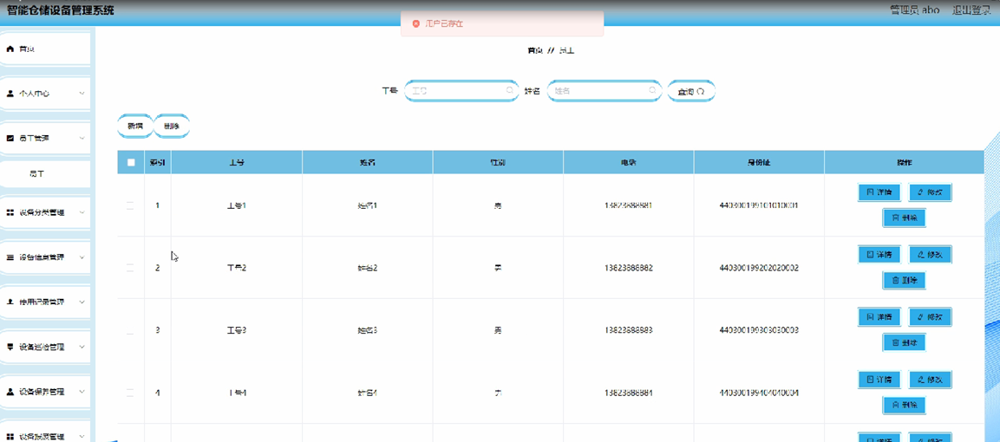
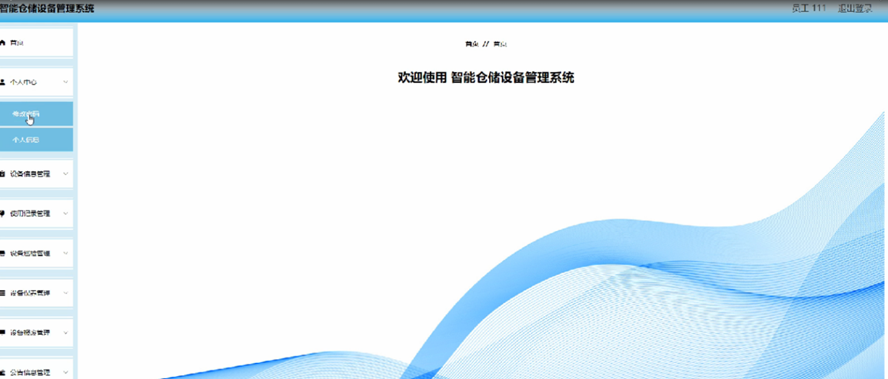

ssm+Vue计算机毕业设计智能仓储设备管理系统（程序+LW文档）

**项目运行**

**环境配置：**

**Jdk1.8 + Tomcat7.0 + Mysql + HBuilderX** **（Webstorm也行）+ Eclispe（IntelliJ
IDEA,Eclispe,MyEclispe,Sts都支持）。**

**项目技术：**

**SSM + mybatis + Maven + Vue** **等等组成，B/S模式 + Maven管理等等。**

**环境需要**

**1.** **运行环境：最好是java jdk 1.8，我们在这个平台上运行的。其他版本理论上也可以。**

**2.IDE** **环境：IDEA，Eclipse,Myeclipse都可以。推荐IDEA;**

**3.tomcat** **环境：Tomcat 7.x,8.x,9.x版本均可**

**4.** **硬件环境：windows 7/8/10 1G内存以上；或者 Mac OS；**

**5.** **是否Maven项目: 否；查看源码目录中是否包含pom.xml；若包含，则为maven项目，否则为非maven项目**

**6.** **数据库：MySql 5.7/8.0等版本均可；**

**毕设帮助，指导，本源码分享，调试部署** **(** **见文末** **)**

### 功能结构

为了更好的去理清本系统整体思路，对该系统以结构图的形式表达出来，设计实现该智能仓储设备管理系统的功能结构图如下所示：

图4-1 系统总体结构图

### 4.2数据库设计

#### 4.2.1数据库E/R图

ER图是由实体及其关系构成的图，通过E/R图可以清楚地描述系统涉及到的实体之间的相互关系。在系统中对一些主要的几个关键实体如下图：

(1)设备信息注册E/R图如下所示：

图4-2设备信息注册E/R图

(2)备品配件息E/R图如下所示：

图4-3备品配件E/R图

系统登录，管理员和员工进入系统前在登录页面根据要求填写账号，密码，验证码和选择角色等信息，点击登录进行登录操作，如图5-1所示。

图5-1系统登录界面图

### 5.1管理员功能模块

管理员登陆系统后，可以查看首页，个人中心，员工管理，设备分类管理，设备信息管理，使用记录管理，设备巡检管理，设备保养管理，设备报废管理，公告信息管理，备品配件管理，入库登记管理，出库登记管理等功能，还能对每个功能逐一进行相应操作，如图5-2所示。

图5-2管理员功能界面图

员工管理，在员工管理页面可以对索引，工号，姓名，性别，电话，身份证等内容进行详情，修改和删除操作，如图5-3所示。

图5-3员工管理界面图

设备信息管理，在设备信息管理页面可以对索引，设备编号，设备名称，数量，型号，用途，设备分类，位置等内容进行详情，修改和删除等操作，如图5-4所示。

图5-4设备信息管理界面图

使用记录管理，在使用记录管理页面可以对索引，设备编号，设备名称，设备型号，设备分类，位置，使用时长，登记日期等内容进行详情，修改和删除等操作，如图5-5所示。

图5-5使用记录管理界面图

设备巡检管理，在设备巡检管理页面可以对索引，设备编号，设备名称，型号，设备分类，位置，设备状态，登记时间，工号，姓名等内容进行详情，修改和删除等操作，如图5-6所示。

图5-6设备巡检管理界面图

设备报废管理，在设备报废管理页面可以对索引，设备编号，设备名称，数量，型号，设备分类，位置，登记日期等内容进行详情，修改和删除等操作，如图5-7所示。

图5-7设备报废管理界面图

备品配件管理，在备品配件管理页面可以对索引，配件名称，配件数量，价格，使用机型，位置，品牌等内容进行详情，修改和删除等操作，如图5-8所示。

图5-8备品配件管理界面图

### 5.2员工功能模块

员工登陆系统，可以查看首页，个人中心，设备信息管理，使用记录管理，设备巡检管理，设备保养管理，设备报废管理，公告信息管理，备品配件管理，入库登记管理，出库登记管理等功能，还能对每个功能逐一进行相应操作，如图5-9所示。

图5-9员工功能界面图

个人中心，在个人信息页面通过填写工号，姓名，性别，电话，身份证等内容进行个人信息修改操作，如图5-10所示。

图5-10个人中心界面图

设备信息管理，在设备信息管理页面可以对索引，设备编号，设备名称，数量，型号，用途，设备分类，位置等内容进行详情，使用，巡检，保养，报废操作等操作，如图5-11所示。

图5-11设备信息管理界面图

使用记录管理，在使用记录管理页面可以对索引，设备编号，设备名称，型号，设备分类，位置，使用时长，登记日期等内容进行详情，修改和删除等操作，如图5-12所示。

图5-12使用记录管理界面图

**JAVA** **毕设帮助，指导，源码分享，调试部署**

