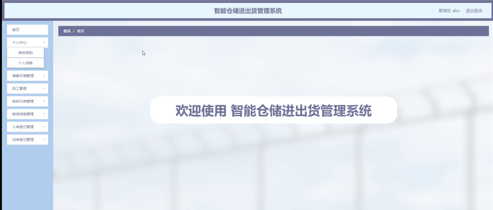
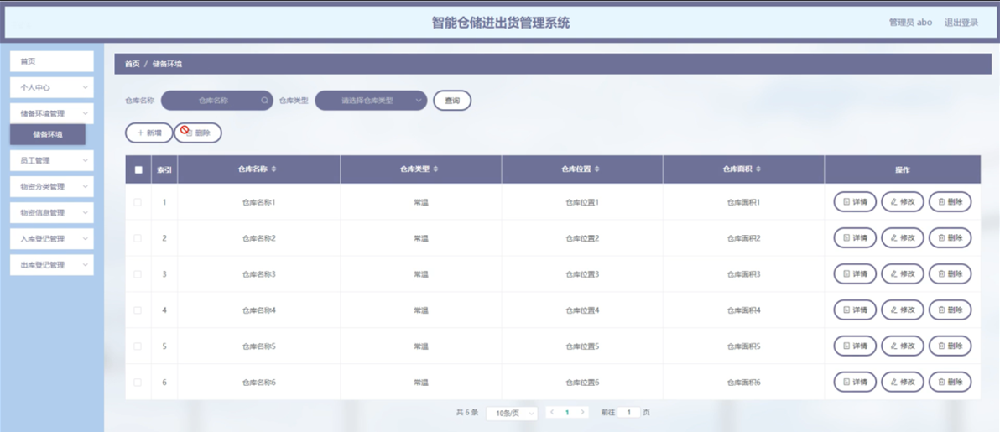
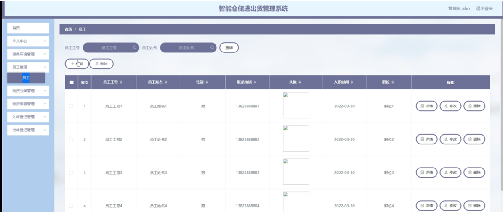

ssm+Vue计算机毕业设计智能仓储进出货管理系统（程序+LW文档）

**项目运行**

**环境配置：**

**Jdk1.8 + Tomcat7.0 + Mysql + HBuilderX** **（Webstorm也行）+ Eclispe（IntelliJ
IDEA,Eclispe,MyEclispe,Sts都支持）。**

**项目技术：**

**SSM + mybatis + Maven + Vue** **等等组成，B/S模式 + Maven管理等等。**

**环境需要**

**1.** **运行环境：最好是java jdk 1.8，我们在这个平台上运行的。其他版本理论上也可以。**

**2.IDE** **环境：IDEA，Eclipse,Myeclipse都可以。推荐IDEA;**

**3.tomcat** **环境：Tomcat 7.x,8.x,9.x版本均可**

**4.** **硬件环境：windows 7/8/10 1G内存以上；或者 Mac OS；**

**5.** **是否Maven项目: 否；查看源码目录中是否包含pom.xml；若包含，则为maven项目，否则为非maven项目**

**6.** **数据库：MySql 5.7/8.0等版本均可；**

**毕设帮助，指导，本源码分享，调试部署** **(** **见文末** **)**

### 软件功能模块设计

系统整体功能如下图所示：

图 4-1 系统总体功能模块图

### 管理员功能模块

管理员登录，管理员通过输入用户名、密码、选择角色等信息，然后点击登录就能登录到系统进行系统的使用了，如图5-1所示。

图5-1管理员登录界面图

管理员登录系统后，可以对首页、个人中心、储备环境管理、员工管理、物资分类管理、物资信息管理、入库登记管理、出库登记管理等功能进行相应的操作管理，如图5-2所示。

图5-2管理员功能界面图

储备环境管理，在储备环境管理页面可以对索引、仓库名称、仓库类型、仓库位置、仓库面积等信息进行详情、修改和删除等操作，如图5-3所示。

图5-3储备环境管理界面图

员工管理，在员工管理页面可以对索引、员工工号、员工姓名、性别、联系电话、头像、入职时间、职位等内容进行详情、修改和删除等操作，如图5-4所示。

图5-4员工管理界面图

物资分类管理，在物资分类管理页面可以对索引、物资分类等内容进行详情、修改和删除等操作，如图5-5所示。

图5-5物资分类管理界面图

物资信息管理，在物资信息管理页面可以对索引、物品编号、物品名称、物资分类、数量、仓库名称、仓库类型、登记时间等内容进行详情、修改和删除等操作，如图5-6所示。

图5-6物资信息管理界面图

入库登记管理，在入库登记管理页面可以对索引、入库编号、物品编号、物品名称、物资分类、数量、仓库名称、仓库类型、登记时间等内容进行详情、修改和删除等操作，如图5-7所示。

图5-7入库登记管理界面图

出库登记管理，在出库登记管理页面可以对索引、出库编号、物品编号、物品名称、物资分类、数量、仓库名称、仓库类型、登记时间等内容进行详情、修改和删除等操作，如图5-8所示。

图5-8出库登记管理界面图

### 5.2员工功能模块

员工登录进入智能仓储进出货管理系统可以对首页、个人中心、储备环境管理、物资信息管理、入库登记管理、出库登记管理等功能进行相应操作，如图5-9所示。

图5-9员工功能界面图

个人中心，在个人中心页面可以对员工工号、性别、头像、入职时间、员工姓名、联系电话、职位等内容进行个人信息修改，如图5-10所示。

图5-10个人中心界面图

储备环境管理，在储备环境管理页面可以对索引、仓库名称、仓库类型、仓库位置、仓库面积等内容进行详情操作，如图5-11所示。

图5-11储备环境管理界面图

物资信息管理，在物资信息管理页面可以对索引、物品编号、物品名称、物资分类、数量、仓库名称、仓库类型、登记时间等内容进行详情、入库、出库等操作，如图5-12所示。

图5-12物资信息管理界面图

**JAVA** **毕设帮助，指导，源码分享，调试部署**

