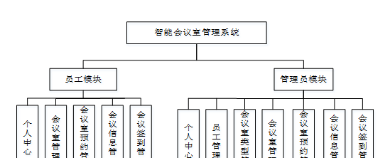
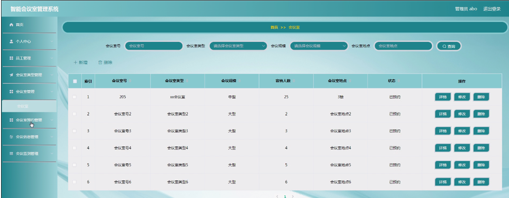
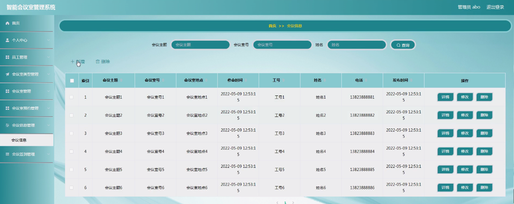

ssm+Vue计算机毕业设计智能会议室管理系统（程序+LW文档）

**项目运行**

**环境配置：**

**Jdk1.8 + Tomcat7.0 + Mysql + HBuilderX** **（Webstorm也行）+ Eclispe（IntelliJ
IDEA,Eclispe,MyEclispe,Sts都支持）。**

**项目技术：**

**SSM + mybatis + Maven + Vue** **等等组成，B/S模式 + Maven管理等等。**

**环境需要**

**1.** **运行环境：最好是java jdk 1.8，我们在这个平台上运行的。其他版本理论上也可以。**

**2.IDE** **环境：IDEA，Eclipse,Myeclipse都可以。推荐IDEA;**

**3.tomcat** **环境：Tomcat 7.x,8.x,9.x版本均可**

**4.** **硬件环境：windows 7/8/10 1G内存以上；或者 Mac OS；**

**5.** **是否Maven项目: 否；查看源码目录中是否包含pom.xml；若包含，则为maven项目，否则为非maven项目**

**6.** **数据库：MySql 5.7/8.0等版本均可；**

**毕设帮助，指导，本源码分享，调试部署** **(** **见文末** **)**

### 功能结构

为了更好的去理清本系统整体思路，对该系统以结构图的形式表达出来，设计实现该智能会议室管理系统的功能结构图如下所示：

图4-1 系统总体结构图

### 4.2 数据库设计

####  4.2.1 数据库E/R图

ER图是由实体及其关系构成的图，通过E/R图可以清楚地描述系统涉及到的实体之间的相互关系。在系统中对一些主要的几个关键实体如下图：

(1) 员工信息E/R图如下所示：

图4-2员工信息E/R图

(2) 会议室信息E/R图如下所示：

图4-3会议室信息E/R图

(3) 会议信息E/R图如下所示：

图4-4会议信息E/R图

### 管理员功能模块

管理员登录，管理员通过输入用户名，密码和角色，点击登录进入系统操作进行操作，如图5-1所示。

图5-1管理员登录界图面

管理员通过登陆进入系统后，可以查看个人中心、员工管理、会议室类型管理、会议室管理、会议室预约管理、会议信息管理、会议签到管理等功能，还能对每个功能逐一进行相应操作，如图5-2所示。

图5-2管理员功能界图面

员工管理，管理员可在员工管理页面查看工号、姓名、头像、性别、部门、职位、电话等内容，还可进行修改或删除等操作，如图5-3所示。

图5-3员工管理界面图

会议室类型管理，管理员可在会议室类型管理页面进行查询、新增、修改或删除等操作，如图5-4所示。

图5-4会议室类型管理界面图

会议室管理，管理员可在会议室管理页面查看会议室号、会议室类型、会议规模、容纳人数、会议室地点、状态等内容，还可进行新增、修改或删除等操作，如图5-5所示。

图5-5会议室管理界面图

会议室预约管理，管理员可在会议室预约管理页面查看会议室号、会议室类型、会议室地点、会议主题、参会时间、预约时间、工号、姓名、电话、审核回复、审核状态等内容，还可进行审核或删除等操作，如图5-6所示。

图5-6会议室预约管理界面图

会议信息管理，管理员可在会议信息管理页面查看会议主题、会议室号、会议室地点、参会时间、工号、姓名、电话、发布时间等内容，还可进行新增、修改或删除等操作，如图5-7所示。

图5-7会议信息管理界面图

会议签到管理，管理员可在会议签到管理页面查看会议主题、会议室号、会议室地点、本人照片、签到时间、工号、姓名、电话等内容，还可进行修改或删除等操作，如图5-8所示。

图5-8会议签到管理界面图

5.2员工功能模块

员工注册，员工通过输入工号、密码、姓名、部门、职位、电话等内容进行注册，如图5-9所示。

图5-9员工注册界面图

员工通过登录进入系统可查看个人中心、会议室管理、会议室预约管理、会议信息管理、会议签到管理等内容，如图5-10所示。

图5-10员工功能界面图

会议室预约管理，员工可在会议室预约管理页面查看会议室号、会议室类型、会议室地点、会议主题、参会时间、预约时间、工号、姓名、电话、审核回复、审核状态等内容，还可进行删除等操作，如图5-11所示。

图5-11会议室预约管理界面图

会议信息管理，员工可在会议信息管理页面查看会议主题、会议室号、会议室地点、参会时间、工号、姓名、电话、发布时间等内容，还可进行删除等操作，如图5-12所示。

图5-12会议信息管理界图面

#### **JAVA** **毕设帮助，指导，源码分享，调试部署**

