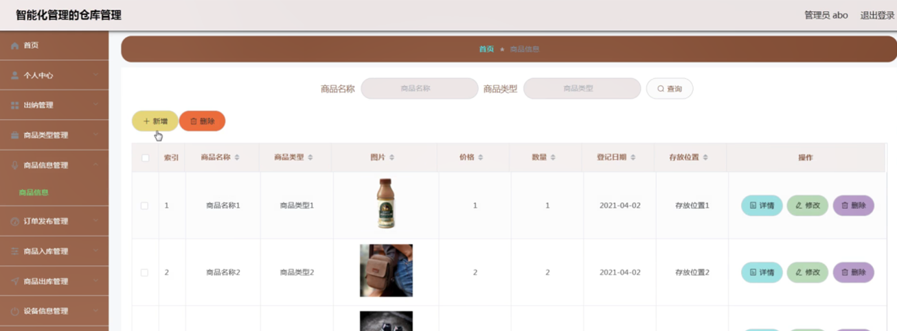

ssm+Vue计算机毕业设计智能化管理的仓库管理（程序+LW文档）

**项目运行**

**环境配置：**

**Jdk1.8 + Tomcat7.0 + Mysql + HBuilderX** **（Webstorm也行）+ Eclispe（IntelliJ
IDEA,Eclispe,MyEclispe,Sts都支持）。**

**项目技术：**

**SSM + mybatis + Maven + Vue** **等等组成，B/S模式 + Maven管理等等。**

**环境需要**

**1.** **运行环境：最好是java jdk 1.8，我们在这个平台上运行的。其他版本理论上也可以。**

**2.IDE** **环境：IDEA，Eclipse,Myeclipse都可以。推荐IDEA;**

**3.tomcat** **环境：Tomcat 7.x,8.x,9.x版本均可**

**4.** **硬件环境：windows 7/8/10 1G内存以上；或者 Mac OS；**

**5.** **是否Maven项目: 否；查看源码目录中是否包含pom.xml；若包含，则为maven项目，否则为非maven项目**

**6.** **数据库：MySql 5.7/8.0等版本均可；**

**毕设帮助，指导，本源码分享，调试部署** **(** **见文末** **)**

### 系统体系结构

智能化管理的仓库管理系统的结构图4-1所示：

图4-1 系统结构

登录系统结构图，如图4-2所示：

图4-2 登录结构图

系统结构图，如图4-3所示：

图4-3 系统结构图

### 4.2 数据库实体设计

数据库的功能就是对系统中所有的数据进行存储和管理。所有的数据可以在数据库中产时间的进行存储，方便用户的使用。而且所有的数据库中的数据也应该具有一定的共享性，任何的系统可以对一些数据进行使用，同时还应该保持一定的独立性，每一个数据库中的数据都有很强的安全性，可以被很好的存放到数据库，没有进行身份的验证是不能对这些数据进行查看和使用的。数据库的设计需要明确每一个实体之间的联系，系统的E-
R图如下图所示：

出纳管理实体主要存储管理信息包括索引、用户名、姓名、性别、头像、邮箱、手机等属性。出纳管理属性图如图4-4所示。

图4-4出纳管理实体属性图

商品信息管理主要包括索引、商品名称、商品类型、图片、价格、数量、登记日期、存放位置等属性，商品信息管理属性图如图4-5所示。

图4-5商品信息管理实体属性图

### 管理员功能模块

管理员登录，管理员通过输入界面上显示的信息然后点击登录就能登录到系统进行系统的使用了，如图5-1所示。

图5-1管理员登录界面图

管理员登录进入智能化管理的仓库管理系统之后，就可以对所有的信息进行查看，可以查看到首页、个人中心、出纳管理、商品类型管理、商品信息管理、订单发布管理、商品入库管理、商品出库管理、设备信息管理、设备报修管理等功能，并且还可以对其进行相应的操作管理，如图5-2所示。

图5-2管理员功能界面图

出纳管理，在出纳管理页面中可以对索引、用户名、姓名、性别、头像、邮箱、手机等信息进行详情，修改或删除等操作，如图5-3所示。

图5-3出纳管理界面图

商品类型管理，在商品类型管理页面中可以对索引、商品类型等信息进行修改或删除等操作，如图5-4所示。

图5-4商品类型管理界面图

商品信息管理，在商品信息管理页面中可以对索引、商品名称、商品类型、图片、价格、数量、登记日期、存放位置等信息进行详情，修改或删除等操作，如图5-5所示。

图5-5商品信息管理界面图

订单发布管理，在订单发布管理页面中可以对索引、订单类型、名称、商品名称、数量、订单内容、发布时间、用户名、姓名等信息进行详情，修改或删除等操作，如图5-6所示。

图5-6订单发布管理界面图

商品入库管理，在商品入库管理页面中可以对索引、订单编号、商品名称、商品类型、供应商、进货价格、数量、总价格、存放位置、入库日期、入库内容、用户名、姓名等信息进行详情，修改或删除等操作，如图5-7所示。

图5-7商品入库管理界面图

商品出库管理，在商品出库管理页面中可以对索引、订单编号、商品名称、商品类型、客户、价格、数量、总价格、出库日期、出库内容、用户名、姓名等信息进行详情，修改或删除等操作，如图5-8所示。

图5-8商品出库管理界面图

设备信息管理，在设备信息管理页面中可以对索引、设备编号、设备名称、位置、数量、用途、注意事项、设备详情、登记时间等信息进行详情，修改或删除等操作，如图5-9所示。

图5-9设备信息管理界面图

设备报修管理，在设备报修管理页面中可以对索引、设备编号、设备名称、位置、报修内容、报修日期、用户名、姓名、审核回复、审核状态、审核等信息进行修改或删除等操作，如图5-10所示。

图5-10设备报修管理界面图

### 5.2 出纳功能模块

出纳登录进入智能化管理的仓库管理系统可以查看到首页、个人中心、商品信息管理、订单发布管理、商品入库管理、商品出库管理、设备信息管理、设备报修管理等功能，并且还可以对其进行相应的操作管理，如图5-11所示。

图5-11出纳功能界面图

个人中心，在个人中心页面通过填写用户名、姓名、性别、头像、邮箱、手机等信息进行个人信息修改操作，如图5-12所示。

图5-12个人中心界面图

#### **JAVA** **毕设帮助，指导，源码分享，调试部署**

