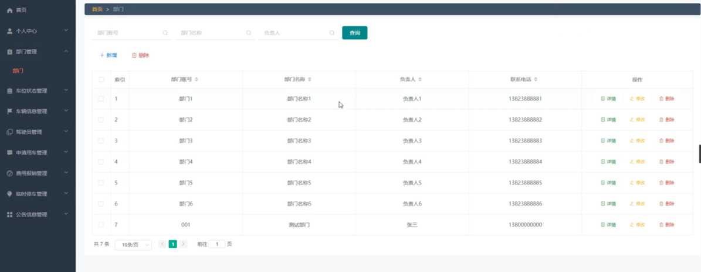
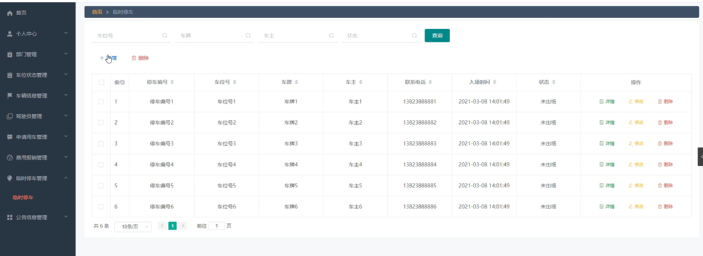

ssm+Vue计算机毕业设计智能化车辆管理综合信息平台（程序+LW文档）

**项目运行**

**环境配置：**

**Jdk1.8 + Tomcat7.0 + Mysql + HBuilderX** **（Webstorm也行）+ Eclispe（IntelliJ
IDEA,Eclispe,MyEclispe,Sts都支持）。**

**项目技术：**

**SSM + mybatis + Maven + Vue** **等等组成，B/S模式 + Maven管理等等。**

**环境需要**

**1.** **运行环境：最好是java jdk 1.8，我们在这个平台上运行的。其他版本理论上也可以。**

**2.IDE** **环境：IDEA，Eclipse,Myeclipse都可以。推荐IDEA;**

**3.tomcat** **环境：Tomcat 7.x,8.x,9.x版本均可**

**4.** **硬件环境：windows 7/8/10 1G内存以上；或者 Mac OS；**

**5.** **是否Maven项目: 否；查看源码目录中是否包含pom.xml；若包含，则为maven项目，否则为非maven项目**

**6.** **数据库：MySql 5.7/8.0等版本均可；**

**毕设帮助，指导，本源码分享，调试部署** **(** **见文末** **)**

### 系统体系结构

智能化车辆管理综合信息平台的结构图4-1所示：

图4-1 系统结构

登录系统结构图，如图4-2所示：

图4-2 登录结构图

系统结构图，如图4-3所示：

图4-3 系统结构图

### 4.2 数据库实体设计

数据库的功能就是对系统中所有的数据进行存储和管理。所有的数据可以在数据库中产时间的进行存储，方便用户的使用。而且所有的数据库中的数据也应该具有一定的共享性，任何的系统可以对一些数据进行使用，同时还应该保持一定的独立性，每一个数据库中的数据都有很强的安全性，可以被很好的存放到数据库，没有进行身份的验证是不能对这些数据进行查看和使用的。数据库的设计需要明确每一个实体之间的联系，系统的E-
R图如下图所示：：

管理员实体主要存储管理信息包括用户名、密码、角色属性。管理员信息属性图如图4-4所示。

图4-4 管理员信息实体属性图

部门信息主要包括部门账号、部门名称、负责人、联系电话等属性，部门信息属性图如图4-5所示。

图4-5部门信息实体属性图

车辆信息管理实体属性主要包括索引、车辆编号、车牌号、车辆类型、限乘人数、车辆图片、车辆状态、购置时间、固定车位等属性。车辆信息管理实体属性图如图4-6所示。

图4-6车辆信息管理实体属性图

申请用车管理属性主要包括索引、申请单编号、车牌号、部门账号、部门名称、申请时间、预计归还时间、是否需要司机、用途、审核回复、审核状态等属性。申请用车管理实体属性图如图4-7所示。

图4-7申请用车管理实体属性图

### 管理员功能模块

管理员登录，管理员通过输入账号、密码、角色等信息即可进行系统登录，如图5-1所示。

图5-1管理员登录界面图

管理员登录进入智能化车辆管理综合信息平台可以查看首页、个人中心、部门管理、车位状态管理、车辆信息管理、驾驶员管理、申请用车管理、费用报销管理、临时停车管理、公告信息管理等内容，如图5-2所示。

图5-2管理员功能界面图

部门管理，在部门管理页面可以查看索引、部门账号、部门名称、负责人、联系电话等信息，并可根据需要进行修改或删除等操作，如图5-3所示。

图5-3部门管理界面图

车位状态管理，在车位状态管理页面可以查看索引、类型、车位、状态等信息，并可根据需要进行修改或删除等操作，如图5-4所示。

图5-4车位状态管理界面图

车辆信息管理，在车辆信息管理页面可以查看索引、车辆编号、车牌号、车辆类型、限乘人数、车辆图片、车辆状态、购置时间、固定车位等信息，并可根据需要进行修改或删除等操作，如图5-5所示。

图5-5车辆信息管理界面图

驾驶员管理，在驾驶员管理页面可以查看索引、驾驶员工号、驾驶员姓名、联系电话、状态、驾龄等信息，并可根据需要进行修改或删除等操作，如图5-6所示。

图5-6驾驶员管理界面图

申请用车管理，在申请用车管理页面可以查看索引、申请单编号、车牌号、部门账号、部门名称、申请时间、预计归还时间、是否需要司机、用途、审核回复、审核状态、审核等信息，并可根据需要进行修改或删除等操作，如图5-7所示。

图5-7申请用车管理界面图

费用报销管理，在费用报销管理页面可以查看索引、报销单编号、申请单编号、部门账号、部门名称、报销类型、报销金额、发票、申请时间、审核回复、审核状态、审核等信息，并可根据需要进行修改或删除等操作，如图5-8所示。

图5-8费用报销管理界面图

临时停车管理，在临时停车管理页面可以查看索引、停车编号、车位号、车牌、车主、联系电话、入场时间、状态等信息，并可根据需要进行修改或删除等操作，如图5-9所示。

图5-9临时停车管理界面图

公告信息管理，在公告信息管理页面可以查看索引、公告、时间等信息，并可根据需要进行修改或删除等操作，如图5-10所示。

图5-10公告信息管理界面图

### 5.2部门功能模块

部门登录进入智能化车辆管理综合信息平台可以查看首页、个人中心、车辆信息管理、驾驶员管理、申请用车管理、费用报销管理、公告信息管理等内容，如图5-11所示。

图5-11部门功能界面图

个人中心，在个人中心页面通过填写部门账号、部门名称、负责人、联系电话等信息进行修改，如图5-12所示。

图5-12个人中心界面图

#### **JAVA** **毕设帮助，指导，源码分享，调试部署**

