ssm+Vue计算机毕业设计智能垃圾分类系统（程序+LW文档）

**项目运行**

**环境配置：**

**Jdk1.8 + Tomcat7.0 + Mysql + HBuilderX** **（Webstorm也行）+ Eclispe（IntelliJ
IDEA,Eclispe,MyEclispe,Sts都支持）。**

**项目技术：**

**SSM + mybatis + Maven + Vue** **等等组成，B/S模式 + Maven管理等等。**

**环境需要**

**1.** **运行环境：最好是java jdk 1.8，我们在这个平台上运行的。其他版本理论上也可以。**

**2.IDE** **环境：IDEA，Eclipse,Myeclipse都可以。推荐IDEA;**

**3.tomcat** **环境：Tomcat 7.x,8.x,9.x版本均可**

**4.** **硬件环境：windows 7/8/10 1G内存以上；或者 Mac OS；**

**5.** **是否Maven项目: 否；查看源码目录中是否包含pom.xml；若包含，则为maven项目，否则为非maven项目**

**6.** **数据库：MySql 5.7/8.0等版本均可；**

**毕设帮助，指导，本源码分享，调试部署** **(** **见文末** **)**

### 系统结构设计

系统设计主要是管理员登录后对整个系统相关操作进行处理，可进行系统管理。系

统的功能结构图如下图所示。

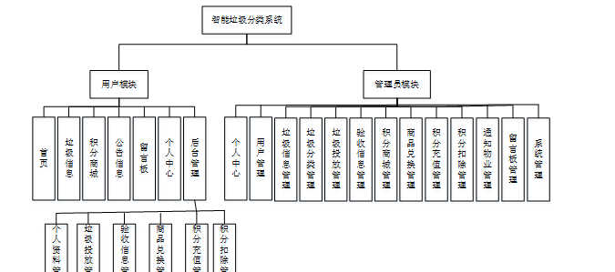

图3-1 系统总体结构图

3.4 数据库设计与实现

数据可设计要遵循职责分离原则，即在设计时应该要考虑系统独立性，即每个系统之间互不干预不能混乱数据表和系统关系。

数据库命名也要遵循一定规范，否则容易混淆，数据库字段名要尽量做到与表名类似，多使用小写英文字母和下划线来命名并尽量使用简单单词。

#### 3.4.1 数据库概念结构设计

数据库的E-R图反映了实体、实体的属性和实体之间的联系。下面是各个实体以及实体的属性。

垃圾投放管理实体属性图如下所示：

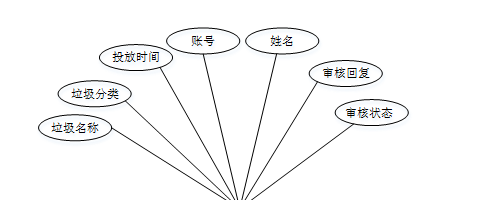

图3-2 垃圾投放管理实体属性图

验收信息管理实体属性图如下所示：

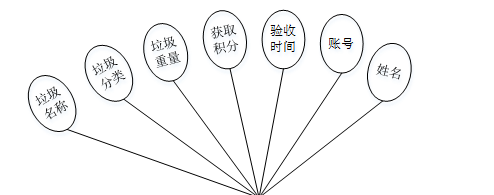

图3-3验收信息管理实体属性图

用户管理实体属性图如下所示：

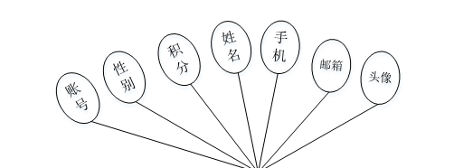

图3-4用户管理实体属性图

### 系统前台功能模块

在系统首页可查看首页、垃圾信息、积分商城、公告信息、留言板、个人中心、后台管理等内容，如图4-1所示。

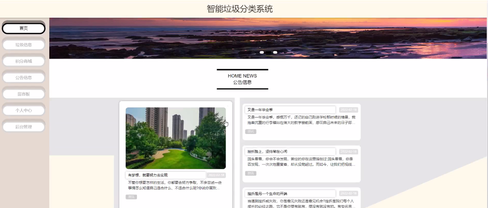

图4-1系统首页界面图

垃圾信息，在垃圾信息页面可查看垃圾编号、垃圾名称、垃圾分类、危害程度、投放标准、发布日期、垃圾详情等内容，还可进行评论或收藏等操作，如图4-2所示。

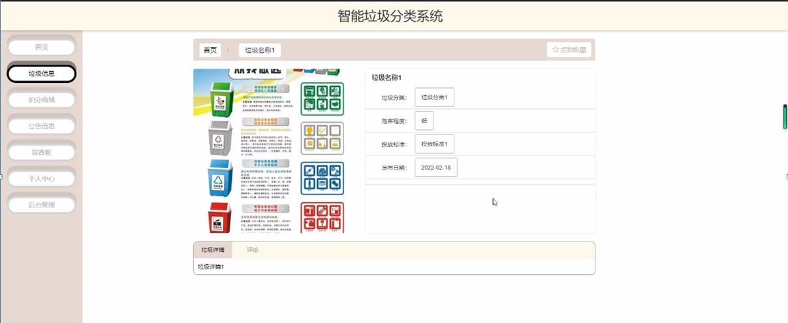

图4-2垃圾信息界面图

积分商城，在积分商城页面可查看商品编号、商品名称、商品类型、规格、兑换积分、上架时间、商品详情等内容，还可进行评论、收藏或兑换等操作，如图4-3所示。

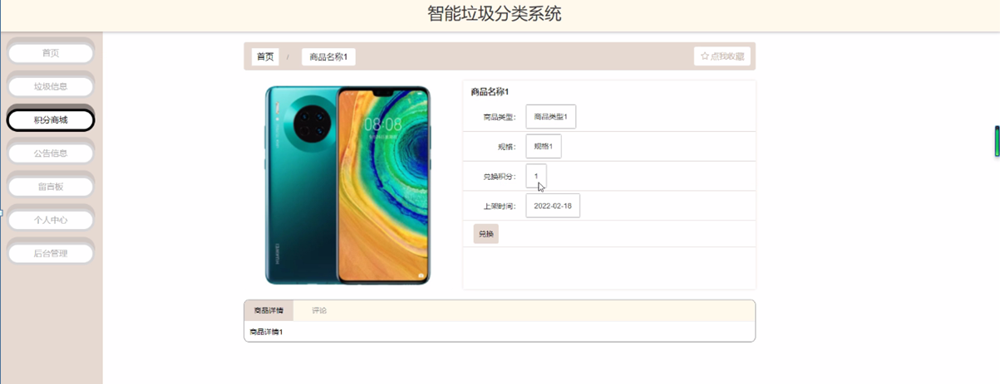

图4-3积分商城界面图

用户注册，用户通过输入账号、密码、姓名、手机、邮箱等内容进行注册，如图4-4所示。

图4-4用户注册界面图

个人中心，用户可在个人中心页面通过输入账号、密码、姓名、性别、手机、邮箱、积分、上传图片等进行更新信息等操作，或查看我的收藏等内容，如图4-5所示。

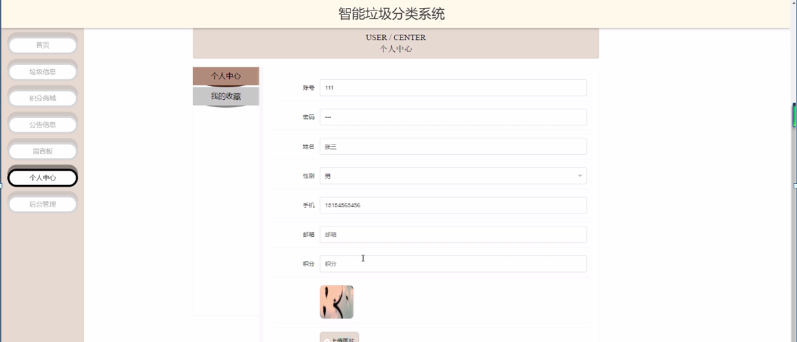

图4-5个人中心界面图

4.3用户后台功能模块

用户进入智能垃圾分类系统后台可查看个人中心、垃圾投放管理、验收信息管理、商品兑换管理、积分充值管理、积分扣除管理等内容，在个人中心页面还可进行修改密码和个人信息等操作，如图4-6所示。

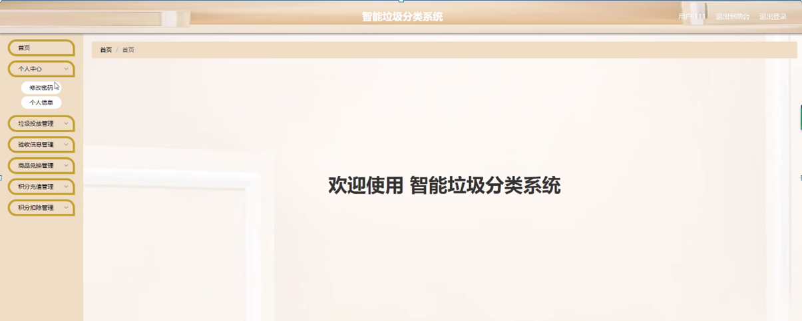图4-6用户功能管理界面图

垃圾投放管理，用户可在垃圾投放管理页面查看垃圾名称、垃圾分类、投放时间、账号、姓名、审核回复、审核状态等内容，还可进行删除等操作，如图4-7所示。

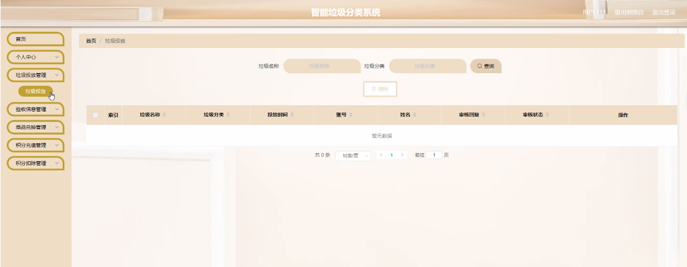

图4-7垃圾投放管理界面图

验收信息管理，用户可在验收信息管理页面查看垃圾名称、垃圾分类、垃圾重量、获取积分、验收时间、账号、姓名等内容，还可进行删除等操作，如图4-8所示。

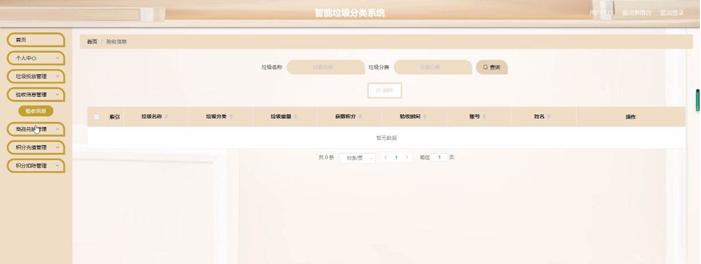

图4-8验收信息管理界面图

商品兑换管理，用户可在商品兑换 管理页面通过输入商品名称、商品类型进行查询等操作，如图4-9所示。

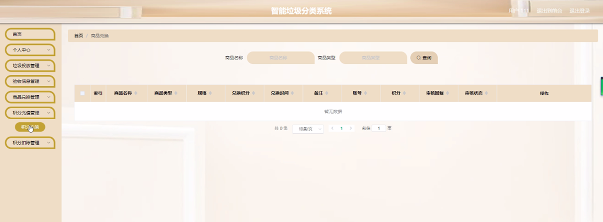

图4-9商品兑换管理界面图

积分充值管理，用户可在积分充值管理页面通过数输入姓名进行查询等操作，如图4-10所示。

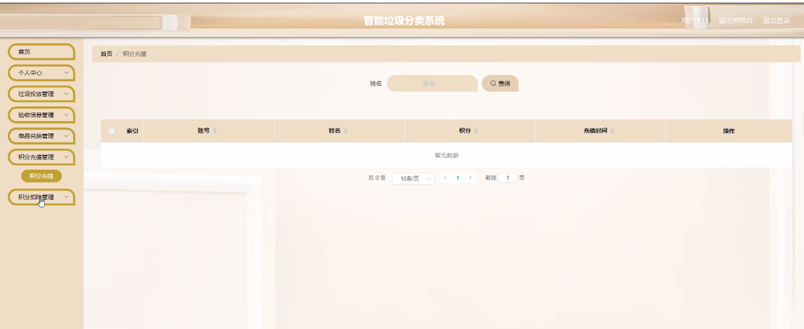

图4-10积分充值管理界面图

积分扣除管理， 用户可在积分扣除管理页面通过输入姓名进行查询等操作，如图4-11所示。

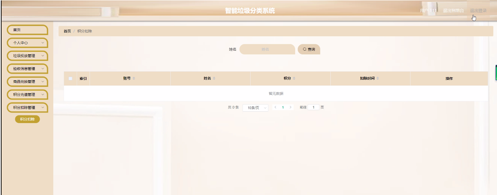

图4-11积分扣除管理界面图

4.4后台管理员功能模块

管理员通过输入用户名、密码、角色进行登录进入系统，如图4-12所示。

图4-12管理员登录界面图

#### **JAVA** **毕设帮助，指导，源码分享，调试部署**

