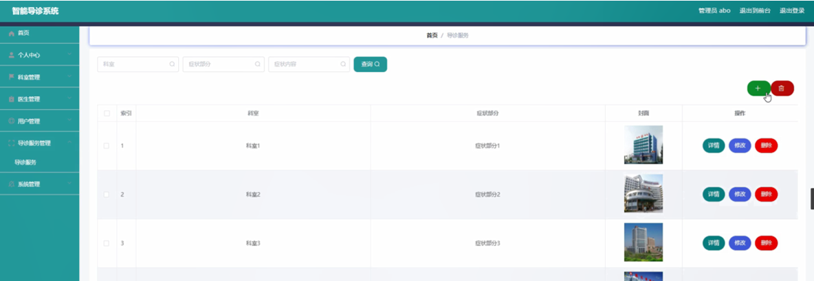
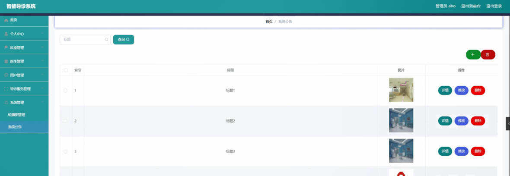

ssm+Vue计算机毕业设计智能导诊系统（程序+LW文档）

**项目运行**

**环境配置：**

**Jdk1.8 + Tomcat7.0 + Mysql + HBuilderX** **（Webstorm也行）+ Eclispe（IntelliJ
IDEA,Eclispe,MyEclispe,Sts都支持）。**

**项目技术：**

**SSM + mybatis + Maven + Vue** **等等组成，B/S模式 + Maven管理等等。**

**环境需要**

**1.** **运行环境：最好是java jdk 1.8，我们在这个平台上运行的。其他版本理论上也可以。**

**2.IDE** **环境：IDEA，Eclipse,Myeclipse都可以。推荐IDEA;**

**3.tomcat** **环境：Tomcat 7.x,8.x,9.x版本均可**

**4.** **硬件环境：windows 7/8/10 1G内存以上；或者 Mac OS；**

**5.** **是否Maven项目: 否；查看源码目录中是否包含pom.xml；若包含，则为maven项目，否则为非maven项目**

**6.** **数据库：MySql 5.7/8.0等版本均可；**

**毕设帮助，指导，本源码分享，调试部署** **(** **见文末** **)**

### 系统结构

系统架构图属于系统设计阶段，系统架构图只是这个阶段一个产物，系统的总体架构决定了整个系统的模式，是系统的基础。智能导诊系统的整体结构设计如图4-2所示。

图4-2 系统结构图

### 4.3. 数据库设计

#### 4.3.1 数据库实体

用户管理结构图，如图4-3所示：

图4-3用户管理结构图

导诊服务管理实体属性图，如图4-4所示：

图4-4导诊服务管理实体属性图

医生管理实体属性图，如图4-7所示：

图4-6医生管理实体属性图

### 系统功能模块

智能导诊系统，在系统的首页可以查看首页、医生、导诊服务、系统公告、个人中心、后台管理等信息进行详细操作，如图5-1所示。

图5-1系统首页界面图

医生，在医生页面中可以查看医生姓名、医生工号、科室、职称、性别、医龄、联系电话、简介等信息，并进行评论或收藏等操作；如图5-2所示。

图5-2医生界面图

导诊服务，在导诊服务页面中可以查看科室、症状部分、封面等详细内容，如图5-3所示。

图5-3导诊服务界面图

用户注册，在用户注册页面通过填写用户账号、用户姓名、密码、年龄、联系电话等信息完成用户注册，如图5-4所示。在个人中心页面通过填写用户账号、用户姓名、密码、性别、年龄、联系电话等信息进行更新操作，还可以根据需要对我的收藏进行详细操作；如图5-5所示。

图5-4用户注册界面图

图5-5个人中心界面图

### 5.2管理员功能模块

管理员登录，管理员通过输入账号，密码，选择角色等信息即可进行系统登录，如图5-6所示。

图5-6管理员登录界面图

管理员登录进入智能导诊系统可以查看首页、个人中心、科室管理、医生管理、用户管理、导诊服务管理、系统管理等内容进行详细操作，如图5-7所示。

图5-7管理员功能界面图

科室管理，在科室管理页面可以对索引、科室等信息进行详情，修改或删除等操作，如图5-8所示。

图5-8科室管理界面图

医生管理，在医生管理页面可以对索引、医生工号、医生姓名、科室、职称、性别、医龄、联系电话、头像等信息进行详情、修改、查看评论或删除等操作，如图5-9所示。

图5-9医生管理界面图

用户管理，在用户管理页面可以对索引、用户账号、用户姓名、性别、年龄、联系电话等信息进行详情，修改或删除等操作，如图5-10所示。

图5-10用户管理界面图

导诊服务管理，在导诊服务管理页面可以对索引、科室、症状部分、封面等信息进行详情，修改或删除等操作，如图5-11所示。

图5-11导诊服务管理界面图

系统管理，在系统公告页面可以对索引、标题、图片等信息进行详情，修改或删除等操作，还可以根据需要对轮播图管理进行详细操作；如图5-12所示。

图5-12系统管理界面图

#### **JAVA** **毕设帮助，指导，源码分享，调试部署**

