ssm+Vue计算机毕业设计智能居家养老服务平台（程序+LW文档）

**项目运行**

**环境配置：**

**Jdk1.8 + Tomcat7.0 + Mysql + HBuilderX** **（Webstorm也行）+ Eclispe（IntelliJ
IDEA,Eclispe,MyEclispe,Sts都支持）。**

**项目技术：**

**SSM + mybatis + Maven + Vue** **等等组成，B/S模式 + Maven管理等等。**

**环境需要**

**1.** **运行环境：最好是java jdk 1.8，我们在这个平台上运行的。其他版本理论上也可以。**

**2.IDE** **环境：IDEA，Eclipse,Myeclipse都可以。推荐IDEA;**

**3.tomcat** **环境：Tomcat 7.x,8.x,9.x版本均可**

**4.** **硬件环境：windows 7/8/10 1G内存以上；或者 Mac OS；**

**5.** **是否Maven项目: 否；查看源码目录中是否包含pom.xml；若包含，则为maven项目，否则为非maven项目**

**6.** **数据库：MySql 5.7/8.0等版本均可；**

**毕设帮助，指导，本源码分享，调试部署** **(** **见文末** **)**

### 4.1系统总体设计

系统总体设计即对有关系统全局问题的设计，也就是设计系统总的处理方案，又称系统概要设计。它包括系统规划与系统功能设计等内容。

智能居家养老服务平台主要有四类用户。分别是管理员，家人，老人和医生，详细规划如图4-1所示。

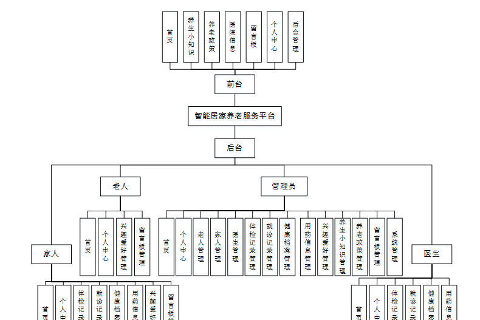图4-1 系统规划图

其中各子模块的主要功能如下：

1、用户登录：用户进入网页先输入用户名与密码，选择权限登录，用户登录成功，要记录登录的用户名和登录类型。

2、新用户注册：新用户填写用户名，密码，姓名，手机，邮箱等信息完成注册操作。

3、查看智能居家养老服务信息：用户登录成功后，能够按分类或者查找智能居家养老服务信息进行管理。

4、首页内容管理：管理员登录以后，可以对首页，养生小知识，养老政策，医院信息，留言板，个人中心，后台管理进行详细操作。

### 4.2数据库设计

数据库是一个软件项目的根基，它决定了整个项目代码的走势，同时也决定了整个项目在后期的维护以及升级的难易程度。

#### 4.2.1 数据库概念设计

根据智能居家养老服务平台的功能需求，对数据库进行分析，得到相应的数据，设计用户需要的各种实体，以及相互之间的关联，为逻辑结构设计铺好路。根据所实体内的各种具体信息得于实现。

1.家人注册信息实体

家人注册信息实体包括家人账号，密码，确认密码，家人姓名，年龄，手机等属性。家人注册信息实体图如图4-2所示：

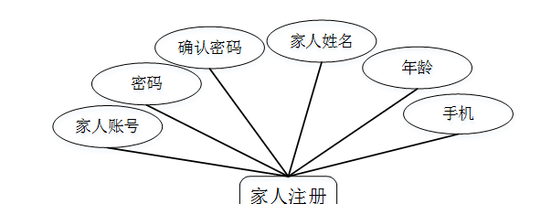

图4-2.家人注册信息实体图

2.医院信息实体

医院信息实体包括标题，图片，简介，内容等属性；医院信息实体图如图4-3所示：

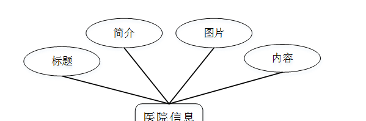

图4-3医院信息实体图

3.养生小知识实体

养生小知识实体包括标题，简介，发布时间，适合人群，封面，内容，最近点击时间，点击次数等属性。养生小知识实体图如图4-4所示：

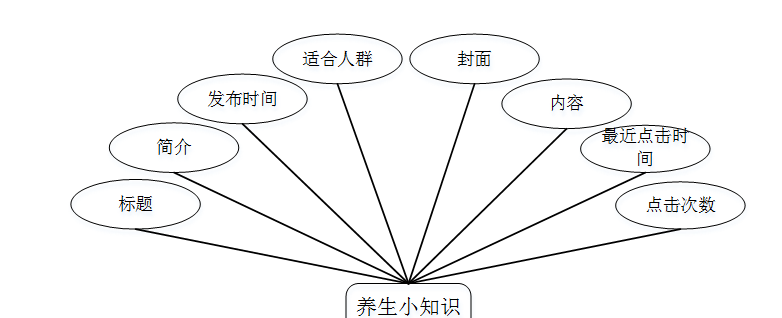图4-4养生小知识实体图

### 5.1功能页面实现

按照不同功能模块，在此对系统所涉及的关键页面的实现细节进行阐述，包括页面功能描述，页面涉及功能分析，介绍以及界面展示。

系统登录：运行系统，首先进入登录界面，按照登录界面的要求填写相应的“账号”和“密码”以及用户类型，点击“登录”然后系统判断填写是否正确，若正确进入相应的界面，否则给出要求先注册信息。具体流程如图5-1所示。

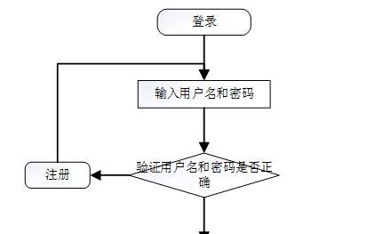

图5-1 登录流程图

登录，通过输入账号，密码，选择角色并点击登录进行系统登录操作，如图5-2所示。

图5-2登录界面图

### 5.2系统功能模块

智能居家养老服务平台；在网站首页可以查看首页，养生小知识，养老政策，医院信息，留言板，个人中心，后台管理等内容进行详细操作，如图5-3所示。

图5-3网站首页界面图

老人注册；在老人注册页面通过填写老人账号，密码，确认密码，老人姓名，年龄，手机，身份证等信息完成老人注册操作，如图5-4所示。

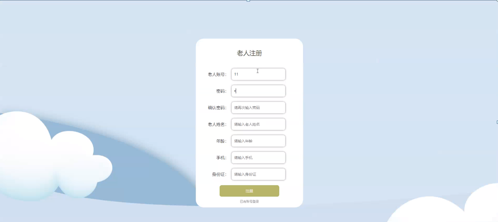

图5-4老人注册界面图

养生小知识；在养生小知识页面可以查看标题，图片，适合人群，内容等详细内容，如图5-5所示。

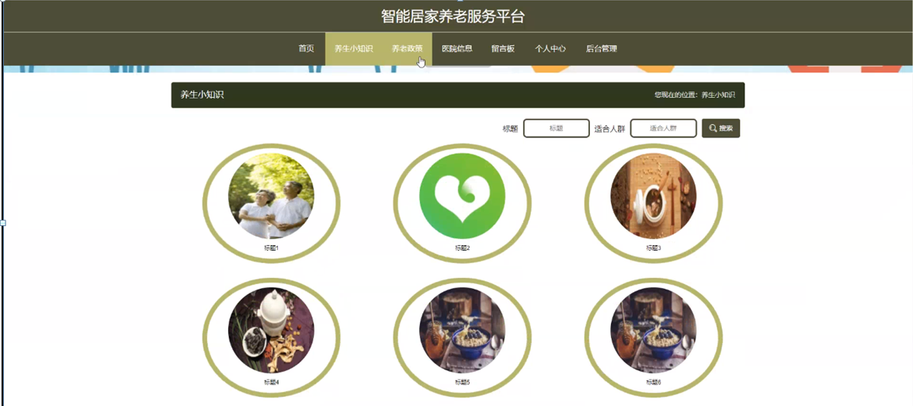

图5-5养生小知识界面图

养老政策；在养老政策页面可以查看政策名称，政策内容等内容，如图5-6所示。

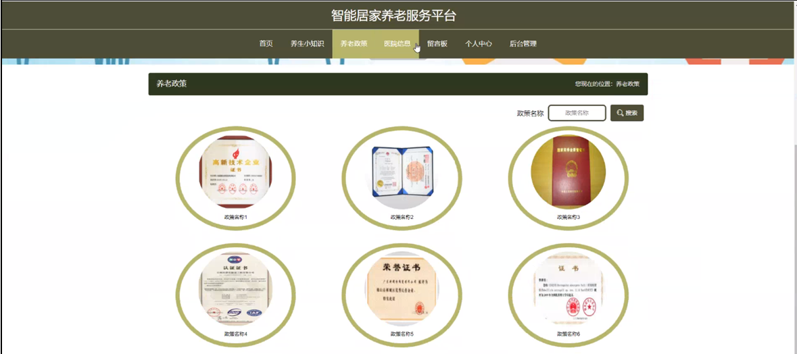

图5-6养老政策界面图

### 5.3管理员功能模块

管理员登录系统后，可以对首页，个人中心，家人管理，老人管理，医生管理，体检记录管理，就诊记录管理，健康档案管理，用药信息管理，兴趣爱好管理，养生小知识管理，养老政策管理，留言板管理，系统管理等功能进行相应操作，如图5-7所示。

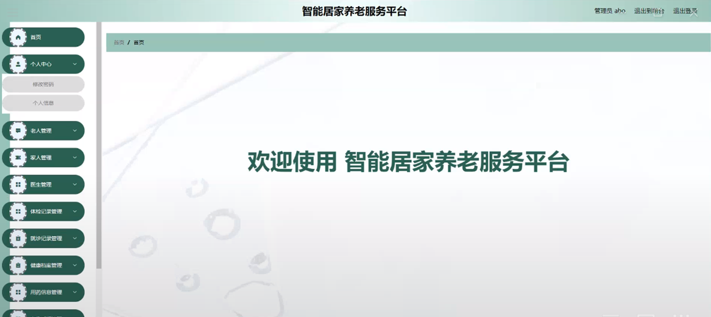

图5-7管理员功能界面图

老人管理；在老人管理页面可以对用老人账号，老人姓名，年龄，性别，手机，身份证，图片，家人账号，家人姓名等内容进行详情，修改或删除等操作，如图5-8所示。

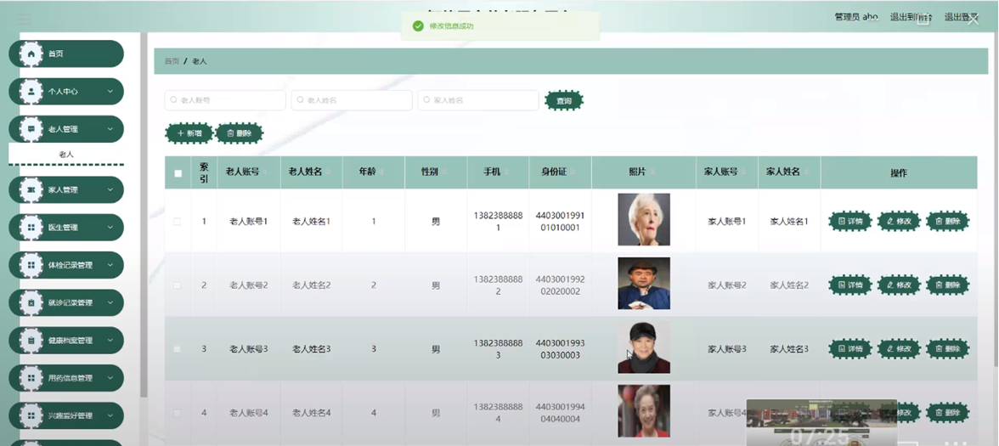

图5-8老人管理界面图

家人管理；在家人管理页面可以对老人账号，老人姓名，年龄，性别，手机，身份证，照片，家人账号，家人姓名等内容进行详情，修改或删除等操作，如图5-9所示。

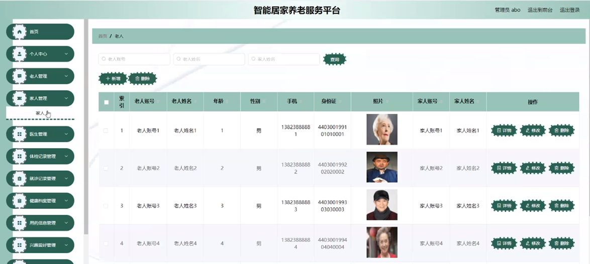

图5-9家人管理界面图

体检记录管理；在体检记录管理页面可以对老人账号，老人姓名，性别，手机，年龄，身高，体重，血压，血糖，心跳登，登记日期等内容进行详情或删除等操作，如图5-10所示。

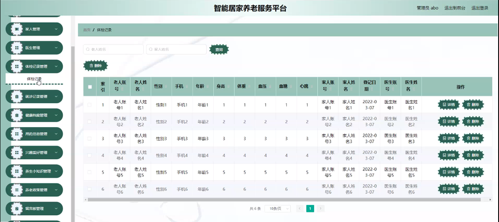

图5-10体检记录管理界面图

就诊记录管理；在就诊记录管理页面可以对老人账号，老人姓名，性别，手机，家人账号，家人姓名，登记日期，医生账号，医生姓名等内容进行详情或删除等操作，如图5-11所示。

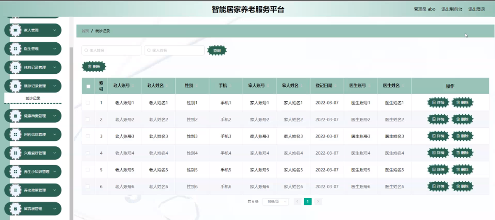

图5-11就诊记录管理界面图

养生小知识管理；在养生小知识管理页面可以对标题，发布时间，封面等内容进行详情，修改，查看评论或删除等操作，如图5-12所示。

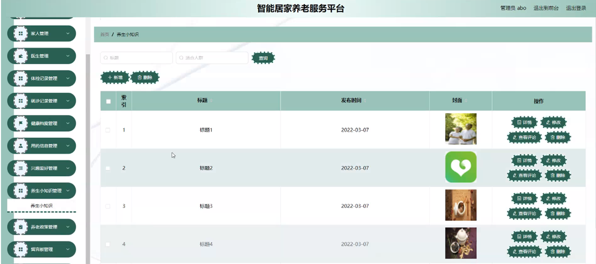

图5-12养生小知识管理界面图

#### **JAVA** **毕设帮助，指导，源码分享，调试部署**

