ssm+Vue计算机毕业设计智能推荐二手车交易网站（程序+LW文档）

**项目运行**

**环境配置：**

**Jdk1.8 + Tomcat7.0 + Mysql + HBuilderX** **（Webstorm也行）+ Eclispe（IntelliJ
IDEA,Eclispe,MyEclispe,Sts都支持）。**

**项目技术：**

**SSM + mybatis + Maven + Vue** **等等组成，B/S模式 + Maven管理等等。**

**环境需要**

**1.** **运行环境：最好是java jdk 1.8，我们在这个平台上运行的。其他版本理论上也可以。**

**2.IDE** **环境：IDEA，Eclipse,Myeclipse都可以。推荐IDEA;**

**3.tomcat** **环境：Tomcat 7.x,8.x,9.x版本均可**

**4.** **硬件环境：windows 7/8/10 1G内存以上；或者 Mac OS；**

**5.** **是否Maven项目: 否；查看源码目录中是否包含pom.xml；若包含，则为maven项目，否则为非maven项目**

**6.** **数据库：MySql 5.7/8.0等版本均可；**

**毕设帮助，指导，本源码分享，调试部署** **(** **见文末** **)**

### 系统体系结构

智能推荐二手车交易网站开发系统的结构图4-1所示：

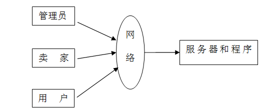

图4-1 系统结构

模块包括首页、个人中心、卖家管理、用户管理、城市管理、汽车品牌管理、汽车分类管理、汽车信息管理、预约看车管理、订单信息管理、留言板管理、系统管理等进行相应的操作。

登录系统结构图，如图4-2所示：

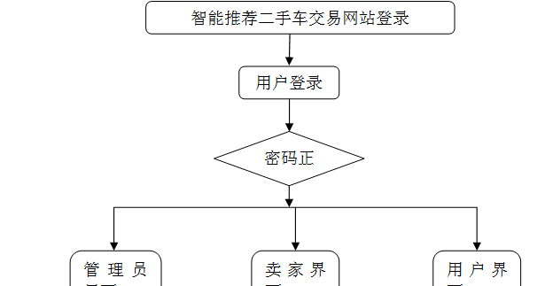

图4-2 登录结构图

这些功能可以充分满足智能推荐二手车交易网站的需求。此系统功能较为全面如下图系统功能结构如图4-3所示。

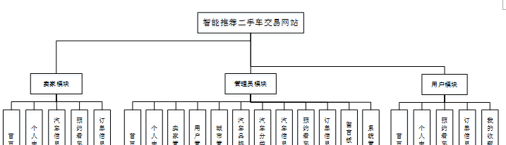

图4-3系统功能结构图

### 4.2 数据库设计原则

每个数据库的应用它们都是和区分开的，当运行到一定的程序当中，它就会与自己相关的协议与客户端进行通讯。那么这个系统就会对使这些数据进行连接。当我们选择哪个桥段的时候，接下来就会简单的叙述这个数据库是如何来创建的。当点击完成按钮的时候就会自动在对话框内弹出数据源的名称，在进行点击下一步即可，直接在输入相对应的身份验证和登录密码。

智能推荐二手车交易网站的数据流程：

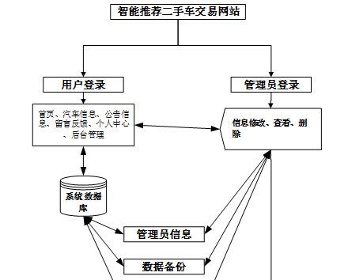

图4-4 系统数据流程图

用户管理实体E-R图，如图4-5所示。

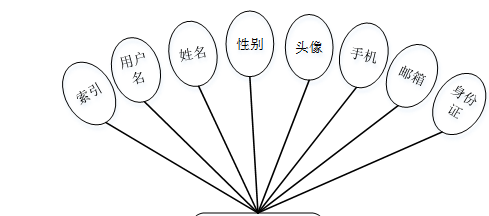

图4-5用户管理E-R图

汽车信息E-R图，如图4-6所示。

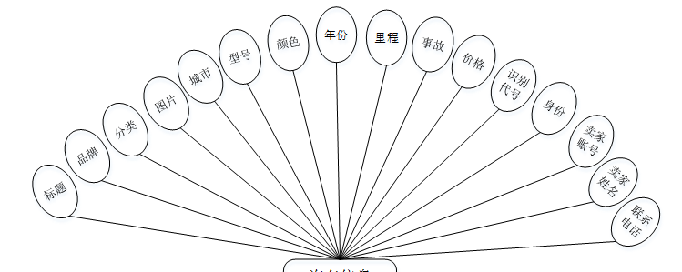

图4-6汽车信息E-R图

### 用户功能模块

智能推荐二手车交易网站，在系统的首页可以查看首页、汽车信息、公告信息、留言反馈、个人中心、后台管理等信息进行详细操作，如图5-1所示。

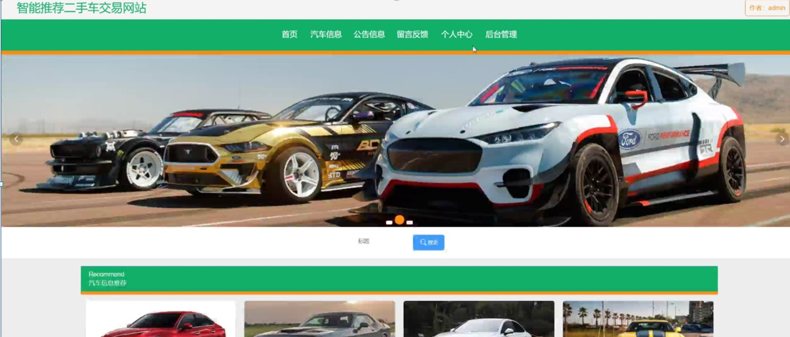

图5-1系统首页界面图

汽车信息，在汽车信息页面中可以查看标题、品牌、分类、图片、城市、型号、颜色、年份、里程、事故、价格、识别代号、身份、卖家账号、卖家姓名、联系电话、详情等信息，并进行预约看车、订单信息、评论或收藏等操作；如图5-2所示。

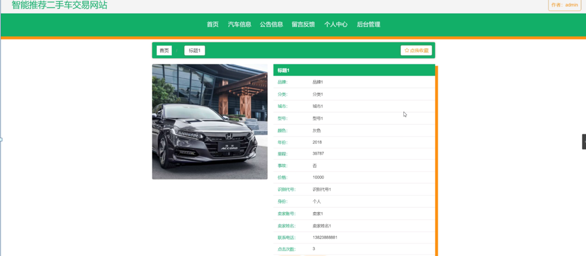

图5-2汽车信息界面图

用户注册，在用户注册页面通过填写用户名、密码、姓名、手机、邮箱、身份证等信息完成用户注册，如图5-3所示。

图5-3用户注册界面图

### 5.2 管理员功能模块

管理员登录，管理员通过输入用户名、密码、选择角色等信息，然后点击登录就能登录到系统进行系统的使用了，如图5-4所示。

图5-4管理员登录界面图

管理员登录进入系统之后，就可以对所有的信息进行查看，可以查看到首页、个人中心、卖家管理、用户管理、城市管理、汽车品牌管理、汽车分类管理、汽车信息管理、预约看车管理、订单信息管理、留言板管理、系统管理等，并且还可以对其进行相应的操作管理，如图5-5所示。

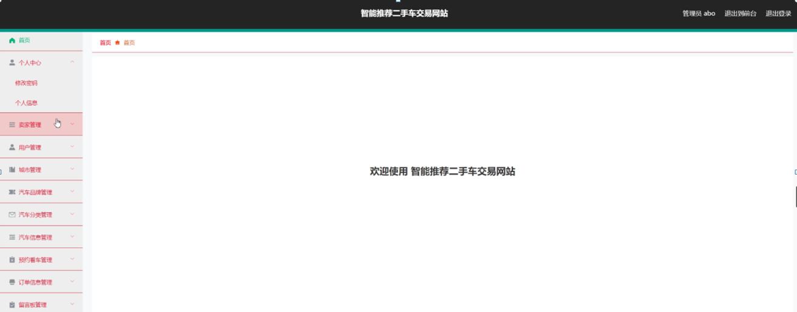

图5-5管理员功能界面图

卖家管理，在卖家管理页面中可以对索引、卖家账号、卖家姓名、性别、照片、联系电话、卖家邮箱、身份证等信息进行详情，修改或删除等操作，如图5-6所示。

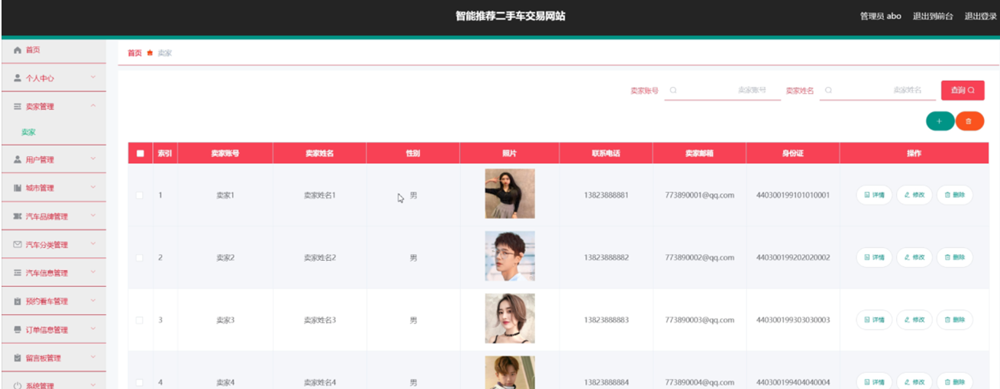

图5-6卖家管理界面图

用户管理，在用户管理页面中可以对索引、用户名、姓名、性别、头像、手机、邮箱、身份证等信息进行详情，修改或删除等操作，如图5-7所示。

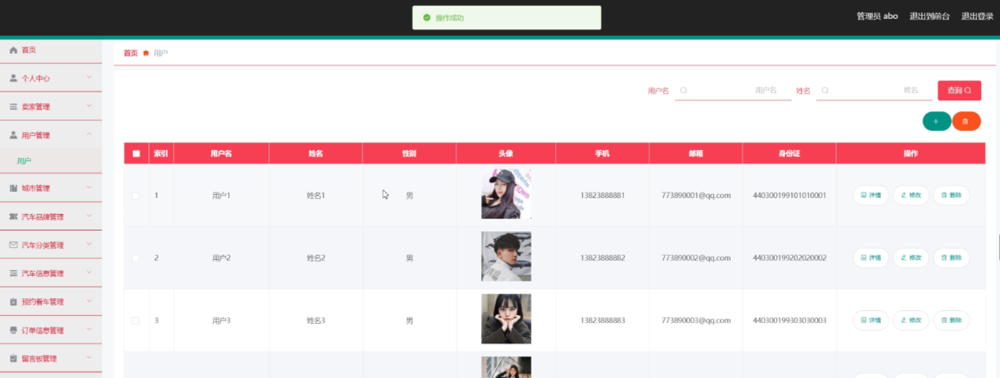

图5-7用户管理界面图

汽车品牌管理，在汽车品牌管理页面中可以对索引、品牌等信息进行详情，修改或删除等操作，如图5-8所示。

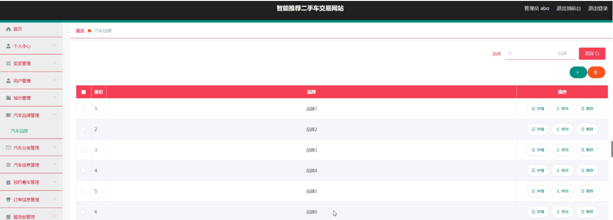

图5-8汽车品牌管理界面图

汽车分类管理，在汽车分类管理页面中可以对索引、分类等信息进行详情、修改或删除等操作，如图5-9所示。

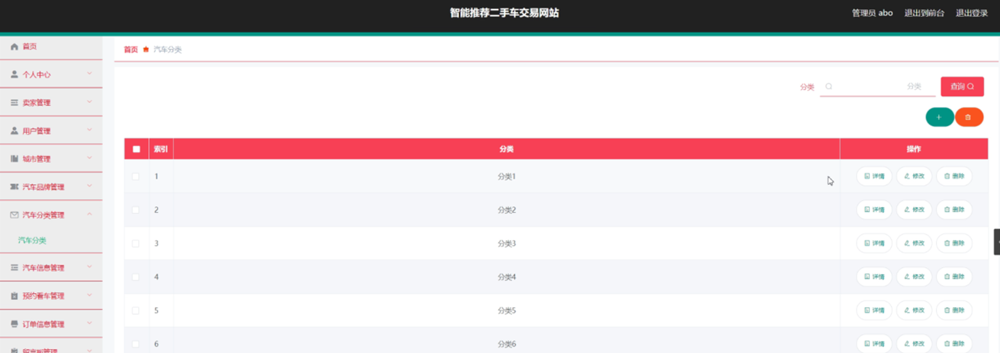

图5-9汽车分类管理界面图

汽车信息管理，在汽车信息管理页面中可以对索引、标题、品牌、分类、图片、视频、城市、型号、颜色、年份、里程、事故、价格、识别代号、身份、卖家账号、卖家姓名、联系电话、审核回复、审核状态、审核等信息进行详情、修改、查看评论或删除等操作，如图5-10所示。

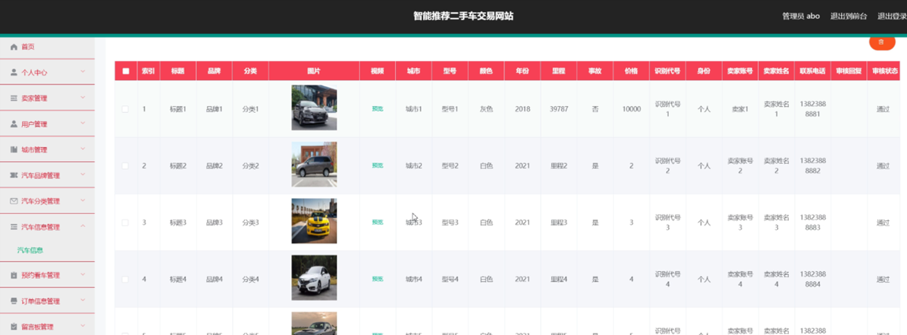

图5-10汽车信息管理界面图

预约看车管理，在预约看车管理页面中可以对索引、品牌、分类、图片、卖家账号、卖家姓名、联系电话、预约时间、预约内容、用户名、姓名、手机、审核回复、审核状态等信息进行详情，修改或删除等操作，如图5-11所示。

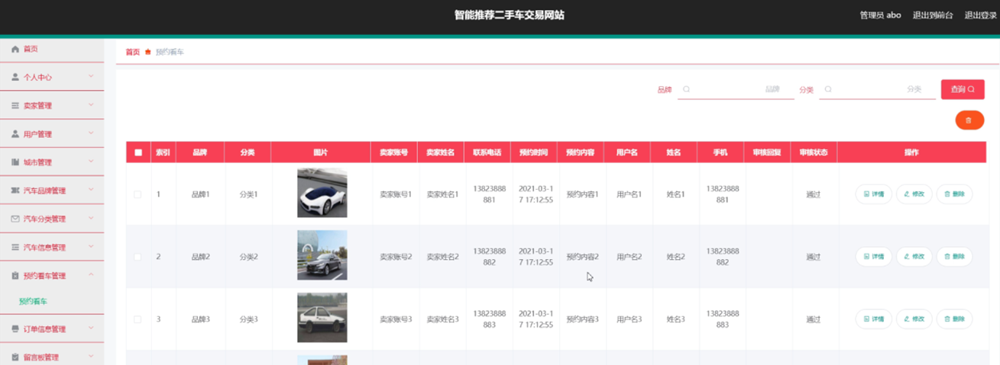

图5-11预约看车管理界面图

订单信息管理，在订单信息管理页面中可以对索引、订单编号、品牌、分类、图片、型号、颜色、城市、年份、价格、下单日期、下单备注、卖家账号、卖家姓名、联系电话、用户名、姓名、手机、是否支付、审核回复、审核状态等信息进行详情，修改或删除等操作，如图5-12所示。

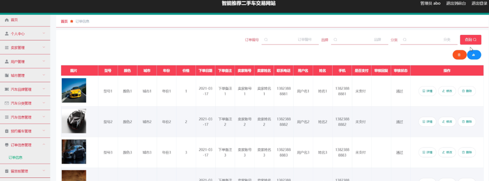

图5-12订单信息管理界面图

**JAVA** **毕设帮助，指导，源码分享，调试部署**

