ssm+Vue计算机毕业设计智能旅游电子票务系统（程序+LW文档）

**项目运行**

**环境配置：**

**Jdk1.8 + Tomcat7.0 + Mysql + HBuilderX** **（Webstorm也行）+ Eclispe（IntelliJ
IDEA,Eclispe,MyEclispe,Sts都支持）。**

**项目技术：**

**SSM + mybatis + Maven + Vue** **等等组成，B/S模式 + Maven管理等等。**

**环境需要**

**1.** **运行环境：最好是java jdk 1.8，我们在这个平台上运行的。其他版本理论上也可以。**

**2.IDE** **环境：IDEA，Eclipse,Myeclipse都可以。推荐IDEA;**

**3.tomcat** **环境：Tomcat 7.x,8.x,9.x版本均可**

**4.** **硬件环境：windows 7/8/10 1G内存以上；或者 Mac OS；**

**5.** **是否Maven项目: 否；查看源码目录中是否包含pom.xml；若包含，则为maven项目，否则为非maven项目**

**6.** **数据库：MySql 5.7/8.0等版本均可；**

**毕设帮助，指导，本源码分享，调试部署** **(** **见文末** **)**

### 系统结构设计

整个系统是由多个功能模块组合而成的，要将所有的功能模块都一一列举出来，然后进行逐个的功能设计，使得每一个模块都有相对应的功能设计，然后进行系统整体的设计。

本智能旅游电子票务系统结构图如图3-2所示。

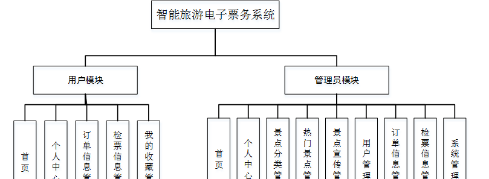

图3-2 智能旅游电子票务系统结构图

### 3.3 数据库设计

数据库可以说是所有软件的根本，如果数据库存在缺陷，那么会导致系统开发的不顺利、维护困难、用户使用不顺畅等一系列问题，严重时将会直接损害企业的利益，同时在开发完成后，数据库缺陷也更加难以解决。所以必须要对数据库设计重点把握，做到认真细致。因此，数据库设计是这个在线智能旅游电子票务购票系统的重点要素。

#### 3.3.1概念结构设计

(1)管理员实体属性图如下图3-3所示

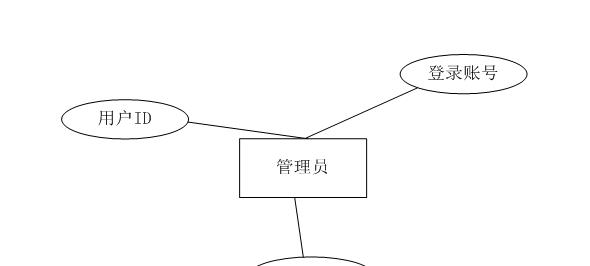

图3-3管理员实体属性图

(2) 热门景点管理实体属性如下图3-4所示

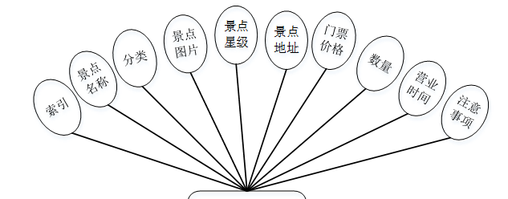

图3-4热门景点管理实体属性图

(3景点宣传管理实体属性如下图3-5所示

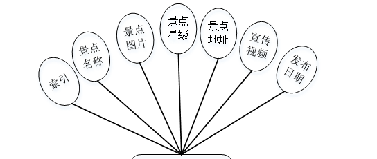

图3-5景点宣传管理实体属性图

### 系统功能模块

智能旅游电子票务系统，在系统首页可以查看首页、热门景点、景点宣传、旅游资讯、个人中心、后台管理、客服等内容进行详细操作，如图4-1所示。

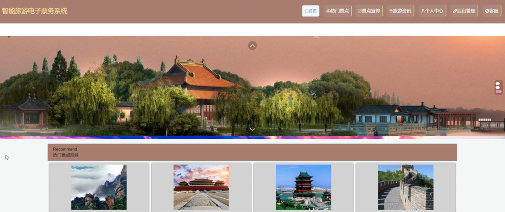

图4-1系统首页界面图

热门景点，在热门景点页面可以查看景点名称、分类、图片、景点星级、景点地址、门票价格、数量、营业时间、注意事项、景点介绍等详细内容进行购票、评论或收藏等操作，如图4-2所示。

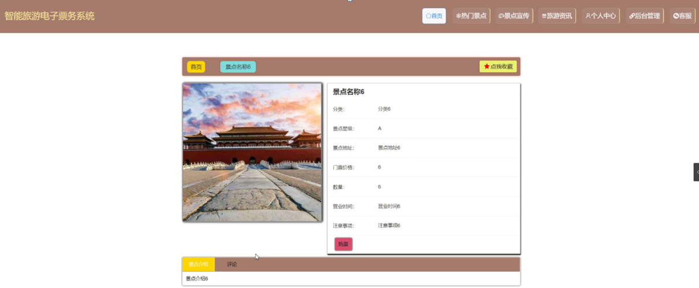

图4-2热门景点界面图

用户注册，在用户注册页面通过填写用户名、密码、姓名、手机、身份证、邮箱等信息完成用户注册，如图4-3所示。在个人中心页面通过填写用户名、密码、姓名、性别、图片、手机、身份证、邮箱等信息进行更新操作，还可以根据需要对我的收藏进行相应操作；如图4-4所示。

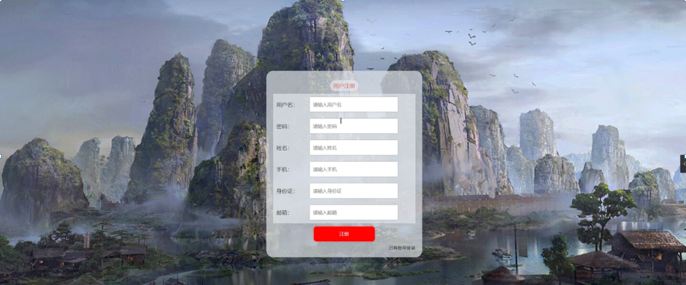

图4-3用户注册界面图

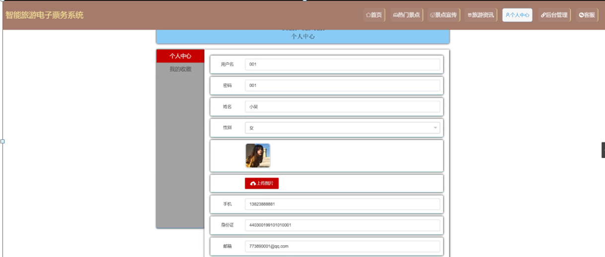

图4-4个人中心界面图

### 4.2管理员功能模块

管理员登录，通过填写注册时输入的用户名、密码、选择角色进行登录，如图4-5所示。

图4-5管理员登录界面图

管理员登录进入系统可以查看首页、个人中心、景点分类管理、热门景点管理、景点宣传管理、用户管理、订单信息管理、检票信息管理、系统管理等信息进行详细操作，如图4-6所示。

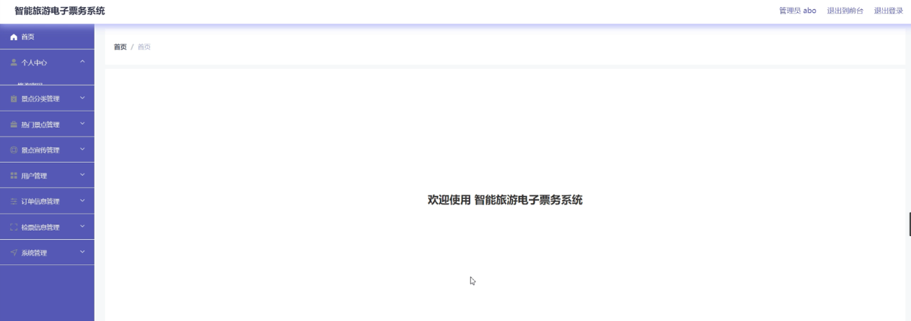

图4-6管理员功能界面图

景点分类管理，在景点分类管理页面中可以对索引、分类等信息进行详情，修改或删除等操作，如图4-7所示。

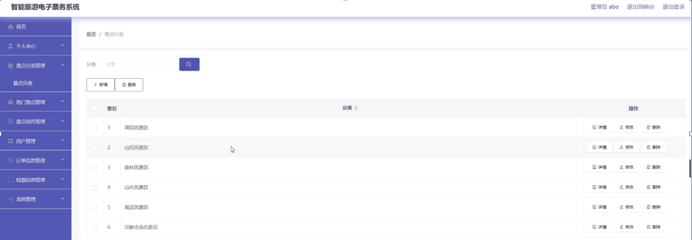

图4-7景点分类管理界面图

热门景点管理，在热门景点管理页面中可以对索引、景点名称、分类、景点图片、景点星级、景点地址、门票价格、数量、营业时间、注意事项等信息进行详情、添加宣传、修改、查看评论或删除等操作，如图4-8所示。

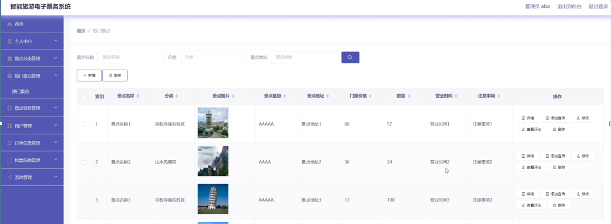

图4-8热门景点管理界面图

景点宣传管理，在景点宣传管理页面中可以对索引、景点名称、景点图片、景点星级、景点地址、宣传视频、发布日期等信息进行详情、修改、查看评论或删除等操作，如图4-9所示。

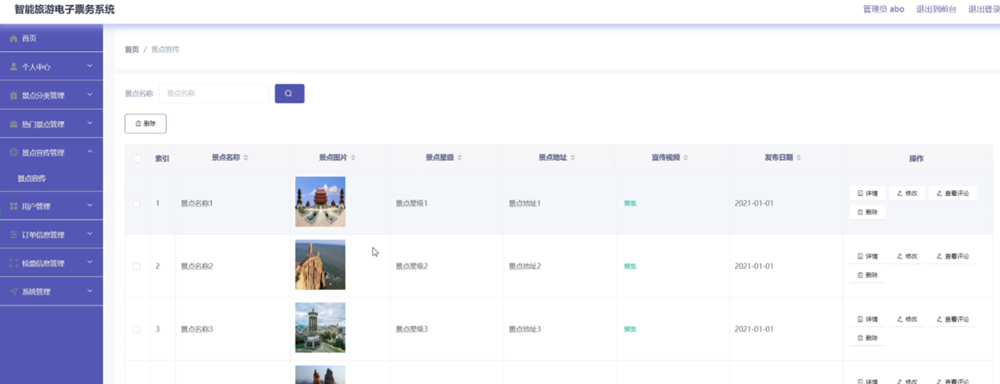

图4-9景点宣传管理界面图

用户管理，在用户管理页面中可以对索引、用户名、密码、姓名、性别、头像、手机、身份证、邮箱等信息进行详情，修改或删除等操作，如图4-10所示。

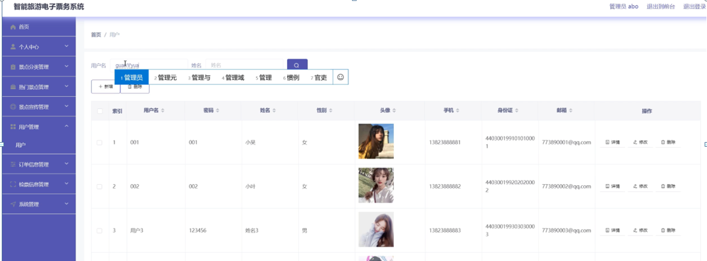

图4-10用户管理界面图

订单信息管理，在订单信息管理页面中可以对索引、订单编号、景点名称、分类、景点图片、景点地址、门票价格、数量、总价格、预定日期、备注、用户名、姓名、手机、身份证、是否支付、审核回复、审核等信息进行详情、添加检票、修改或删除等操作，如图4-11所示。

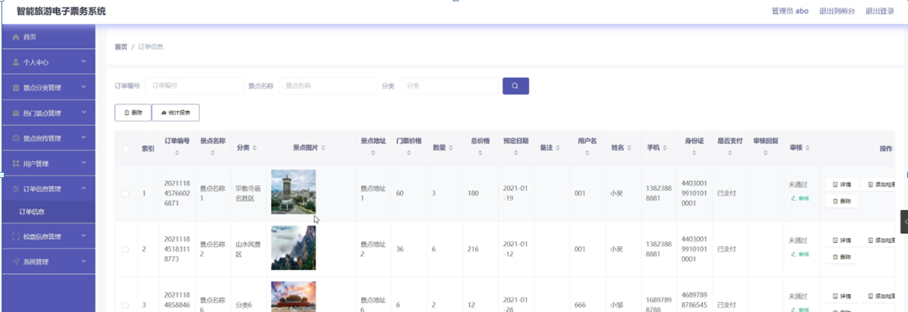

图4-11订单信息管理界面图

检票信息管理，在检票信息管理页面中可以对索引、订单编号、景点名称、二维码、门票价格、数量、预定日期、其它、用户名、手机、身份证、检票日期等信息进行详情，修改或删除等操作，如图4-12所示。

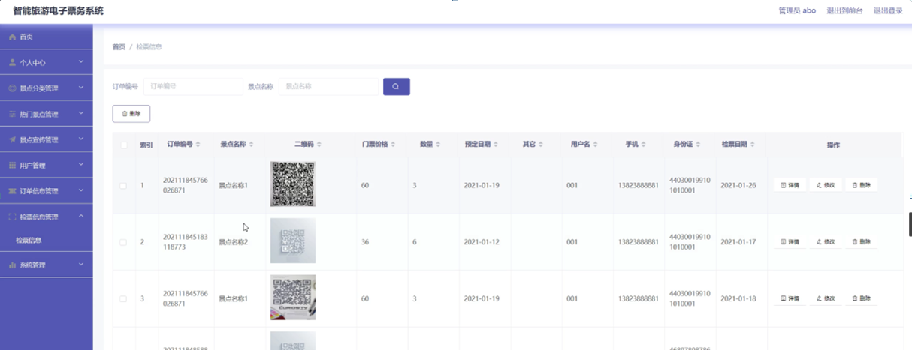

图4-12检票信息管理界面图

**JAVA** **毕设帮助，指导，源码分享，调试部署**

