ssm+Vue计算机毕业设计智能社区管理系统（程序+LW文档）

**项目运行**

**环境配置：**

**Jdk1.8 + Tomcat7.0 + Mysql + HBuilderX** **（Webstorm也行）+ Eclispe（IntelliJ
IDEA,Eclispe,MyEclispe,Sts都支持）。**

**项目技术：**

**SSM + mybatis + Maven + Vue** **等等组成，B/S模式 + Maven管理等等。**

**环境需要**

**1.** **运行环境：最好是java jdk 1.8，我们在这个平台上运行的。其他版本理论上也可以。**

**2.IDE** **环境：IDEA，Eclipse,Myeclipse都可以。推荐IDEA;**

**3.tomcat** **环境：Tomcat 7.x,8.x,9.x版本均可**

**4.** **硬件环境：windows 7/8/10 1G内存以上；或者 Mac OS；**

**5.** **是否Maven项目: 否；查看源码目录中是否包含pom.xml；若包含，则为maven项目，否则为非maven项目**

**6.** **数据库：MySql 5.7/8.0等版本均可；**

**毕设帮助，指导，本源码分享，调试部署** **(** **见文末** **)**

### 软件功能模块设计

系统整体功能如下图所示：

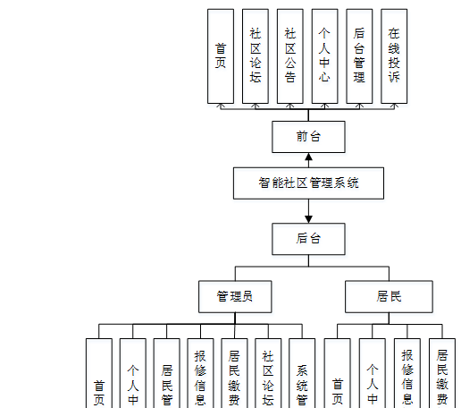

图 4-1 系统总体功能模块图

### 4.2数据库设计与实现

在每一个系统中数据库有着非常重要的作用，数据库的设计得好将会增加系统的效率以及系统各逻辑功能的实现。所以数据库的设计我们要从系统的实际需要出发，才能使其更为完美的符合系统功能的实现。

#### 4.2.1概念模型设计

概念模型是对现实中的问题出现的事物的进行描述，ER图是由实体及其关系构成的图，通过E-R图可以清楚地描述系统涉及到的实体之间的相互关系。

居民注册实体图如图4-2所示：

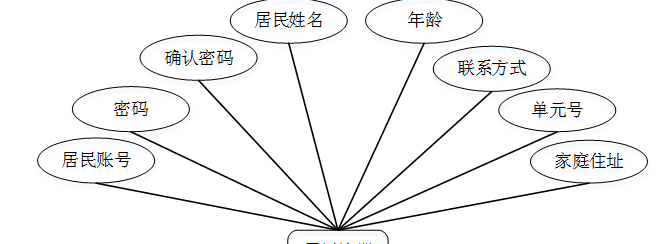

图4-2居民注册实体图

报修信息实体图如图4-3所示：

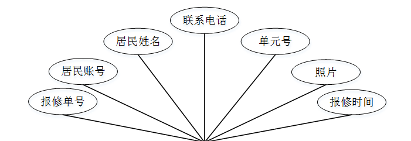

图4-3报修信息实体图

### 系统功能模块

智能社区管理系统，在系统首页可以查看首页，社区论坛，社区公告，个人中心，后台管理，在线投诉等内容，并进行详细操作，如图5-1所示。

图5-1系统首页界面图

居民注册，在居民注册页面通过填写居民账号，具名姓名，密码，确认密码，年龄，联系电话，单元号，家庭住址等信息进行注册操作，如图5-2所示。

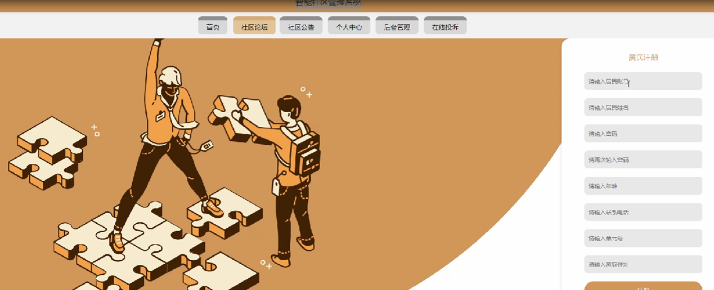

图5-2居民注册界面图

个人中心，在个人中心页面通过填写居民账号，具名姓名，密码，性别，年龄，联系电话，单元号，家庭住址等内容进行更新信息，还可以根据需要对我的发布进行相应操作，如图5-3所示。

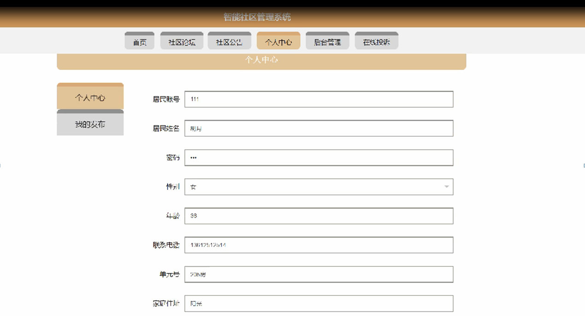

图5-3个人中心界面图

### 5.2后台功能模块

后台登录，管理员和居民进入系统前在登录页面根据要求填写用户名和密码，选择角色等信息，点击登录进行登录操作，如图5-4所示。

图5-4后台登录界面图

#### 5.2.1管理员功能模块

管理员登录系统后，可以对首页，个人中心，居民管理，报修信息管理，居民缴费管理，社区论坛，系统管理等功能进行相应的操作，如图5-5所示。

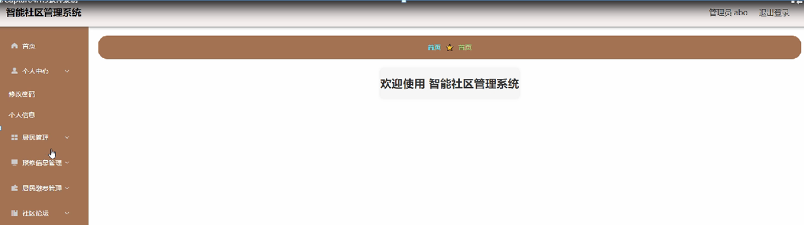

图5-5管理员功能界面图

居民管理，在居民管理页面可以对索引，居民账号，居民姓名，性别，年龄，联系电话，单元号，家庭住址等内容进行详情，修改和删除等操作，如图5-6所示。

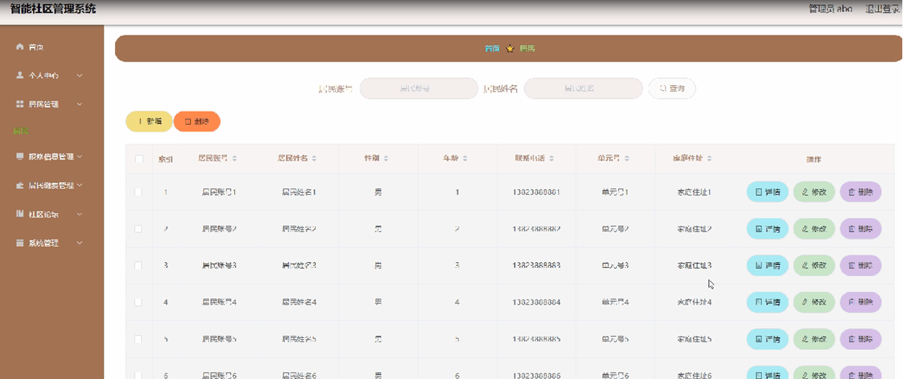

图5-6居民管理界面图

报修信息管理，在报修信息管理页面可以对索引，报修单号，居民账号，居民姓名，联系电话，单元号，照片，报修时间，审核回复，审核状态等内容进行详情和删除等操作，如图5-7所示。

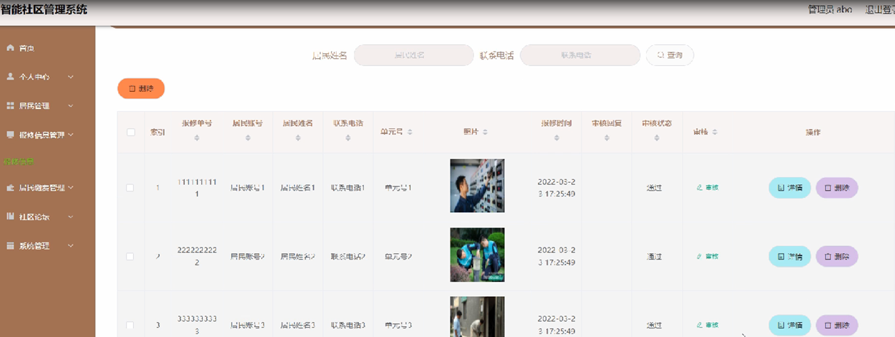

图5-7报修信息管理界面图

居民缴费管理，在居民缴费管理页面可以对索引，缴费单号，月份，居民账号，居民姓名，单元号，缴费类型，缴费金额，登记时间，是否支付等内容详情，修改和删除等操作，如图5-8所示。

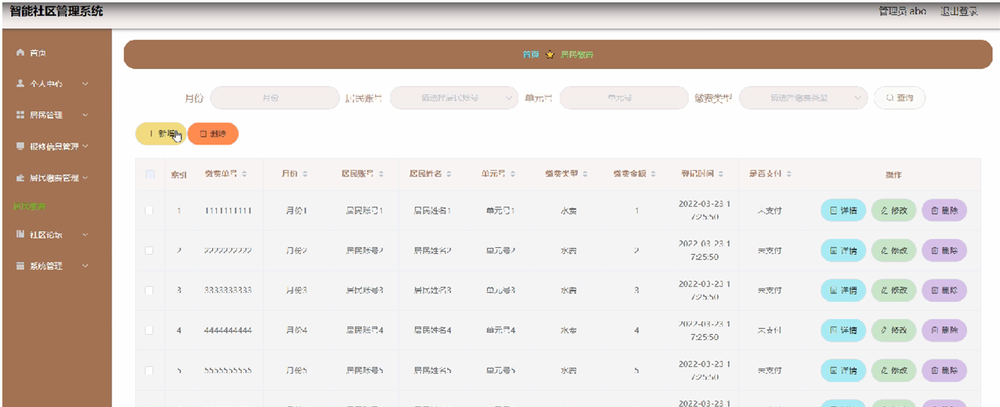

图5-8居民缴费管理界面图

#### 5.2.2居民功能模块

居民登录进入智能社区管理系统可以对首页，个人中心，报修信息管理，居民缴费管理等功能进行相应操作，如图5-9所示。

图5-9居民功能界面图

个人中心，在个人中心页面通过填写居民账号，具名姓名，密码，性别，年龄，联系电话，单元号，家庭住址等内容进行个人信息修改操作，如图5-10所示。

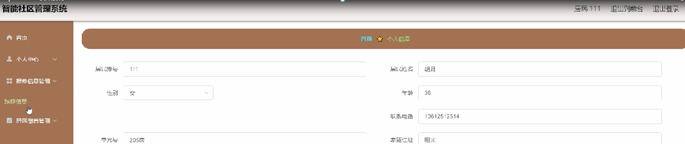

图5-10个人中心界面图

报修信息管理，在报修信息管理页面可以对索引，报修单号，居民账号，居民姓名，联系电话，单元号，照片，报修时间，审核回复，审核状态等内容进行详情，修改和删除等操作，如图5-11所示。

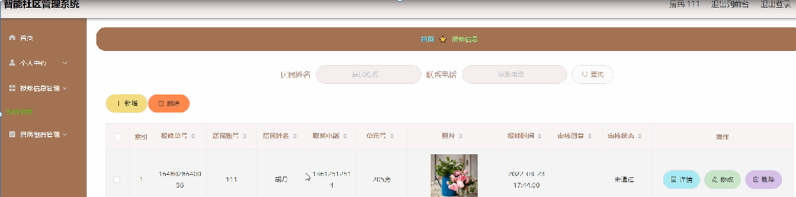

图5-11报修信息管理界面图

**JAVA** **毕设帮助，指导，源码分享，调试部署**

