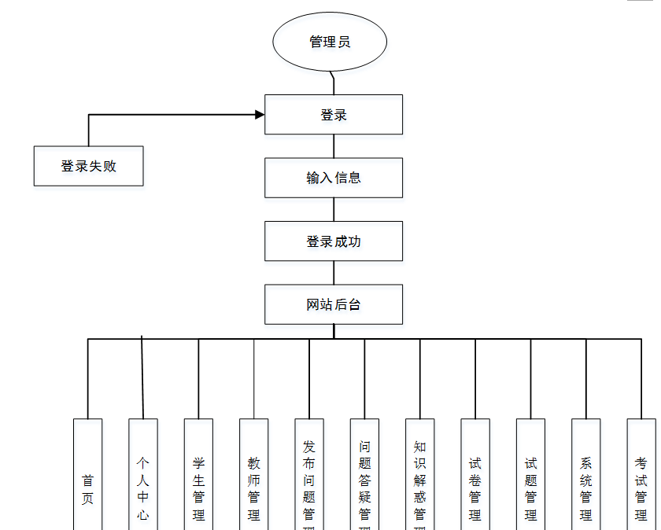
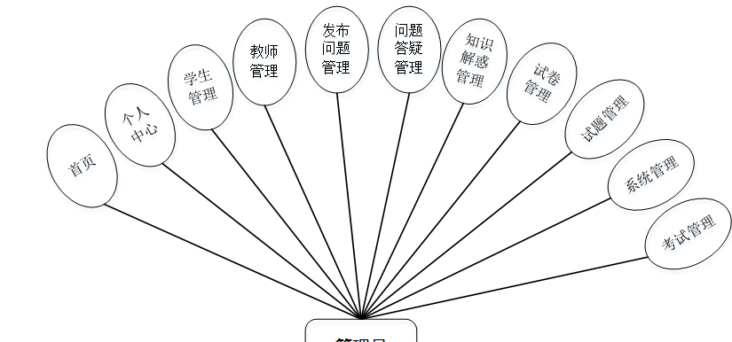
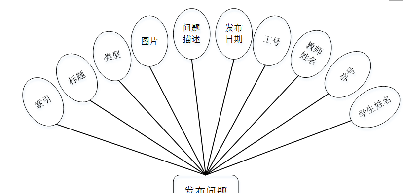
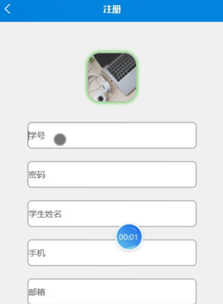
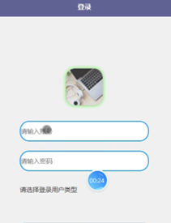
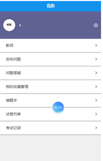
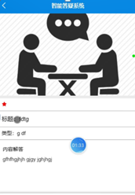
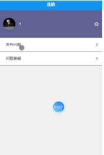
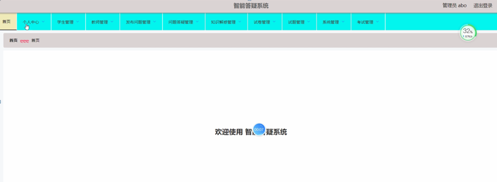
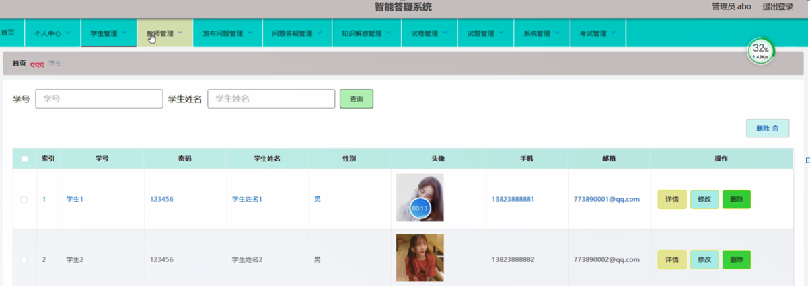

ssm+Vue计算机毕业设计智能答疑系统app（程序+LW文档）

**项目运行**

**环境配置：**

**Jdk1.8 + Tomcat7.0 + Mysql + HBuilderX** **（Webstorm也行）+ Eclispe（IntelliJ
IDEA,Eclispe,MyEclispe,Sts都支持）。**

**项目技术：**

**SSM + mybatis + Maven + Vue** **等等组成，B/S模式 + Maven管理等等。**

**环境需要**

**1.** **运行环境：最好是java jdk 1.8，我们在这个平台上运行的。其他版本理论上也可以。**

**2.IDE** **环境：IDEA，Eclipse,Myeclipse都可以。推荐IDEA;**

**3.tomcat** **环境：Tomcat 7.x,8.x,9.x版本均可**

**4.** **硬件环境：windows 7/8/10 1G内存以上；或者 Mac OS；**

**5.** **是否Maven项目: 否；查看源码目录中是否包含pom.xml；若包含，则为maven项目，否则为非maven项目**

**6.** **数据库：MySql 5.7/8.0等版本均可；**

**毕设帮助，指导，本源码分享，调试部署** **(** **见文末** **)**

根据系统功能需求建立的模块关系图如下图：

图3-1 管理员结构图

设计原则

本“智能答疑系统”APP采用Android系统，使用Java语言开发，充分保证了系统稳定性、完整性。

“智能答疑系统”APP的设计与实现的设计思想如下：

（1）操作简单方便、系统界面安全良、简单明了的页面布局、方便查询答疑信息管理相关内容。

（2）即时可见：对“智能答疑系统”APP信息的处理将立马在对应地点可以查询到，从而实现“即时发布、即时见效”的系统功能。

（3）功能的完善性：可以管理首页、个人中心、学生管理、教师管理、发布问题管理、问题答疑管理、知识解惑管理、试卷管理、试题管理、系统管理、考试管理模块的修改维护操作。

通过“智能答疑系统”APP的功能进行规划分成几个实体信息，实体信息将通过ER图进行说明，本系统的主要实体图如下：

管理员功能实体属性图如图4-2所示。

图4-2管理员功能实体属性图

发布问题管理实体属性图如图4-3所示。

图4-3发布问题管理实体属性图

### 用户前端

用户注册，在用户注册页面通过填写学号、密码、学生姓名、手机、邮箱等内容完成用户注册，如图5-1所示。

图5-1用户注册界面图

注册用户登录，在登录界面通过输入注册时填写的账号和密码进行系统登录，如图5-2所示。

图5-2用户登录界面图

（1）学生登录进入系统首页可以查看首页、教师、知识解惑、我的等功能模块进行操作，如图5-3所示。

图5-3学生功能界面图

我的，在我的页面可以查看教师、发布问题、问题答疑、我的收藏管理、错题本、试卷列表、考试记录等内容进行相应操作，如图5-4所示。

图5-4我的界面图

教师，在教师页面可以查看工号、教师姓名、性别、图片、职称、联系电话、教师邮箱、评论等内容进行提问操作，如图5-5所示。

图5-5教师界面图

知识解惑，在知识解惑页面可以查看标题、类型、图片、内容解答、评论等详细信息进行收藏，如图5-6所示。

图5-6知识解惑界面图

（2）教师登录进入系统首页可以查看首页、教师、知识解惑、我的等功能模块进行操作，如图5-7所示。

图5-7教师功能界面图

我的，在我的页面可以查看发布问题、问题答疑等内容进行相应操作，如图5-8所示。

图5-8我的界面图

问题答疑，在问题答疑页面可以查看标题、类型、图片、发布日期、工号、教师姓名、学号、学生姓名、问题描述、问题答复等内容进行答疑操作，如图5-9所示。

图5-9问题答疑界面图

### 5.2管理员功能模块

管理员登录，管理员通过输入用户名和密码，选择角色并点击登录进行系统登录操作，如图5-10所示。

图5-10管理员登录界图面

管理员登陆系统后，可以对首页、个人中心、学生管理、教师管理、发布问题管理、问题答疑管理、知识解惑管理、试卷管理、试题管理、系统管理、考试管理等功能模块进行相应操作，如图5-11所示。

图5-11管理员功能界图面

学生管理，在学生管理页面可以对索引、学号、密码、学生姓名、性别、头像、手机、邮箱等内容进行详情、修改或删除等操作，如图5-12所示。

图5-12学生管理界面图

#### **JAVA** **毕设帮助，指导，源码分享，调试部署**

