ssm+Vue计算机毕业设计智能线上教育（程序+LW文档）

**项目运行**

**环境配置：**

**Jdk1.8 + Tomcat7.0 + Mysql + HBuilderX** **（Webstorm也行）+ Eclispe（IntelliJ
IDEA,Eclispe,MyEclispe,Sts都支持）。**

**项目技术：**

**SSM + mybatis + Maven + Vue** **等等组成，B/S模式 + Maven管理等等。**

**环境需要**

**1.** **运行环境：最好是java jdk 1.8，我们在这个平台上运行的。其他版本理论上也可以。**

**2.IDE** **环境：IDEA，Eclipse,Myeclipse都可以。推荐IDEA;**

**3.tomcat** **环境：Tomcat 7.x,8.x,9.x版本均可**

**4.** **硬件环境：windows 7/8/10 1G内存以上；或者 Mac OS；**

**5.** **是否Maven项目: 否；查看源码目录中是否包含pom.xml；若包含，则为maven项目，否则为非maven项目**

**6.** **数据库：MySql 5.7/8.0等版本均可；**

**毕设帮助，指导，本源码分享，调试部署** **(** **见文末** **)**

### 系统功能设计

系统的功能设计是整个系统的运行基础，是一个把设计需求替换成以计算机系统的形式表示出来。通过对智能线上教育系统的调查、分析和研究，得出了该网站的总体规划，这是开发设计系统的初步核心。

系统功能结构图如图4-1所示。

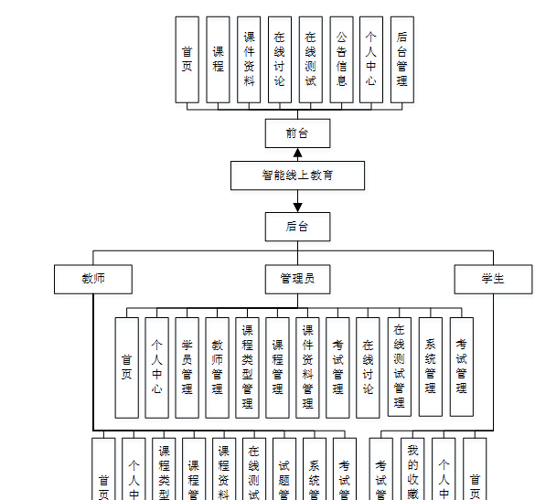

图4-1系统功能结构图

### 4.2数据库设计

在整个系统来说，数据库的设计是相当重要的，需要非常仔细去设计。

本系统中涉及的各级权限分别是：

  1. 教师登录权限，可以查看系统首页，个人中心，课程类型管理，课程管理，课程资料管理，在线测试管理 ，试题管理，系统管理，考试管理等。
  2. 学生登录权限，可以查看系统首页，个人中心，我的收藏管理，考试管理等。

（3）管理员权限，管理员有系统的所有权限，包括首页，个人中心，学员管理，教师管理，课程类型管理，课程管理 ，课件资料管理
，考试管理，在线讨论，在线测试管理，系统管理，考试管理等。

#### 4.2.1概念结构设计

根据分析系统的数据需求，得到系统的实体属性图。

(1)管理员信息E-R图，如图4-2所示：

图4-2管理员信息E-R图

(2)教师注册E-R图，如图4-3所示：

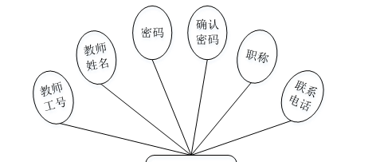

图4-3教师注册E-R图

(3)课程管理E-R图，如图4-4所示：

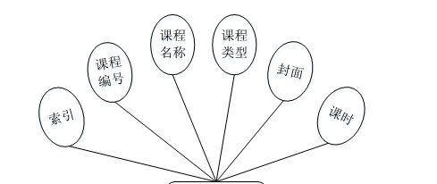

图4-4课程管理E-R图

### 系统功能模块

智能线上教育系统，在系统首页可以查看首页，课程，课件资料，在线讨论，在线测试，公告信息，个人中心，后台管理等内容，并进行详细操作，如图5-1所示。

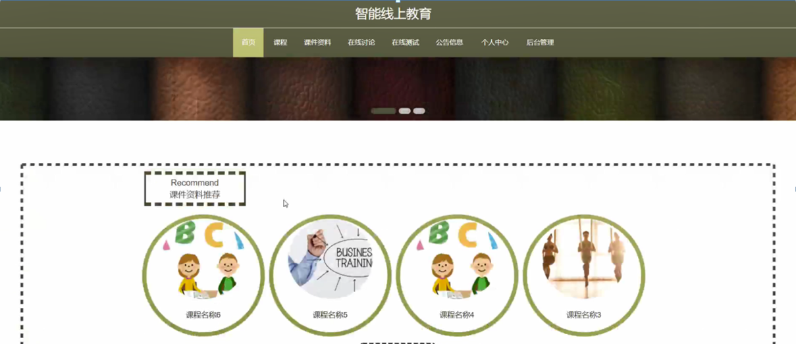

图5-1系统首页界面图

教师注册，在教师注册页面通过填写教师工号，教师姓名，密码，确认密码，职称，联系电话等内容完成教师注册，如图5-2所示。

图5-2教师注册界面图

课件资料，在课件资料页面可以查看课程名称，课程类型，上传时间，教师工号，教师姓名，点击次数，课程文件等内容操作，如图5-3所示。

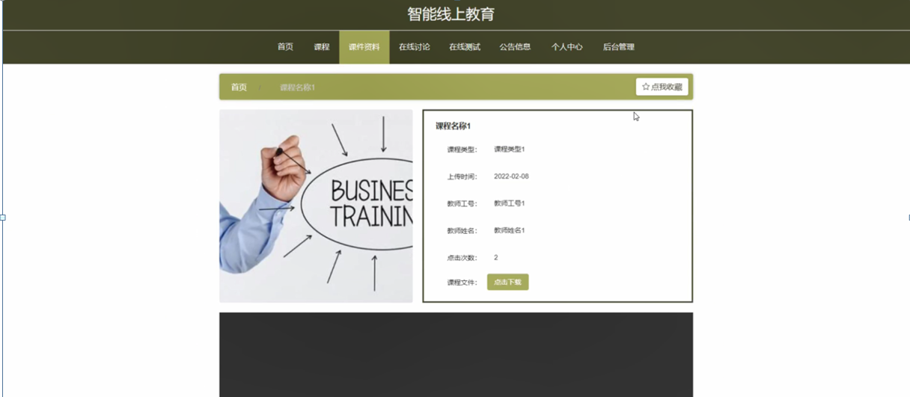

图5-3课件资料界面图

在线讨论，在线讨论页面可以查看标题，简介等内容，如图5-4所示。

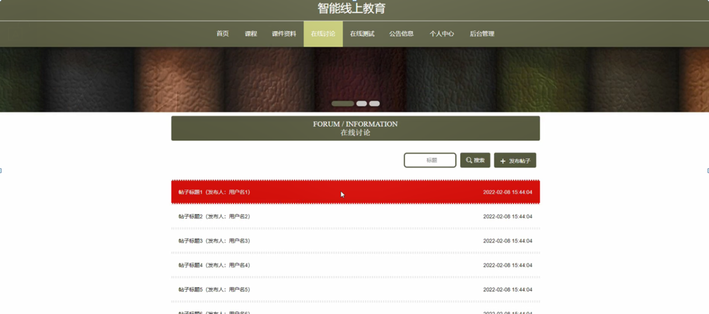

图5-4在线讨论界面图

### 5.2管理员功能模块

管理员进行登录，进入系统前在登录页面根据要求填写用户名和密码，选择角色等信息，点击登录进行登录操作，如图5-5所示。

图5-5管理员登录界面图

管理员登录系统后，可以对首页，个人中心，学员管理，教师管理，课程类型管理，课程管理 ，课件资料管理
，考试管理，在线讨论，在线测试管理，系统管理，考试管理等进行相应的操作管理，如图5-6所示。

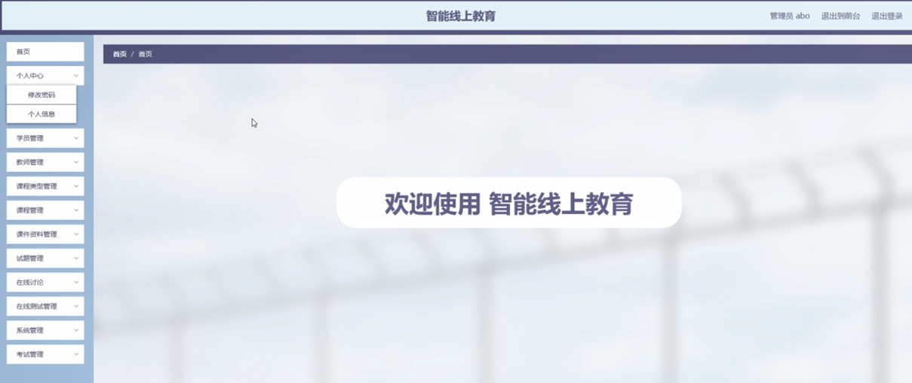

图5-6管理员功能界面图

学员管理，在学生管理页面可以对索引，账号，姓名，性别，头像，手机，身份证等内容进行详情，修改和删除等操作，如图5-7所示。

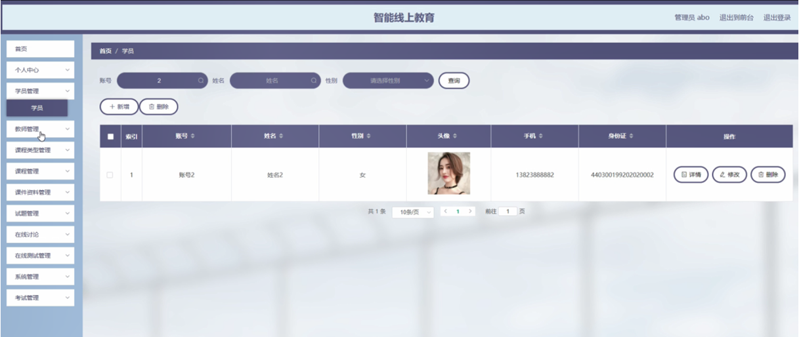

图5-7学生管理界面图

教师管理，在教师管理页面可以对索引，教师工号，教师姓名，姓别，图片，职称，联系电话等内容进行详情，修改和删除等操作，如图5-8所示。

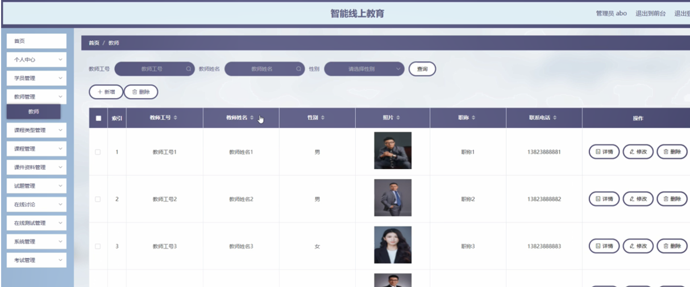

图5-8教师管理界面图

课程类型管理，在课程类型管理页面可以对索引，课程类型内容进行修改和删除等操作，如图5-9所示。

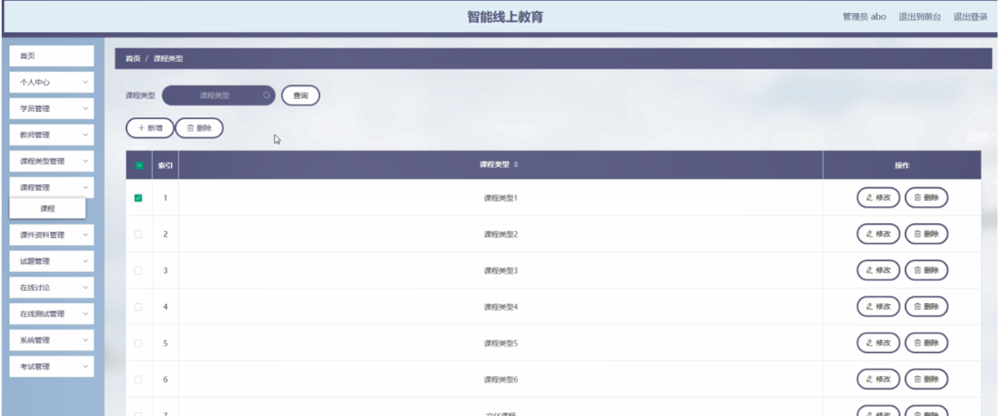

图5-9课程类型管理界面图

课程管理，在课程管理页面可以对索引，课程编号，课程名称，课程类型，封面，课时等内容进行详情，修改和删除等操作，如图5-10所示。

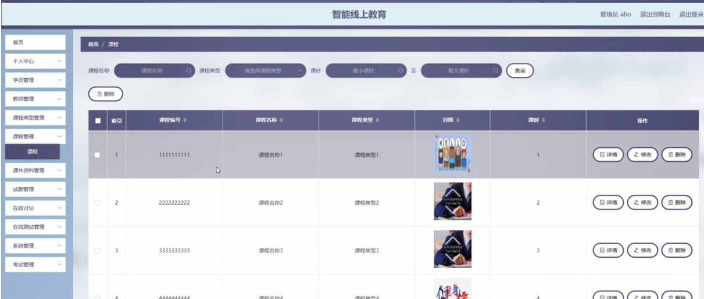

图5-10课程管理界面图

课件资料管理，在课件资料管理页面可以对索引，课程名称，课程类型，封面，课程文件，课程视频，上传时间，教师工号，教师姓名等内容进行详情，修改，查看评论和删除等操作，如图5-11所示。

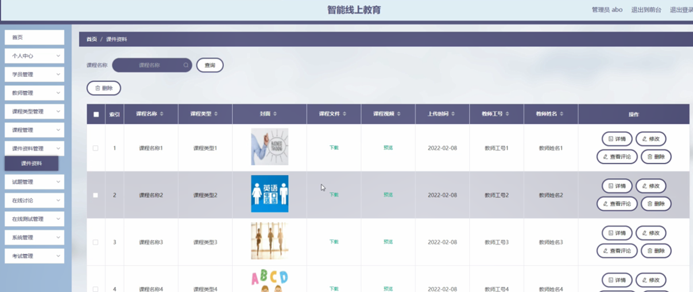

图5-11课件资料管理界面图

试题管理，在试题管理页面可以对在线测试，试题名称，分值，答案，类型等内容进行修改和删除等操作，如图5-12所示。

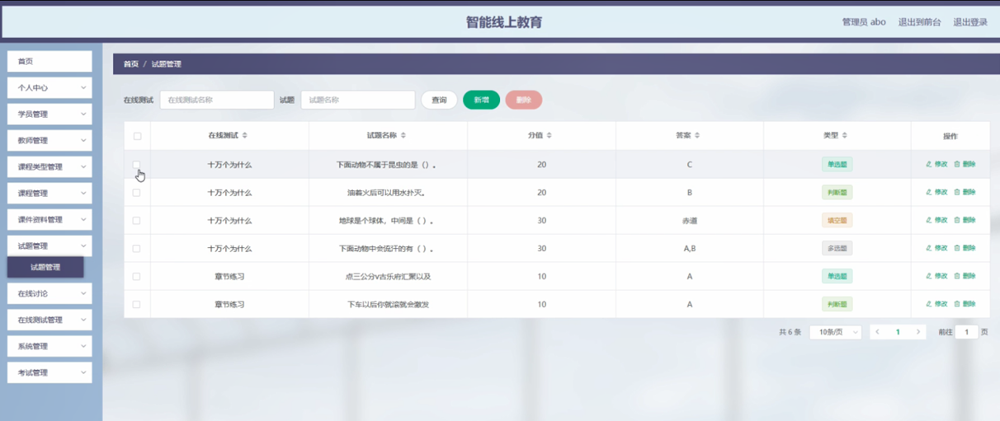

图5-12试题管理界面图

#### **JAVA** **毕设帮助，指导，源码分享，调试部署**

