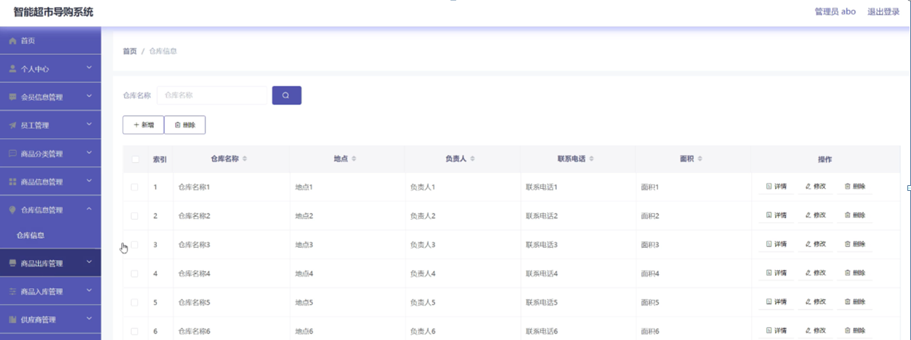

ssm+Vue计算机毕业设计智能超市导购系统（程序+LW文档）

**项目运行**

**环境配置：**

**Jdk1.8 + Tomcat7.0 + Mysql + HBuilderX** **（Webstorm也行）+ Eclispe（IntelliJ
IDEA,Eclispe,MyEclispe,Sts都支持）。**

**项目技术：**

**SSM + mybatis + Maven + Vue** **等等组成，B/S模式 + Maven管理等等。**

**环境需要**

**1.** **运行环境：最好是java jdk 1.8，我们在这个平台上运行的。其他版本理论上也可以。**

**2.IDE** **环境：IDEA，Eclipse,Myeclipse都可以。推荐IDEA;**

**3.tomcat** **环境：Tomcat 7.x,8.x,9.x版本均可**

**4.** **硬件环境：windows 7/8/10 1G内存以上；或者 Mac OS；**

**5.** **是否Maven项目: 否；查看源码目录中是否包含pom.xml；若包含，则为maven项目，否则为非maven项目**

**6.** **数据库：MySql 5.7/8.0等版本均可；**

**毕设帮助，指导，本源码分享，调试部署** **(** **见文末** **)**

### 系统体系结构

智能超市导购系统的结构图4-1所示：

图4-1 系统结构

登录系统结构图，如图4-2所示：

图4-2 登录结构图

系统结构图，如图4-3所示：

图4-3 系统结构图

### 4.2 数据库实体设计

数据库的功能就是对系统中所有的数据进行存储和管理。所有的数据可以在数据库中产时间的进行存储，方便用户的使用。而且所有的数据库中的数据也应该具有一定的共享性，任何的系统可以对一些数据进行使用，同时还应该保持一定的独立性，每一个数据库中的数据都有很强的安全性，可以被很好的存放到数据库，没有进行身份的验证是不能对这些数据进行查看和使用的。数据库的设计需要明确每一个实体之间的联系，系统的E-
R图如下图所示：：

管理员实体主要存储管理信息包括序号、用户名、密码属性。管理员信息属性图如图4-4所示。

图4-4 管理员信息实体属性图

商品信息管理主要包括索引、商品编号、仓库名称、商品分类、商品名称、供应商、商品图片、数量、商品价格等属性，商品信息管理属性图如图4-5所示。

图4-5商品信息管理实体属性图

仓库信息管理实体属性主要包括索引、仓库名称、地点、负责人、联系电话、面积等属性。仓库信息管理实体属性图如图4-6所示。

图4-6仓库信息管理实体属性图

### 管理员功能模块

管理员登录，管理员通过输入界面上显示的信息然后点击登录就能登录到系统进行系统的使用了，如图5-1所示。

图5-1管理员登录界面图

管理员登录进入智能超市导购系统之后，就可以对所有的信息进行查看，可以查看到首页、个人中心、会员信息管理、员工管理、商品分类管理、商品信息管理、仓库信息管理、商品出库管理、商品入库管理、供应商管理等，并且还可以对其进行相应的操作管理，如图5-2所示。

图5-2管理员功能界面图

会员信息管理，在会员信息管理页面中可以对索引、会员号、会员姓名、性别、年龄、头像等信息进行详情、修改或删除等操作，如图5-3所示。

图5-3会员信息管理界面图

员工管理，在员工管理页面中可以对索引、员工工号、密码、员工姓名、性别、头像、员工手机、年龄、入职时间等信息进行详情、修改或删除等操作，如图5-4所示。

图5-4员工管理界面图

商品分类管理，在商品分类管理页面中可以对索引、商品分类等信息进行详情、修改或删除等操作，如图5-5所示。

图5-5商品分类管理界面图

商品信息管理，在商品信息管理页面中可以对索引、商品编号、仓库名称、商品分类、商品名称、供应商、商品图片、数量、商品价格等信息进行详情、修改或删除等操作，如图5-6所示。

图5-6商品信息管理界面图

仓库信息管理，在仓库信息管理页面中可以对索引、仓库名称、地点、负责人、联系电话、面积等信息进行详情、修改或删除等操作，如图5-7所示。

图5-7仓库信息管理界面图

商品出库管理，在商品出库管理页面中可以对索引、出库单号、仓库名称、商品名称、商品分类、数量、出库价格、出库总价、出库对象、出库时间、员工工号、员工姓名、备注等信息进行详情、修改或删除等操作，如图5-8所示。

图5-8商品出库管理界面图

商品入库管理，在商品入库管理页面中可以对索引、入库单号、仓库名称、商品名称、商品分类、数量、入库价格、入库总价、供应商、入库时间、员工工号、员工姓名、备注等信息进行详情、修改或删除等操作，如图5-9所示。

图5-9商品入库管理界面图

供应商管理，在供应商管理页面中可以对索引、供应商编号、供应商名称、地址、联系电话、负责人姓名、联系方式等信息进行详情、修改或删除等操作，如图5-10所示。

图5-10供应商管理界面图

### 5.2员工功能模块

员工登录进入智能超市导购系统可以对首页、个人中心、商品信息管理、商品出库管理、商品入库管理等进行相应的操作管理，如图5-11所示。

图5-11员工功能界面图

个人中心，在个人中心页面中可以填写员工工号、员工姓名、性别、头像、员工手机、年龄、入职时间等信息进行修改操作，如图5-12所示。

图5-12个人中心界面图

#### **JAVA** **毕设帮助，指导，源码分享，调试部署**

