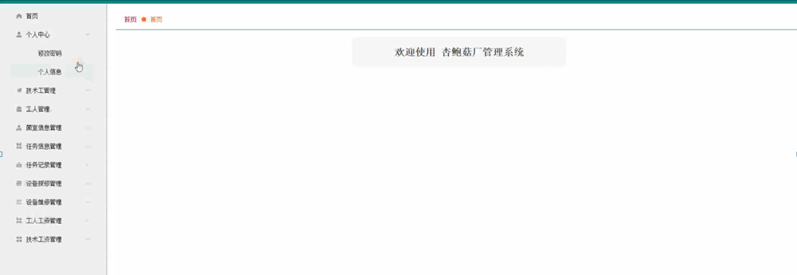
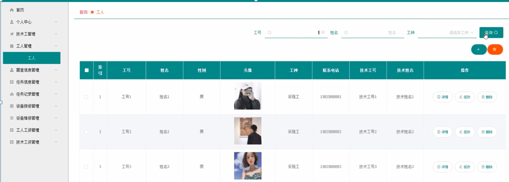

ssm+Vue计算机毕业设计杏鲍菇厂管理系统（程序+LW文档）

**项目运行**

**环境配置：**

**Jdk1.8 + Tomcat7.0 + Mysql + HBuilderX** **（Webstorm也行）+ Eclispe（IntelliJ
IDEA,Eclispe,MyEclispe,Sts都支持）。**

**项目技术：**

**SSM + mybatis + Maven + Vue** **等等组成，B/S模式 + Maven管理等等。**

**环境需要**

**1.** **运行环境：最好是java jdk 1.8，我们在这个平台上运行的。其他版本理论上也可以。**

**2.IDE** **环境：IDEA，Eclipse,Myeclipse都可以。推荐IDEA;**

**3.tomcat** **环境：Tomcat 7.x,8.x,9.x版本均可**

**4.** **硬件环境：windows 7/8/10 1G内存以上；或者 Mac OS；**

**5.** **是否Maven项目: 否；查看源码目录中是否包含pom.xml；若包含，则为maven项目，否则为非maven项目**

**6.** **数据库：MySql 5.7/8.0等版本均可；**

**毕设帮助，指导，本源码分享，调试部署** **(** **见文末** **)**

### 系统设计主要功能

通过市场调研及咨询研究，了解了用户及管理者的使用需求，于是制定了管理员、技术工和工人等模块。功能结构图如下所示：

图4-1系统功能结构图

### 4.2 数据库设计

#### 4.2.1 数据库设计规范

数据可设计要遵循职责分离原则，即在设计时应该要考虑系统独立性，即每个系统之间互不干预不能混乱数据表和系统关系。

数据库命名也要遵循一定规范，否则容易混淆，数据库字段名要尽量做到与表名类似，多使用小写英文字母和下划线来命名并尽量使用简单单词。

#### 4.2.2 E/R图

技术工管理E/R图，如下所示：

图4-2技术工管理E/R图

菌室信息管理E/R图，如下所示：

图4-3菌室信息管理E/R图

任务记录管理E/R图，如下所示。

图4-4任务记录管理E/R图

管理员、工人和技术工进行登录，进入系统前在登录页面根据要求填写用户名和密码，选择角色等信息，点击登录进行登录操作，如图5-1所示。

图5-1 系统登录界面图

### 5.2管理员功能模块

管理员登录系统后，可以对首页、个人中心、技术工管理、工人管理、菌室信息管理、任务信息管理、任务记录管理、设备报修管理、设备维修管理、工人工资管理、技术工资管理等功能进行相应的操作管理，如图5-2所示。

图5-2管理员功能界面图

技术工管理，在技术工管理页面可以对索引、技术工号、技术姓名、性别、头像、联系电话等内容进行详情、修改或删除等操作，如图5-3所示。

图5-3技术工管理界面图

工人管理，在工人管理页面可以对索引、工号、姓名、性别、头像、工种、联系电话、技术工号、技术姓名等内容进行详情、修改或删除等操作，如图5-4所示。

图5-4工人管理界面图

菌室信息管理，在菌室信息管理页面中可以对索引、菌室编号、菌室名称、
菌室位置、菌室分类、技术工号、技术姓名、分配时间、提醒时间等内容进行详情、修改或删除等操作，如图5-5所示。

图5-5菌室信息管理界面图

任务信息管理，在任务信息管理页面中可以对索引、菌室名称、任务名称、任务酬劳、任务内容、采菇方式、任务日期、任务状态、工号、姓名、工种、技术工号、技术姓名等内容进行详情、修改或删除等操作，如图5-6所示。

图5-6任务信息管理界面图

任务记录管理，在任务记录管理页面可以对索引、任务名称、任务酬劳、完成情况、日期、工号、姓名、工种、技术工号、审核回复、审核状态等内容进行详情、修改或删除等操作，如图5-7所示。

图5-7任务记录管理界面图

设备保修管理，在设备保修管理页面可以对索引、设备名称、报修日期、状态、工号、姓名、技术工号、审核回复、审核状态、审核等内容进行详情、维修、修改或删除等操作，如图5-8所示。

图5-8设备保修管理界面图

设备维修管理，在设备维修管理页面可以对索引、设备名称、维修进度、维修日期、工号、技术工号等内容进行详情或修改等操作，如图5-9所示。

图5-9设备维修管理界面图

工人工资管理，在工人工资管理页面中可以对索引、工号、姓名、工种、固定工资、按劳工资、加班工资、应扣金额、其他扣款、实发工资、月份、备注等内容进行详情、修改或删除等操作，如图5-10所示。

图5-10工人工资管理界面图

技术工资管理，在技术工资管理页面中可以对索引、技术工号、技术姓名、固定工资、岗位工资、加班工资、应扣金额、其他扣款、实发工资、月份、备注等内容进行详情、修改或删除等操作，如图5-11所示。

图5-11技术工资管理界面图

### 5.3技术工功能模块

技术工登录进入系统可以对首页、个人中心、工人管理、菌室信息管理、任务信息管理、任务记录管理、设备报修管理、设备维修管理、技术工资管理等功能进行相应操作，如图5-12所示。

图5-12技术工功能界面图

#### **JAVA** **毕设帮助，指导，源码分享，调试部署**

