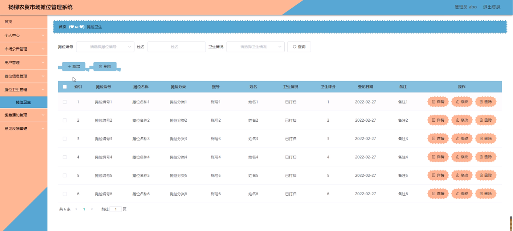

ssm+Vue计算机毕业设计杨柳农贸市场摊位管理系统（程序+LW文档）

**项目运行**

**环境配置：**

**Jdk1.8 + Tomcat7.0 + Mysql + HBuilderX** **（Webstorm也行）+ Eclispe（IntelliJ
IDEA,Eclispe,MyEclispe,Sts都支持）。**

**项目技术：**

**SSM + mybatis + Maven + Vue** **等等组成，B/S模式 + Maven管理等等。**

**环境需要**

**1.** **运行环境：最好是java jdk 1.8，我们在这个平台上运行的。其他版本理论上也可以。**

**2.IDE** **环境：IDEA，Eclipse,Myeclipse都可以。推荐IDEA;**

**3.tomcat** **环境：Tomcat 7.x,8.x,9.x版本均可**

**4.** **硬件环境：windows 7/8/10 1G内存以上；或者 Mac OS；**

**5.** **是否Maven项目: 否；查看源码目录中是否包含pom.xml；若包含，则为maven项目，否则为非maven项目**

**6.** **数据库：MySql 5.7/8.0等版本均可；**

**毕设帮助，指导，本源码分享，调试部署** **(** **见文末** **)**

总体设计

根据摊位管理系统的功能需求，进行系统设计。

管理员，管理员功能包括首页、个人中心、用户管理、市场公告管理，摊位信息管理，摊位卫生管理，缴费通知管理，意见反馈管理等；

用户，用户功能包括首页，个人中心，市场公告管理，摊位信息管理，摊位卫生管理，缴费通知管理，意见反馈管理等。

系统对这些功能进行整合，产生的功能结构图如下：

图3-1 系统总体结构图

3.4 数据库设计与实现

在每一个系统中数据库有着非常重要的作用，数据库的设计得好将会增加系统的效率以及系统各逻辑功能的实现。所以数据库的设计我们要从系统的实际需要出发，才能使其更为完美的符合系统功能的实现。

#### 3.4.1 数据库概念结构设计

数据库的E-R图反映了实体、实体的属性和实体之间的联系。下面是各个实体以及实体的属性。

摊位申请实体属性图如下所示：

图3-2摊位申请实体属性图

摊位卫生实体属性图如下所示：

图3-3摊位卫生实体属性图

市场公告实体属性图如下所示：

图3-4市场公告实体属性图

### 系统功能模块

农贸市场摊位管理系统，用户进入到系统首页，可以进行登录，注册等内容操作，如图4-1所示。

图4-1系统首页界面图

用户注册；在用户注册页面中输入用户名、密码、确认密码、姓名、年龄、手机等内容进行用户注册操作；如图4-2所示。

图4-2用户注册界面图

### 4.2 管理员功能模块

管理员登录，通过填写注册时输入的用户名、密码、选择角色等信息进行登录操作，如图4-3所示。

图4-3管理员登录界面图

管理员登录进入摊位管理系统可以查看首页、个人中心、用户管理、市场公告管理，摊位信息管理，摊位卫生管理，缴费通知管理，意见反馈管理等信息进行详细操作，如图4-4所示。

图4-4管理员功能界面图

用户管理；在用户管理页面中可以对用账号、姓名、年龄、性别、头像、手机等内容进行详情，修改和删除等操作；如图4-5所示。

图4-5用户管理界面图

市场公告管理；在市场公告管理页面中可以对标题，发布时间，封面等内容进行详情，修改和删除等操作；如图4-6所示。

图4-6市场公告管理界面图

摊位信息管理；在摊位信息管理页面中可以对摊位编号，摊位名称，摊位分类，摊位面积，摊位图片，摊位状态，账号，姓名，摊位租金，摊位位置等内容进行详情，修改，和删除等操作；如图4-7所示。

图4-7摊位信息管理界面图

摊位卫生管理；在摊位卫生管理页面中可以对摊位编号，摊位名称，摊位分类，账号，姓名，卫生情况，卫生评分，登记日期，备注等内容进行详情，修改和删除等操作；如图4-8所示。

图4-8摊位卫生管理界面图

缴费通知管理；在缴费通知管理页面中可以对摊位编号，摊位名称，摊位分类，摊位租金，其他费用，总费用，通知时间，账号，姓名等内容进行详情，修改和删除等操作；如图4-9所示。

图4-9缴费通知管理界面图

### 4.3 用户功能模块

用户登录进入农贸市场摊位管理系统后台可以查看首页、个人中心、市场公告管理，摊位信息管理，摊位卫生管理，缴费通知管理，意见反馈管理等内容，并进行详细操作，如图4-10所示。

图4-10用户功能界面图

市场公告管理；在市场公告管理页面中可以对标题，发布时间，封面等内容进行详情查看等操作；如图4-11所示。

图4-11市场公告管理界面图

摊位信息管理；在摊位信息管理页面中可以对摊位编号，摊位名称，摊位分类，摊位面积，摊位图片，摊位状态，账号，姓名，摊位租金，摊位位置，登记日期等内容进行查看等操作；如图4-12所示。

图4-12摊位信息管理界面图

#### **JAVA** **毕设帮助，指导，源码分享，调试部署**

