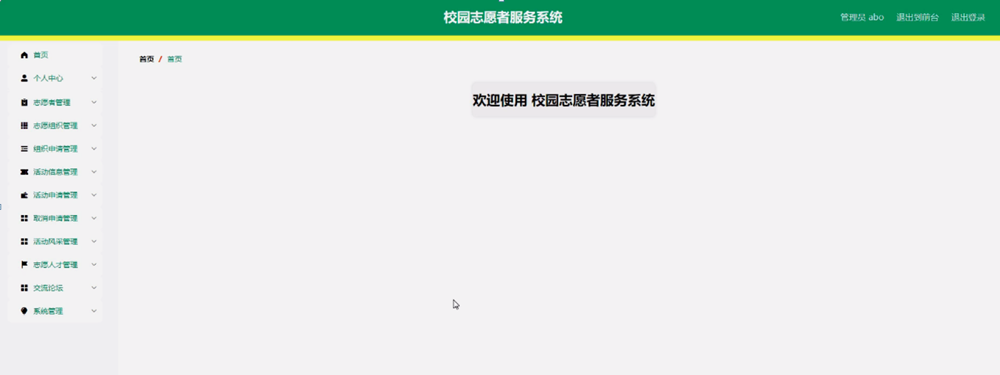

ssm+Vue计算机毕业设计校园志愿者服务系统（程序+LW文档）

**项目运行**

**环境配置：**

**Jdk1.8 + Tomcat7.0 + Mysql + HBuilderX** **（Webstorm也行）+ Eclispe（IntelliJ
IDEA,Eclispe,MyEclispe,Sts都支持）。**

**项目技术：**

**SSM + mybatis + Maven + Vue** **等等组成，B/S模式 + Maven管理等等。**

**环境需要**

**1.** **运行环境：最好是java jdk 1.8，我们在这个平台上运行的。其他版本理论上也可以。**

**2.IDE** **环境：IDEA，Eclipse,Myeclipse都可以。推荐IDEA;**

**3.tomcat** **环境：Tomcat 7.x,8.x,9.x版本均可**

**4.** **硬件环境：windows 7/8/10 1G内存以上；或者 Mac OS；**

**5.** **是否Maven项目: 否；查看源码目录中是否包含pom.xml；若包含，则为maven项目，否则为非maven项目**

**6.** **数据库：MySql 5.7/8.0等版本均可；**

**毕设帮助，指导，本源码分享，调试部署** **(** **见文末** **)**

总体设计

系统总体设计图如下图4-1所示：

图4-1系统总体设计图

### 4.2 数据库设计

#### 4.2.1 概念模型设计

数据可设计要遵循职责分离原则，即在设计时应该要考虑系统独立性，即每个系统之间互不干预不能混乱数据表和系统关系。

数据库命名也要遵循一定规范，否则容易混淆，数据库字段名要尽量做到与表名类似，多使用小写英文字母和下划线来命名并尽量使用简单单词。

概念模型是对现实中的问题出现的事物的进行描述，ER图是由实体及其关系构成的图，通过E-R图可以清楚地描述系统涉及到的实体之间的相互关系。

志愿者管理实体图如图4-2所示：

图4-2志愿者管理实体图

志愿组织管理实体图如图4-3所示：

图4-3志愿组织管理实体图

活动信息管理实体图如图4-4所示：

图4-4活动信息管理实体图

系统功能模块

校园志愿者服务系统，在系统首页可查看首页、志愿组织、活动信息、活动风采、志愿人才、交流论坛、公告信息、个人中心、后台管理等内容，如图5-1所示。

图5-1系统功能界面图

志愿者注册，志愿者通过输入个人账号、密码、姓名、邮箱、手机号码等内容进行注册，如图5-2所示。

图5-2志愿者注册界面

志愿组织，志愿者可在志愿组织页面查看组织名称、组织地址、组织人数、组织口号、组织文化、图片、组织风采等内容，还可进行申请等操作，如图5-3所示。

图5-3志愿组织界面

活动信息，志愿者可在活动信息页面查看活动名称、活动编号、图片、活动地址、人数、活动日期、发布日期等内容，还可进行申请等操作，如图5-4所示。

图5-4活动信息界面

志愿人才，志愿者可在志愿人才页面查看表彰名称、信息编号、图片、表彰简介、个人账号、姓名、组织名称、发布日期等内容，如图5-5所示。

图5-5志愿人才界面图

个人中心，志愿者可在个人中心页面通过输入个人账号、姓名、密码、性别、邮箱、手机号码、上传图片、组织名称等内容进行更新信息或查看我的发布等内容，如图5-6所示。

图5-6个人中心界面图

5.2志愿者功能模块

志愿者进入系统后台功能模块可查看个人中心、组织申请管理、活动申请管理、取消申请管理、交流论坛等内容，如图5-7所示。

图5-7志愿者功能界面图

组织申请管理，志愿者可在组织申请管理页面查看申请编号、组织名称、组织地址、个人账号、姓名、手机号码、申请原因、申请日期、审核回复、审核状态等内容，还可进行删除等操作，如图5-8所示。

图5-8组织申请管理界面

活动申请管理，志愿者可在活动申请管理页面查看活动名称、活动地址、活动日期、人数、个人账号、姓名、手机号码、组织名称、申请原因、申请日期、审核回复、审核状态等内容，还可进行删除等操作，如图5-9所示。

图5-9活动申请管理界面

取消申请管理，志愿者可在取消申请管理页面查看活动名称、活动地址、活动日期、人数、个人账号、姓名、手机号码、组织名称、操作日期、审核回复、审核状态等内容，还可进行删除等操作，如图5-10所示。

图5-10取消申请管理界面

5.3管理员功能模块

管理员通过输入用户名、密码、角色进行登录，如图5-11所示。

图5-11管理员登录界面图

管理员通过登录进入校园志愿者服务系统可查看个人中心、志愿者管理、志愿组织管理、组织申请管理、活动信息管理、活动申请管理、取消申请管理、活动风采管理、志愿人才管理、交流论坛、系统管理等内容，如图5-12所示。

图5-12管理员功能界面图

#### **JAVA** **毕设帮助，指导，源码分享，调试部署**

