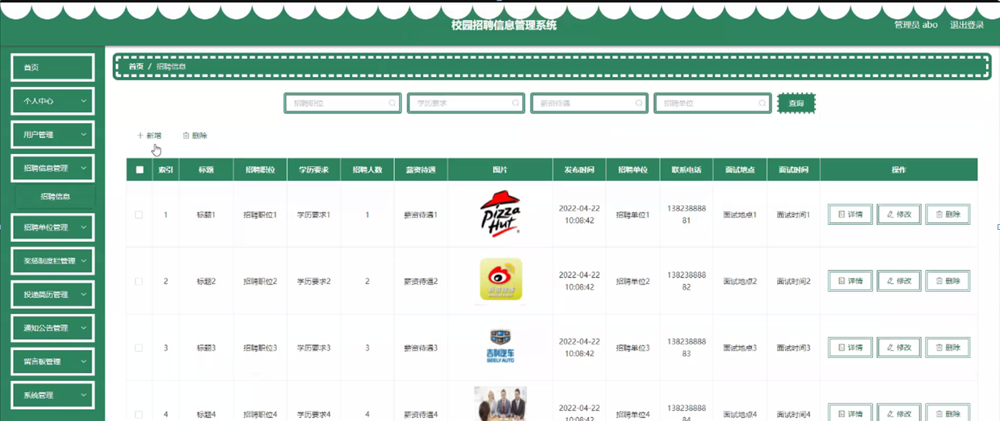
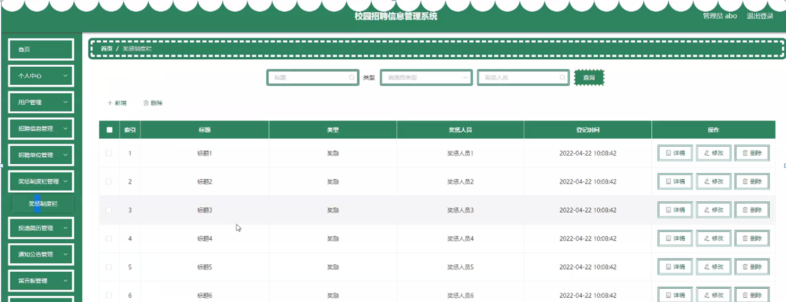

ssm+Vue计算机毕业设计校园招聘信息管理系统_（程序+LW文档）

**项目运行**

**环境配置：**

**Jdk1.8 + Tomcat7.0 + Mysql + HBuilderX** **（Webstorm也行）+ Eclispe（IntelliJ
IDEA,Eclispe,MyEclispe,Sts都支持）。**

**项目技术：**

**SSM + mybatis + Maven + Vue** **等等组成，B/S模式 + Maven管理等等。**

**环境需要**

**1.** **运行环境：最好是java jdk 1.8，我们在这个平台上运行的。其他版本理论上也可以。**

**2.IDE** **环境：IDEA，Eclipse,Myeclipse都可以。推荐IDEA;**

**3.tomcat** **环境：Tomcat 7.x,8.x,9.x版本均可**

**4.** **硬件环境：windows 7/8/10 1G内存以上；或者 Mac OS；**

**5.** **是否Maven项目: 否；查看源码目录中是否包含pom.xml；若包含，则为maven项目，否则为非maven项目**

**6.** **数据库：MySql 5.7/8.0等版本均可；**

**毕设帮助，指导，本源码分享，调试部署** **(** **见文末** **)**

### 功能结构

为了更好的去理清本系统整体思路，对该系统以结构图的形式表达出来，设计实现该校园招聘信息管理系统的功能结构图如下所示：

图4-1 系统总体结构图

### 4.2 数据库设计

####  4.2.1 数据库E/R图

ER图是由实体及其关系构成的图，通过E/R图可以清楚地描述系统涉及到的实体之间的相互关系。在系统中对一些主要的几个关键实体如下图：

(1) 招聘单位E/R图如下所示：

图4-2招聘单位E/R图

(2) 用户信息E/R图如下所示：

图4-3用户信息E/R图

(3) 留言板E/R图如下所示：

图4-4留言板E/R图

### 管理员功能模块

管理员登录，管理员通过输入用户名、密码，选择角色并点击登录进行系统登录操作，如图5-1所示。

图5-1管理员登录界面图

管理员登录系统后，可以对个人中心、用户管理、招聘信息管理、招聘单位管理、奖惩制度栏管理、投递简历管理、通知公告管理、留言板管理、系统管理等功能进行相应操作，如图5-2所示。

图5-2管理员功能界图面

用户管理，管理员可在用户管理页面查看账号、姓名、年龄、性别、手机、照片等内容，还可进行新增、修改或删除等操作，如图5-3所示。

图5-3用户管理界面图

招聘信息管理，管理员可在招聘信息管理页面查看标题、招聘职位、学历要求、招聘人数、薪资待遇、图片、发布时间、招聘单位、联系电话、面试地点、面试时间等内容，还可进行新增、修改或删除等操作，如图5-4所示。

图5-4招聘信息管理界面图

招聘单位管理，管理员可在招聘单位管理页面查看单位名称、负责人、联系方式、邮箱、封面、单位地址、创立日期等内容，还可进行新增、修改或删除等操作，如图5-5所示。

图5-5招聘单位管理界面图

奖惩制度栏管理，管理员可在奖惩制度栏管理页面查看标题、类型、奖惩人员、登记时间等内容，还可进行新增、修改或删除等操作，如图5-6所示。

图5-6奖惩制度栏管理界面图

投递简历管理，管理员可在投递简历管理页面查看账号、姓名、性别、手机、照片、专业等内容，还可进行删除等操作，如图5-7所示。

图5-7投递简历管理界面图

通知公告管理，管理员可在通知公告管理页面查看标题、发布时间、封面等内容，还可进行新增、修改或删除等操作，如图5-8所示。

图5-8通知公告管理界图面

留言板管理，管理员可在留言板管理页面查看用户名、留言内容、留言图片、回复内容、回复图片等内容，还可进行回复或删除等操作，如图5-9所示。

图5-9留言板管理界面图

5.2系统功能模块

校园招聘信息管理系统，在系统首页可查看首页、招聘信息、招聘单位、通知公告、个人中心、后台管理、联系我们等内容，如图5-10所示。

图5-10系统首页界面图

用户注册，用户通过输入账号、密码、姓名、年龄、手机进行注册，如图5-11所示。

图5-11用户注册界面图

个人中心，用户可通过输入账号、密码、姓名、年龄、手机、上传图片进行更新信息或查看我的收藏等内容，如图5-12所示。

图5-12个人中心界面图

#### **JAVA** **毕设帮助，指导，源码分享，调试部署**

