ssm+Vue计算机毕业设计校园招聘信息管理系统（程序+LW文档）

**项目运行**

**环境配置：**

**Jdk1.8 + Tomcat7.0 + Mysql + HBuilderX** **（Webstorm也行）+ Eclispe（IntelliJ
IDEA,Eclispe,MyEclispe,Sts都支持）。**

**项目技术：**

**SSM + mybatis + Maven + Vue** **等等组成，B/S模式 + Maven管理等等。**

**环境需要**

**1.** **运行环境：最好是java jdk 1.8，我们在这个平台上运行的。其他版本理论上也可以。**

**2.IDE** **环境：IDEA，Eclipse,Myeclipse都可以。推荐IDEA;**

**3.tomcat** **环境：Tomcat 7.x,8.x,9.x版本均可**

**4.** **硬件环境：windows 7/8/10 1G内存以上；或者 Mac OS；**

**5.** **是否Maven项目: 否；查看源码目录中是否包含pom.xml；若包含，则为maven项目，否则为非maven项目**

**6.** **数据库：MySql 5.7/8.0等版本均可；**

**毕设帮助，指导，本源码分享，调试部署** **(** **见文末** **)**

### 4.1系统总体设计

系统总体设计即对有关系统全局问题的设计，也就是设计系统总的处理方案，又称系统概要设计。它包括系统规划与系统功能设计等内容。

校园招聘信息管理系统主要有三类用户。分别是管理员，学生和企业，详细规划如图4-1所示。

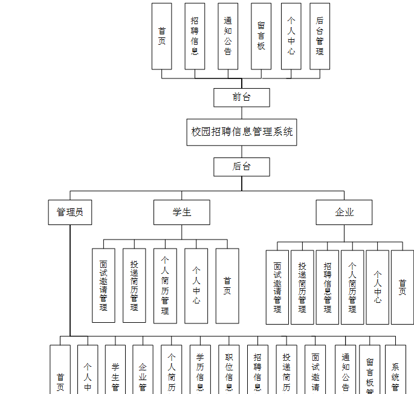

图4-1系统规划图

其中各子模块的主要功能如下：

1、用户登录：用户进入网页先输入用户名与密码，选择权限登录，用户登录成功，要记录登录的用户名和登录类型。

2、新用户注册：新用户填写用户名，密码，姓名，手机，邮箱等信息完成注册操作。

3、查看校园招聘信息：用户登录成功后，能够按分类或者查找校园招聘信息进行管理。

4、主页内容管理：管理员登录以后，可以对首页，个人中心，学生管理，企业管理，个人简历管理，学历信息管理，职位信息管理，招聘信息管理，投递简历管理，面试邀请管理，通知公告管理，留言板管理，系统管理进行详细操作。

### 4.2数据库设计

数据库是一个软件项目的根基，它决定了整个项目代码的走势，同时也决定了整个项目在后期的维护以及升级的难易程度。

#### 4.2.1 数据库概念设计

根据校园招聘信息管理系统的功能需求，对数据库进行分析，得到相应的数据，设计用户需要的各种实体，以及相互之间的关联，为逻辑结构设计铺好路。根据所实体内的各种具体信息得于实现。

1.企业管理信息实体图如图4-2所示：

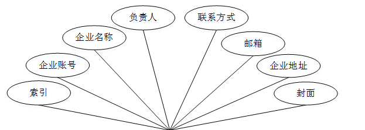

图4-2企业管理信息实体图

2.面试邀请管理实体图如图4-3所示：

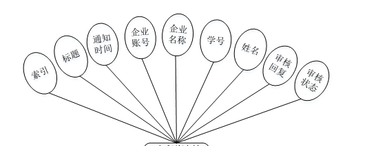

图4-3面试邀请管理实体图

3.通知公告管理实体图如图4-4所示：

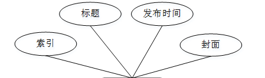

图4-4通知公告管理实体图

### 5.1功能页面实现

按照不同功能模块，在此对系统所涉及的关键页面的实现细节进行阐述，包括页面功能描述，页面涉及功能分析，介绍以及界面展示。

系统登录：
运行系统，首先进入登录界面，按照登录界面的要求填写相应的“账号”和“密码”以及用户类型，点击“登录”然后系统判断填写是否正确，若正确进入相应的界面，否则给出要求先注册信息。具体流程如图5-1所示。

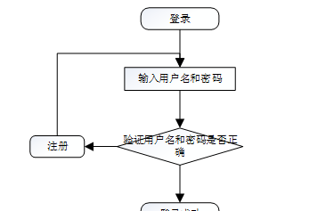

图5-1登录流程图

登录，通过输入账号，密码，选择角色并点击登录进行系统登录操作，如图5-2所示。

图5-2登录界面图

### 5.2系统功能模块

校园招聘信息管理系统；在系统首页可以查看首页，招聘信息，通知公告，留言板，个人中心，后台管理等内容进行详细操作，如图5-3所示。

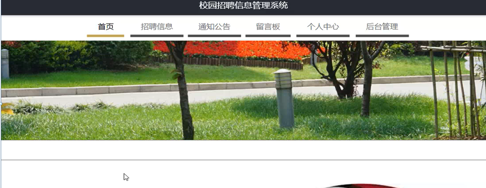

图5-3系统首页界面图

招聘信息；在招聘信息页面可以查看招聘职位，职位要求，上班时间，上班地点，薪资待遇，招聘人数，负责人，联系方式，邮箱，企业账号，企业名称，点击次数等详细内容，并进行投递简历操作，如图5-4所示。

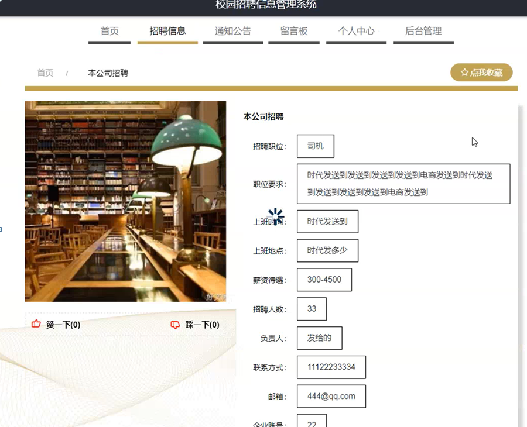

图5-4招聘信息界面图

个人中心；在个人中心页面通过填写学号，密码，姓名，年龄，性别，手机，学历，上传图片等信息进行更新操作，还可以对我的收藏进行相应操作，如图5-5所示。

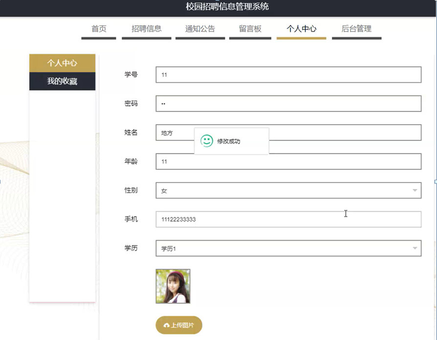

图5-5个人中心界面图

### 5.3管理员功能模块

管理员登录系统后，可以对首页，个人中心，学生管理，企业管理，个人简历管理，学历信息管理，职位信息管理，招聘信息管理，投递简历管理，面试邀请管理，通知公告管理，留言板管理，系统管理等功能进行相应操作，如图5-6所示。

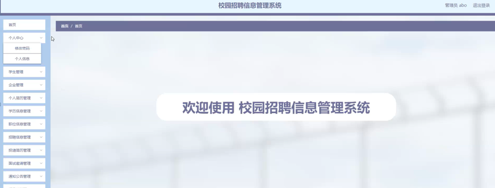

图5-6管理员功能界面图

学生管理；在学生管理页面可以对索引，学号，姓名，年龄，性别，手机，学历，照片等内容进行详情，修改或删除等操作，如图5-7所示。

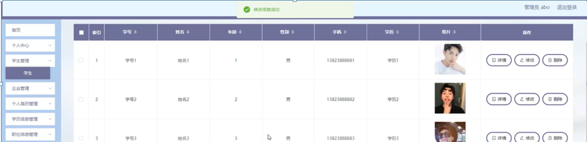

图5-7学生管理界面图

企业管理；在企业管理页面可以对索引，企业账号，企业名称，负责人，联系方式，邮箱，企业地址，封面等信息进行详情，修改或删除等操作，如图5-8所示。

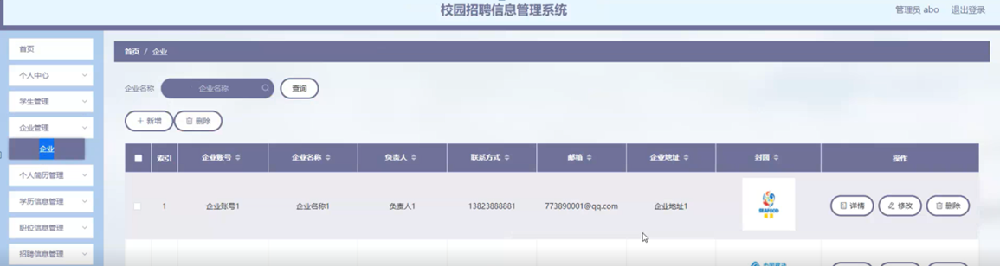

图5-8企业管理界面图

个人简历管理；在个人简历管理页面可以对索引，学号，姓名，性别，手机，照片，学历，专业，出生日期，意向职位，意向城市，薪资要求，教育背景，获奖证书，简历文件等内容进行详情或删除等操作，如图5-9所示。

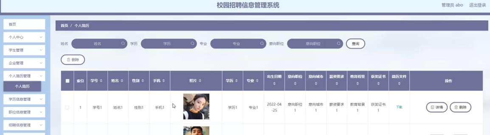

图5-9个人简历管理界面图

学历信息管理；在学历信息管理页面可以对索引，学历等内容进行查详情，修改或删除等操作，如图5-10所示。

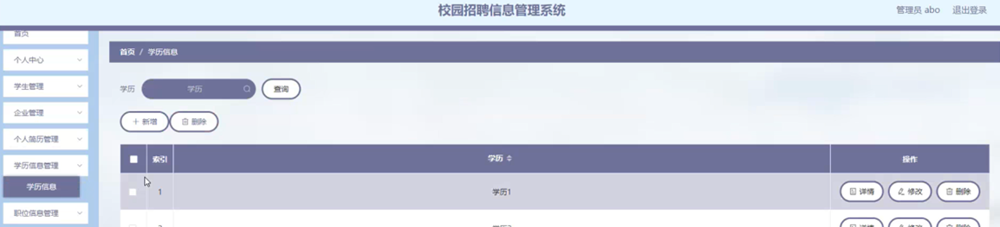

图5-10学历信息管理界面图

职位信息管理；在职位信息管理页面可以对索引，职位等内容进行查详情，修改或删除等操作，如图5-11所示。

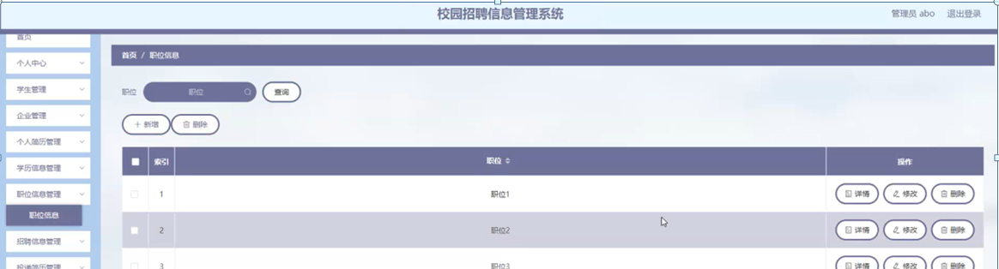

图5-11职位信息管理界面图

招聘信息管理；在招聘信息管理页面可以对索引，标题，招聘职位，上班时间，上班地点，薪资待遇，招聘人数，图片，负责人，联系方式，邮箱，企业账号，企业名称等内容进行查详情，修改或删除等操作，如图5-12所示。

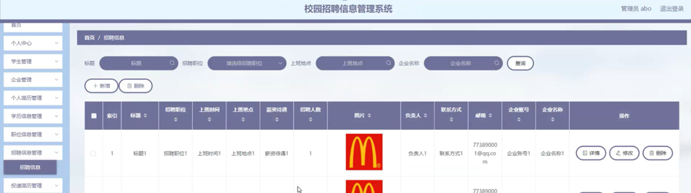

图5-12招聘信息管理界面图

#### **JAVA** **毕设帮助，指导，源码分享，调试部署**

