ssm+Vue计算机毕业设计校园招聘信息网站（程序+LW文档）

**项目运行**

**环境配置：**

**Jdk1.8 + Tomcat7.0 + Mysql + HBuilderX** **（Webstorm也行）+ Eclispe（IntelliJ
IDEA,Eclispe,MyEclispe,Sts都支持）。**

**项目技术：**

**SSM + mybatis + Maven + Vue** **等等组成，B/S模式 + Maven管理等等。**

**环境需要**

**1.** **运行环境：最好是java jdk 1.8，我们在这个平台上运行的。其他版本理论上也可以。**

**2.IDE** **环境：IDEA，Eclipse,Myeclipse都可以。推荐IDEA;**

**3.tomcat** **环境：Tomcat 7.x,8.x,9.x版本均可**

**4.** **硬件环境：windows 7/8/10 1G内存以上；或者 Mac OS；**

**5.** **是否Maven项目: 否；查看源码目录中是否包含pom.xml；若包含，则为maven项目，否则为非maven项目**

**6.** **数据库：MySql 5.7/8.0等版本均可；**

**毕设帮助，指导，本源码分享，调试部署** **(** **见文末** **)**

本系统主要包括以下功能模块：首页、个人中心、学生管理、企业管理、招聘信息管理、职位类别管理、应聘信息管理、系统管理等模块，通过这些模块的实现能够基本满足日常校园招聘信息管理的要求。

总体设计

根据校园招聘信息网站的功能需求，进行系统设计。

前台功能：用户进入网站可以对首页、招聘信息、个人中心、后台管理等功能进行操作；

后台主要是管理员，企业，学生。管理员功能包括首页、个人中心、学生管理、企业管理、招聘信息管理、职位类别管理、应聘信息管理、系统管理等；企业功能包括首页、个人中心、招聘信息管理、应聘信息管理、在线交流管理；学生功能包括首页、个人中心、应聘信息管理、在线交流管理、我的收藏管理。

系统对这些功能进行整合，产生的功能结构图如下：

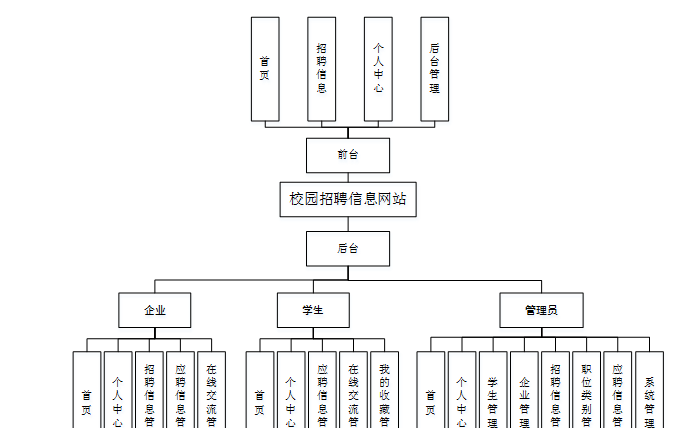

图3-1网站总体结构图

3.4 数据库设计与实现

在每一个网站中数据库有着非常重要的作用，数据库的设计得好将会增加网站的效率以及网站各逻辑功能的实现。所以数据库的设计我们要从网站的实际需要出发，才能使其更为完美的符合网站功能的实现。

#### 3.4.1 数据库概念结构设计

数据库的E-R图反映了实体、实体的属性和实体之间的联系。下面是各个实体以及实体的属性。

企业实体属性图如下所示：

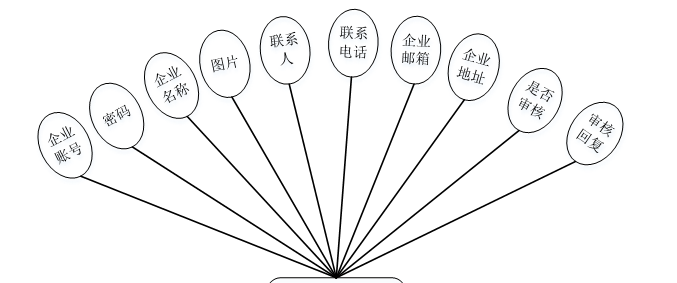

图3-2企业实体属性图

学生实体属性图如下所示：

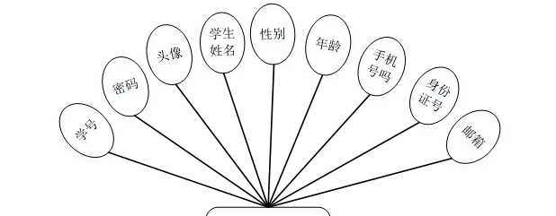

图3-3学生实体属性图

在线交流实体属性图如下所示：

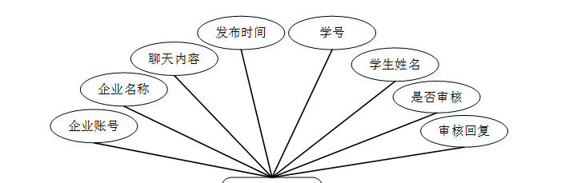

图3-4在线交流实体属性图

### 网站功能模块

校园招聘信息网站，用户进入到网站首页，可以查看首页、招聘信息、个人中心、后台管理等内容进行操作，如图4-1所示。

图4-1网站首页界面图

招聘信息；在招聘信息页面中可以查看岗位名称、职位类别、招聘认输、工资待遇、上班时间、学历要求、年龄要求、岗位简介、发布时间、企业账号、企业名称、联系人、联系电话、企业地址等内容，并进行收藏等操作；如图4-2所示。

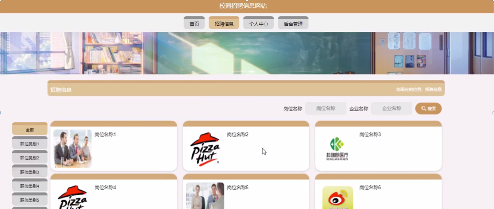

图4-2招聘信息界面图

学生注册；在学生注册页面中输入用户名、密码、学生姓名、手机号码、邮箱、身份证等内容进行学生注册操作；如图4-3所示。

图4-3学生注册界面图

### 4.2 管理员功能模块

管理员登录，通过填写注册时输入的用户名、密码、选择角色等信息进行登录操作，如图4-4所示。

图4-4管理员登录界面图

管理员登录进入校园招聘信息网站可以查看首页、个人中心、学生管理、企业管理、招聘信息管理、职位类别管理、应聘信息管理、系统管理等信息进行详细操作，如图4-5所示。

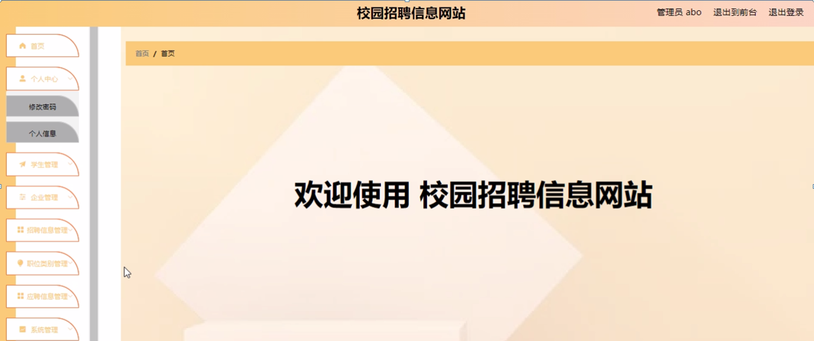

图4-5管理员功能界面图

学生管理；在学生管理页面中可以对用学号、学生姓名、性别、头像、手机、邮箱、身份证等内容进行详情，修改和删除等操作；如图4-6所示。

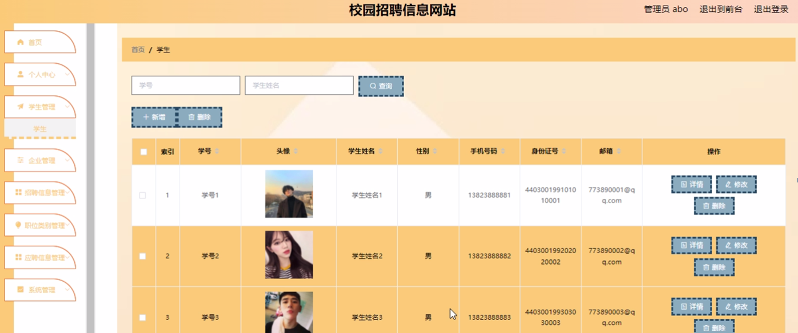

图4-6学生管理界面图

企业管理；在企业管理页面中可以对企业账号、企业名称、图片、联系人、联系电话、企业邮箱、企业地址等内容进行详情，修改和删除等操作；如图4-7所示。

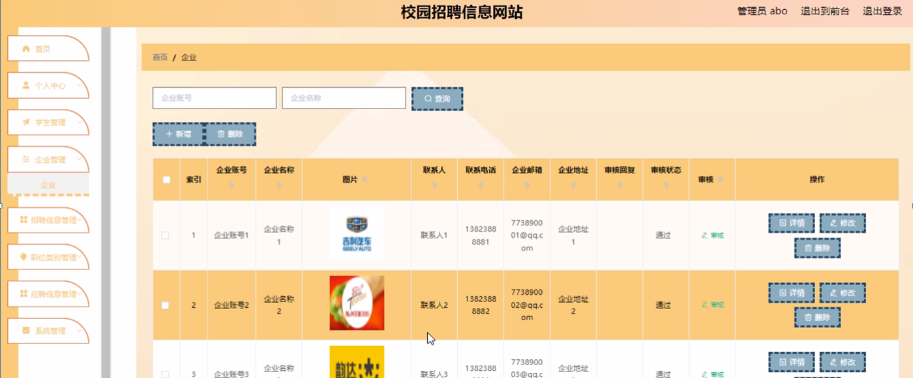

图4-7企业管理界面图

职位类别管理；在职位类别管理页面中可以新增记录，也可对职位类别进行详情，修改，和删除等操作；如图4-8所示。

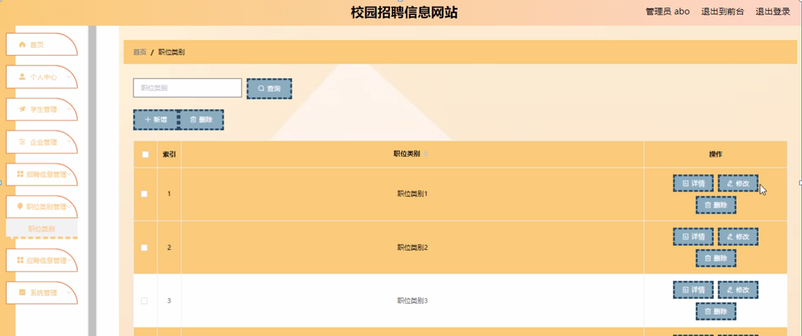

图4-8职位类别管理界面图

### 4.3 企业功能模块

企业登录校园招聘信息网站后台可以查看首页、个人中心、招聘信息管理、应聘信息管理、在线交流管理等内容，并进行详细操作，如图4-9所示。

图4-9企业功能界面图

招聘信息管理；在招聘信息管理页面中可以对岗位名称、图片、职位类别、招聘人数、工资待遇、上班时间、学历要求、年龄要求、发布时间、企业账号、企业名称、联系人、联系电话、企业地址等内容，进行详情，修改和删除等操作；如图4-10所示。

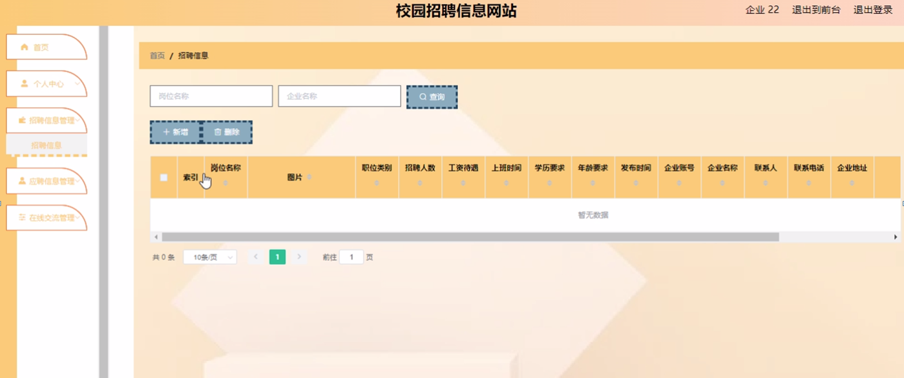

图4-10招聘信息管理界面图

### 4.4学生功能模块

学生登录校园招聘信息网站后台可以查看首页、个人中心、应聘信息管理、在线交流管理、我的收藏管理等内容，并进行详细操作，如图4-11所示。

图4-11学生功能界面图

应聘信息管理；在应聘信息管理页面中可以对岗位名称、职位类别、工资待遇、上班时间、学历要求、年龄要求、企业账号、企业名称、简历、求职时间、备注、学号、学生姓名等内容进行详情操作；如图4-12所示。

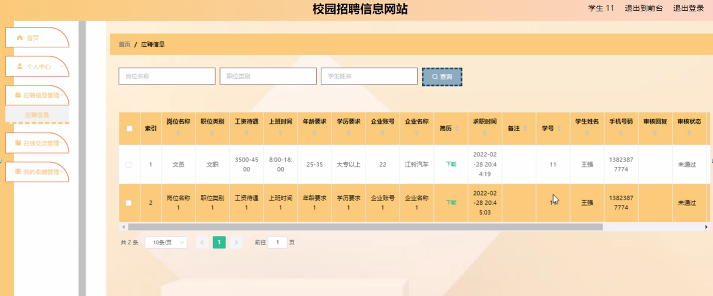

图4-12应聘信息管理界面图

#### **JAVA** **毕设帮助，指导，源码分享，调试部署**

