ssm+Vue计算机毕业设计校园招聘管理系统（程序+LW文档）

**项目运行**

**环境配置：**

**Jdk1.8 + Tomcat7.0 + Mysql + HBuilderX** **（Webstorm也行）+ Eclispe（IntelliJ
IDEA,Eclispe,MyEclispe,Sts都支持）。**

**项目技术：**

**SSM + mybatis + Maven + Vue** **等等组成，B/S模式 + Maven管理等等。**

**环境需要**

**1.** **运行环境：最好是java jdk 1.8，我们在这个平台上运行的。其他版本理论上也可以。**

**2.IDE** **环境：IDEA，Eclipse,Myeclipse都可以。推荐IDEA;**

**3.tomcat** **环境：Tomcat 7.x,8.x,9.x版本均可**

**4.** **硬件环境：windows 7/8/10 1G内存以上；或者 Mac OS；**

**5.** **是否Maven项目: 否；查看源码目录中是否包含pom.xml；若包含，则为maven项目，否则为非maven项目**

**6.** **数据库：MySql 5.7/8.0等版本均可；**

**毕设帮助，指导，本源码分享，调试部署** **(** **见文末** **)**

### 功能结构

为了更好的去理清本系统整体思路，对该系统以结构图的形式表达出来，设计实现该校园招聘管理系统的功能结构图如下所示：

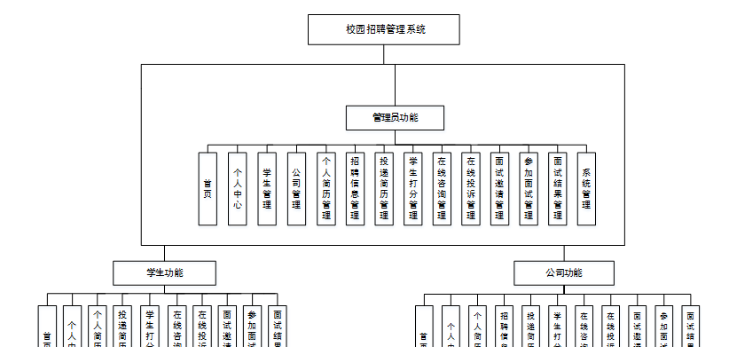

图4-1 系统总体结构图

### 4.2 数据库设计

####  4.2.1 数据库E/R图

ER图是由实体及其关系构成的图，通过E/R图可以清楚地描述系统涉及到的实体之间的相互关系。在系统中对一些主要的几个关键实体如下图：

(1) 学生信息E/R图如下所示：

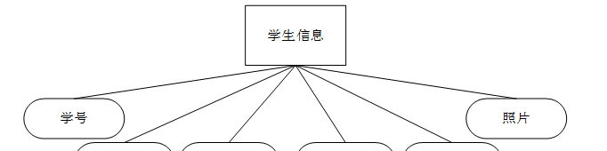

图4-2学生信息E/R图

(2) 公司信息E/R图如下所示：

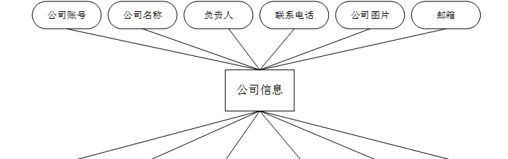

图4-3公司信息E/R图

(3)招聘信息E/R图如下所示：

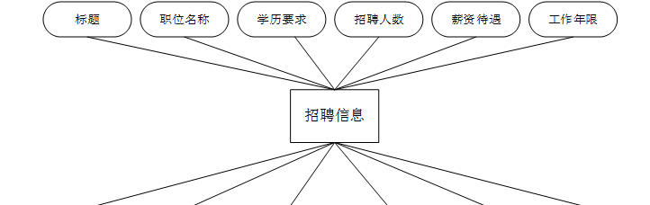

图4-4招聘信息E/R图

(4) 个人简历信息E/R图如下所示：

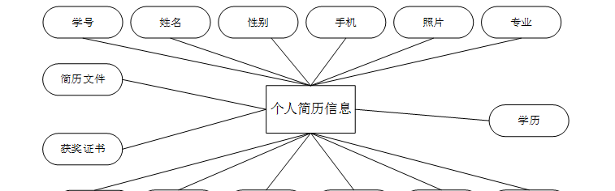

图4-5个人简历信息E/R图

**管理员功能模块**

管理员登录，管理员通过登录页面输入用户名，密码，角色等信息即可进行系统登录，如图5-1所示。

图5-1管理员登录界面图

管理员登录进入校园招聘管理系统可以查看首页、个人中心、学生管理、公司管理、个人简历管理、招聘信息管理、投递简历管理、学生打分管理、在线咨询管理、在线投诉管理、面试邀请管理、参加面试管理、面试结果管理、系统管理等内容，如图5-2所示。

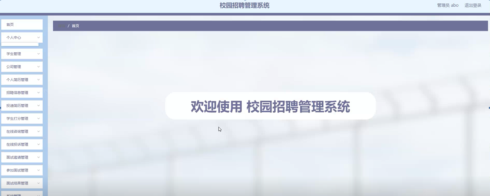

图5-2管理员功能界面图

学生管理，在学生管理页面可以查看学号、姓名、年龄、性别、手机、照片等信息，并可根据需要进行详情、修改、删除等操作，如图5-3所示。

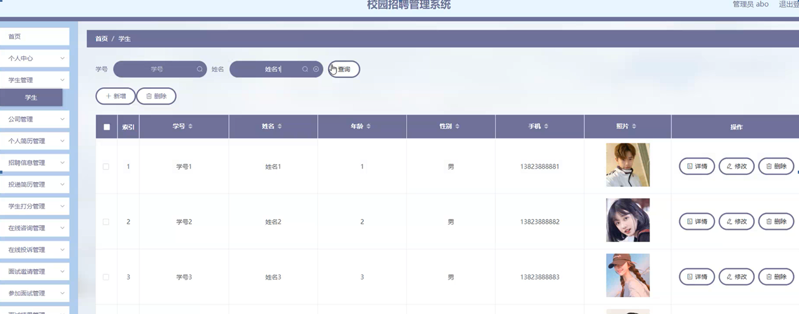

图5-3学生管理界面图

公司管理，在公司管理页面可以查看公司账号、公司名称、负责人、联系电话、公司图片、邮箱、公司类型、成立日期、公司地址、审核回复、审核状态、审核等内容，并可根据需要进行详情、修改、删除等操作，如图5-4所示。

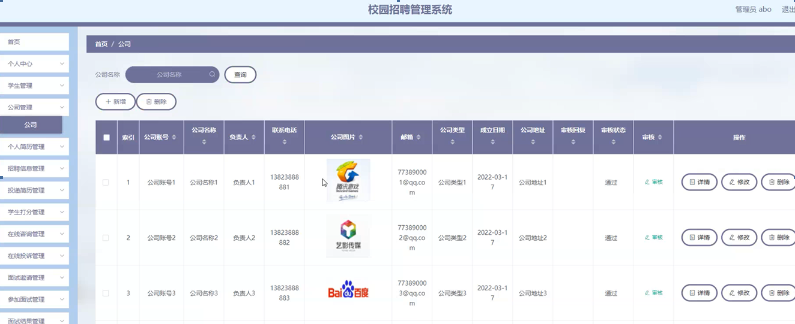

图5-4公司管理界面图

个人简历管理，在个人简历管理页面可以查看学号、姓名、性别、手机、照片、专业、学历、出生日期、求职意向、意向职位、意向城市、薪资要求、教育背景、获奖证书、简历文件等信息，并可根据需要进行详情、删除等操作，如图5-5所示。

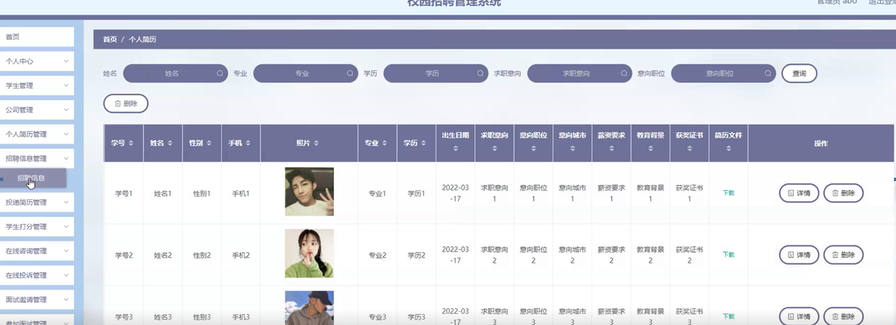

图5-5个人简历管理界面图

招聘信息管理，在招聘信息管理页面可以查看标题、职位名称、学历要求、招聘人数、薪资待遇、工作年限、图片、发布时间、公司账号、公司名称、联系电话、公司类型等信息，并可根据需要进行详情、修改、查看评论、删除等操作，如图5-6所示。

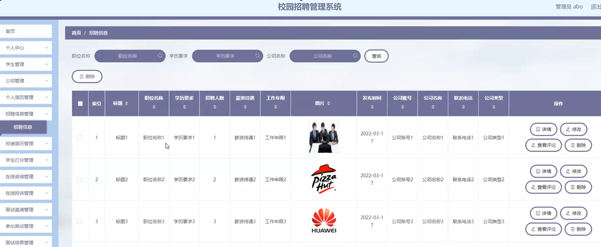

图5-6招聘信息管理界面图

投递简历管理，在投递简历管理页面可以查看学号、姓名、性别、手机、照片、专业、学历、出生日期、简历文件、求职意向、意向职位、意向城市、薪资要求、教育背景、获奖证书、毕业学校、公司账号、公司名称等信息，并可根据需要进行详情、修改、删除等操作，如图5-7所示。

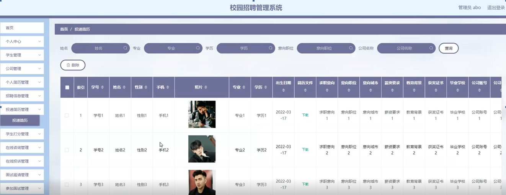

图5-7投递简历管理界面图

学生打分管理，在学生打分管理页面可以查看标题、打分、打分时间、公司账号、公司名称、学号、姓名等信息，并可根据需要进行详情、删除等操作，如图5-8所示。

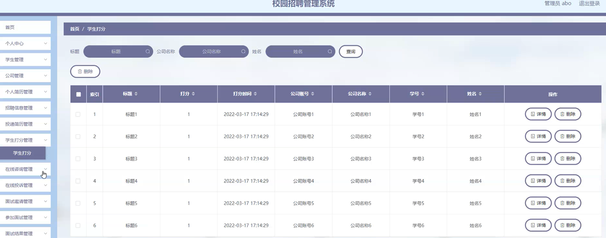

图5-8学生打分管理界面图

在线咨询管理，在在线咨询管理页面可以查看标题、咨询时间、公司账号、公司名称、学号、姓名、审核回复、审核状态等信息，并可根据需要进行详情、删除等操作，如图5-9所示。

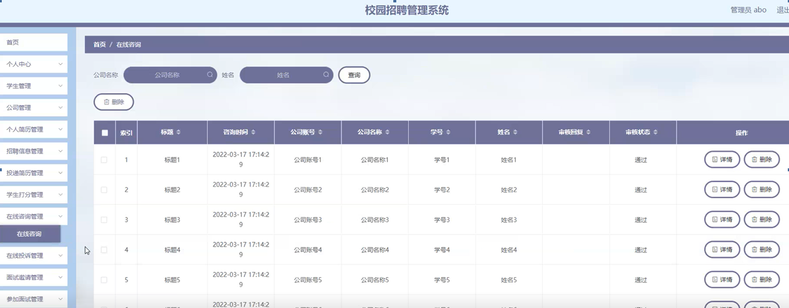

图5-9在线咨询管理界面图

在线投诉管理，在在线投诉管理页面可以查看标题、投诉时间、公司账号、公司名称、学号、姓名、审核回复、审核状态等信息，并可根据需要进行详情、删除等操作，如图5-10所示。

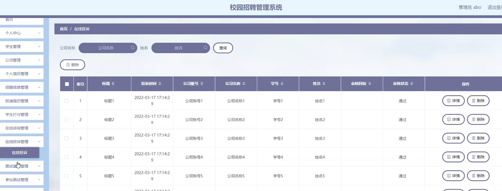

图5-10在线投诉管理界面图

**5.2** **学生功能模块**

点击后台管理成功跳转到校园招聘管理系统可以查看首页、个人中心、个人简历管理、投递简历管理、学生打分管理、在线咨询管理、在线投诉管理、面试邀请管理、参加面试管理、面试结果管理等内容，如图5-11所示。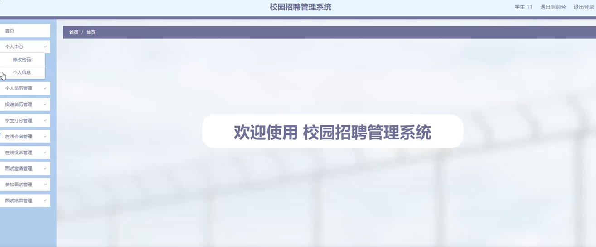

图5-11学生功能界面图

个人简历管理，在个人简历管理页面可以查看学号、姓名、性别、手机、照片、专业、学历、出生日期、求职意向、意向职位、意向城市、薪资要求、教育背景、获奖证书、简历文件等内容，并可根据需要对个人简历管理进行详情、修改、删除等操作，如图5-12所示。

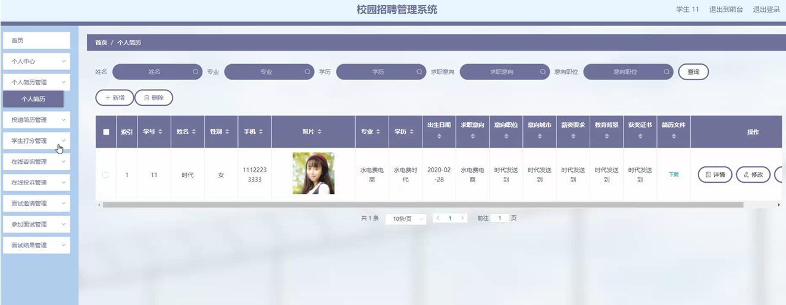

图5-12个人简历管理界面图

#### **JAVA** **毕设帮助，指导，源码分享，调试部署**

