ssm+Vue计算机毕业设计游乐园娱乐项目管理系统（程序+LW文档）

**项目运行**

**环境配置：**

**Jdk1.8 + Tomcat7.0 + Mysql + HBuilderX** **（Webstorm也行）+ Eclispe（IntelliJ
IDEA,Eclispe,MyEclispe,Sts都支持）。**

**项目技术：**

**SSM + mybatis + Maven + Vue** **等等组成，B/S模式 + Maven管理等等。**

**环境需要**

**1.** **运行环境：最好是java jdk 1.8，我们在这个平台上运行的。其他版本理论上也可以。**

**2.IDE** **环境：IDEA，Eclipse,Myeclipse都可以。推荐IDEA;**

**3.tomcat** **环境：Tomcat 7.x,8.x,9.x版本均可**

**4.** **硬件环境：windows 7/8/10 1G内存以上；或者 Mac OS；**

**5.** **是否Maven项目: 否；查看源码目录中是否包含pom.xml；若包含，则为maven项目，否则为非maven项目**

**6.** **数据库：MySql 5.7/8.0等版本均可；**

**毕设帮助，指导，本源码分享，调试部署** **(** **见文末** **)**

### 功能结构

为了更好的去理清本系统整体思路，对该系统以结构图的形式表达出来，设计实现该游乐园娱乐项目管理系统的功能结构图如下所示：

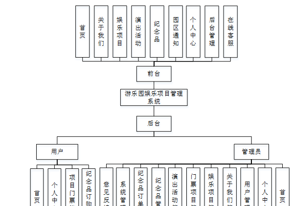

图4-1 系统总体结构图

### 4.2数据库设计

#### 4.2.1数据库E/R图

ER图是由实体及其关系构成的图，通过E/R图可以清楚地描述系统涉及到的实体之间的相互关系。在系统中对一些主要的几个关键实体如下图：

(1) 用户注册E/R图如下所示：

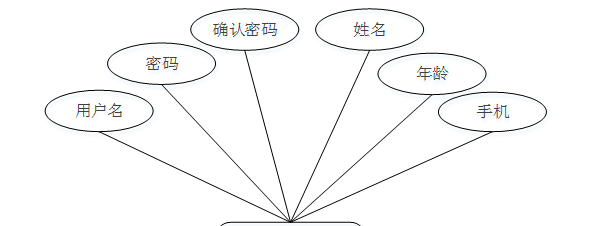

图4-2用户注册E/R图

(2)娱乐项目E/R图如下所示：

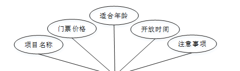

图4-3娱乐项目E/R图

(3)演出活动E/R图如下所示：

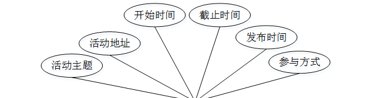

图4-4演出活动E/R图

### 系统功能模块

游乐园娱乐项目管理系统，在系统首页可以查看首页，关于我们，娱乐项目，演出活动，纪念品，园区通知，个人中心，后台管理，在线客服等内容，并进行详细操作，如图5-1所示。

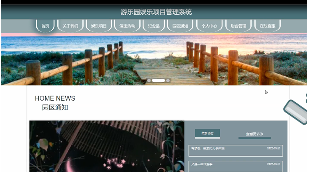

图5-1系统首页界面图

用户注册，在用户注册页面通过填写用户名，姓名，密码，确认密码，年龄，手机号等信息进行注册操作，如图5-2所示。

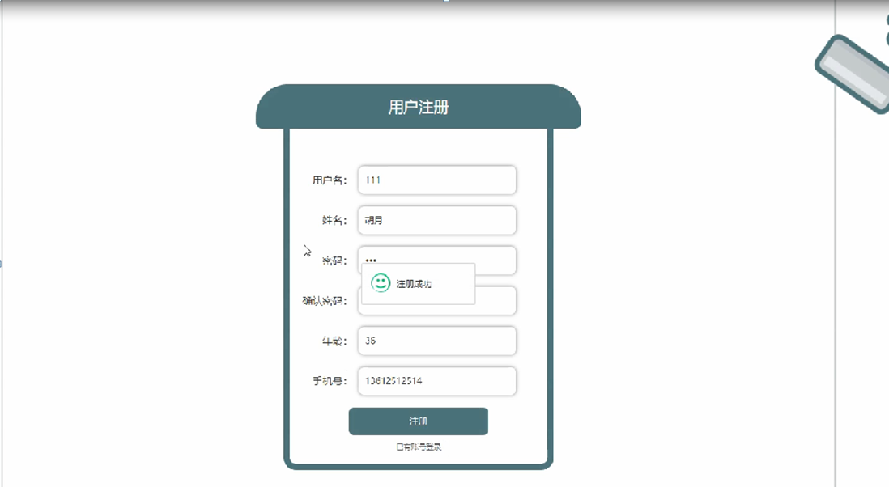

图5-2用户注册界面图

娱乐项目，在娱乐项目页面可以查看项目名称，门票价格，适合年龄，开放时间，注意事项等内容进行立即购票，评论，点我收藏等操作，如图5-3所示。

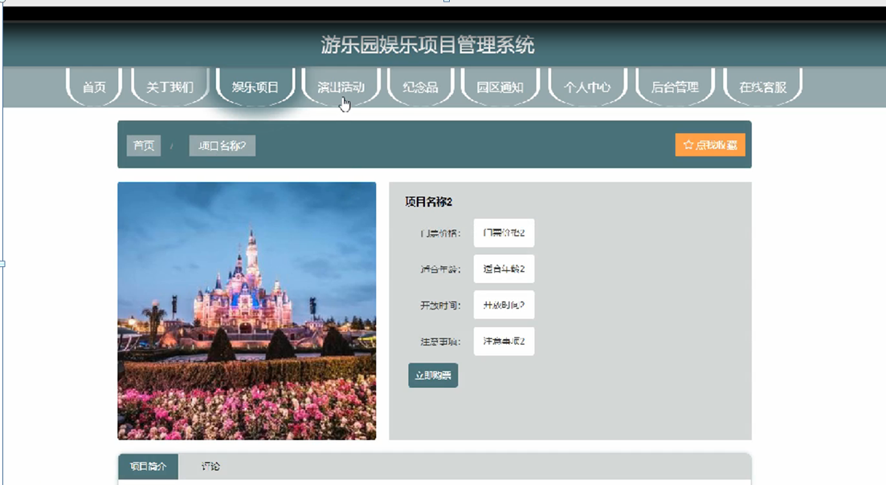

图5-3娱乐项目界面图

个人中心，在个人中心页面通过填写用用户名，姓名，密码，性别，年龄等内容进行更新信息或退出等操作，也可以对我的收藏进行相应的操作，如图5-4所示。

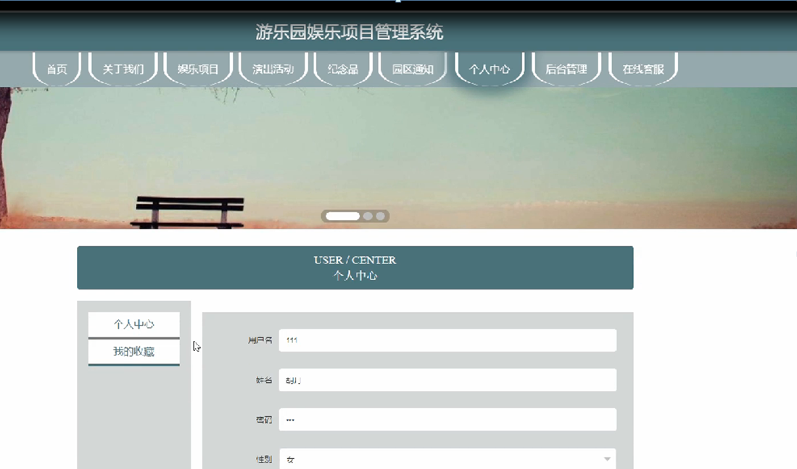

图5-4个人中心界面图

演出活动，在演出活动页面可以查看活动主题，活动地址，开始时间，截止时间，发布时间，参与方式等内容，如图5-5所示。

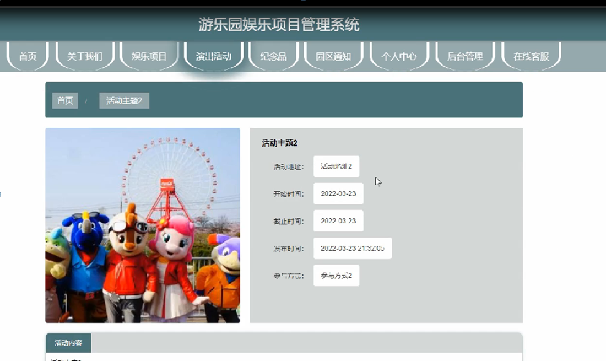

图5-5演出活动界面图

### 5.2后台功能模块

后台登录，进入系统前在登录页面根据要求填写用户名和密码，选择角色等信息，点击登录进行登录操作，如图5-6所示。

图5-6后台登录界面图

#### 5.2.1管理员功能

管理员登录系统后，可以对首页，个人中心，用户管理，关于我们管理，娱乐项目管理，项目门票管理，演出活动管理，纪念品管理，纪念品订单管理，系统管理等功能进行相应的操作，如图5-7所示。

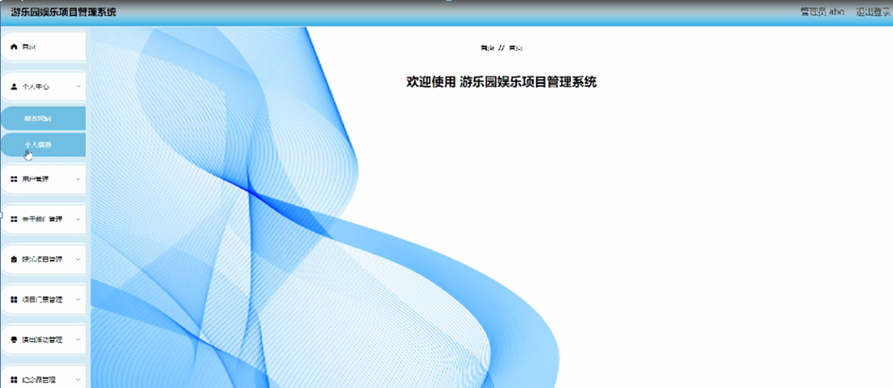

图5-7管理员功能界面图

用户管理，在用户管理页面可以对索引，用户名，姓名，性别，年龄，手机号等内容进行详情、修改或删除等操作，如图5-8所示。

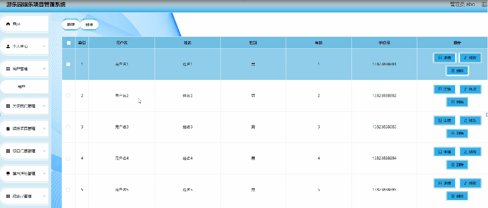

图5-8用户管理界面图

娱乐项目管理，在娱乐项目管理页面可以对索引，项目名称，门票价格，适合年龄，封面，开放时间等内容进行详情，修改，查看评论和删除等操作，如图5-9所示。

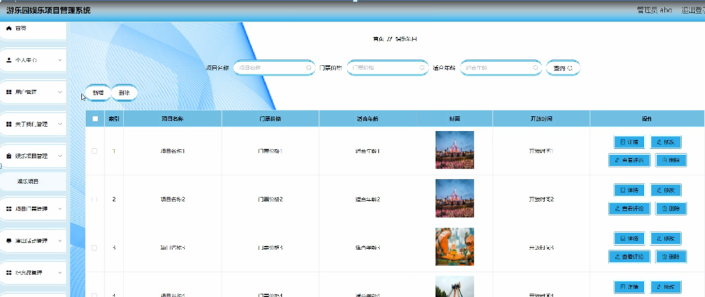

图5-9娱乐项目管理界面图

项目门票管理，在项目门票管理页面可以对索引，订单编号，项目名称，门票价格，数量，总金额，用户名，姓名，手机号，购买时间，是否支付等内容进行详情、修改或删除等操作，如图5-10所示。

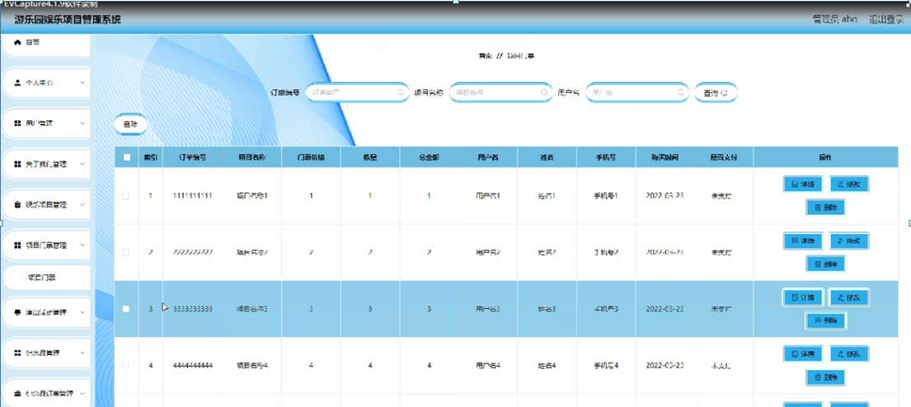

图5-10项目门票管理界面图

演出活动管理，在演出活动管理页面可以对 索引，活动主题，活动地址，活动封面，开始时间，截止时间，发布时间等内容进行详情，修改和删除等操作，如图5-11所示。

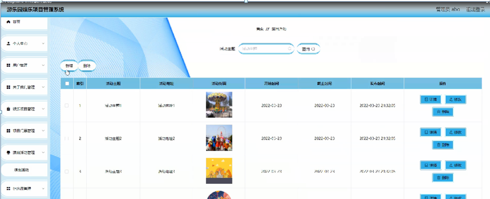

图5-11演出活动管理界面图

纪念品管理，在纪念品管理页面可以对索引，礼品编号，礼品名称，礼品图片，数量，价格等内容进行详情，修改和删除等操作，如图5-12所示。

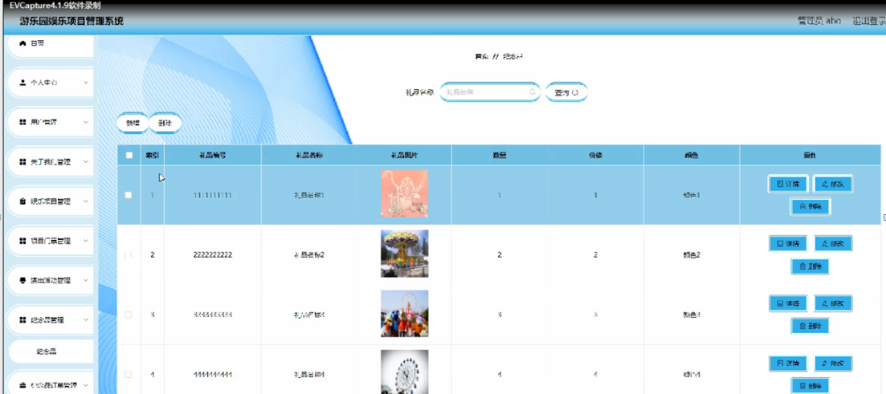

图5-12纪念品管理界面图

**JAVA** **毕设帮助，指导，源码分享，调试部署**

