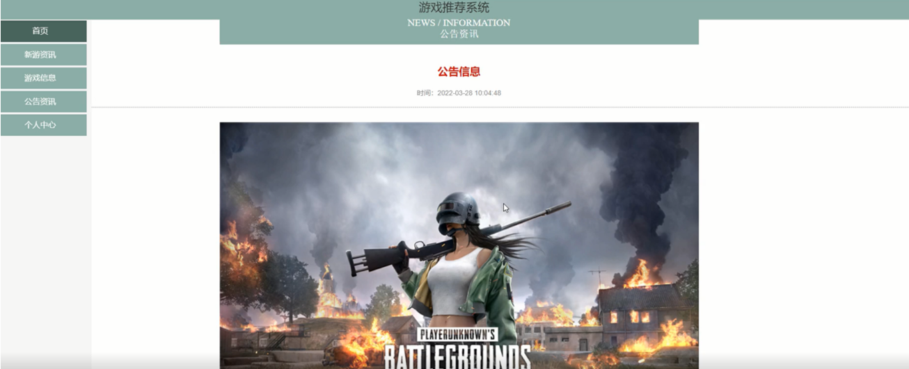

ssm+Vue计算机毕业设计游戏推荐系统（程序+LW文档）

**项目运行**

**环境配置：**

**Jdk1.8 + Tomcat7.0 + Mysql + HBuilderX** **（Webstorm也行）+ Eclispe（IntelliJ
IDEA,Eclispe,MyEclispe,Sts都支持）。**

**项目技术：**

**SSM + mybatis + Maven + Vue** **等等组成，B/S模式 + Maven管理等等。**

**环境需要**

**1.** **运行环境：最好是java jdk 1.8，我们在这个平台上运行的。其他版本理论上也可以。**

**2.IDE** **环境：IDEA，Eclipse,Myeclipse都可以。推荐IDEA;**

**3.tomcat** **环境：Tomcat 7.x,8.x,9.x版本均可**

**4.** **硬件环境：windows 7/8/10 1G内存以上；或者 Mac OS；**

**5.** **是否Maven项目: 否；查看源码目录中是否包含pom.xml；若包含，则为maven项目，否则为非maven项目**

**6.** **数据库：MySql 5.7/8.0等版本均可；**

**毕设帮助，指导，本源码分享，调试部署** **(** **见文末** **)**

总体设计

根据游戏推荐系统的功能需求，进行系统设计。

前台功能：用户进入系统可以实现首页、新游资讯、游戏信息、公告资讯、个人中心等进行操作；

后台主要是管理员，管理员功能包括首页、个人中心、用户管理、新游资讯管理、游戏分类管理、游戏类型管理、游戏信息管理、系统管理等；

系统对这些功能进行整合，产生的功能结构图如下：

图3-1 系统总体结构图

3.5 数据库设计与实现

在每一个系统中数据库有着非常重要的作用，数据库的设计得好将会增加系统的效率以及系统各逻辑功能的实现。所以数据库的设计我们要从系统的实际需要出发，才能使其更为完美的符合系统功能的实现。

#### **3.4.1** **数据库概念结构设计**

数据库的E-R图反映了实体、实体的属性和实体之间的联系。下面是各个实体以及实体的属性。

管理员信息实体属性图如下所示：

图3-2 管理员信息实体属性图

用户信息实体属性图如下所示：

图3-3用户信息实体属性图

新游资讯信息实体属性图如下所示：

图3-4新游资讯信息实体属性图

游戏信息实体属性图如下所示：

图3-5游戏信息实体属性图

### 用户前台功能模块

游戏推荐系统，用户进入前台网站查看首页、新游资讯、游戏信息、公告资讯、个人中心等内容进行操作，如图4-1所示。

图4-1网站首页界面图

用户注册；在用户注册页面中输入用户名、密码、确认密码、姓名、邮箱、手机等内容进行注册操作；如图4-2所示。

图4-2用户注册界面图

用户登录；在登录页面中输入账号、密码等内容进行登录操作；如图4-3所示。

图4-3用户登录界面图

在个人中心页面中输入用户名、密码、姓名、性别、头像、邮箱、手机等内容进行更新信息，并且还可以查看我的收藏，进行详细操作，如图4-4 4-5所示。

图4-4个人中心界面图

图4-5我的收藏界面图

游戏信息；在游戏信息页面中可以查看游戏名称、游戏标签、游戏分类、游戏类型、游戏封面、游戏公司、游戏宣传、下载链接、发布日期等内容，如有需要可以进行收藏或者评论等操作，如图4-6所示。

图4-6游戏信息界面图

新游资讯；在新游资讯页面可以查看标题、类型、游戏名称、图片、网站链接、发布时间等内容，如有需要可以进行收藏或者评论等操作，如图4-7所示。

图4-7新游资讯界面图

公告资讯；在公告资讯页面查看标题、简介、发布日期、资讯内容，如图4-8所示。

图4-8公告资讯界面图

### 4.2 管理员功能模块

管理员登录，通过登录页面输入用户名、密码、选择角色等信息进行登录操作，如图4-9所示。

图4-9管理员登录界面图

管理员登录进入游戏推荐系统可以查看首页、个人中心、用户管理、新游资讯管理、游戏分类管理、游戏类型管理、游戏信息管理、系统管理等信息进行详细操作，如图4-10所示。

图4-10管理员功能界面图

个人中心：在个人中心页面中可以修改密码、个人信息修改，如图4-11所示。

图4-11个人中心界面图

用户管理；在用户管理页面中可以查看用户名、姓名、性别、头像、邮箱、手机等内容，并进行修改和删除等操作；如图4-12所示。

图4-12用户管理界面图

#### **JAVA** **毕设帮助，指导，源码分享，调试部署**

