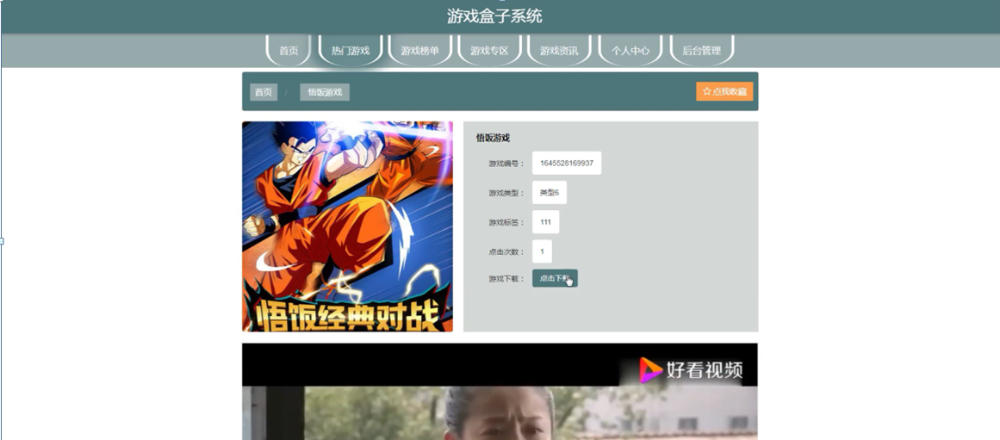

ssm+Vue计算机毕业设计游戏盒子系统（程序+LW文档）

**项目运行**

**环境配置：**

**Jdk1.8 + Tomcat7.0 + Mysql + HBuilderX** **（Webstorm也行）+ Eclispe（IntelliJ
IDEA,Eclispe,MyEclispe,Sts都支持）。**

**项目技术：**

**SSM + mybatis + Maven + Vue** **等等组成，B/S模式 + Maven管理等等。**

**环境需要**

**1.** **运行环境：最好是java jdk 1.8，我们在这个平台上运行的。其他版本理论上也可以。**

**2.IDE** **环境：IDEA，Eclipse,Myeclipse都可以。推荐IDEA;**

**3.tomcat** **环境：Tomcat 7.x,8.x,9.x版本均可**

**4.** **硬件环境：windows 7/8/10 1G内存以上；或者 Mac OS；**

**5.** **是否Maven项目: 否；查看源码目录中是否包含pom.xml；若包含，则为maven项目，否则为非maven项目**

**6.** **数据库：MySql 5.7/8.0等版本均可；**

**毕设帮助，指导，本源码分享，调试部署** **(** **见文末** **)**

### 系统结构设计

系统设计是把本系统的各项功能需求进行细化，而转换为软件系统表示的一个设计过程，在对目标系统的研究分析之后，做出整个系统平台的总体规划，进而对用例中各个对象进一步地合理精细设计。为降低整个系统的复杂度，而使其更加便于修改，提高代码的可读性，我们会将系统模块化，模块间保持相对独立，且每个模块只完成一个子功能，并且与其他模块通过简单的接口链接，即高内聚低耦合原则，而使整个系统能够拥有一个高性能的结构，这边是系统概要设计最重要的目的。在之前的需求分析的基础上，本游戏盒子系统结构，如下图4-1所示。

图4-1 系统结构功能图

### 4.2数据库设计

在查询时，应保证所有满足条件的记录都能查到。数据库记录通常在几百条以上，如有遗漏将会对客户的统计造成影响。一般操作的响应时间应该在1-2秒内。采用菜单界面，对会员比较友好。本文中将通过E-
R图来设计并展示数据的概念模型，

热门游戏实体属性图如图4-2所示。

图4-2热门游戏实体属性图

用户注册实体E-R图如图4-3所示。

图4-3用户注册实体E-R图

### 系统功能模块

游戏盒子系统，在系统首页可以详情首页，热门游戏，游戏榜单，游戏专区，游戏咨询，个人中心，后台管理等内容，并进行详细操作；如图5-1所示。

图5-1系统首页界面图

热门游戏，在热门游戏页面可以详情游戏编号，游戏类型，游戏标签，点击次数，游戏下载等内容如图5-2所示。

图5-2热门游戏界面图

个人中心，在个人中心页面通过填写用户账号，用户姓名，密码，性别，上传图片，电话号码等信息，如图5-3所示。

图5-3交流论坛界面图

用户注册，在用户注册页面通过填写用户账号，用户姓名，密码，确认密码，电话号码等信息进行注册操作，如图5-4所示。

图5-4用户注册界面图

### 5.2后台功能模块

管理员后台登录，管理员进入系统前在登录页面根据要求填写用户名和密码，选择角色等信息，点击登录进行登录操作，如图5-5所示。

图5-5后台登录界面图

#### 5.2.1管理员功能

管理员登录系统后，可以对首页，个人中心，用户管理，游戏类型管理，热门游戏管理，游戏榜单管理，游戏专区管理，系统管理等功能进行相应的操作管理，如图5-6所示。

图5-6管理员功能界面图

用户管理，在用户管理页面可以对索引，用户账号，用户姓名，性别，头像，电话号码等内容进行详情，修改，删除操作，如图5-7所示。

图5-7用户管理界面图

热门游戏管理，在热门游戏管理页面可以对索引，游戏编号
，游戏名称，图片，游戏类型，预览视频，游戏标签，游戏下载等信息进行详情，修改，查看评论和删除操作，如图5-8所示。

图5-8热门游戏管理界面图

游戏专区管理，在游戏专区管理页面可以对索引，专区编号，游戏名称，游戏类型，图片，发布时间等内容进行详情，修改，删除操作，如图5-9所示。

图5-9游戏专区管理界面图

系统管理，在游戏咨询管理页面可以对标题、图片等内容进行详情，修改和删除等操作，还可以对轮播图管理进行详细操作；如图5-10所示。

图5-10系统管理界面图

#### 5.2.2用户后台功能

用户登录进入系统后台可以对首页、个人中心等功能进行相应操作，如图5-11所示。

图5-11用户后台功能界面图

#### **JAVA** **毕设帮助，指导，源码分享，调试部署**

