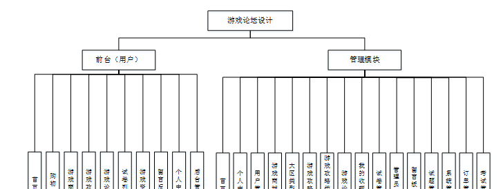
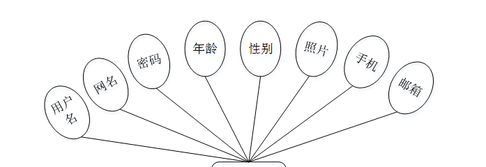
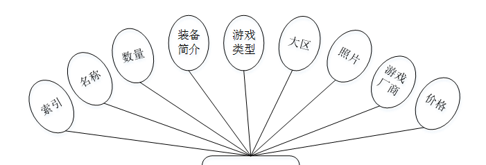
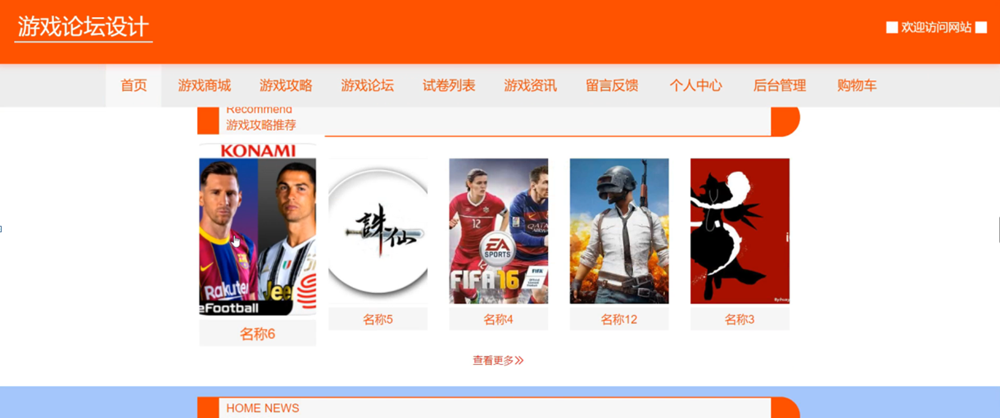
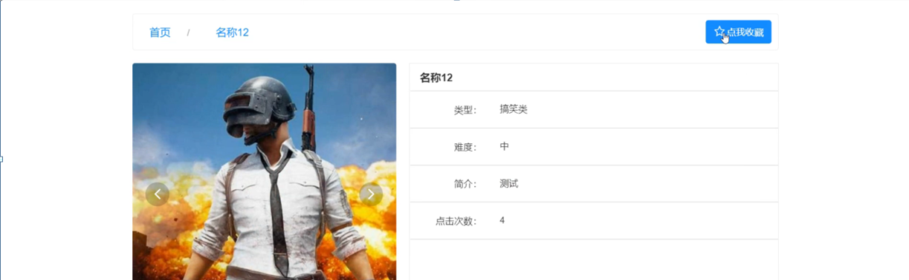
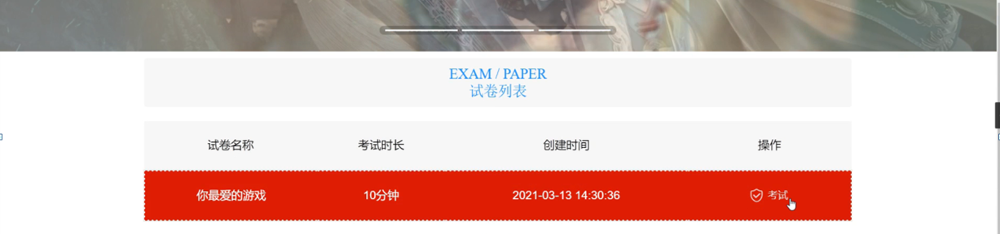
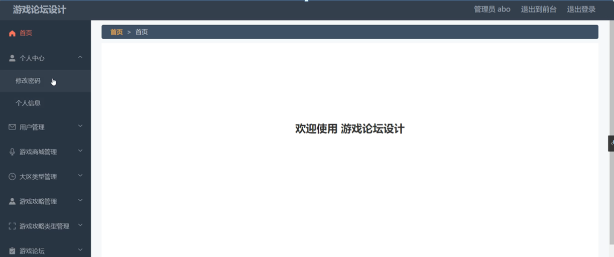
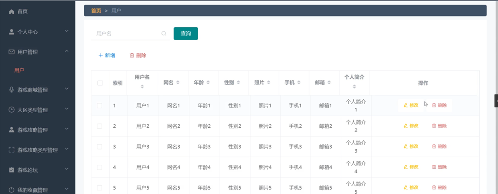
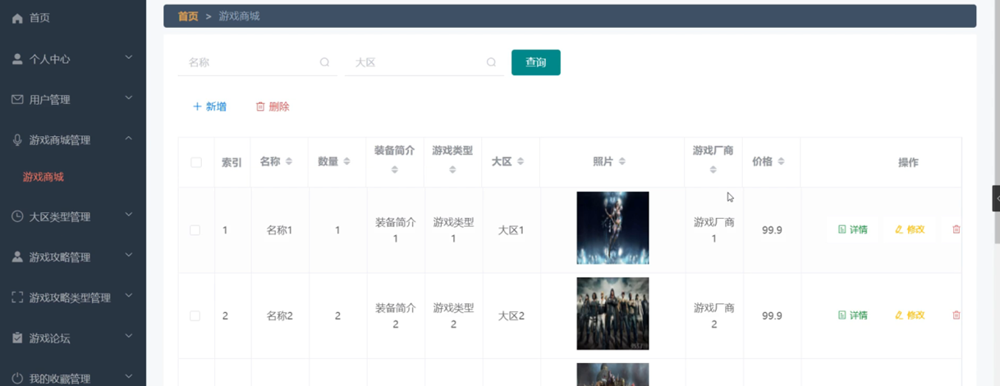

ssm+Vue计算机毕业设计游戏论坛设计（程序+LW文档）

**项目运行**

**环境配置：**

**Jdk1.8 + Tomcat7.0 + Mysql + HBuilderX** **（Webstorm也行）+ Eclispe（IntelliJ
IDEA,Eclispe,MyEclispe,Sts都支持）。**

**项目技术：**

**SSM + mybatis + Maven + Vue** **等等组成，B/S模式 + Maven管理等等。**

**环境需要**

**1.** **运行环境：最好是java jdk 1.8，我们在这个平台上运行的。其他版本理论上也可以。**

**2.IDE** **环境：IDEA，Eclipse,Myeclipse都可以。推荐IDEA;**

**3.tomcat** **环境：Tomcat 7.x,8.x,9.x版本均可**

**4.** **硬件环境：windows 7/8/10 1G内存以上；或者 Mac OS；**

**5.** **是否Maven项目: 否；查看源码目录中是否包含pom.xml；若包含，则为maven项目，否则为非maven项目**

**6.** **数据库：MySql 5.7/8.0等版本均可；**

**毕设帮助，指导，本源码分享，调试部署** **(** **见文末** **)**

### 系统结构设计

系统架构图属于系统设计阶段，系统架构图只是这个阶段一个产物，系统的总体架构决定了整个系统的模式，是系统的基础。游戏论坛设计的整体结构设计如图4-2所示。

图4-2 系统结构图

### 4.3数据库设计

数据库是计算机信息系统的基础。目前，电脑系统的关键与核心部分就是数据库。数据库开发的优劣对整个系统的质量和速度有着直接影响。

#### 4.3.1 数据库设计原则

数据库的概念结构设计采用实体—联系（E-R）模型设计方法。E-R模型法的组成元素有：实体、属性、联系，E-R模型用E-
R图表示，是提示用户工作环境中所涉及的事物，属性则是对实体特性的描述。在系统设计当中数据库起着决定性的因素。下面设计出这几个关键实体的实体—关系图。

#### 4.3.2 数据库实体

数据模型中的实体（Entity），也称为实例，对应现实世界中可区别于其他对象的“事件”或“事物”。例如，公司中的每个员工，家里中的每个家具。

本系统的E-R图如下图所示：

1、用户注册实体图如图4-3所示：

图4-3用户注册实体图

2、游戏商城管理实体图如图4-4所示：

图4-4游戏商城管理实体图

### 前台

游戏论坛设计，在系统首页可以查看首页、游戏商城、游戏攻略、游戏论坛、试卷列表、游戏资讯、留言反馈、个人中心、后台管理、购物车等内容，如图5-1所示。

图5-1系统首页界面图

用户注册，在用户注册页面通过填写用户名、网名、密码、年龄、性别、照片、手机、邮箱等信息完成用户注册，如图5-2所示。

图5-2用户注册界面图

游戏商城，在游戏商城页面可以查看名称、数量、装备简介、游戏类型、大区、照片、游戏厂商、价格等信息，进行添加到购物车、立即购买，如图5-3所示。

图5-3游戏商城界面图

游戏攻略，在游戏攻略页面可以查看名称、类型、照片、难度、视频、简介、点击次数等信息，如图5-4所示。

图5-4游戏攻略界面图

游戏论坛，在游戏论坛页面通过填写标题、类型、内容等信息进行发布帖子，如图5-5所示。

图5-5游戏论坛界面图

试卷列表，在试卷列表页面可以查看试卷名称、考试时长、创建时间等信息，进行考试操作，如图5-6所示。

图5-6试卷列表界面图

留言反馈，在留言反馈页面通过输入留言内容并立即提交，如图5-7所示。

图5-7留言反馈界面图

个人中心，在个人中心页面通过填写用户名、网名、密码、年龄、性别、手机、邮箱、个人简介、余额等信息进行更新信息，根据需要对我的发布、我的订单、我的地址、考试记录、错题本、我的收藏进行相对应操作，如图5-8所示。

图5-8个人中心界面图

### 5.2管理员功能模块

管理员登录，通过填写注册时输入的用户名、密码、角色进行登录，如图5-9所示。

图5-9管理员登录界面图

管理员登录进入游戏论坛设计可以查看首页、个人中心、用户管理、游戏商城管理、大区类型管理、游戏攻略管理、游戏攻略类型管理、游戏论坛、我的收藏管理、试卷管理、管理员管理、留言板管理、试题管理、系统管理、订单管理、考试管理等信息，如图5-10所示。

图5-10管理员功能界面图

用户管理，在用户管理页面中可以查看索引、用户名、网名、年龄、性别、照片、手机、邮箱、个人简介等信息，并可根据需要进行修改或删除等操作，如图5-11所示。

图5-11用户管理界面图

游戏商城管理，在游戏商城管理页面中可以查看索引、名称、数量、装备简介、游戏类型、大区、照片、游戏厂商、价格等信息，并可根据需要进行修改或删除等操作，如图5-12所示。

图5-12游戏商城管理界面图

#### **JAVA** **毕设帮助，指导，源码分享，调试部署**

