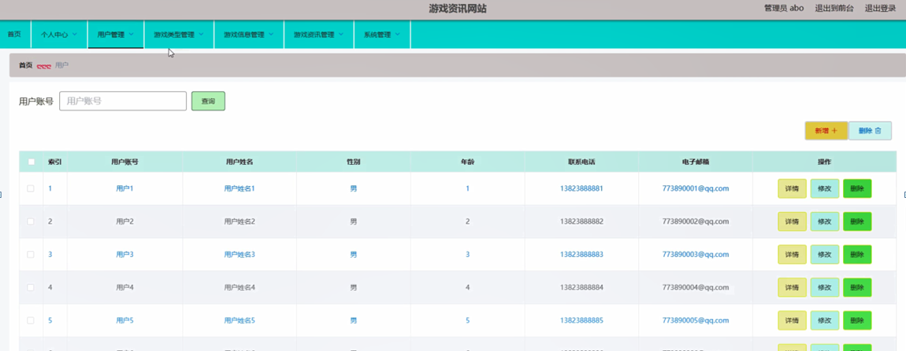

ssm+Vue计算机毕业设计游戏资讯网站（程序+LW文档）

**项目运行**

**环境配置：**

**Jdk1.8 + Tomcat7.0 + Mysql + HBuilderX** **（Webstorm也行）+ Eclispe（IntelliJ
IDEA,Eclispe,MyEclispe,Sts都支持）。**

**项目技术：**

**SSM + mybatis + Maven + Vue** **等等组成，B/S模式 + Maven管理等等。**

**环境需要**

**1.** **运行环境：最好是java jdk 1.8，我们在这个平台上运行的。其他版本理论上也可以。**

**2.IDE** **环境：IDEA，Eclipse,Myeclipse都可以。推荐IDEA;**

**3.tomcat** **环境：Tomcat 7.x,8.x,9.x版本均可**

**4.** **硬件环境：windows 7/8/10 1G内存以上；或者 Mac OS；**

**5.** **是否Maven项目: 否；查看源码目录中是否包含pom.xml；若包含，则为maven项目，否则为非maven项目**

**6.** **数据库：MySql 5.7/8.0等版本均可；**

**毕设帮助，指导，本源码分享，调试部署** **(** **见文末** **)**

### 系统体系结构

游戏资讯网站的结构图4-1所示：

图4-1 系统结构

登录系统结构图，如图4-2所示：

图4-2 登录结构图

管理员结构图，如图4-3所示。

图4-3 管理员结构图

### 数据库设计原则

学习编程，我们都知道数据库设计是基于需要设计的系统功能，我们需要建立一个数据库关系模型，用于存储数据信息，这样当我们在程序中时，就没有必要为程序页面添加数据，从而提高系统的效率。数据库存储了很多信息，可以说是信息管理系统的核心和基础，数据库还提供了添加、删除、修改和检查，使系统能够快速找到自己想要的信息，而不是在程序代码中找到。数据库中信息表的每个部分根据一定的关系精确地组合，排列和组合成数据表。

通过游戏资讯网站的功能进行规划分成几个实体信息，实体信息将通过ER图进行说明，本系统的主要实体图如下：

管理员信息属性图如图4-5所示。

图4-5 管理员信息实体属性图

用户管理实体属性图如图4-6所示。

图4-6用户管理属性图

游戏信息管理实体属性图如图4-7所示。

图4-7游戏信息管理实体属性图

游戏资讯管理实体属性图如图4-8所示。

图4-8游戏资讯管理实体属性图

### 系统功能模块

游戏资讯网站，在网站首页可以查看首页、游戏信息、游戏资讯、系统公告、个人中心、后台管理等内容进行详细操作，如图5-1所示。

图5-1网站首页界面图

游戏信息，在游戏信息页面可以查看游戏名称、游戏类型、图片、游戏商、下载地址、游戏评分、点击次数、视频、游戏详情等详细内容进行评论或收藏，如图5-2所示。

图5-2游戏信息界面图

游戏资讯，在游戏资讯页面可以查看游戏名称、游戏类型、图片、用户姓名、用户账号、发布时间、资讯正文等详细内容进行评论或收藏，如图5-3所示。

图5-3游戏资讯界面图

用户注册，在用户注册页面通过填写用户账号、用户姓名、密码、年龄、联系电话、电子邮箱等信息完成用户注册，如图5-4所示。在个人中心页面通过填写用户账号、用户姓名、密码、性别、年龄、联系电话、电子邮箱等内容进行更新操作，还可以根据需要对我的收藏进行详细操作；如图5-5所示。

图5-4用户注册界面图

图5-5个人中心界面图

### 5.2管理员功能模块

管理员登录，通过填写注册时输入的用户名、密码、选择角色进行登录，如图5-6所示。

图5-6管理员登录界面图

管理员登录进入游戏资讯网站可以查看首页、个人中心、用户管理、游戏类型管理、游戏信息管理、游戏资讯管理、系统管理等信息进行详细操作，如图5-7所示。

图5-7管理员功能界面图

用户管理，在用户管理页面中可以查看索引、用户账号、用户姓名、性别、年龄、联系电话、电子邮箱等信息，并可根据需要进行详情，修改或删除等操作，如图5-8所示。

图5-8用户管理界面图

游戏类型管理，在游戏类型管理页面中可以查看索引、游戏类型等信息，并可根据需要进行详情，修改或删除等详细操作，如图5-9所示。

图5-9游戏类型管理界面图

游戏信息管理，在游戏信息管理页面中可以查看索引、游戏名称、游戏类型、游戏图片、视频、游戏商、下载地址、游戏评分等内容，并且根据需要进行详情、修改、查看评论或删除等详细操作，如图5-10所示。

图5-10游戏信息管理界面图

游戏资讯管理，在游戏资讯管理页面中可以查看索引、资讯题目、游戏名称、游戏类型、用户姓名、用户账号、封面图片、发布时间等内容，并且根据需要进行详情、查看评论或删除等详细操作，如图5-11所示。

图5-11游戏资讯管理界面图

系统管理，在系统公告页面中可以查看索引、标题、图片等内容，并且根据需要进行详情、修改或删除等详细操作，还可以对轮播图管理进行详细操作；如图5-12所示。

图5-12系统管理界面图

**JAVA** **毕设帮助，指导，源码分享，调试部署**

