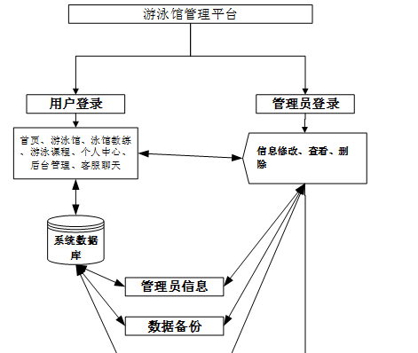

ssm+Vue计算机毕业设计游泳馆管理平台（程序+LW文档）

**项目运行**

**环境配置：**

**Jdk1.8 + Tomcat7.0 + Mysql + HBuilderX（Webstorm也行）+ Eclispe（IntelliJ
IDEA,Eclispe,MyEclispe,Sts都支持）。**

**项目技术：**

**SSM + mybatis + Maven + Vue 等等组成，B/S模式 + Maven管理等等。**

**环境需要**

**1.运行环境：最好是java jdk 1.8，我们在这个平台上运行的。其他版本理论上也可以。**

**2.IDE环境：IDEA，Eclipse,Myeclipse都可以。推荐IDEA;**

**3.tomcat环境：Tomcat 7.x,8.x,9.x版本均可**

**4.硬件环境：windows 7/8/10 1G内存以上；或者 Mac OS；**

**5.是否Maven项目: 否；查看源码目录中是否包含pom.xml；若包含，则为maven项目，否则为非maven项目**

**6.数据库：MySql 5.7/8.0等版本均可；**

**毕设帮助，指导，本源码分享，调试部署(** **见文末)**

### 系统体系结构

游泳馆管理平台开发系统的结构图4-1所示：

图4-1 系统结构

模块包括首页、个人中心、用户管理、游泳馆管理、学院信息管理、泳馆教练管理、订单信息管理、游泳课程管理、泳馆预约管理、课表信息管理、系统管理等进行相应的操作。

登录系统结构图，如图4-2所示：

图4-2 登录结构图

这些功能可以充分满足游泳馆管理平台的需求。此系统功能较为全面如下图系统功能结构如图4-3所示。

图4-3系统功能结构图

### 4.2 数据库设计原则

每个数据库的应用它们都是和区分开的，当运行到一定的程序当中，它就会与自己相关的协议与客户端进行通讯。那么这个系统就会对使这些数据进行连接。当我们选择哪个桥段的时候，接下来就会简单的叙述这个数据库是如何来创建的。当点击完成按钮的时候就会自动在对话框内弹出数据源的名称，在进行点击下一步即可，直接在输入相对应的身份验证和登录密码。

游泳馆管理平台的数据流程：

图4-4 系统数据流程图

学院信息管理实体E-R图，如图4-5所示。

图4-5学院信息管理E-R图

游泳课程管理E-R图，如图4-6所示。

图4-6游泳课程管理E-R图

### 用户功能模块

通过网站页面可以查看首页、游泳馆、泳馆教练、游泳课程、个人中心、后台管理、客服聊天等信息，如图5-1所示。通过用户注册可以填写用户账号、密码、用户姓名、年龄、用户手机等详细信息，进行注册操作，如图5-2所示。

图5-1 系统首页界面图

图5-2用户注册界面图

游泳馆：通过游泳馆页面，可以获取泳馆账号、游泳馆名称、地址、图片、价格、联系电话、负责人、游泳馆介绍等信息，进行预约、评论或收藏操作，如图5-3所示。

图5-3游泳馆界面图

泳馆教练：通过泳馆教练页面，可以获取泳馆账号、教练姓名、性别、年龄、身高、体重、照片、职业履历、个人介绍等信息，如图5-4所示。

图5-4泳馆教练界面图

游泳课程：通过游泳课程页面，可以获取课程编号、课程名称、课程时长、课程价格、上课地点、课程图片、教练姓名、泳馆账号、游泳馆名称、联系电话、课程简介等信息，进行课程购买，如图5-5所示。

图5-5游泳课程界面图

### 5.2用户后台功能模块

用户点击后台进入到系统操作界面，可以对首页、个人中心、订单信息管理、泳馆预约管理、课表信息管理、我的收藏管理等功能进行操作，如图5-6所示。

图5-6用户后台功能界面图

个人中心：通过个人中心页面可以填写用户账号、用户姓名、性别、年龄、头像、学院、用户手机等信息，进行修改操作，如图5-7所示。

图5-7个人中心界面图

我的收藏管理：通过列表可以获取索引、收藏名称、收藏图片等信息，进行详情或删除操作，如图5-8所示。

图5-8我的收藏管理界面图

### 5.3管理员功能模块

管理员通过用户名和密码，密码填写完成后选则提交，如图5-9所示。管理员登录成功后进入到系统操作界面，可以对首页、个人中心、用户管理、游泳馆管理、学院信息管理、泳馆教练管理、订单信息管理、游泳课程管理、泳馆预约管理、课表信息管理、系统管理等功能进行相对应操作，如图5-10所示。

图5-9管理员登录界面图

图5-10管理员功能界面图

用户管理：通过列表可以获取索引、用户账号、密码、用户姓名、性别、年龄、头像、学院、用户手机等信息，进行详情，修改或删除等操作，如图5-11所示。

图5-11用户管理界面图

游泳馆管理：通过列表可以获取索引、泳馆账号、密码、游泳馆名称、地址、图片、价格、联系电话、负责人、审核回复、审核状态、审核等信息，进行详情、修改、查看评论或删除等操作，如图5-12所示。

图5-12游泳馆管理界面图

**JAVA毕设帮助，指导，源码分享，调试部署**

