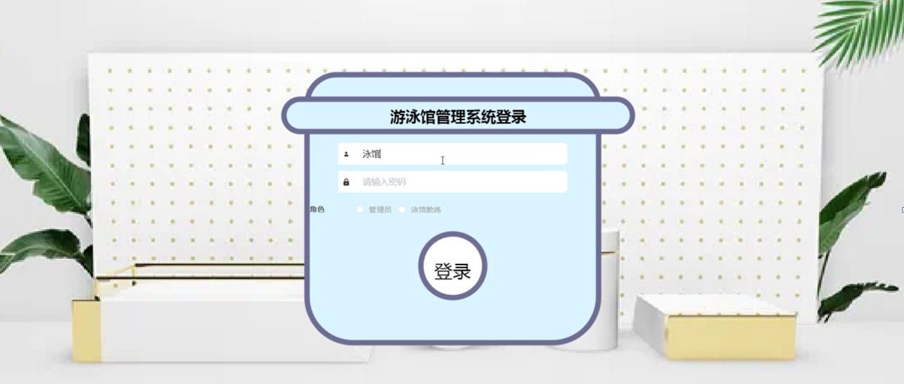
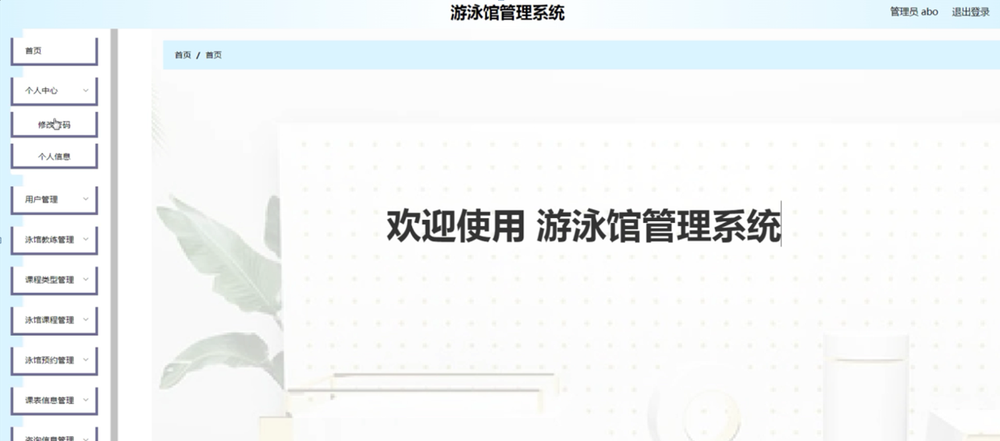
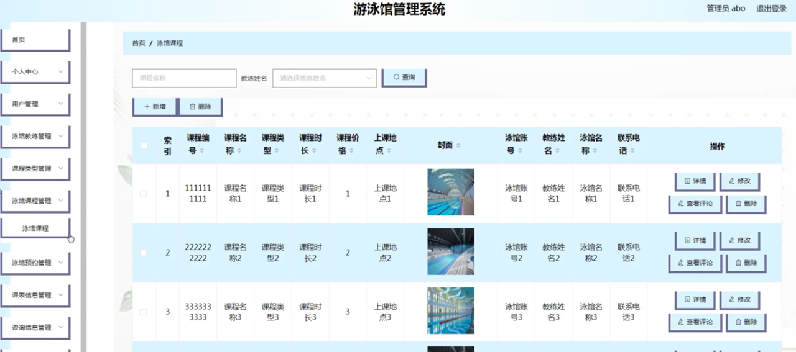

ssm+Vue计算机毕业设计游泳馆管理系统（程序+LW文档）

**项目运行**

**环境配置：**

**Jdk1.8 + Tomcat7.0 + Mysql + HBuilderX** **（Webstorm也行）+ Eclispe（IntelliJ
IDEA,Eclispe,MyEclispe,Sts都支持）。**

**项目技术：**

**SSM + mybatis + Maven + Vue** **等等组成，B/S模式 + Maven管理等等。**

**环境需要**

**1.** **运行环境：最好是java jdk 1.8，我们在这个平台上运行的。其他版本理论上也可以。**

**2.IDE** **环境：IDEA，Eclipse,Myeclipse都可以。推荐IDEA;**

**3.tomcat** **环境：Tomcat 7.x,8.x,9.x版本均可**

**4.** **硬件环境：windows 7/8/10 1G内存以上；或者 Mac OS；**

**5.** **是否Maven项目: 否；查看源码目录中是否包含pom.xml；若包含，则为maven项目，否则为非maven项目**

**6.** **数据库：MySql 5.7/8.0等版本均可；**

**毕设帮助，指导，本源码分享，调试部署** **(** **见文末** **)**

为了方便更直观的理解,下图以图形形式给出关于整个系统的结构图。系统总体功能结构图3-1如图所示：

图3-1系统总体功能结构图

### 数据库概念设计

在对数据库设计之前首先要分析一下游泳馆管理系统的功能，和各模块之间的关系，再对数据表进行设计。每一个模块的实体都会对应多个实体对象，下面是几个系统中的数据实体如下所示。

用户管理实体E-R图如图4-1所示：

图4-1用户管理E-R图

游泳课程管理实体E-R图如图4-2所示：

图4-2游泳课程管理实体E-R图

信息资讯管理实体E-R图如图4-3所示：

图4-3信息资讯管理实体E-R图

### 系统首页的设计

该界面是游泳馆管理系统的首页，界面设置要求界面简洁明了、操作简单、兼容性好。在考虑设计界面时，首先要考虑界面标准化设计，其次是完善界面设计，但不要因对界面的美化使界面的操作变得复杂，用户可在此页面进行登录等操作，页面顶部导航条是各模块的入口。

系统首页页面主要包括首页，泳馆教练，泳馆课程，系统公告，个人中心，后台管理等内容，并根据需要进行详细操作；如图5-1所示：

图5-1系统首页界面图

用户注册，在用户注册页面通过填写用户账号，用户姓名，密码，确认密码，手机号码，年龄，邮箱等信息完成用户注册操作，如图5-2所示。

图5-2用户注册界面图

泳馆课程，在泳馆课程页面可以查看课程名称，课程编号，课程时长，课程价格，上课地点，泳馆账号，教练姓名，泳馆名称，联系电话等详细内容，并进行预约操作，如图5-3所示。

图5-3泳馆课程界面图

游泳教练，在游泳教练页面可以查看教练名称，泳馆账号，联系电话，泳馆名称，邮箱，姓名，年龄，身高等内容，并进行咨询操作；如图5-4所示。

图5-4游泳教练界面图

个人中心，在个人中心页面通过填写用户账号，用户姓名，密码，手机号码，性别，年龄，邮箱等信息进行更新信息，如图5-5所示。

图5-5个人中心界面图

### 5.2后台功能模块

后台登录，用户进入系统前在登录页面根据要求填写用户名和密码，选择角色等信息，点击登录进行登录操作，如图5-6所示。

图5-6后台登录界面图

#### 5.2.1管理员功能模块

管理员登录系统后，可以对首页，个人中心，用户管理，泳馆教练管理，课程类型管理，泳馆课程管理，泳馆预约管理，课表信息管理，咨询信息管理，系统管理等功能进行相应的操作管理，如图5-7所示。

图5-7管理员功能界面图

用户管理，在用户管理页面可以对索引，用户账号，用户姓名，手机号码，头像，性别，年龄，邮箱等内容进行详情，修改和删除等操作，如图5-8所示。

图5-8用户管理界面图

游泳教练管理，在游泳教练管理页面可以对索引，泳馆账号，教练姓名，联系电话，头像，泳馆名称，邮箱，性别，年龄
，身高等内容进行详情，修改和删除等操作，如图5-9所示。

图5-9游泳教练管理界面图

课程类型管理，在课程类型管理页面可以对索引，课程类型等内容进行查看，修改和删除等操作，如图5-10所示。

图5-10课程类型管理界面图

游泳课程管理，在游泳课程管理页面可以对索引，课程编号，课程名称，课程类型，课程时长，课程价格，上课地点，封面，泳馆账号，教练姓名，泳馆名称，联系电话等内容进行详情，修改，查看评论和删除等操作，如图5-11所示。

图5-11游泳课程管理界面图

泳馆预约管理，在泳馆预约管理页面可以对索引，订单号，课程编号，课程名称，课程类型，课程市场，上课地点，泳馆账号，教练姓名，泳馆名称，联系电话，用户账号，用户姓名，手机号码，报名时间，课程价格，是否支付，审核回复，审核状态，审核等内容进行详情，加入课程，修改，删除等操作，如图5-12所示。

图5-12泳馆预约管理界面图

**JAVA** **毕设帮助，指导，源码分享，调试部署**

