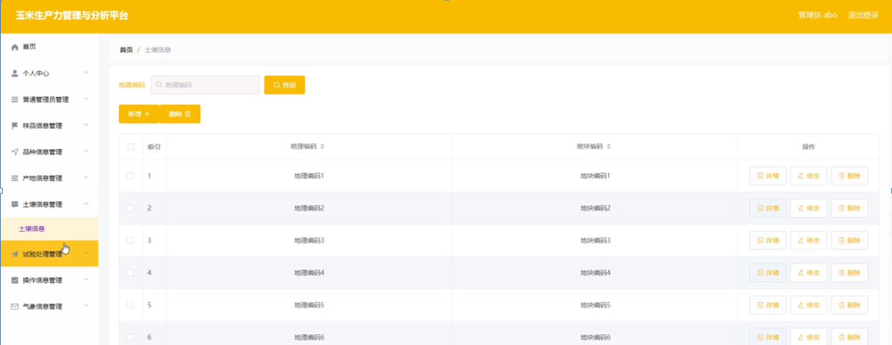
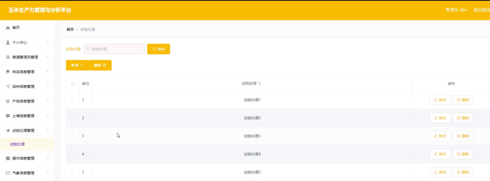

ssm+Vue计算机毕业设计玉米生产力管理与分析平台（程序+LW文档）

**项目运行**

**环境配置：**

**Jdk1.8 + Tomcat7.0 + Mysql + HBuilderX（Webstorm也行）+ Eclispe（IntelliJ
IDEA,Eclispe,MyEclispe,Sts都支持）。**

**项目技术：**

**SSM + mybatis + Maven + Vue 等等组成，B/S模式 + Maven管理等等。**

**环境需要**

**1.运行环境：最好是java jdk 1.8，我们在这个平台上运行的。其他版本理论上也可以。**

**2.IDE环境：IDEA，Eclipse,Myeclipse都可以。推荐IDEA;**

**3.tomcat环境：Tomcat 7.x,8.x,9.x版本均可**

**4.硬件环境：windows 7/8/10 1G内存以上；或者 Mac OS；**

**5.是否Maven项目: 否；查看源码目录中是否包含pom.xml；若包含，则为maven项目，否则为非maven项目**

**6.数据库：MySql 5.7/8.0等版本均可；**

**毕设帮助，指导，本源码分享，调试部署(见文末)**

### 系统结构

本系统架构网站系统，本系统的具体功能如下：

图4-2系统功能结构图

管理员功能结构图，如图4-3所示：

图4-3 管理员功能结构图

普通管理员功能结构图，如图4-4所示：

图4-4 普通管理员功能结构图

### 4.3. 数据库设计

#### 4.3.1 数据库实体

普通管理员管理结构图，如图4-5所示：

图4-5普通管理员管理结构图

样品信息管理实体属性图，如图4-6所示：

 图4-6样品信息管理实体属性图

产地信息管理实体属性图，如图4-7所示：

图4-7产地信息管理实体属性图

### 管理员功能模块

管理员登录，管理员通过输入账号，密码，选择角色等信息即可进行系统登录，如图5-1所示。

图5-1管理员登录界面图

管理员登录进入玉米生产力管理与分析平台可以查看首页、个人中心、普通管理员管理、样品信息管理、品种信息管理、产地信息管理、土壤信息管理、试验处理管理、操作信息管理、气象信息管理等内容进行详细操作，如图5-2所示。

图5-2管理员功能界面图

普通管理员管理，在普通管理员管理页面可以对索引、管理员账号、管理员姓名、备注等信息进行详情，修改或删除等操作，如图5-3所示。

图5-3普通管理员管理界面图

样品信息管理，在样品信息管理页面可以对索引、品种编码、品种名称、种植密度、试验处理、实验重复数、穗粗、穗长、行粒数、穗行数、千粒重、百粒重、产量、播种日期、收获日期等信息进行详情，修改或删除等操作，如图5-4所示。

图5-4样品信息管理界面图

品种信息管理，在品种信息管理页面可以对索引、品种编码、品种名称等信息进行详情，修改或删除等操作，如图5-5所示。

图5-5品种信息管理界面图

产地信息管理，在产地信息管理页面可以对索引、地理编码、国家、省、市、地点、经度、纬度等信息进行详情，修改或删除等操作，如图5-6所示。

图5-6产地信息管理界面图

土壤信息管理，在土壤信息管理页面可以对索引、地理编码、地块编码等级等信息进行详情，修改或删除等操作，如图5-7所示。

图5-7土壤信息管理界面图

试验处理管理，在试验处理管理页面可以对索引、试验处理等信息进行修改或删除等操作，如图5-8所示。

图5-8试验处理管理界面图

操作信息管理，在操作信息管理页面可以对索引、品种编码、品种名称、施氮量、施磷量、施钾量、有机质施用量、土壤供水量、灌溉等信息进行详情，修改或删除等操作，如图5-9所示。

图5-9操作信息管理界面图

气象信息管理，在气象信息管理页面可以对索引、地理编码、日期、年降水量等信息进行详情，修改或删除等操作，如图5-10所示。

图5-10气象信息管理界面图

### 5.2普通管理员功能模块

普通管理员登录进入玉米生产力管理与分析平台可以查看首页、个人中心、样品信息管理、品种信息管理、产地信息管理、土壤信息管理、试验处理管理、操作信息管理、气象信息管理等内容进行详细操作，如图5-11所示。

图5-11普通管理员功能界面图

样品信息管理，在样品信息管理页面可以对索引、品种编码、品种名称、种植密度、试验处理、实验重复数、穗粗、穗长、行粒数、穗行数、千粒重、百粒重、产量、播种日期、收获日期等信息进行详情，修改或删除等操作，如图5-12所示。

图5-12样品信息管理界面图

#### **JAVA毕设帮助，指导，源码分享，调试部署**

