ssm+Vue计算机毕业设计疫情下公共场所卫生安全管理系统（程序+LW文档）

**项目运行**

**环境配置：**

**Jdk1.8 + Tomcat7.0 + Mysql + HBuilderX** **（Webstorm也行）+ Eclispe（IntelliJ
IDEA,Eclispe,MyEclispe,Sts都支持）。**

**项目技术：**

**SSM + mybatis + Maven + Vue** **等等组成，B/S模式 + Maven管理等等。**

**环境需要**

**1.** **运行环境：最好是java jdk 1.8，我们在这个平台上运行的。其他版本理论上也可以。**

**2.IDE** **环境：IDEA，Eclipse,Myeclipse都可以。推荐IDEA;**

**3.tomcat** **环境：Tomcat 7.x,8.x,9.x版本均可**

**4.** **硬件环境：windows 7/8/10 1G内存以上；或者 Mac OS；**

**5.** **是否Maven项目: 否；查看源码目录中是否包含pom.xml；若包含，则为maven项目，否则为非maven项目**

**6.** **数据库：MySql 5.7/8.0等版本均可；**

**毕设帮助，指导，本源码分享，调试部署** **(** **见文末** **)**

### 系统的功能结构图

经过系统需求分析，该疫情下公共场所卫生安全管理系统的设计与实现功能结构图如图4-1所示：

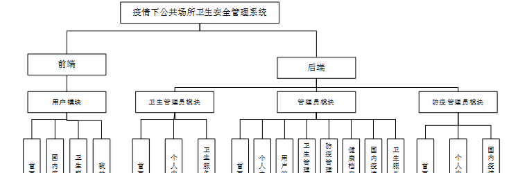

图4-1 系统功能结构图

### 4.2 数据库概念结构设计

####  4.2.1 数据库E-R图

概念设计主要是通过数据库的概念结构和模式进行建立数据库嗯逻辑结构，然后利用数据库的DBMS进行完成，它不需要计算机系统的支持。通过系统的整体来看，主要是对数据库进行管理、整理、更新等操作。数据库的功能是非常强大的，每个系统的开发肯定离不开数据库，通过数据库可以看得出整个系统的质量和效率，根据以上的系统分析，对系统中的主要实体进行规划。以下是几个关键实体的实体关系图：

(1) 国内疫情管理实体E-R图如图4-2所示：

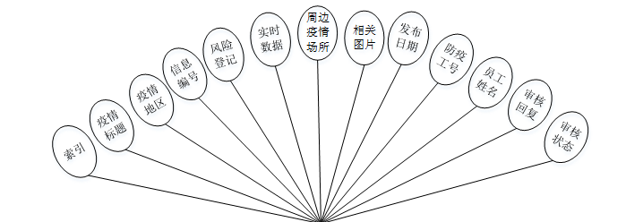

图4-2国内疫情管理实体属性图

(2卫生服务管理实体E-R图如图4-3所示：

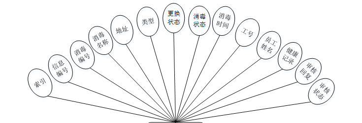

图4-3卫生服务管理实体图

### 前端

用户登录，用户通过输入用户名和密码，选择角色并点击登录进行系统登录操作，如图5-1所示。

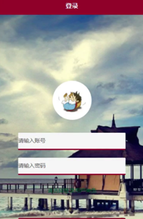

图5-1用户登录界面图

用户注册，在用户注册页面通过填写个人账号、密码、姓名、性别、年龄、身份证号码、手机号码等信息进行注册操作；如图5-2所示。

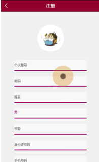

图5-2用户注册界面图

用户登陆系统后，可以对首页、国内疫情、卫生服务、我的等功能模块进行操作，如图5-3所示。

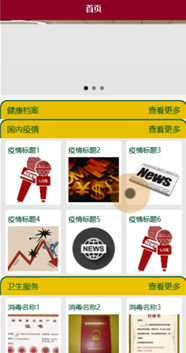

图5-3系统首页界面图

国内疫情，在国内疫情页面可以查看疫情标题、疫情图片、疫情地区、信息编号、风险登记、发布日期、防疫工号、员工姓名、实时数据、周边疫情场所等信息进行评论或收藏，如图5-4所示。

图5-4国内疫情界面图

卫生服务，在卫生服务页面可以查看消毒名称、信息编号、图片、地址、类型、更换状态、消毒状态、消毒时间、工号、员工姓名、审核回复等信息进行评论或收藏，如图5-5所示。

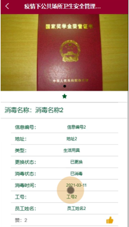

图5-5卫生服务界面图

我的，在我的页面可以对健康档案、国内疫情、我的收藏管理等详细信息进行操作，如图5-6所示。

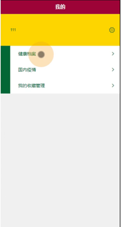

图5-6我的界面图

用户信息，在用户信息页面通过填写用户个人账号、密码、姓名、性别、年龄、身份证号、手机号码、相片等详细信息进行保存操作，如图5-7所示。

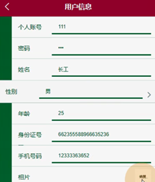

图5-7用户信息界面图

### 5.2后端

### 5.2.1管理员功能

管理员登录，管理员通过输入账号、密码，选择角色并点击登录进行系统登录操作，如图5-8所示。

图5-8管理员登录界图面

管理员登陆系统后，可以对首页、个人中心、用户管理、卫生管理员管理、防疫管理员管理、健康档案管理、国内疫情管理、卫生服务管理等功能进行相应操作，如图5-9所示。

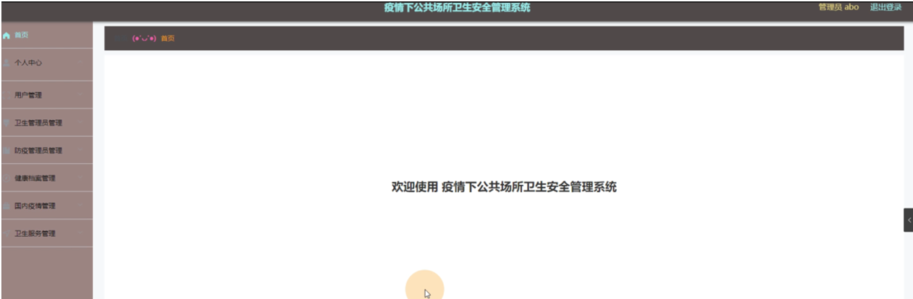

图5-9管理员功能界图面

用户管理，在用户管理页面可以对索引、个人账号、姓名、性别、年龄、身份证号码、手机号码、相片等内容进行详情、修改或删除等操作，如图5-10所示。

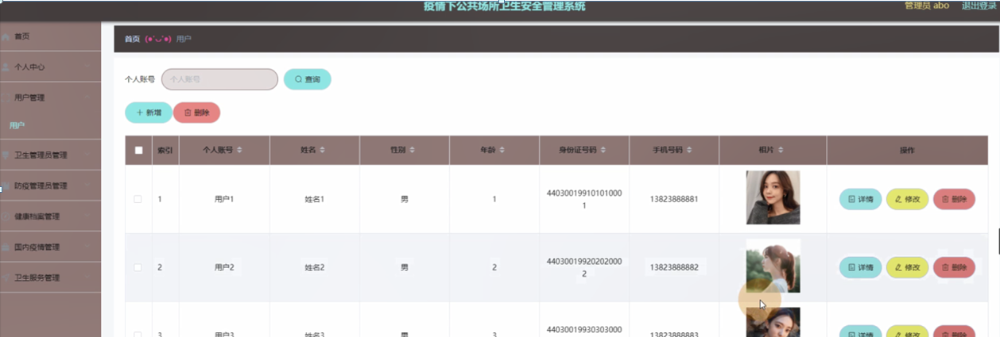

图5-10用户管理界面图

卫生管理员管理，在卫生管理员管理页面可以对索引、工号、员工姓名、性别、年龄、身份证号码、手机号码、相片等内容进行详情，修改或删除等操作，如图5-11所示。

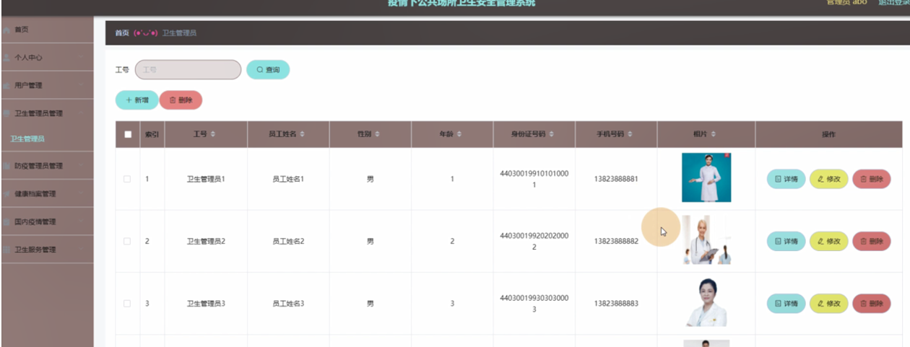

图5-11卫生管理员管理界面图

防疫管理员管理，在防疫管理员管理页面可以对索引、防疫工号、员工姓名、性别、年龄、身份证号码、手机号码、相片等内容进行详情，修改或删除等操作，如图5-12所示。

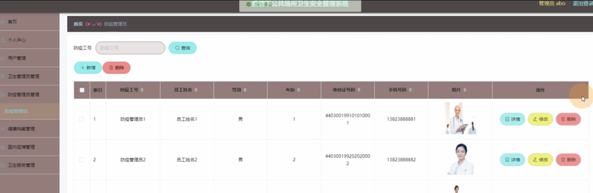

图5-12防疫管理员管理界面图

#### **JAVA** **毕设帮助，指导，源码分享，调试部署**

