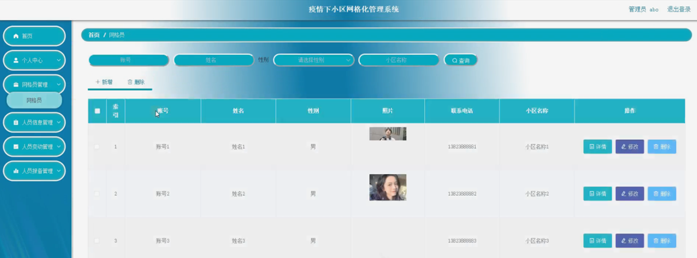
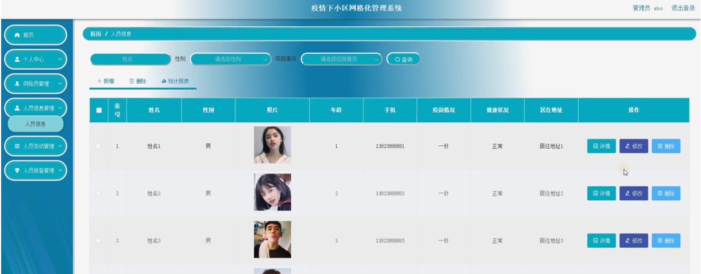

ssm+Vue计算机毕业设计疫情下小区网格化管理系统（程序+LW文档）

**项目运行**

**环境配置：**

**Jdk1.8 + Tomcat7.0 + Mysql + HBuilderX** **（Webstorm也行）+ Eclispe（IntelliJ
IDEA,Eclispe,MyEclispe,Sts都支持）。**

**项目技术：**

**SSM + mybatis + Maven + Vue** **等等组成，B/S模式 + Maven管理等等。**

**环境需要**

**1.** **运行环境：最好是java jdk 1.8，我们在这个平台上运行的。其他版本理论上也可以。**

**2.IDE** **环境：IDEA，Eclipse,Myeclipse都可以。推荐IDEA;**

**3.tomcat** **环境：Tomcat 7.x,8.x,9.x版本均可**

**4.** **硬件环境：windows 7/8/10 1G内存以上；或者 Mac OS；**

**5.** **是否Maven项目: 否；查看源码目录中是否包含pom.xml；若包含，则为maven项目，否则为非maven项目**

**6.** **数据库：MySql 5.7/8.0等版本均可；**

**毕设帮助，指导，本源码分享，调试部署** **(** **见文末** **)**

### 功能结构

为了更好的去理清本系统整体思路，对该系统以结构图的形式表达出来，设计实现该疫情下小区网格化管理系统的功能结构图如下所示：

图4-1 系统总体结构图

### 4.2 数据库设计

####  4.2.1 数据库E/R图

ER图是由实体及其关系构成的图，通过E/R图可以清楚地描述系统涉及到的实体之间的相互关系。在系统中对一些主要的几个关键实体如下图：

(1) 人员报备E/R图如下所示：

图4-2人员报备E/R图

(2) 人员变动E/R图如下所示：

图4-3人员变动E/R图

登录，管理员和网格员通过输入用户名，密码，选择角色信息，点击登录进入系统操作进行操作，如图5-1所示。

图5-1登录界面图

### 5.1管理员功能模块

管理员登陆系统后，可以查看首页、个人中心、网格员管理、人员信息管理、人员变动管理、人员报备管理等功能，还能对每个功能逐一进行相应操作，如图5-2所示。

图5-2管理员功能界面图

网格员管理，在网格员管理页面可以对索引、账号、姓名、性别、照片、联系电话、小区名称等内容进行详情，修改或删除操作，如图5-3所示。

图5-3网格员管理界面图

人员信息管理，在人员信息管理页面可以对索引、姓名、性别、照片、年龄、手机、疫苗情况、健康状况、居住地址等内容进行详情，修改或删除操作，如图5-4所示。

图5-4人员信息管理界面图

人员变动管理，在人员变动管理页面可以对索引、姓名、性别、居住地址、变动情况、登记日期、账号、审核回复、审核状态、审核等内容进行详情，修改或删除操作，如图5-5所示。

图5-5人员变动管理界面图

人员报备管理，在人员报备管理页面可以对索引、姓名、性别、居住地址、报备情况、特殊治疗、报备日期、账号、审核回复、审核状态、审核等内容进行详情，修改或删除操作，如图5-6所示。

图5-6人员报备管理界面图

### 5.2网格员功能模块

网格员登陆系统，可以查看首页、个人中心、人员信息管理、人员变动管理、人员报备管理等功能，还能对每个功能逐一进行相应操作，如图5-7所示。

图5-7网格员功能界面图

个人中心，在个人信息页面通过填写账号、姓名、性别、照片、联系电话、小区名称等内容进行个人信息修改操作，如图5-8所示。

图5-8个人中心界面图

人员信息管理，在人员信息管理页面可以对索引、姓名、性别、照片、年龄、手机、疫苗情况、健康状况、居住地址等内容进行详情，人员变动，人员报备，修改或删除操作，如图5-9所示。

图5-9人员信息管理界面图

人员报备管理，在人员报备管理页面可以对索引、姓名、性别、居住地址、报备情况、特殊治疗、报备日期、账号、审核回复、审核状态等内容进行详情，修改或删除操作，如图5-10所示。

图5-10人员报备管理界面图

#### **JAVA** **毕设帮助，指导，源码分享，调试部署**

