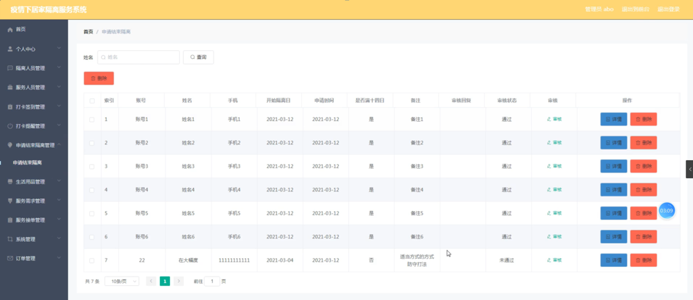
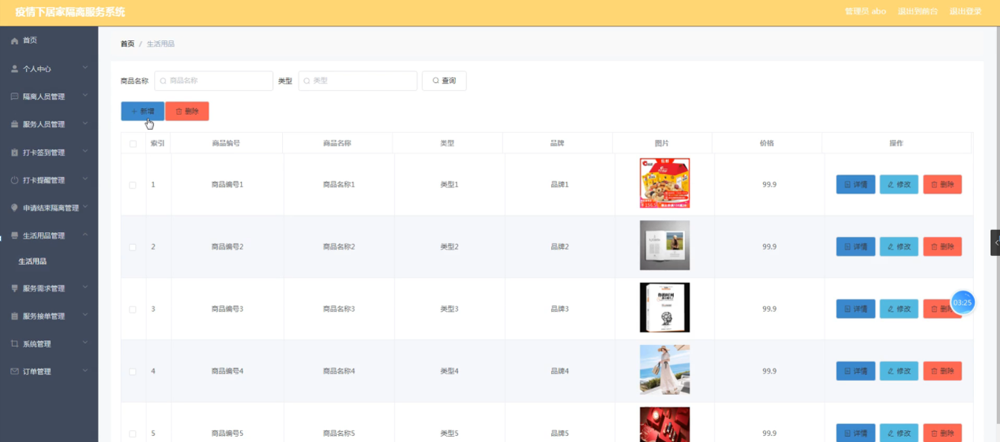

ssm+Vue计算机毕业设计疫情下居家隔离服务系统（程序+LW文档）

**项目运行**

**环境配置：**

**Jdk1.8 + Tomcat7.0 + Mysql + HBuilderX** **（Webstorm也行）+ Eclispe（IntelliJ
IDEA,Eclispe,MyEclispe,Sts都支持）。**

**项目技术：**

**SSM + mybatis + Maven + Vue** **等等组成，B/S模式 + Maven管理等等。**

**环境需要**

**1.** **运行环境：最好是java jdk 1.8，我们在这个平台上运行的。其他版本理论上也可以。**

**2.IDE** **环境：IDEA，Eclipse,Myeclipse都可以。推荐IDEA;**

**3.tomcat** **环境：Tomcat 7.x,8.x,9.x版本均可**

**4.** **硬件环境：windows 7/8/10 1G内存以上；或者 Mac OS；**

**5.** **是否Maven项目: 否；查看源码目录中是否包含pom.xml；若包含，则为maven项目，否则为非maven项目**

**6.** **数据库：MySql 5.7/8.0等版本均可；**

**毕设帮助，指导，本源码分享，调试部署** **(** **见文末** **)**

### 系统的功能结构图

经过系统需求分析，该疫情下居家隔离服务系统的设计与实现功能结构图如图4-1所示：

图4-1 系统功能结构图

### 4.2 数据库概念结构设计

####  4.2.1 数据库E-R图

概念设计主要是通过数据库的概念结构和模式进行建立数据库嗯逻辑结构，然后利用数据库的DBMS进行完成，它不需要计算机系统的支持。通过系统的整体来看，主要是对数据库进行管理、整理、更新等操作。数据库的功能是非常强大的，每个系统的开发肯定离不开数据库，通过数据库可以看得出整个系统的质量和效率，根据以上的系统分析，对系统中的主要实体进行规划。以下是几个关键实体的实体关系图：

(1) 服务需求管理实体E-R图如图4-2所示：

图4-2服务需求管理实体属性图

(2) 服务接单管理实体E-R图如图4-3所示：

图4-3服务接单管理实体图

### 系统功能模块

疫情下居家隔离服务系统，在系统首页可以查看首页、生活用品、服务需求、个人中心、后台管理、线上健康问诊等内容，如图5-1所示。

图5-1系统首页界面图

生活用品，在生活用品页面可以查看商品编号、商品名称、类型、品牌、图片、价格

等内容，如图5-2所示。

图5-2生活用品界面图

服务需求，在服务需求页面可以查看标题、图片、需求内容、发布时间、备注、账号、姓名、手机、地址等内容，如图5-3所示。

图5-3服务需求界面图

个人中心，在个人中心页面通过填写用户信息进行更新信息，根据需要对我的订单、我的地址进行相对应操作，如图5-4所示。

图5-4个人中心界面图

### 5.2管理员功能模块

管理员登录，通过填写注册时输入的用户名、密码、角色进行登录，如图5-5所示。

图5-5管理员登录界面图

管理员登录进入疫情下居家隔离服务系统可以查看首页、个人中心、隔离人员管理、服务人员管理、打卡签到管理、打卡提醒管理、申请结束隔离管理、生活用品管理、服务需求管理、服务接单管理、系统管理、订单管理等信息，如图5-6所示。

图5-6管理员功能界面图

隔离人员管理，在隔离人员管理页面中可以查看索引、账号、姓名、性别、手机、邮箱、身份证、照片、地址等信息，并可根据需要进行删除等操作，如图5-7所示。

图5-7隔离人员管理界面图

服务人员管理，在服务人员管理页面中可以查看索引、服务人员工号、服务人员姓名、性别、联系方式、邮箱、身份证、照片、地址等信息，并可根据需要进行删除等操作，如图5-8所示。

图5-8服务人员管理界面图

打卡签到管理，在打卡签到管理页面中可以查看索引、账号、姓名、打卡签到、体温度数、登记人、登记时间、备注等信息，如图5-9所示。

图5-9打卡签到管理界面图

打卡提醒管理，在打卡提醒管理页面中可以查看索引、提醒编号、账号、姓名、手机、未打卡原因、提醒时间、是否打卡、备注等信息，并可根据需要进行修改或删除等操作，如图5-10所示。

图5-10打卡提醒管理界面图

申请结束隔离管理，在申请结束隔离管理页面中可以查看索引、账号、姓名、手机、开始隔离日、申请时间、是否满十四日、备注、审核回复、审核状态、审核等信息，并可根据需要进行删除等操作，如图5-11所示。

图5-11申请结束隔离管理界面图

生活用品管理，在生活用品管理页面中可以查看索引、商品编号、商品名称、类型、品牌、图片、价格等信息，并可根据需要进行修改或删除等操作，如图5-12所示。

图5-12生活用品管理界面图

**JAVA** **毕设帮助，指导，源码分享，调试部署**

