ssm+Vue计算机毕业设计疫情下智慧社区系统（程序+LW文档）

**项目运行**

**环境配置：**

**Jdk1.8 + Tomcat7.0 + Mysql + HBuilderX（Webstorm也行）+ Eclispe（IntelliJ
IDEA,Eclispe,MyEclispe,Sts都支持）。**

**项目技术：**

**SSM + mybatis + Maven + Vue 等等组成，B/S模式 + Maven管理等等。**

**环境需要**

**1.运行环境：最好是java jdk 1.8，我们在这个平台上运行的。其他版本理论上也可以。**

**2.IDE环境：IDEA，Eclipse,Myeclipse都可以。推荐IDEA;**

**3.tomcat环境：Tomcat 7.x,8.x,9.x版本均可**

**4.硬件环境：windows 7/8/10 1G内存以上；或者 Mac OS；**

**5.是否Maven项目: 否；查看源码目录中是否包含pom.xml；若包含，则为maven项目，否则为非maven项目**

**6.数据库：MySql 5.7/8.0等版本均可；**

**毕设帮助，指导，本源码分享，调试部署(** **见文末)**

###  系统结构

本系统架构网站系统，本系统的具体功能如下：

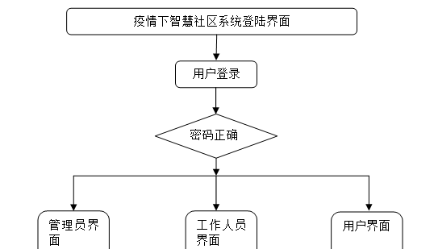

图4-2系统功能结构图

系统架构图属于系统设计阶段，系统架构图只是这个阶段一个产物，系统的总体架构决定了整个系统的模式，是系统的基础。就业推荐系统的整体结构设计如图4-3所示。

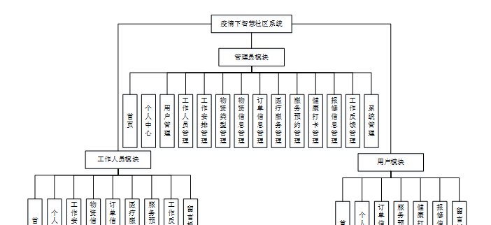

图4-3 系统结构图

### 4.3. 数据库设计

#### 4.3.1 数据库实体

管理员信息结构图，如图4-4所示：

图4-4 管理员信息实体结构图

用户信息实体属性图，如图4-5所示：

图4-5用户信息实体属性图

物资信息管理实体属性图，如图4-6所示：

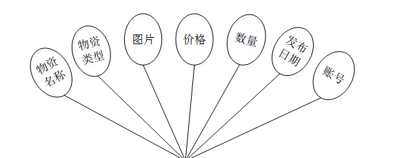

图4-6物资信息管理实体属性图

### 系统功能模块

疫情下智慧社区系统设计，在系统首页可以查看首页、物资信息、医疗服务、社区新闻、留言反馈、个人中心、后台管理等内容，如图5-1所示。

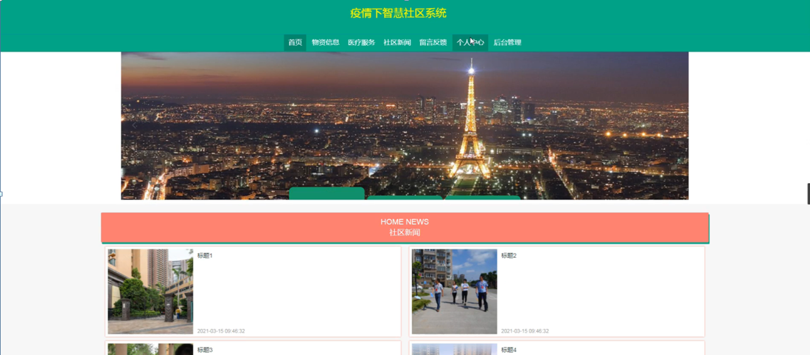

图5-1系统首页界面图

用户注册，在用户注册页面通过填写用户名、密码、姓名、身份证、手机等信息完成用户注册，如图5-2所示。

图5-2用户注册界面图

物资信息，在物资信息页面可以查看物资名称、物资类型、图片、价格、数量、发布日期、账号等详细信息，根据需要进行购买，如图5-3所示。

图5-3物资信息界面图

医疗服务，在医疗服务页面可以查看项目类型、价格、项目详情、发布日期、账号等详细信息，根据需要进行预约，如图5-4所示。

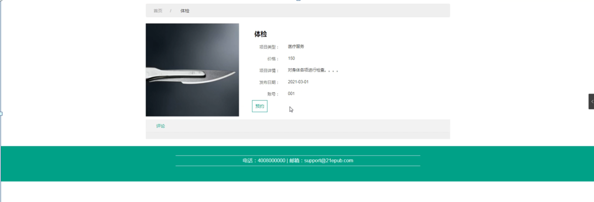

图5-4医疗服务界面图

个人中心，在个人中心页面通过填写用户名、密码、姓名、性别、身份证、手机等信息进行更新信息，根据需要对我的收藏进行相对应操作，如图5-5所示。

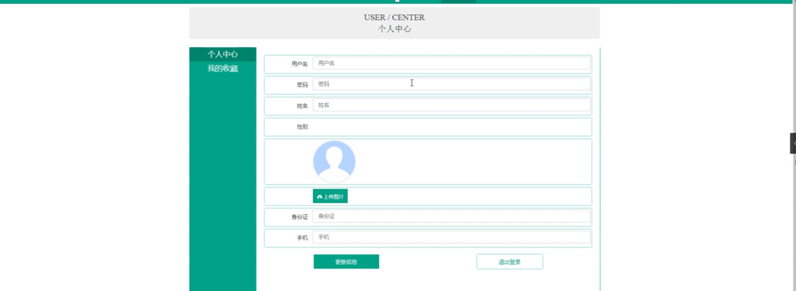

图5-5个人中心界面图

### 5.2管理员功能模块

管理员登录，管理员通过输入账号，密码，权限等信息即可进行系统登录，如图5-6所示。

图5-6管理员登录界面图

管理员登录进入疫情下智慧社区系统设计可以查看首页、个人中心、用户管理、工作人员管理、工作安排管理、物资类型管理、物资信息管理、订单信息管理、医疗服务管理、服务预约管理、健康打卡管理、报修信息管理、工作反馈管理、系统管理等内容，如图5-7所示。

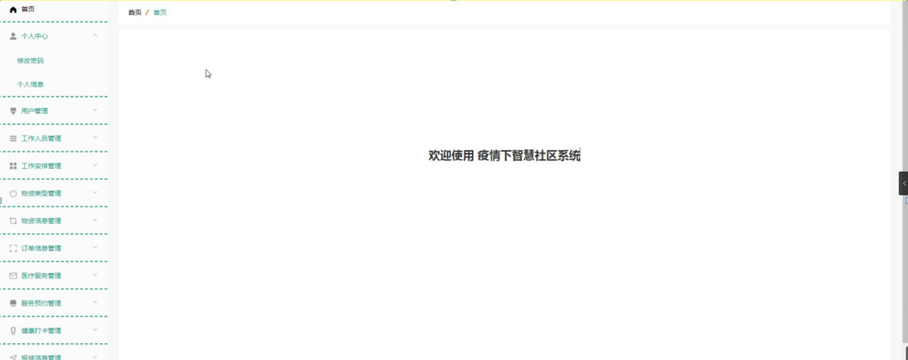

图5-7管理员功能界面图

用户管理，在用户管理页面可以查看用户名、姓名、性别、头像、身份证、手机等信息，并可根据需要进行修改或删除等操作，如图5-8所示。

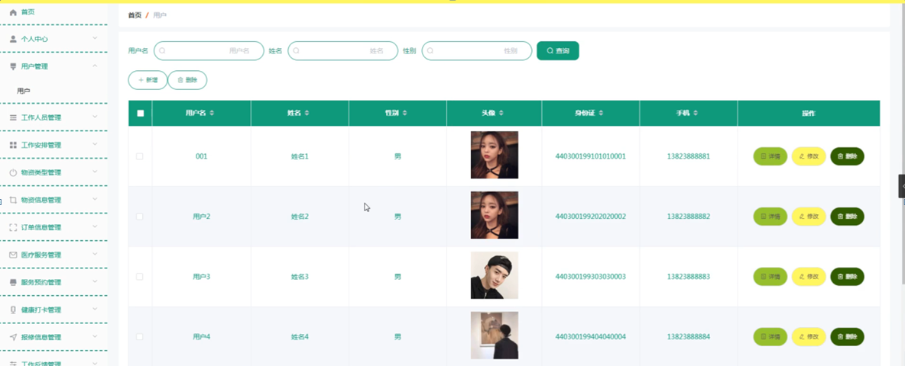

图5-8用户管理界面图

工作人员管理，在工作人员管理页面可以查看账号、姓名、性别、头像、身份证、手机等信息，并可根据需要进行安排、修改或删除等操作，如图5-9所示。

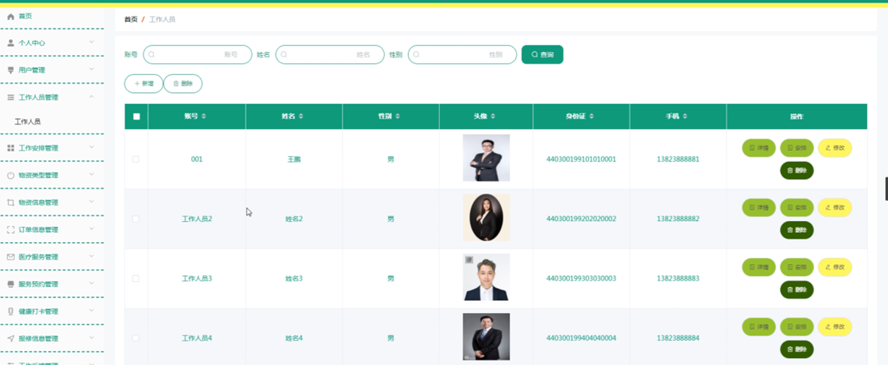

图5-9工作人员管理界面图

工作安排管理，在工作安排管理页面可以查看名称、账号、姓名、工作时间、工作内容等信息，并可根据需要进行修改或删除等操作，如图5-10所示。

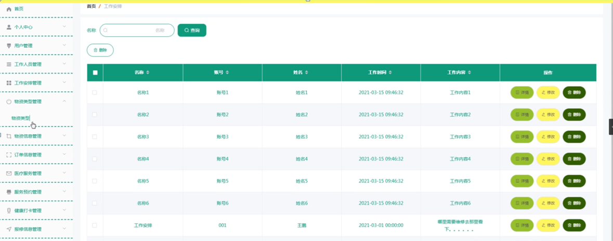

图5-10工作安排管理界面图

物资类型管理，在物资类型管理页面可以查看物资类型等信息，并可根据需要进行修改或删除等操作，如图5-11所示。

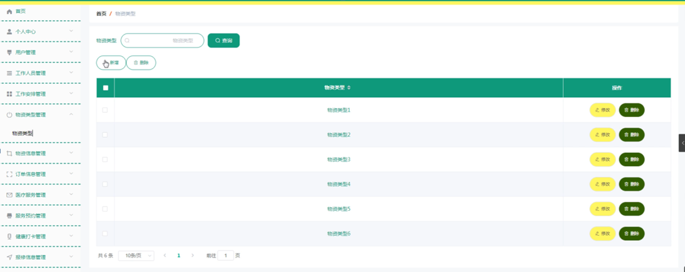

图5-11物资类型管理界面图

物资信息管理，在物资信息管理页面可以查看物资名称、物资类型、图片、价格、数量、发布日期、账号等信息，并可根据需要进行查看评论、修改或删除等操作，如图5-12所示。

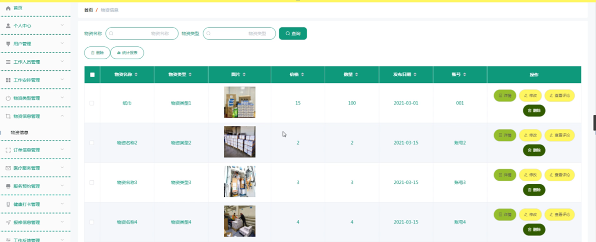

图5-12物资信息管理界面图

#### **JAVA毕设帮助，指导，源码分享，调试部署**

