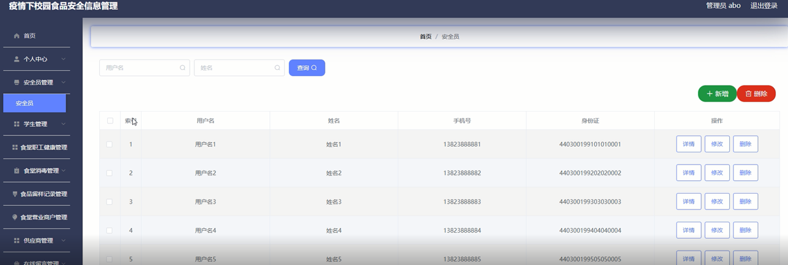
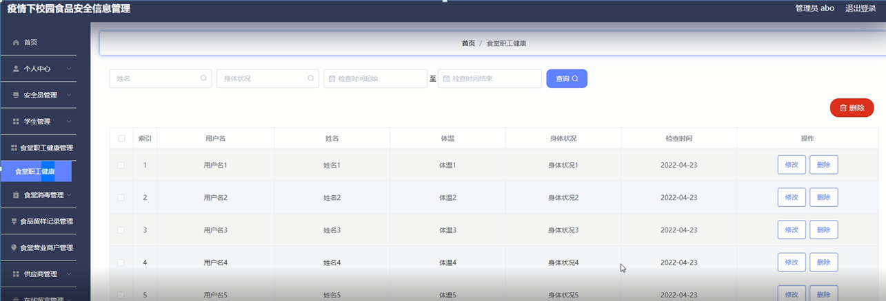

ssm+Vue计算机毕业设计疫情下校园食品安全信息管理（程序+LW文档）

**项目运行**

**环境配置：**

**Jdk1.8 + Tomcat7.0 + Mysql + HBuilderX** **（Webstorm也行）+ Eclispe（IntelliJ
IDEA,Eclispe,MyEclispe,Sts都支持）。**

**项目技术：**

**SSM + mybatis + Maven + Vue** **等等组成，B/S模式 + Maven管理等等。**

**环境需要**

**1.** **运行环境：最好是java jdk 1.8，我们在这个平台上运行的。其他版本理论上也可以。**

**2.IDE** **环境：IDEA，Eclipse,Myeclipse都可以。推荐IDEA;**

**3.tomcat** **环境：Tomcat 7.x,8.x,9.x版本均可**

**4.** **硬件环境：windows 7/8/10 1G内存以上；或者 Mac OS；**

**5.** **是否Maven项目: 否；查看源码目录中是否包含pom.xml；若包含，则为maven项目，否则为非maven项目**

**6.** **数据库：MySql 5.7/8.0等版本均可；**

**毕设帮助，指导，本源码分享，调试部署** **(** **见文末** **)**

### 软件功能模块设计

网站整功能如下图所示：

图4-1疫情下校园食品安全信息管理总体功能模块图

### 4.2 数据库设计与实现

在每一个系统中数据库有着非常重要的作用，数据库的设计得好将会增加系统的效率以及系统各逻辑功能的实现。所以数据库的设计我们要从系统的实际需要出发，才能使其更为完美的符合系统功能的实现。

#### 4.2.1 概念模型设计

概念模型是对现实中的问题出现的事物的进行描述，ER图是由实体及其关系构成的图，通过E-R图可以清楚地描述系统涉及到的实体之间的相互关系。

食堂职工健康信息实体图如图4-2所示：

图4-2食堂职工健康信息实体图

食堂营业商户信息实体图如图4-3所示：

图4-3食堂营业商户信息实体图

食品留样记录信息实体图如图4-4所示：

图4-4食品留样记录信息实体图

### 管理员功能模块

管理员登录，管理员通过登录页面输入用户名、密码，选择角色并点击登录进行系统登录操作，如图5-1所示。

图5-1管理员登录界面图

管理员登录系统后，可以对首页、个人中心、安全员管理、学生管理、食堂职工健康管理、食堂消毒管理、食品留样记录管理、食堂营业商户管理、供应商管理、在线留言管理、留言回复管理等功能进行相应操作，如图5-2所示。

图5-2管理员功能界图面

管理员对个人中心进行操作填写原密码、新密码、确认密码并进行添加、删除、修改以及查看。修改密码，管理员对修改密码进行操作填写原密码、新密码、确认密码并进行添加、删除、修改以及查看，如图5-3所示。

图5-3个人中心界面图

学生管理，在学生管理页面可以对学生学号、学生姓名、手机号、身份证等内容进行详情、修改、删除等操作，如图5-4所示。

图5-4学生管理界面图

安全员管理，在安全员管理页面可以对用户名、姓名、手机号、身份证等内容进行详情、修改、删除等操作，如图5-5所示。

图5-5安全员管理界面图

食堂职工健康管理，在食堂职工健康管理页面可以对用户名、姓名、体温、身体状况、检查时间等内容进行修改、删除等操作，如图5-6所示。

图5-6食堂职工健康管理界面图

食堂消毒管理，在食堂消毒管理页面可以对食堂名称、消毒时间、用户名、姓名等内容进行详情、修改、删除等操作，如图5-7所示。

图5-7食堂消毒管理界面图

食品留样记录管理，在食品留样记录管理页面可以对留言日期、窗口号、制作时间、厨师姓名、用户名、姓名、质量是否通过检测等内容进行详情、修改、删除等操作，如图5-8所示。

图5-8食品留样记录管理界面图

食堂营业商户管理，在食堂营业商户管理可以对食堂名称、窗口号、负责人、营业执照、卫生证等内容进行详情、修改、删除等操作，如图5-9所示。

图5-9食堂营业商户管理面图

###

### 5.2学生功能模块

学生注册，在注册页面填写学生学号、密码、确认密码、学生姓名、手机号、身份证等信息，进行注册操作，如图5-10所示。

图5-10学生注册界面图

学生登录，在登录页面填写用户名、密码、选择角色等信息，进行登录操作，如图5-11所示。

图5-11学生登录界面图

学生登录到疫情下校园食品安全信息管理后台后，可以对首页、个人中心、食品留样记录管理、在线留言管理、留言回复管理等功能进行相应操作，如图5-12所示。

图5-12学生功能界面图

#### **JAVA** **毕设帮助，指导，源码分享，调试部署**

