ssm+Vue计算机毕业设计疫情下的学生出入管理系统（程序+LW文档）

**项目运行**

**环境配置：**

**Jdk1.8 + Tomcat7.0 + Mysql + HBuilderX** **（Webstorm也行）+ Eclispe（IntelliJ
IDEA,Eclispe,MyEclispe,Sts都支持）。**

**项目技术：**

**SSM + mybatis + Maven + Vue** **等等组成，B/S模式 + Maven管理等等。**

**环境需要**

**1.** **运行环境：最好是java jdk 1.8，我们在这个平台上运行的。其他版本理论上也可以。**

**2.IDE** **环境：IDEA，Eclipse,Myeclipse都可以。推荐IDEA;**

**3.tomcat** **环境：Tomcat 7.x,8.x,9.x版本均可**

**4.** **硬件环境：windows 7/8/10 1G内存以上；或者 Mac OS；**

**5.** **是否Maven项目: 否；查看源码目录中是否包含pom.xml；若包含，则为maven项目，否则为非maven项目**

**6.** **数据库：MySql 5.7/8.0等版本均可；**

**毕设帮助，指导，本源码分享，调试部署** **(** **见文末** **)**

### 软件功能模块设计

系统整体功能如下图所示：

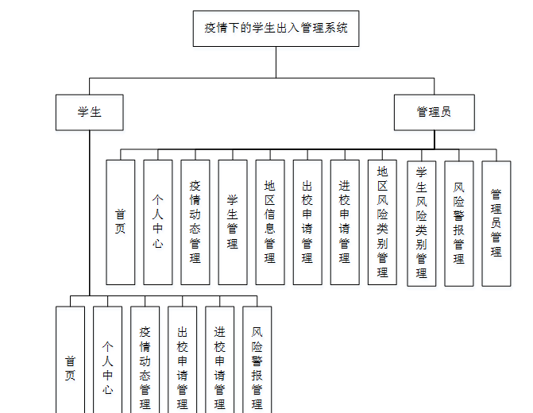

图 4-1 系统总体功能模块图

### 4.2数据库设计与实现

在每一个系统中数据库有着非常重要的作用，数据库的设计得好将会增加系统的效率以及系统各逻辑功能的实现。所以数据库的设计我们要从系统的实际需要出发，才能使其更为完美的符合系统功能的实现。

#### 4.2.1概念模型设计

概念模型是对现实中的问题出现的事物的进行描述，ER图是由实体及其关系构成的图，通过E-R图可以清楚地描述系统涉及到的实体之间的相互关系。

疫情动态管理实体图如图4-2所示：

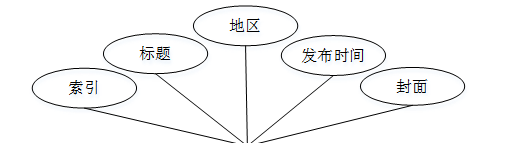

图4-2疫情动态管理实体图

学生管理实体图如图4-3所示：

图4-3学生管理实体图

系统登录，用户进入系统前在登录页面根据要求填写用户名和密码，选择角色等信息，点击登录进行登录操作，如图5-1所示。

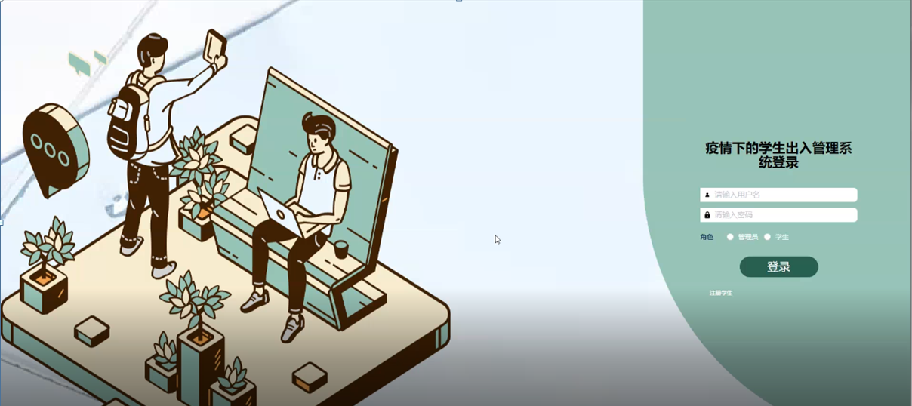

图5-1系统登录界面图

### 5.1管理员功能模块

管理员登录系统后，可以对首页，个人中心，疫情动态管理，学生管理，地区信息管理，出校申请管理，进校申请管理，地区风险类别管理，学生风险类别管理，风险警报管理，管理员管理等功能进行相应的操作管理，如图5-2所示。

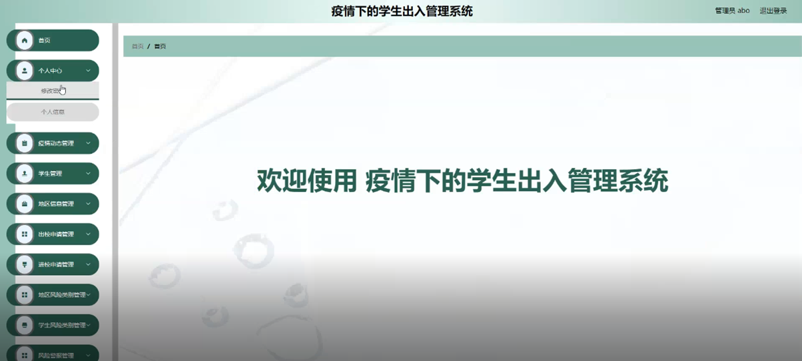

图5-2管理员功能界面图

疫情动态管理，在疫情动态页面可以对索引，标题，地区，发布时间，封面等内容进行详情，修改，和删除等操作，如图5-3所示。

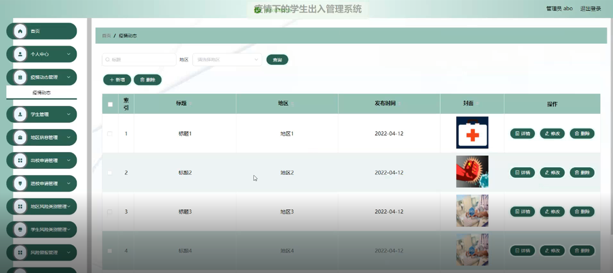

图5-3疫情动态管理界面图

学生管理，在学生页面可以对索引，学号，姓名，年龄，性别，手机，年级，类别，照片等内容进行详情，修改和删除等操作，如图5-4所示。

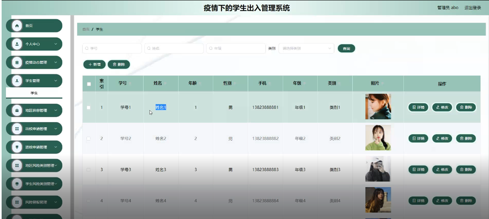

图5-4学生管理界面图

地区信息管理，在地区信息页面可以对索引，地区，类别名称等内容进行详情，修改和删除操作；如图5-5所示。

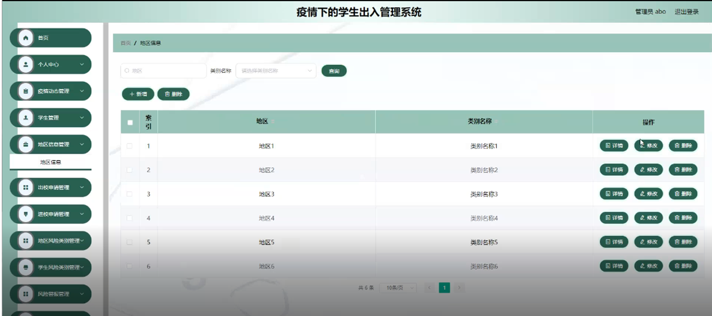

图5-5地区信息管理界面图

地区风险类别管理，在地区风险类别页面可以对索引，类别名称等内容进行详情，修改和删除操作；如图5-6所示。

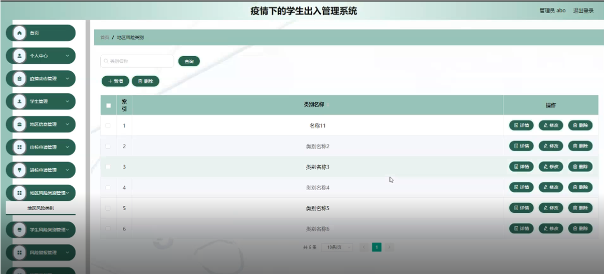

图5-6地区风险类别管理界面图

学生风险类别管理，在学生风险类别页面可以对索引，类别名称等内容进行详情，修改和删除操作；如图5-7所示。

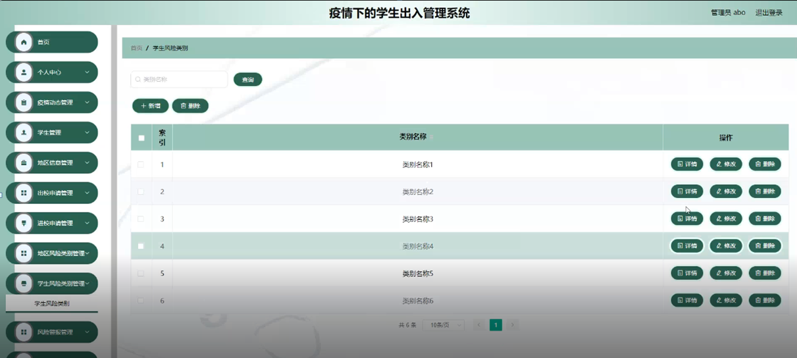

图5-7学生风险类别管理界面图

出校申请管理，在出校申请页面可以对索引，申请编号，目的地，离校时间，返校时间，学号，姓名，手机，年级，审核回复，审核状态，审核等内容进行详情和删除操作；如图5-8所示。

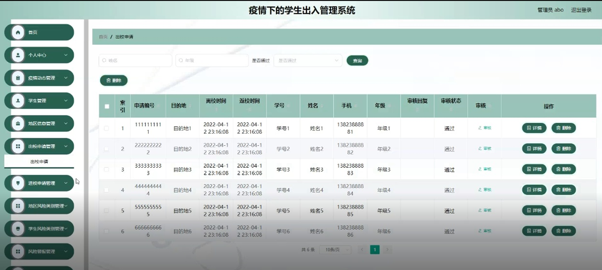

图5-8出校申请管理界面图

进校申请管理，在进校申请页面可以对索引，学号，姓名，年级，地区，类别名称，到过何处，高危人群，申请时间，审核回复，审核等内容进行详情和删除操作；如图5-9所示。

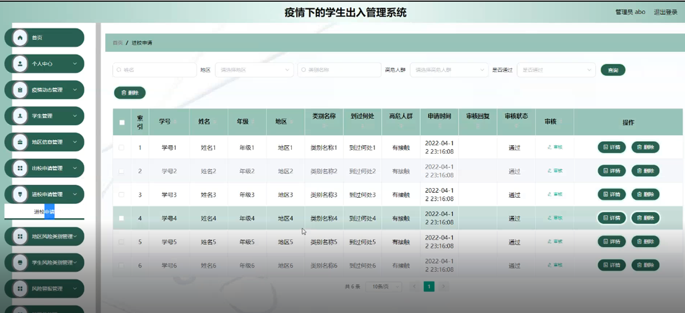

图5-9进校申请管理界面图

风险警报管理，在风险警报页面可以对索引，标题，警报时间，学号，姓名，年级等内容进行详情，修改和删除操作；如图5-10所示。

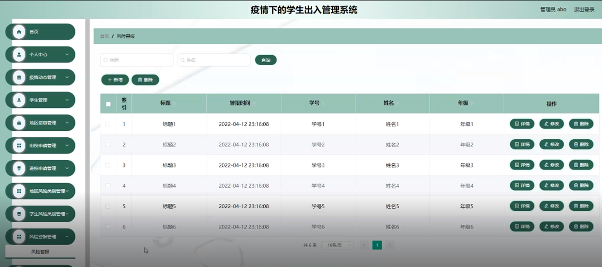

图5-10风险警报管理界面图

管理员管理，在管理员页面可以对索引，用户名，密码，角色等内容进行详情，修改和删除操作；如图5-11所示。

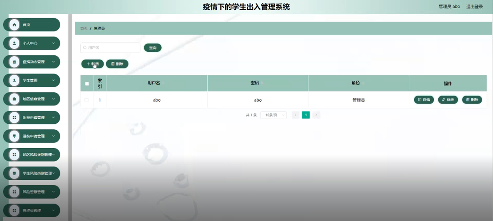

图5-11管理员管理界面图

### 5.2学生功能模块

学生登录进入疫情下的学生出入管理系统可以对首页，个人中心，疫情动态管理，出校申请管理，进校申请管理，风险警报管理等功能进行相应操作，如图5-12所示。

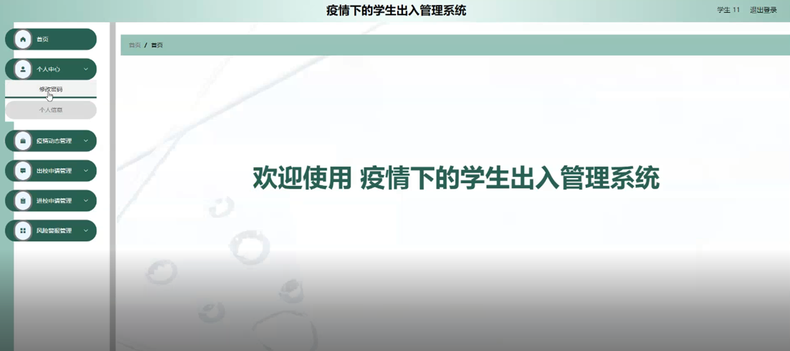

图5-12学生功能界面图

**JAVA** **毕设帮助，指导，源码分享，调试部署**

