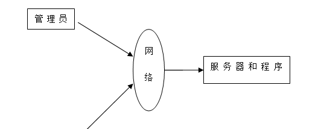
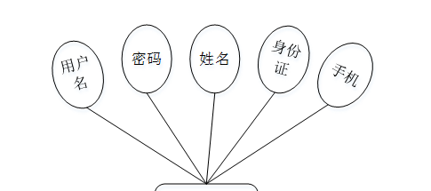

ssm+Vue计算机毕业设计疫情下的进出口食品安全信息管理系统（程序+LW文档）

**项目运行**

**环境配置：**

**Jdk1.8 + Tomcat7.0 + Mysql + HBuilderX** **（Webstorm也行）+ Eclispe（IntelliJ
IDEA,Eclispe,MyEclispe,Sts都支持）。**

**项目技术：**

**SSM + mybatis + Maven + Vue** **等等组成，B/S模式 + Maven管理等等。**

**环境需要**

**1.** **运行环境：最好是java jdk 1.8，我们在这个平台上运行的。其他版本理论上也可以。**

**2.IDE** **环境：IDEA，Eclipse,Myeclipse都可以。推荐IDEA;**

**3.tomcat** **环境：Tomcat 7.x,8.x,9.x版本均可**

**4.** **硬件环境：windows 7/8/10 1G内存以上；或者 Mac OS；**

**5.** **是否Maven项目: 否；查看源码目录中是否包含pom.xml；若包含，则为maven项目，否则为非maven项目**

**6.** **数据库：MySql 5.7/8.0等版本均可；**

**毕设帮助，指导，本源码分享，调试部署** **(** **见文末** **)**

### 系统体系结构

疫情下的进出口食品安全信息管理系统的结构图4-1所示：

图4-1 系统结构

登录系统结构图，如图4-2所示：

图4-2 登录结构图

系统结构图，如图4-3所示：

图4-3 系统结构图

4.2 数据库实体设计

数据库的功能就是对系统中所有的数据进行存储和管理。所有的数据可以在数据库中产时间的进行存储，方便用户的使用。而且所有的数据库中的数据也应该具有一定的共享性，任何的系统可以对一些数据进行使用，同时还应该保持一定的独立性，每一个数据库中的数据都有很强的安全性，可以被很好的存放到数据库，没有进行身份的验证是不能对这些数据进行查看和使用的。数据库的设计需要明确每一个实体之间的联系，系统的E-
R图如下图所示：：

管理员实体主要存储管理信息包括用户名、密码、角色属性。管理员信息属性图如图4-4所示。

图4-4 管理员信息实体属性图

用户注册主要包括用户名、密码、姓名、身份证、手机等属性，用户注册属性图如图4-5所示。

图4-5用户注册实体属性图

食品安全管理实体属性主要包括索引、食品名称、视频类型、图片、视频安全法、注意事项、日期等属性。食品安全实体属性图如图4-6所示。

图4-6食品安全管理实体属性图

留言板管理属性主要包括索引、用户名、留言内容、回复内容等属性。留言板管理实体属性图如图4-7所示。

图4-7留言板管理实体属性图

### 系统功能模块

疫情下的进出口食品安全信息管理系统，在系统的首页可以查看首页、食品安全法规、食品安全、预警通报、留言反馈、个人中心、后台管理等信息，如图5-1所示。

图5-1系统首页界面图

用户注册，在用户注册页面通过填写用户名、密码、姓名、身份证、手机等信进行用户注册，如图5-2所示。

图5-2用户注册界面图

食品安全法规，在食品安全法规页面中可以查看标题、图片、国家、地区、法律文件等信息，如图5-3所示。

图5-3食品安全法规界面图

食品安全，在食品安全页面可以查看食品名称、视频类型、图片、视频安全法、注意事项、日期等信息，如图5-4所示。

图5-4食品安全界面图

留言反馈，在留言反馈页面通过输入留言内容并立即提交，如图5-5所示。

图5-5留言反馈界面图

个人中心，在个人中心页面通过填写用户名、密码、姓名、性别、身份证、手机等信息进行更新信息，并可对我的收藏进行相对应的操作，如图5-6所示。

图5-6个人中心界面图

### 5.2 管理员功能模块

管理员登录，管理员通过输入界面上显示的信息然后点击登录就能登录到系统进行系统的使用了，如图5-7所示。

图5-7管理员登录界面图

管理员登录进入疫情下的进出口食品安全信息管理系统之后，就可以对所有的信息进行查看，可以查看到首页、个人中心、用户管理、食品安全法规管理、国家信息管理、地区信息管理、食品类型管理、食品安全管理、留言板管理、系统管理等信息，并且还可以对其进行相应的操作管理，如图5-8所示。

图5-8管理员功能界面图

用户管理，在用户管理页面中可以查看索引、用户名、密码、姓名、性别、头像、身份证、手机信息等信息，还可以根据需要进行修改或删除等操作，如图5-9所示。

图5-9用户管理界面图

食品安全法规管理，在食品安全法规管理页面中可以查看索引、标题、图片、国家、地区、法律文件等信息，还可以根据需要进行修改或删除等操作，如图5-10所示。

图5-10食品安全法规管理界面图

国家信息管理，在国家信息管理页面中可以查看索引、国家等信息，还可以根据需要进行修改或删除等操作，如图5-11所示。

图5-11国家信息管理界面图

地区信息管理，在地区信息管理页面中可以查看索引、地区等信息，还可以根据需要进行修改或删除等操作，如图5-12所示。

图5-12地区信息管理界面图

#### **JAVA** **毕设帮助，指导，源码分享，调试部署**

