ssm+Vue计算机毕业设计疫情信息管理系统（程序+LW文档）

**项目运行**

**环境配置：**

**Jdk1.8 + Tomcat7.0 + Mysql + HBuilderX（Webstorm也行）+ Eclispe（IntelliJ
IDEA,Eclispe,MyEclispe,Sts都支持）。**

**项目技术：**

**SSM + mybatis + Maven + Vue 等等组成，B/S模式 + Maven管理等等。**

**环境需要**

**1.运行环境：最好是java jdk 1.8，我们在这个平台上运行的。其他版本理论上也可以。**

**2.IDE环境：IDEA，Eclipse,Myeclipse都可以。推荐IDEA;**

**3.tomcat环境：Tomcat 7.x,8.x,9.x版本均可**

**4.硬件环境：windows 7/8/10 1G内存以上；或者 Mac OS；**

**5.是否Maven项目: 否；查看源码目录中是否包含pom.xml；若包含，则为maven项目，否则为非maven项目**

**6.数据库：MySql 5.7/8.0等版本均可；**

**毕设帮助，指导，本源码分享，调试部署(** **见文末)**

### 系统设计主要功能

通过市场调研及咨询研究，了解了用户及管理者的使用需求，于是制定了管理员，居民和工作人员等模块。功能结构图如下所示：

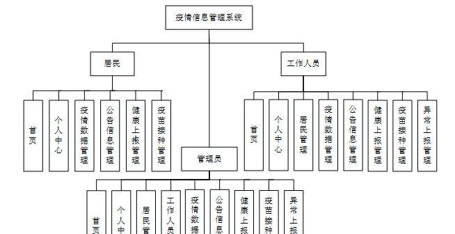

图4-1系统功能结构图

### 4.2 数据库设计

#### 4.2.1 数据库设计规范

数据可设计要遵循职责分离原则，即在设计时应该要考虑系统独立性，即每个系统之间互不干预不能混乱数据表和系统关系。

数据库命名也要遵循一定规范，否则容易混淆，数据库字段名要尽量做到与表名类似，多使用小写英文字母和下划线来命名并尽量使用简单单词。

#### 4.2.2 E/R图

居民管理E/R图，如下所示：

图4-2居民管理E/R图

工作人员管理E/R图，如下所示：

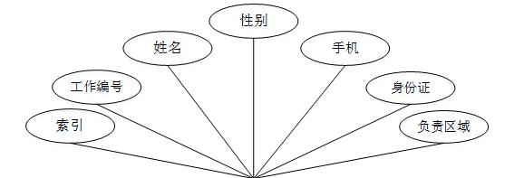

图4-3工作人员管理E/R图

疫情数据管理E/R图，如下所示。

图4-4疫情数据管理E/R图

### 登陆注册功能模块

疫情信息管理系统，居民注册在页面填写居民账号，姓名，密码，确认密码，年龄，联系电话，电子邮箱，单元号，家庭住址等内容，进行注册操作；如图5-1所示。

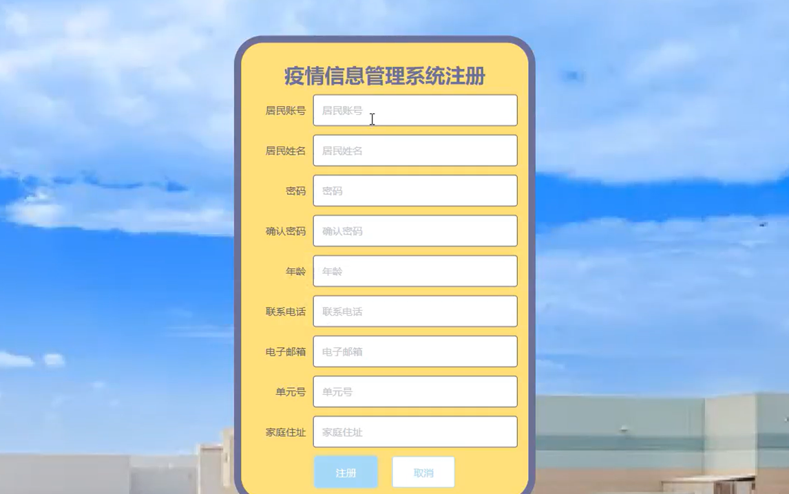

图5-1居民注册界面图

疫情信息管理系统，工作人员注册在页面填写工作编号，密码，确认密码，姓名，手机，身份证，负责区域等内容，进行注册操作；如图5-2所示。

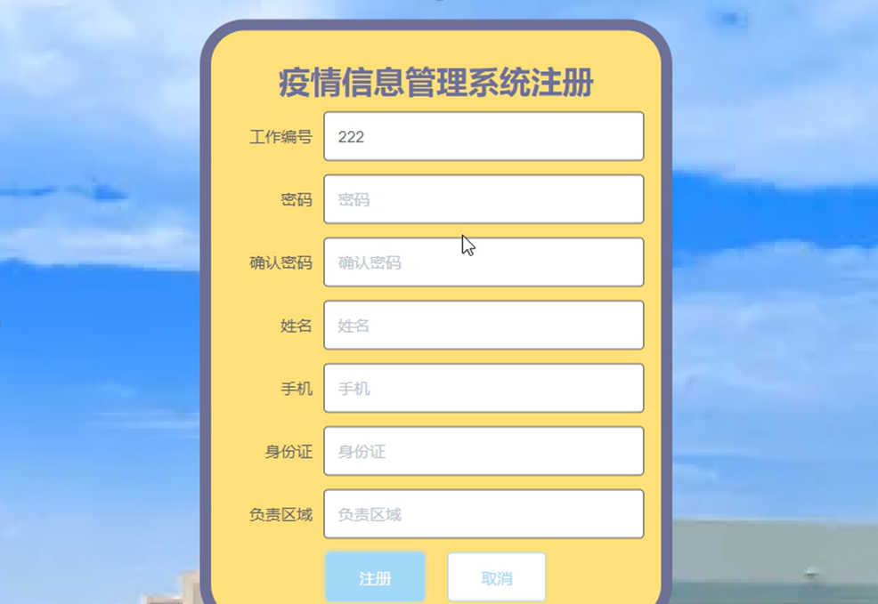

图5-2工作人员注册界面图

管理员，居民，工作人员进行登录，进入系统前在登录页面根据要求填写用户名和密码，选择角色等信息，点击登录进行登录操作，如图5-3所示。

图5-3 系统登录界面图

### 5.2管理员功能模块

管理员登录系统后，可以对首页，个人中心，居民管理，工作人员管理，疫情数据管理，公告信息管理，健康上报管理，疫苗接种管理，异常上报管理等功能进行相应的操作管理，如图5-4所示。

图5-4管理员功能界面图

居民管理，在居民管理页面可以对索引，居民账号，居民姓名，性别，年龄，联系电话，电子邮箱，单元号，家庭住址等内容进行详情，修改和删除等操作，如图5-5所示。

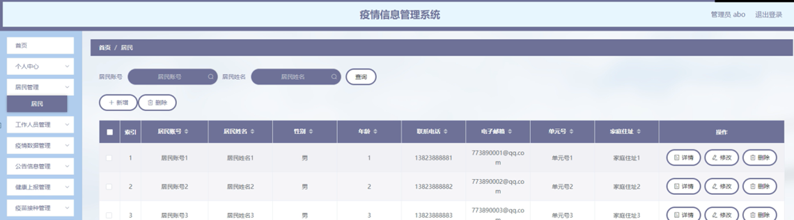

图5-5居民管理界面图

工作人员管理，在工作人员管理页面可以对索引，工作编号，姓名，性别，手机，身份账号，负责区域等内容进行详情，修改和删除等操作，如图5-6所示。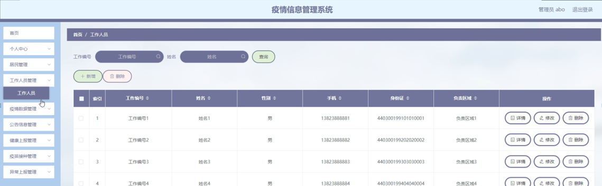

图5-6工作人员管理界面图

疫情数据管理，在疫情数据管理页面可以对索引，标题，新增确诊，累计确诊，新增治愈，累计治愈，新增死亡，累计死亡，封面图，更新时间等内容进行详情，修改和删除等操作，如图5-7所示。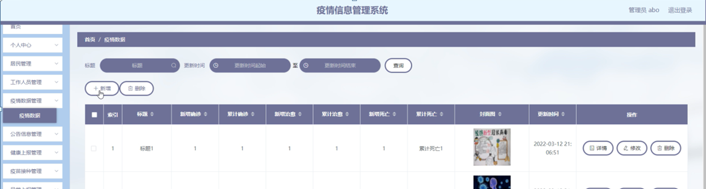

图5-7疫情数据管理界面图

公告信息管理，在公告信息管理页面可以对索引，标题，发布时间等内容进行详情,修改和删除操作，如图5-8所示。

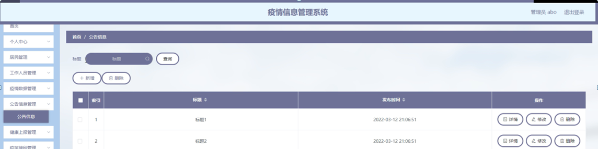

图5-8公告信息管理界面图

健康上报管理，在健康上报管理页面可以对索引，居民账号，居民姓名，体温，健康码，行程码，核酸报告，上传时间等内容进行详情，修改和删除等操作，如图5-9所示。

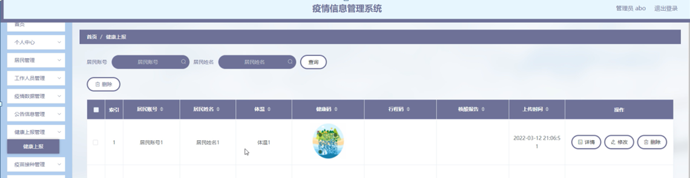

图5-9健康上报管理界面图

疫苗接种管理，在疫苗接种管理页面可以对索引，居民账号，联系电话，居民姓名，单元号，接种时间，厂家，第几针等内容进行详情,修改和删除操作，如图5-10所示。

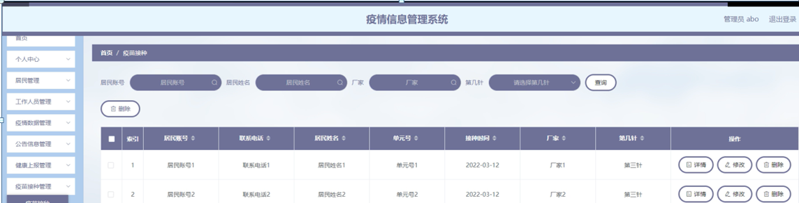

图5-10疫苗接种管理界面图

异常上报管理，在异常上报管理页面可以对索引，居民账号，居民姓名，性别，联系电弧，年龄，单元号，家庭住址，体温，状态，隔离天数，更新时间等内容进行详情，修改和删除等操作，如图5-11所示。

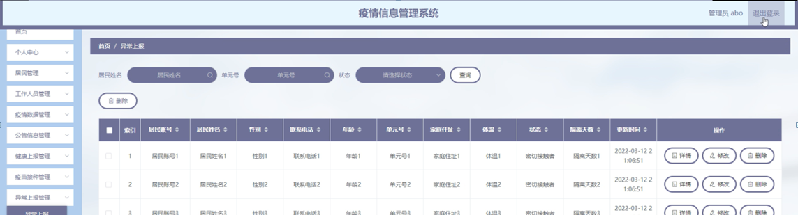

图5-11异常上报管理界面图

### 5.3 居民功能模块

居民登录进入系统可以对首页，个人中心，疫情数据管理，公告信息管理，健康上报管理，疫苗接种管理等功能进行相应操作，如图5-12所示。

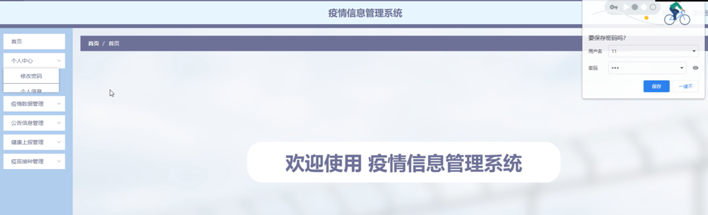

图5-12居民功能界面图

#### **JAVA毕设帮助，指导，源码分享，调试部署**

