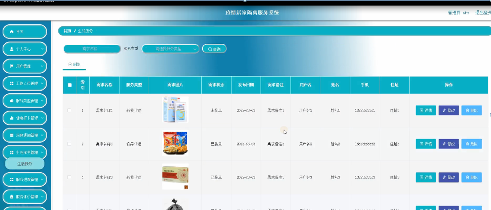

ssm+Vue计算机毕业设计疫情居家隔离服务系统（程序+LW文档）

**项目运行**

**环境配置：**

**Jdk1.8 + Tomcat7.0 + Mysql + HBuilderX** **（Webstorm也行）+ Eclispe（IntelliJ
IDEA,Eclispe,MyEclispe,Sts都支持）。**

**项目技术：**

**SSM + mybatis + Maven + Vue** **等等组成，B/S模式 + Maven管理等等。**

**环境需要**

**1.** **运行环境：最好是java jdk 1.8，我们在这个平台上运行的。其他版本理论上也可以。**

**2.IDE** **环境：IDEA，Eclipse,Myeclipse都可以。推荐IDEA;**

**3.tomcat** **环境：Tomcat 7.x,8.x,9.x版本均可**

**4.** **硬件环境：windows 7/8/10 1G内存以上；或者 Mac OS；**

**5.** **是否Maven项目: 否；查看源码目录中是否包含pom.xml；若包含，则为maven项目，否则为非maven项目**

**6.** **数据库：MySql 5.7/8.0等版本均可；**

**毕设帮助，指导，本源码分享，调试部署** **(** **见文末** **)**

### 系统功能

通过前面的功能分析可以将疫情居家隔离服务系统的功能分为管理员，工作人员和用户三个部分，系统的主要功能包括首页，个人中心，用户管理，工作人员管理，服务类型管理，健康打卡管理，消息通知管理，生活服务管理，服务进度管理，服务评价管理，解除隔离管理等内容。

系统功能结构图是系统设计阶段，系统功能结构图只是这个阶段一个基础，整个系统的架构决定了系统的整体模式，是系统的根据。疫情居家隔离服务系统的整个设计结构如图3-1所示。

图3-1系统功能结构图

### 数据库设计

信息管理系统的效率和实现的效果完全取决于数据库结构设计的好坏。为了保证数据的完整性，提高数据库存储的效率，那么统一合理地设计数据库结构是必要的。数据库设计一般包括如下几个步骤：

（1）根据用户需求，确定数据库信息进行保存

对用户的需求分析是数据库设计的第一阶段，用户和工作人员的需求调研，熟悉隔离服务运作流程，系统要求，这些都是以概念模型为基础的。

（2）设计数据的概念模型

概念模型与数据建模用户的观点一致，用于信息世界的建模工具。通过E-R图可以清楚地描述系统涉及到的实体之间的相互关系。

用户注册实体图如图4-1所示：

图4-1用户注册实体图

健康打卡实体图如图4-2所示：

图4-2健康打卡实体图

系统登录，进入系统前在登录页面根据要求填写账号，密码，验证码和选择角色等信息，点击登录进行登录操作，如图5-1所示。

图5-1系统登录界面图

### 5.1管理员功能模块

管理员登录系统后，可以对首页，个人中心，用户管理，工作人员管理，服务类型管理，健康打卡管理，消息通知管理，生活服务管理，服务进度管理，服务评价管理，解除隔离管理等功能模块进行相应操作，如图5-2所示。

图5-2管理员功能界面图

用户管理，在用户管理页面可以对索引，用户名，姓名，性别，头像，手机，邮箱，住址等信息进行详情，修改和删除等操作，如图5-3所示。

图5-3用户管理界面图

工作人员管理，在工作人员管理页面可以对索引，工作编号，姓名，性别，头像，手机，身份证等内容进行详情，修改和删除等操作，如图5-4所示。

图5-4工作人员管理界面图

健康打卡管理，在健康打卡管理页面可以对索引，标题，用户名，姓名，手机，心率，体温，健康码，身体状况，症状描述，打卡时间，上报日期，审核回复，审核状态等内容进行详情，修改和删除操作，如图5-5所示。

图5-5健康打卡管理界面图

生活服务管理，在生活服务管理页面可以对索引，需求名称，服务类型，需求图片，需求状态，发布日期，需求备注，用户名，姓名，手机，住址等内容进行详情，修改或删除等操作，如图5-6所示。

图5-6生活服务管理界面图

解除隔离管理，在解除隔离管理页面可以对索引，申请标题，隔离天数，申请日期，用户名，手机，住址，审核回复，审核状态，审核等内容进行详情，修改和删除等操作，如图5-7所示。

图5-7解除隔离管理界面图

### 5.2用户功能模块

用户登录进入系统，可以对首页，个人中心，用户首页，个人中心，健康打卡管理，消息通知管理，生活服务管理，服务进度管理，服务评价管理，解除隔离管理等功能模块进行相应操作，如图5-8所示。

图5-8用户功能界面图

健康打卡管理，在健康打卡管理页面可以对索引，标题，用户名，姓名，手机，心率，体温，健康码，身体状况，症状描述，打卡时间，上报日期，审核回复，审核状态等内容进行详情操作，如图5-9所示。

图5-9健康打卡管理界面图

生活服务管理，在生活服务管理页面可以对索引，需求名称，服务类型，需求图片，需求状态，发布日期，需求备注，用户名，姓名，手机，住址等内容进行详情操作，如图5-10所示。

图5-10生活服务管理界面图

### 5.3工作人员功能模块

工作人员登录进入疫情居家隔离服务系统，可以对首页，个人中心，生活服务管理，服务进度管理，服务评价管理等功能进行相应操作，如图5-11所示。

图5-11工作人员功能界面图

生活服务管理，在生活服务管理页面可以对索引，需求名称，服务类型，需求图片，需求状态，发布日期，需求备注，用户名，姓名，手机，住址等信息进行详情，接单服务操作，如图5-12所示。

图5-12生活服务管理界面图

**JAVA** **毕设帮助，指导，源码分享，调试部署**

