ssm+Vue计算机毕业设计疫情期间优化旅游平台（程序+LW文档）

**项目运行**

**环境配置：**

**Jdk1.8 + Tomcat7.0 + Mysql + HBuilderX** **（Webstorm也行）+ Eclispe（IntelliJ
IDEA,Eclispe,MyEclispe,Sts都支持）。**

**项目技术：**

**SSM + mybatis + Maven + Vue** **等等组成，B/S模式 + Maven管理等等。**

**环境需要**

**1.** **运行环境：最好是java jdk 1.8，我们在这个平台上运行的。其他版本理论上也可以。**

**2.IDE** **环境：IDEA，Eclipse,Myeclipse都可以。推荐IDEA;**

**3.tomcat** **环境：Tomcat 7.x,8.x,9.x版本均可**

**4.** **硬件环境：windows 7/8/10 1G内存以上；或者 Mac OS；**

**5.** **是否Maven项目: 否；查看源码目录中是否包含pom.xml；若包含，则为maven项目，否则为非maven项目**

**6.** **数据库：MySql 5.7/8.0等版本均可；**

**毕设帮助，指导，本源码分享，调试部署** **(** **见文末** **)**

总体设计

根据疫情期间优化旅游平台的功能需求，进行系统设计。

前台功能：用户进入系统可以实现首页、旅游景点、酒店客房、疫情数据、系统公告、个人中心、后台管理等进行操作；

后台主要是管理员，管理员功能包括首页、个人中心、用户管理、景点分类管理、旅游景点管理、客房类型管理、酒店客房管理、客房预定管理、疫情数据管理、系统管理等；

系统对这些功能进行整合，产生的功能结构图如下：

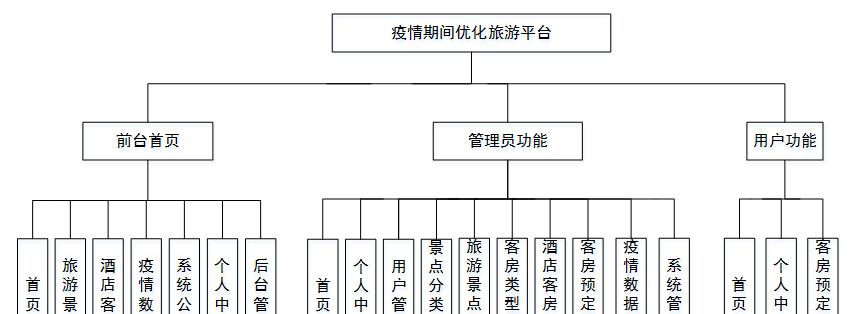

图3-6 系统总体结构图

3.5 数据库设计与实现

在每一个系统中数据库有着非常重要的作用，数据库的设计得好将会增加系统的效率以及系统各逻辑功能的实现。所以数据库的设计我们要从系统的实际需要出发，才能使其更为完美的符合系统功能的实现。

#### **3.5.1** **数据库概念结构设计**

数据库的E-R图反映了实体、实体的属性和实体之间的联系。下面是各个实体以及实体的属性。

用户信息实体属性图如下所示：

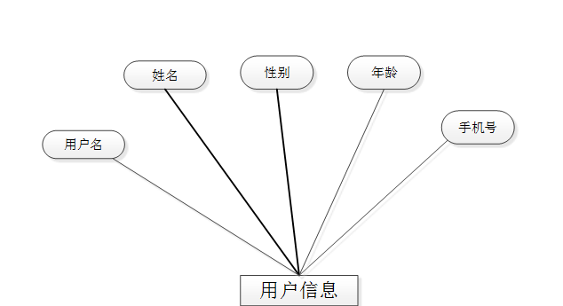

图3-7用户信息实体属性图

旅游景点信息实体属性图如下所示：

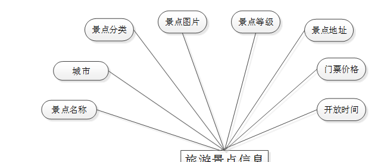

图3-8旅游景点信息实体属性图

酒店客房信息实体属性图如下所示：

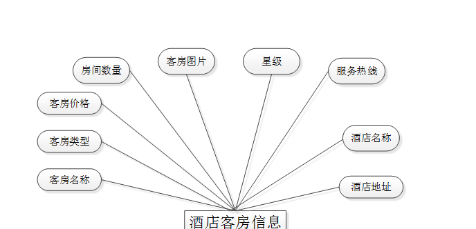

图3-9酒店客房信息实体属性图

客房预定信息实体属性图如下所示：

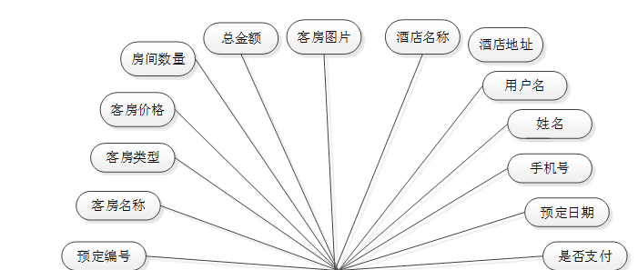

图3-10客房预定信息实体属性图

### 系统功能模块

疫情期间优化旅游平台，用户进入网站查看首页、旅游景点、酒店客房、疫情数据、系统公告、个人中心、后台管理等内容进行操作，如图4-1所示。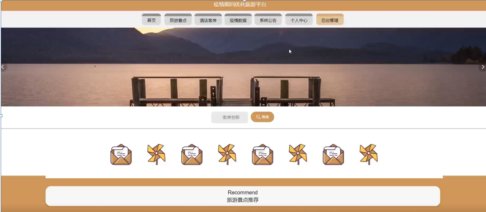

图4-1网站首页界面图

用户注册；在用户注册页面中输入用户名、姓名、密码、确认密码、年龄、手机号等内容进行注册操作；如图4-2所示。

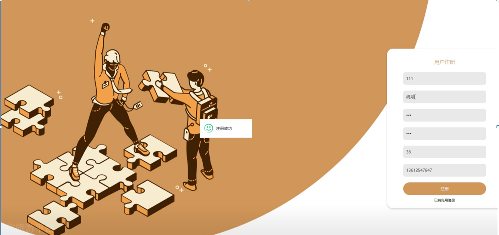

图4-2用户注册界面图

用户登录；在登录页面中输入账号、密码等内容进行登录操作；如图4-3所示。

图4-3用户登录界面图

旅游景点；在旅游景点页面中可以对景点名称、城市、景点分类、景点图片、景点等级、景点地址、门票价格、开放时间、点击次数等内容进行收藏、查看注意事项、评论、地图等操作，如图4-4所示。

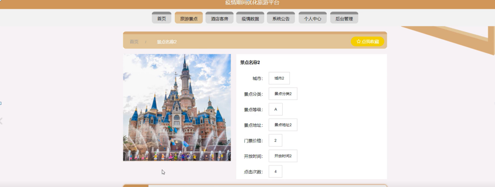

图4-4旅游景点界面图

酒店客房；在酒店客房页面中可以查看客房名称、客房类型、客房价格、房间数量、客房图片、星级、服务热线、酒店名称、酒店地址、点击次数，根据需要进行在线预定或点我收藏、评论，如图4-5所示。

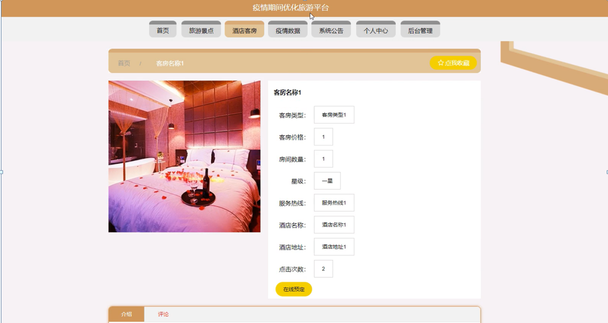

图4-5酒店客房界面图

疫情数据，用户可以在疫情数据界面查看标题、封面图片、国家、地区、现有确诊、新增确诊、累计确诊、无症状、现有重症、新增治愈、累计治愈、新增死亡、累计死亡、更新时间等内容，如图4-6所示。

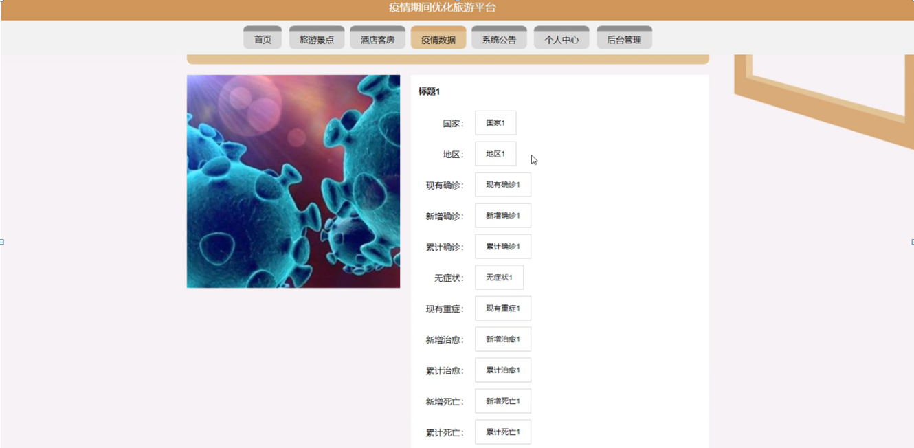

图4-6疫情数据界面图

在系统公告页面中查看标题、公告信息，如图4-7所示。

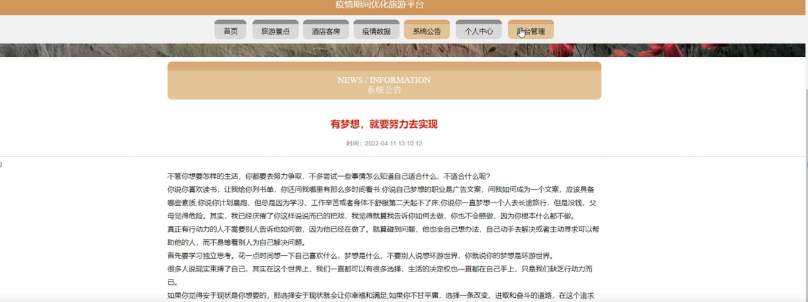

图4-7系统公告界面图

### 4.2 管理员功能模块

管理员登录，通过登录页面输入用户名、密码、选择角色等信息进行登录操作，如图4-8所示。

图4-8管理员登录界面图

管理员登录进入疫情期间优化旅游平台可以查看首页、个人中心、用户管理、景点分类管理、旅游景点管理、客房类型管理、酒店客房管理、客房预定管理、疫情数据管理、系统管理等信息进行详细操作，如图4-9所示。

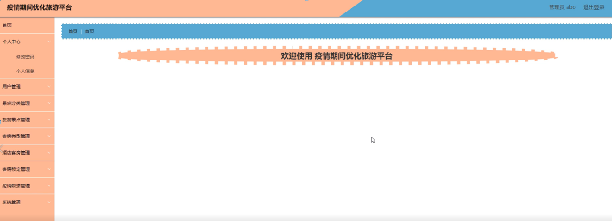

图4-9管理员功能界面图

用户管理；在用户管理页面中可以查看用户名、姓名、性别、年龄、手机号等内容，并进行详情，修改和删除等操作；如图4-10所示。

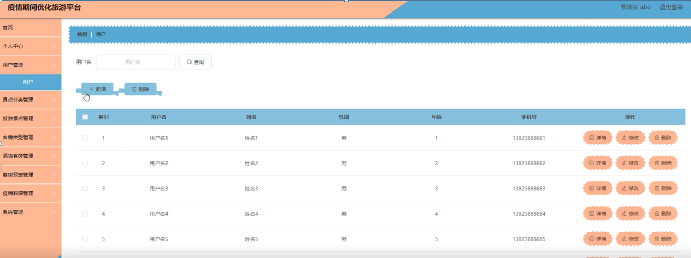

图4-10用户管理界面图

景点分类管理：在景点分类管理页面中可以查看景点分类信息等内容，并进行详情、修改和删除等操作，如图4-11所示。

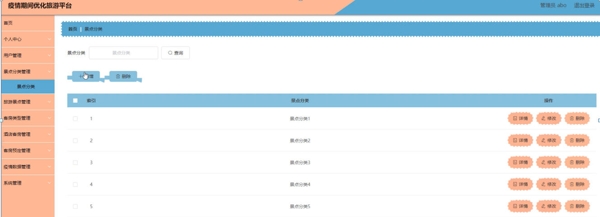

图4-11景点分类管理界面图

旅游景点管理；在旅游景点管理页面中可以查看景点名称、城市、景点分类、景点图片、景点等级、景点地址、门票价格、开放时间等内容，并进行详情、修改、查看评论和删除等操作；如图4-12所示。

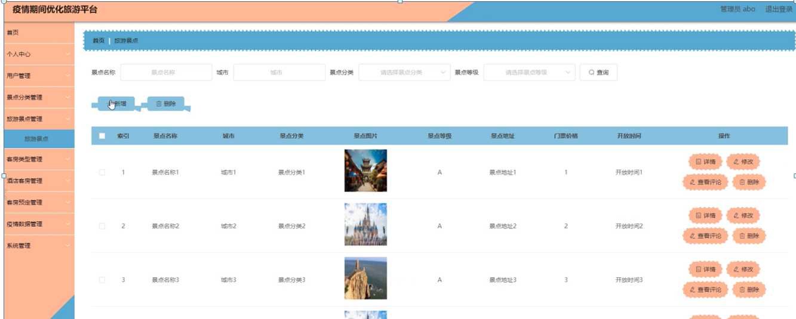

图4-12旅游景点管理界面图

#### **JAVA** **毕设帮助，指导，源码分享，调试部署**

