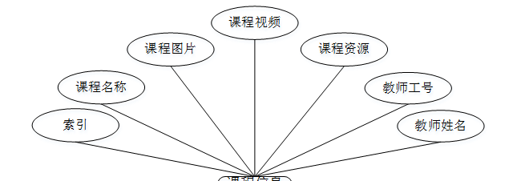

ssm+Vue计算机毕业设计疫情期间学生作业线上管理系统（程序+LW文档）

**项目运行**

**环境配置：**

**Jdk1.8 + Tomcat7.0 + Mysql + HBuilderX** **（Webstorm也行）+ Eclispe（IntelliJ
IDEA,Eclispe,MyEclispe,Sts都支持）。**

**项目技术：**

**SSM + mybatis + Maven + Vue** **等等组成，B/S模式 + Maven管理等等。**

**环境需要**

**1.** **运行环境：最好是java jdk 1.8，我们在这个平台上运行的。其他版本理论上也可以。**

**2.IDE** **环境：IDEA，Eclipse,Myeclipse都可以。推荐IDEA;**

**3.tomcat** **环境：Tomcat 7.x,8.x,9.x版本均可**

**4.** **硬件环境：windows 7/8/10 1G内存以上；或者 Mac OS；**

**5.** **是否Maven项目: 否；查看源码目录中是否包含pom.xml；若包含，则为maven项目，否则为非maven项目**

**6.** **数据库：MySql 5.7/8.0等版本均可；**

**毕设帮助，指导，本源码分享，调试部署** **(** **见文末** **)**

### 系统设计主要功能

通过市场调研及咨询研究，了解了使用者及管理者的使用需求，于是制定了管理员，教师和学生等模块。其功能结构图如下图4-1所示：

图4-1系统功能结构图

### 4.2 数据库设计

#### 4.2.1 数据库设计规范

数据可设计要遵循职责分离原则，即在设计时应该要考虑系统独立性，即每个系统之间互不干预不能混乱数据表和系统关系。

数据库命名也要遵循一定规范，否则容易混淆，数据库字段名要尽量做到与表名类似，多使用小写英文字母和下划线来命名并尽量使用简单单词。

#### 4.2.2 E-R图

公告信息管理E-R图，如图4-2所示：

图4-2 公告信息管理E-R图

课程信息管理E-R图，如图4-3所示：

图4-3课程信息管理E-R图

学生反馈管理E-R图如图4-4所示。

图4-4学生反馈管理E-R图

系统登录，用户通过填写注册时输入的用户名、密码、选择角色等信息进行登录操作，如图5-1所示。

图5-1系统登录界面图

### 5.1 管理员功能模块

管理员登录进入疫情期间学生作业线上管理系统可以查看首页、个人中心、公告信息管理、教师管理、学生管理、课程信息管理、作业信息管理、学生作业管理、作业成绩管理、学生反馈管理等功能进行详细操作，如图5-2所示。

图5-2管理员功能界面图

公告信息管理；在公告信息管理页面中可以对索引，公告标题，公告类型，公告图片，发布日期等内容进行详情，修改和删除操作；如图5-3所示。

图5-3公告信息管理界面图

教师管理；在教师管理页面中可以对索引，教师工号，家属姓名，性别，照片，职称，联系电话等内容进行详情，修改和删除操作；如图5-4所示。

图5-4教师管理界面图

学生管理；在学生管理页面中可以对索引，学号，姓名，性别，头像，手机等内容进行详情，修改和删除操作；如图5-5所示。

图5-5学生管理界面图

课程信息管理；在课程信息管理页面中可以对索引，课程名称，课程图片，课程视频，课程资源，教师工号，教师姓名等内容进行详情，修改和删除操作；如图5-6所示。

图5-6课程信息管理界面图

作业信息管理；在作业信息管理页面中可以对索引，作业名称，作业图片，作业要求，作业附件，发布日期，教师工号，教师姓名等内容进行详情，修改和删除操作；如图5-7所示。

图5-7作业信息管理界面图

学生作业管理；在学生作业管理页面中可以对索引，作业名称，提交图片，教师工号，教师姓名，提交文件，作业成绩，提交日期，学号，姓名，手机等内容进行详情，修改和删除操作；如图5-8所示。

图5-8学生作业管理界面图

作业成绩管理；在作业成绩管理页面中可以对索引，作业名称，作业成绩，教师工号，教师姓名，添加日期，学号，姓名，手机等内容进行详情，修改和删除操作；如图5-9所示。

图5-9作业成绩管理界面图

学生反馈管理；在学生反馈管理页面中可以查看索引，教师工号，教师姓名，反馈日期，学号，姓名，审核回复，审核状态等内容进行详情，修改和删除操作；如图5-10所示。

图5-10学生反馈管理界面图

### 5.2 教师功能模块

教师登录进入疫情期间学生作业线上管理系统可以查看首页、个人中心、公告信息管理、课程信息管理、作业信息管理、学生作业管理、作业成绩管理、学生反馈管理等功能进行详细操作，如图5-11所示。

图5-11教师功能界面图

课程信息管理；在课程信息管理页面中可以对索引，课程名称，课程图片，课程视频，课程资源，教师工号，教师姓名等内容进行详情，修改和删除操作；如图5-12所示。

图5-12课程信息管理界面图

**JAVA** **毕设帮助，指导，源码分享，调试部署**

